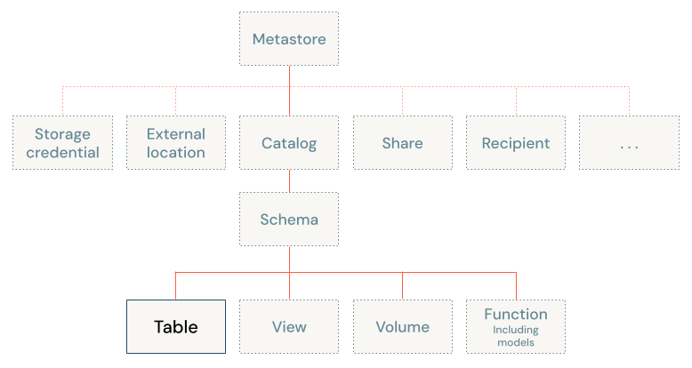

# Tabellenkonzepte und Tabellentypen

Grundlegende Einführung in Databricks-Tabellen: die Unity-Catalog-Namensraum-Hierarchie, verfügbare Speicherformate und die vier Haupttabellentypen im direkten Vergleich. Basierend auf offiziellen Databricks-Doku-Seiten (jeweils am Ende jedes Abschnitts referenziert).

## Abschnittsübersicht

1. [Was ist eine Databricks-Tabelle?](#was-ist)
2. [Die Drei-Ebenen-Namensraum-Hierarchie](#hierarchie)
3. [Speicherformate: Delta Lake und Apache Iceberg](#speicherformate)
4. [Tabellentypen im Überblick](#index-uebersicht)
5. [Vier Haupttabellentypen im Vergleich](#vergleich)
6. [Weitere spezialisierte Tabellentypen](#spezialisiert)
7. [Zugriff und Berechtigungen](#berechtigungen)
8. [Zusammenfassung](#zusammenfassung)

---

## <a id="was-ist">1. Was ist eine Databricks-Tabelle?</a>

Eine Databricks-Tabelle „befindet sich in einem Schema und enthält Zeilen von Daten". Die Plattform erstellt standardmäßig **Unity-Catalog-Managed-Tables**.

### Quelle

- https://docs.databricks.com/aws/en/tables/tables-concepts

---

## <a id="hierarchie">2. Die Drei-Ebenen-Namensraum-Hierarchie</a>

Tabellen existieren innerhalb einer dreistufigen Namensraum-Struktur: **`catalog.schema.table`**. Dieses Organisationsmodell integriert sich mit Unity Catalog, das Tabellen-Metadaten und Governance verwaltet.

### Quelle

- https://docs.databricks.com/aws/en/tables/tables-concepts

---

## <a id="speicherformate">3. Speicherformate: Delta Lake und Apache Iceberg</a>

Beide Formate bieten „eine transaktionale Speicherschicht, die Metadaten nachverfolgt und Atomicity, Consistency, Isolation und Durability (ACID) sowie Time Travel und weitere Features unterstützt."

| Format | Verwendung |
|---|---|
| **Delta Lake** | Standard-Speicherformat für Managed und External Tables — mit ACID-Transaktionen, Time Travel und Schema Enforcement (ausführlich in [Delta Lake Grundlagen.md](Delta%20Lake%20Grundlagen.md)) |
| **Apache Iceberg** | offenes Tabellenformat zur Integration mit dem Iceberg-Ökosystem, für Managed und Foreign Tables, mit fortgeschrittenem Metadaten-Management (ausführlich in [Apache Iceberg.md](Apache%20Iceberg.md)) |

### Quellen

- https://docs.databricks.com/aws/en/tables/
- https://docs.databricks.com/aws/en/tables/tables-concepts

### Vertiefung: Delta Lake vs. Apache Iceberg — Unterschiede und Anwendungsfälle

**Hinweis zur Quellenlage:** Die folgenden Aussagen stammen nicht von `docs.databricks.com`, sondern sind eine über mehrere unabhängige, fachlich anerkannte Drittquellen querverifizierte Zusammenfassung (u. a. DataCamp, Dremio, Starburst) — sinnvoll, weil ein vendor-neutraler Formatvergleich naturgemäß nicht von einer Partei allein (Databricks selbst treibt Delta Lake maßgeblich) stammen kann. Databricks-spezifische Mechanik (UniForm, native Iceberg Tables, Iceberg v3) bleibt weiterhin ausschließlich aus offizieller Doku belegt (siehe [Apache Iceberg.md](Apache%20Iceberg.md) und [Table Features/14 Iceberg Reads (UniForm).md](Table%20Features/14%20Iceberg%20Reads%20%28UniForm%29.md)).

**Ursprung und Governance:**

- **Delta Lake** wurde von Databricks entwickelt und wird heute unter der Linux Foundation geführt — Databricks trägt jedoch weiterhin den Großteil des Codes bei und bestimmt maßgeblich die Roadmap.
- **Apache Iceberg** wurde bei Netflix entwickelt und wird von der Apache Software Foundation geführt, mit Beiträgen von Engineering-Teams aus über 30 Unternehmen (u. a. Netflix, Apple, AWS, Snowflake) — kein einzelner Anbieter kontrolliert das Format.

**Architektur — Metadaten und Zeilenänderungen:**

- **Delta Lake** führt ein sequenzielles Transaktionslog (`_delta_log`, JSON-Einträge) mit periodischen Parquet-Checkpoints. Zeilenänderungen laufen standardmäßig über Neuschreiben ganzer Dateien (Copy-on-Write); optional lassen sich Deletion Vectors für effizientes zeilenweises Ändern aktivieren (siehe [Table Features/06 Deletion Vectors.md](Table%20Features/06%20Deletion%20Vectors.md)).
- **Apache Iceberg** nutzt eine hierarchische, Avro-basierte Metadatenstruktur (Metadaten-Datei → Manifest-Liste → Manifest-Dateien mit Spaltenstatistiken je Snapshot) — das ermöglicht effizientes Metadaten-Pruning auch bei sehr vielen Dateien. Zeilenänderungen liefen historisch über Position-/Equality-Deletes (Merge-on-Read); seit Iceberg v3 stehen mit Databricks vergleichbare Deletion Vectors zur Verfügung (siehe [Apache Iceberg.md](Apache%20Iceberg.md), Abschnitt 7).
- Der früher deutliche Unterschied zwischen beiden Formaten bei zeilenweisen Änderungen ist damit inzwischen weitgehend angeglichen.

**Engine- und Ökosystem-Unterstützung:**

- **Delta Lake** ist am tiefsten mit Apache Spark integriert und liefert dort die ausgereifteste Performance; Konnektoren für weitere Engines existieren, sind aber historisch weniger vollständig als bei Iceberg.
- **Apache Iceberg** ist spezifikationsgetrieben und explizit Engine-agnostisch konzipiert — mit nativer Unterstützung u. a. in Spark, Flink, Trino, Presto, Dremio, Snowflake und AWS Athena über eine gemeinsame REST-Catalog-Spezifikation.

**Schema Evolution und Partitionierung:**

- Beide Formate unterstützen Schema Evolution (Spalten hinzufügen/entfernen/umbenennen) sowie Time Travel über ihre jeweilige Snapshot-/Versionshistorie.
- **Iceberg** erlaubt zusätzlich **Partition Evolution** — die Partitionierungsstrategie einer Tabelle lässt sich ändern, ohne bestehende Daten neu zu schreiben (bei Managed Tables in Databricks aktuell nur über externe Iceberg-Engines, siehe [Apache Iceberg.md](Apache%20Iceberg.md), Abschnitt 5).
- **Delta Lake** erreicht vergleichbare Flexibilität bei Spaltenänderungen über eigene Table Features — Column Mapping für Umbenennen/Entfernen ohne Neuschreiben (siehe [Table Features/05 Column Mapping.md](Table%20Features/05%20Column%20Mapping.md)) und Type Widening für Typänderungen (siehe [Table Features/13 Type Widening.md](Table%20Features/13%20Type%20Widening.md)).

**Wann welches Format?**

| Kriterium | Spricht für Delta Lake | Spricht für Apache Iceberg |
|---|---|---|
| Haupt-Engine | Ausschließlich oder primär Apache Spark / Databricks | Mehrere Engines parallel (z. B. Spark + Trino + Snowflake) |
| Ökosystem-Bindung | Enge Integration in Databricks-Features gewünscht (Liquid Clustering, Photon, Predictive Optimization) | Vendor-Neutralität und Multi-Cloud-Portabilität im Vordergrund |
| Workload | Vereinheitlichtes Batch- und Streaming-Processing (Structured Streaming, Lakeflow-Pipelines) | Sehr große, häufig sich ändernde Partitionsschemata; Analytics-Workloads über verteilte Engine-Landschaft |
| Reifegrad im eigenen Umfeld | Größte Reife und Feature-Tiefe innerhalb von Databricks | Größte Reife bei Trino/Presto/Flink-lastigen Architekturen außerhalb von Databricks |

**Databricks-Perspektive — die Wahl entschärfen statt entscheiden:** Databricks selbst positioniert die Entscheidung zunehmend als weniger binär: Über **UniForm** generiert eine Delta-Lake-Tabelle automatisch Iceberg-Metadaten neben den Delta-Metadaten (eine Kopie der Parquet-Dateien, lesbar für Iceberg-Clients — siehe [Table Features/14 Iceberg Reads (UniForm).md](Table%20Features/14%20Iceberg%20Reads%20%28UniForm%29.md)), und native **Managed Iceberg Tables** in Unity Catalog erlauben umgekehrt vollen Lese-/Schreibzugriff mit wachsender Databricks-Feature-Parität (Iceberg v3, siehe [Apache Iceberg.md](Apache%20Iceberg.md), Abschnitt 7). Innerhalb von Databricks ist die Format-Wahl damit primär eine Frage der externen Engine-Anforderungen, nicht der grundsätzlichen Machbarkeit.

### Quellen (Vertiefung)

- https://www.datacamp.com/blog/iceberg-vs-delta-lake
- https://www.dremio.com/blog/apache-iceberg-vs-delta-lake/
- https://www.starburst.io/blog/iceberg-vs-delta-lake/
- https://www.databricks.com/blog/delta-lake-universal-format-uniform-iceberg-compatibility-now-ga (Databricks-Perspektive/UniForm, offizielle Quelle)

---

## <a id="index-uebersicht">4. Tabellentypen im Überblick</a>

Die offizielle Tables-Übersichtsseite gliedert Databricks-Tabellen in vier Grundtypen, ergänzt um sechs Management-Themen:

**Tabellentypen:**

- **Unity Catalog Managed Tables** für Delta Lake und Apache Iceberg — „Databricks verwaltet Metadaten und Datendateien für neue Tabellen, die optimierte Performance erfordern."
- **Temporary Tables** in SQL und Runtime — „sitzungsgebundene Unity-Catalog-Managed-Tables für Zwischendaten."
- **External Tables** — „Daten in externen Systemen gespeichert. Unity Catalog verwaltet nur Metadaten."
- **Foreign Tables** — nur lesender Zugriff über Lakehouse Federation.

**Management-Themen:** Tabellen-Constraints, Schema Enforcement, Tabellen-Partitionierung, Tabellengrößen-Überwachung, Konvertierung von External zu Managed, External Partition Discovery — jeweils in den folgenden Dateien dieses Ordners vertieft.

### Quelle

- https://docs.databricks.com/aws/en/tables/

---

## <a id="vergleich">5. Vier Haupttabellentypen im Vergleich</a>

### Managed Tables (empfohlener Standard)

Unity Catalog übernimmt Datenlebenszyklus, Storage und Optimierungen. Basiert auf Delta Lake oder Apache Iceberg. Bietet automatische Optimierung, schnellere Queries und automatische Wartung. Daten werden beim Löschen der Tabelle mitgelöscht.

### External Tables

Der eigene Cloud-Object-Storage wird selbst verwaltet; Unity Catalog regelt nur den Zugriff. Unterstützt: Delta Lake, CSV, JSON, AVRO, PARQUET, ORC, TEXT. Metadaten werden beim `DROP` entfernt, die zugrunde liegenden Dateien bleiben jedoch bestehen. Am besten geeignet für Legacy-Integrationen und bereits bestehende Daten.

### Foreign Tables (Federated Tables)

Nur lesender Zugriff, verwaltet vom externen System. Unity Catalog liefert Governance über Query Federation oder Catalog Federation. Keine automatischen Optimierungen — es fehlen die Managed-Table-Vorteile von Delta Lake.

### Vollständige Vergleichsmatrix

| Feature | Managed | External | Foreign |
|---|---|---|---|
| Datenlebenszyklus | Unity Catalog verwaltet | selbst verwaltet | externes System verwaltet |
| Speicherort | Unity Catalog verwaltet | selbst angegeben | externes System verwaltet |
| Automatische Optimierungen | ja | eingeschränkt | nein |
| Formate | Delta Lake, Apache Iceberg | Delta Lake (empfohlen), CSV, JSON, AVRO, PARQUET, ORC, TEXT | abhängig vom externen System |
| Daten beim DROP gelöscht | ja | nein | nein |
| Am besten geeignet für | Produktions-Workloads, häufig abgefragte Daten | Legacy-Integrationen, bestehende Daten | Migration von externen Systemen, temporärer Zugriff |

Ausführliche Behandlung jedes Typs in den Dateien [Managed Tables.md](Managed%20Tables.md) und [External und Foreign Tables.md](External%20und%20Foreign%20Tables.md).

### Quelle

- https://docs.databricks.com/aws/en/tables/types

---

## <a id="spezialisiert">6. Weitere spezialisierte Tabellentypen</a>

Über die vier Grundtypen hinaus:

- **Streaming Tables** — Lakeflow-Pipeline-Datensätze mit inkrementeller Verarbeitung.
- **Materialized Views** — Lakeflow-Datensätze, die Query-Ergebnisse materialisieren.
- **Temporary Tables** — sitzungsgebundene Managed Tables für Zwischendaten (ausführlich in [External und Foreign Tables.md](External%20und%20Foreign%20Tables.md), Abschnitt zu Temporary Tables).

### Quelle

- https://docs.databricks.com/aws/en/tables/types

---

## <a id="berechtigungen">7. Zugriff und Berechtigungen</a>

Gängige Operationen erfordern spezifische Unity-Catalog-Berechtigungen: `SELECT`, `MODIFY`, `MANAGE`, `CREATE TABLE`, `USE CATALOG`, `USE SCHEMA`.

### Quelle

- https://docs.databricks.com/aws/en/tables/tables-concepts

---

## <a id="zusammenfassung">8. Zusammenfassung</a>

- Databricks-Tabellen folgen einer dreistufigen Namensraum-Hierarchie `catalog.schema.table`, verwaltet über Unity Catalog.
- Zwei offene Speicherformate stehen zur Verfügung: **Delta Lake** (Standard) und **Apache Iceberg**.
- Vier Haupttabellentypen unterscheiden sich primär darin, wer den Datenlebenszyklus verwaltet: **Managed** (Unity Catalog verwaltet alles, empfohlener Standard), **External** (eigener Storage, nur Metadaten-Governance), **Foreign** (externes System verwaltet, nur lesend), **Temporary** (sitzungsgebunden).
- Spezialisierte Typen wie Streaming Tables und Materialized Views ergänzen das Bild für Lakeflow-Pipelines.
- Grundlegende Berechtigungen (`SELECT`, `MODIFY`, `MANAGE`, `CREATE TABLE`, `USE CATALOG`, `USE SCHEMA`) steuern den Zugriff auf allen Tabellentypen.
