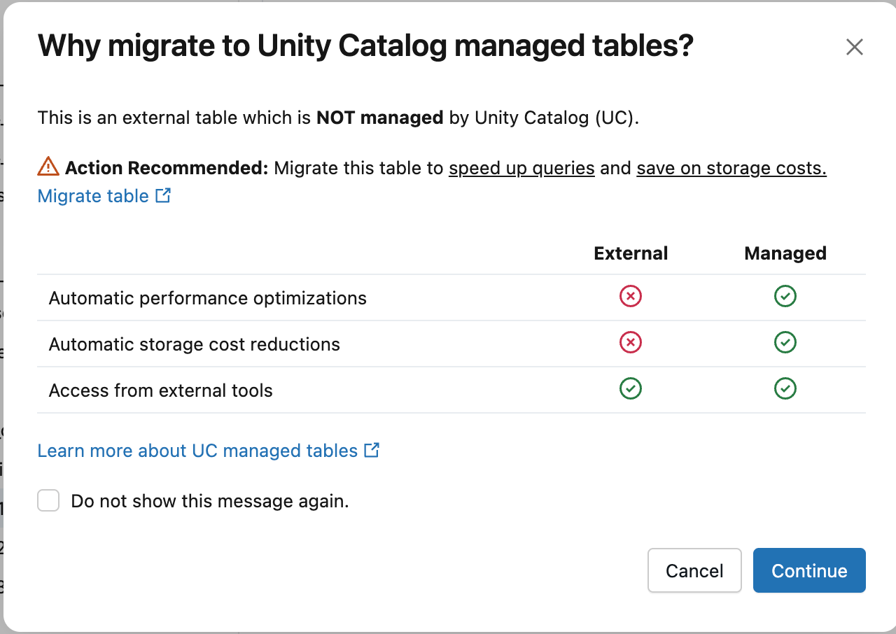
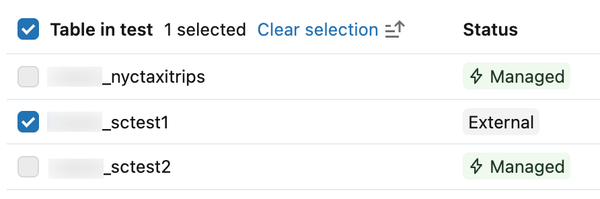
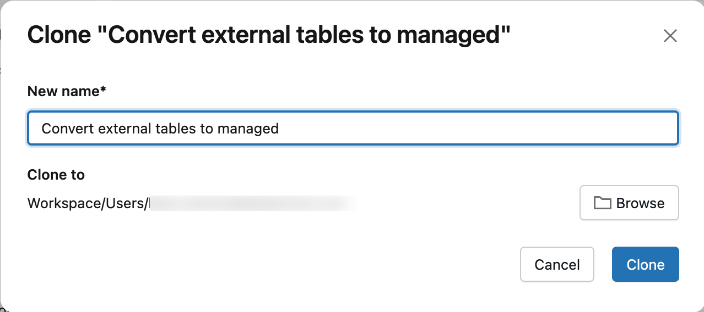
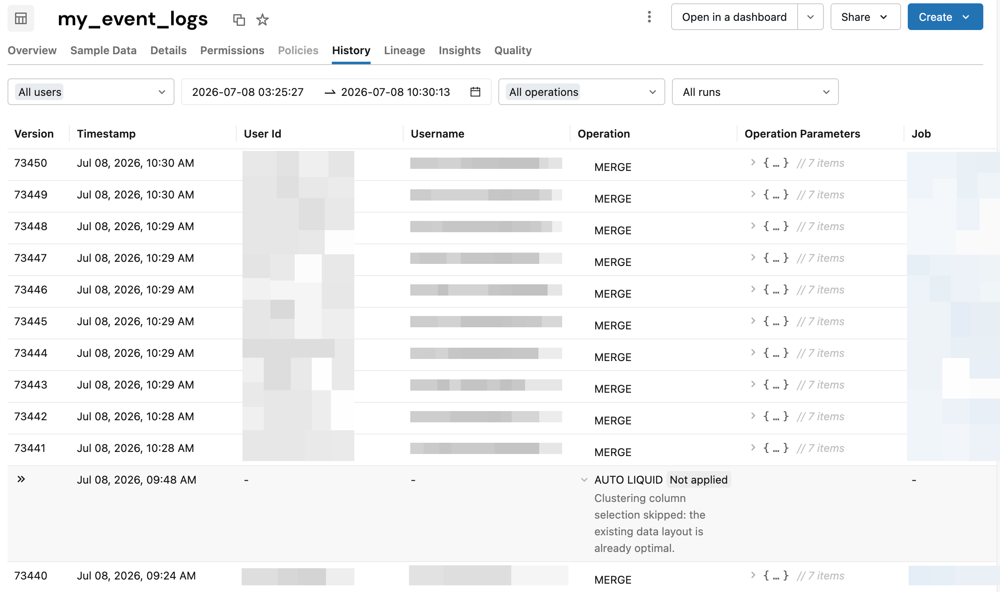

# Managed Tables

Unity-Catalog-Managed-Tables sind der empfohlene Standardtabellentyp in Databricks — vollständig von der Plattform verwaltet, automatisch optimiert und automatisch gepflegt. Dieses Dokument behandelt, was Managed Tables auszeichnet, wie automatische Upgrades funktionieren, wie sich External Tables zu Managed Tables konvertieren lassen, und wie Predictive Optimization die Wartung übernimmt. Basierend auf offiziellen Databricks-Doku-Seiten (jeweils am Ende jedes Abschnitts referenziert). Ergänzt [Liquid Clustering.md](../../Performance%20Optimization/Foundation%20Design/Liquid%20Clustering.md), Abschnitt 11, in dem Predictive Optimization bereits im Kontext von Liquid Clustering behandelt wird.

## Abschnittsübersicht

1. [Was sind Managed Tables?](#was-sind)
2. [Speicherort](#speicherort)
3. [Lebenszyklus und Löschverhalten](#lebenszyklus)
4. [Kernvorteile](#vorteile)
5. [Tabellen erstellen und löschen](#erstellen)
6. [Automatische Upgrades](#automatische-upgrades)
7. [External Tables zu Managed Tables konvertieren](#konvertieren)
8. [Predictive Optimization: Ergänzende Details](#predictive-optimization)
9. [Zusammenfassung](#zusammenfassung)

---

## <a id="was-sind">1. Was sind Managed Tables?</a>

Unity-Catalog-Managed-Tables sind der Standard- und empfohlene Tabellentyp in Databricks — sowohl für Delta Lake als auch für Apache Iceberg. „Unity Catalog übernimmt sämtliche Lese-, Schreib-, Storage- und Optimierungsverantwortlichkeiten." Das System handhabt automatische Wartung, Optimierung und Lebenszyklusmanagement, ohne dass manuelle Eingriffe nötig sind.

### Quelle

- https://docs.databricks.com/aws/en/tables/managed

---

## <a id="speicherort">2. Speicherort</a>

Datendateien für Managed Tables liegen „im Schema oder Catalog, der sie enthält." Organisationen können Managed-Storage-Speicherorte über die Cloud-Storage-Konfigurationsoptionen von Unity Catalog festlegen.

### Quelle

- https://docs.databricks.com/aws/en/tables/managed

---

## <a id="lebenszyklus">3. Lebenszyklus und Löschverhalten</a>

**Beim Löschen einer Managed Table entfernt Databricks** die zugrunde liegenden Datendateien automatisch aus dem Cloud-Storage — **nach Ablauf einer Recovery-Frist**. Die Standard-Recovery-Frist beträgt **7 Tage**, wodurch versehentliche Löschungen über den `UNDROP TABLE`-Befehl rückgängig gemacht werden können. Nach Ablauf der Recovery-Frist „löscht Databricks die zugrunde liegenden Datendateien aus dem Cloud-Tenant innerhalb von 48 Stunden."

Recovery-Fristen lassen sich auf Catalog- oder Schema-Ebene konfigurieren, im Bereich von 0 Stunden (Recovery deaktiviert) bis 30 Tage. Eine Frist von 0 „deaktiviert die Wiederherstellung" und beschleunigt die Dateilöschung.

```sql
-- Recovery-Frist auf Catalog-Ebene konfigurieren
ALTER CATALOG my_catalog RETAIN DROPPED TO 30 DAYS;

-- Recovery-Frist auf Schema-Ebene konfigurieren
ALTER SCHEMA my_catalog.my_schema RETAIN DROPPED TO 7 DAYS;
```

### Quelle

- https://docs.databricks.com/aws/en/tables/managed

---

## <a id="vorteile">4. Kernvorteile</a>

### Performance- und Kostenoptimierung

- „Optimiert Datenlayout und Compute automatisch mittels KI, ohne manuelle Wartungsoperationen" (siehe Abschnitt 8, Predictive Optimization).
- Niedrigere Storage- und Query-Kosten im Vergleich zu External oder Foreign Tables.
- Selbstwartende und selbstoptimierende Funktionalität.

### Erweiterte Features

- Multi-Statement-ACID-Transaktionen über mehrere Tabellen hinweg.
- Automatic Liquid Clustering zur Query-Muster-Optimierung (siehe [Liquid Clustering.md](../../Performance%20Optimization/Foundation%20Design/Liquid%20Clustering.md), Abschnitt 8).
- Full-Text-Search-Indexes (Beta, erfordert Databricks Runtime 18.2+, siehe [Data Skipping und Tabellenstatistiken.md](../../Performance%20Optimization/Foundation%20Design/Data%20Skipping%20und%20Tabellenstatistiken.md), Abschnitt 13).
- Metadaten-Caching für verbesserte Query-Performance.
- Catalog Commits, die Schreibvorgänge externer Engines ermöglichen (siehe [Table Features/](Table%20Features/) für Details).
- Interoperabilität mit Drittanbieter-Tools über offene APIs.

### Governance

- Unterstützt Delta-Lake- und Apache-Iceberg-Clients.
- Credential Vending für sicheren externen Zugriff.
- OpenSharing-Protokoll für Partner-Data-Sharing.

### Quelle

- https://docs.databricks.com/aws/en/tables/managed

---

## <a id="erstellen">5. Tabellen erstellen und löschen</a>

### Managed-Delta-Tabelle erstellen (SQL)

```sql
CREATE TABLE <catalog-name>.<schema-name>.<table-name>(
  <column-specification>
);
```

### Managed-Delta-Tabelle erstellen (Python)

```python
from pyspark.sql.types import StructType, StructField, StringType

schema = StructType([StructField("<column-name>", StringType())])
spark.createDataFrame([], schema).write \
  .saveAsTable("<catalog-name>.<schema-name>.<table-name>")
```

### Über DeltaTableBuilder (Python)

```python
from delta.tables import DeltaTable

DeltaTable.create(spark) \
  .tableName("<catalog-name>.<schema-name>.<table-name>") \
  .addColumn("<column-name>", "<data-type>") \
  .property("<key>", "<value>") \
  .execute()
```

### Managed-Iceberg-Tabelle erstellen (Python)

```python
from pyspark.sql.types import StructType, StructField, StringType

schema = StructType([StructField("<column-name>", StringType())])
spark.createDataFrame([], schema).write \
  .format("iceberg") \
  .saveAsTable("<catalog-name>.<schema-name>.<table-name>")
```

### Managed Table löschen

```sql
DROP TABLE IF EXISTS catalog_name.schema_name.table_name;
```

```python
spark.sql("DROP TABLE IF EXISTS catalog_name.schema_name.table_name")
```

### Quelle

- https://docs.databricks.com/aws/en/tables/managed

---

## <a id="automatische-upgrades">6. Automatische Upgrades</a>

Databricks aktualisiert Unity-Catalog-Managed-Tables automatisch mit generell verfügbaren Features, ohne dass Code-Änderungen nötig sind. Das System überwacht Zugriffsmuster auf Managed Tables über ein Beobachtungsfenster von **50 Tagen** für Public-Preview-Features und **100 Tagen** für generell verfügbare Features.

### Automatisch aktualisierte Features (generell verfügbar)

| Feature | Mindest-Runtime | Rollout-Beginn |
|---|---|---|
| **Automatic Liquid Clustering** | 15.4 LTS | 22. Mai 2026 — gilt nur für neue Tabellen |
| **Checkpoint V2** | 13.3 LTS | 19. Mai 2026 für neue Tabellen in neuen Schemas, 13. Juli 2026 für alle Tabellen in bestehenden Schemas — unterstützt nebenläufige Writer |
| **Row Tracking** | 14.0 | 25. Juli 2026 für neue Tabellen in neuen Schemas, 13. Juli 2026 für alle Tabellen in bestehenden Schemas — verwaltet Row-IDs für inkrementelle Verarbeitung |
| **Catalog Commits** | 16.4 LTS | 13. Juli 2026 — ermöglicht Multi-Table-Transaktionen |
| **Parquet v2** | 18.1 | 25. Juni 2026 — fortgeschrittene Encodings für Performance |

### Public-Preview-Features (Anmeldung erforderlich)

- Catalog Commits für Tabellen bestehender Schemas.
- Column Mapping (Mindest-Runtime 15.4 LTS).
- Parquet v2 für Tabellen bestehender Schemas.

### Voraussetzungen

- Serverless Compute muss in der eigenen Region verfügbar sein.
- Tabellen müssen Unity-Catalog-Managed-Tables im Delta-Lake- oder Apache-Iceberg-Format sein.

### Aktivierung

Kein Handlungsbedarf — automatische Upgrades funktionieren ohne Konfiguration. Neue Schemas erhalten Features sofort bei der Tabellenerstellung; bestehende Schemas benötigen ein Beobachtungsfenster, das bestätigt, dass alle zugreifenden Clients das Feature unterstützen.

### Monitoring

- Tab **History** in Catalog Explorer prüfen oder `DESCRIBE HISTORY <table_name>` ausführen — automatische Operationen zeigen Hash-Werte statt Nutzernamen.
- System-Tabelle `system.storage.table_auto_upgrade_operations_history` für kontoweite Sichtbarkeit abfragen.
- Schema-Eigenschaften in Catalog Explorer einsehen, um aktivierte Features zu sehen (z. B. `catalog.schema.enableRowTracking: "true"`).

### Verwaltung

**Änderungen rückgängig machen:**

```sql
RESTORE TABLE <table_name> TO VERSION AS OF <version>;
```

**Features auf einzelnen Tabellen deaktivieren:**

```sql
ALTER TABLE <table_name> DROP FEATURE <feature_name>;
```

Einmal deaktiviert, aktivieren automatische Upgrades dieses Feature für diese Tabelle nicht erneut.

### Quelle

- https://docs.databricks.com/aws/en/tables/automatic-upgrades

---

## <a id="konvertieren">7. External Tables zu Managed Tables konvertieren</a>

### Befehlssyntax

```sql
-- Standard-Konvertierung
ALTER TABLE catalog.schema.my_external_table SET MANAGED;

-- Bei aktiviertem Iceberg-Read
-- TRUNCATE UNIFORM HISTORY – betrifft nur Tabellen, 
-- bei denen UniForm (Iceberg-Lesekompatibilität für Delta-Tabellen) aktiviert ist. 
-- Es kappt ausschließlich die Iceberg-Historie von UniForm, nicht die normale 
-- Delta-Historie. Das ist nötig, um die Konvertierung sauber und mit minimalem 
-- Downtime durchzuführen; danach sind Time-Travel-Abfragen auf die abgeschnittene 
-- Iceberg-Historie nicht mehr möglich (die Delta-History bleibt aber erhalten).
ALTER TABLE catalog.schema.my_external_table SET MANAGED TRUNCATE UNIFORM HISTORY;
```

### Voraussetzungen

- Delta-Lake-Format-Tabellen.
- Databricks Runtime 17.3 LTS oder höher (oder Serverless Compute).
- Tabellenbesitz-Berechtigungen.
- Reader/Writer auf Runtime 15.4 LTS oder höher.
- Keine nebenläufigen `OPTIMIZE`-Jobs während der Konvertierung.





### Downtime-Schätzungen

Die Konvertierung nutzt einen zweiphasigen Ansatz mit geschätzten Zeiten basierend auf der Tabellengröße:

| Tabellengröße | Empfohlener Cluster | Kopierzeit | Downtime |
|---|---|---|---|
| 100 GB oder weniger | 32-Core-X-Large-SQL-Warehouse | ~6 Min. oder weniger | ~1–2 Min. oder weniger |
| 1 TB | 64-Core-2X-Large-SQL-Warehouse | ~30 Min. | ~1–2 Min. |
| 10 TB | 256-Core-4X-Large-SQL-Warehouse | ~1,5 Std. | ~1–5 Min. |



### Verifikation

```sql
DESCRIBE EXTENDED catalog_name.schema_name.table_name;
```

```sql
SELECT table_type FROM system.information_schema.tables
WHERE table_catalog = 'catalog_name'
AND table_schema = 'schema_name'
AND table_name = 'table_name';
```

### Nachbereitung

Nach 14 Tagen die zurückbehaltenen Daten entfernen:

```sql
VACUUM my_converted_table;
```

### Quelle

- https://docs.databricks.com/aws/en/tables/convert-to-managed

---

## <a id="predictive-optimization">8. Predictive Optimization: Ergänzende Details</a>

Predictive Optimization automatisiert `OPTIMIZE`, `VACUUM` und `ANALYZE` auf Unity-Catalog-Managed-Tables — die Kernmechanik ist bereits in [Liquid Clustering.md](../../Performance%20Optimization/Foundation%20Design/Liquid%20Clustering.md), Abschnitt 11, ausführlich behandelt. Ergänzend dazu einige weniger bekannte Details:

**Integration mit Automatic Liquid Clustering:** Predictive Optimization kann „neue Clustering-Keys auswählen, bevor Daten geclustert werden" — als Teil von Automatic Liquid Clustering eine zusätzliche intelligente Ebene über die reine Optimierung hinaus.

**Transparenz bei übersprungenen Operationen:** Nutzer können einsehen, warum Predictive Optimization Operationen übersprungen hat, über zwei Wege:

```sql
DESCRIBE TABLE EXTENDED catalog_name.schema_name.table_name AS JSON;
```

liefert ein `predictive_optimization_evaluations`-Feld mit Bewertungsergebnissen; alternativ zeigt der **History**-Tab in Catalog Explorer „Not applied"-Labels mit anklickbaren Details zum Überspringungsgrund.

**Vererbungsmodell-Nuance:** Predictive Optimization lässt sich auf Catalog-, Schema- oder Tabellenebene deaktivieren, bevor sie auf Kontoebene aktiviert wird. Wird sie später auf Kontoebene aktiviert, bleibt sie für Objekte, die sie spezifisch deaktiviert haben, weiterhin blockiert.

**Verzögerte Auswertungsergebnisse:** Ergebnisse können bis zu 24 Stunden benötigen, um bei der Prüfung übersprungener Operationen zu erscheinen.

**Abrechnung über Serverless-Jobs-SKU:** Operationen laufen auf Serverless Compute statt auf selbst verwalteten Clustern, mit Kostenverfolgung über eine dedizierte Serverless-Jobs-Preisstufe.



### Quelle

- https://docs.databricks.com/aws/en/optimizations/predictive-optimization

---

## <a id="zusammenfassung">9. Zusammenfassung</a>

- **Managed Tables** sind der empfohlene Standardtabellentyp — Unity Catalog übernimmt vollständig Storage, Optimierung und Lebenszyklus.
- Gelöschte Managed Tables bleiben standardmäßig **7 Tage** über `UNDROP TABLE` wiederherstellbar, konfigurierbar von 0 Stunden bis 30 Tagen auf Catalog-/Schema-Ebene.
- **Automatische Upgrades** rollen generell verfügbare Features (Automatic Liquid Clustering, Checkpoint V2, Row Tracking, Catalog Commits, Parquet v2) ohne Code-Änderungen aus, nach einem 50- bzw. 100-tägigen Beobachtungsfenster.
- **External Tables** lassen sich über `ALTER TABLE ... SET MANAGED` in Managed Tables konvertieren — Downtime typischerweise im Minutenbereich, unabhängig von der Tabellengröße.
- **Predictive Optimization** automatisiert `OPTIMIZE`/`VACUUM`/`ANALYZE` vollständig, inklusive intelligenter Clustering-Key-Auswahl und transparenter Skip-Reason-Berichterstattung.
