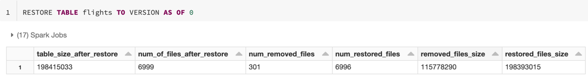

# Schema und Tabellenhistorie

Zwei eng verwandte Themen: Wie Databricks das Schema einer Tabelle vor fehlerhaften Schreibvorgängen schützt (Schema Enforcement) und wie es sich gezielt weiterentwickeln lässt (Schema Evolution), sowie wie sich jede Änderung an einer Tabelle über `DESCRIBE HISTORY` vollständig nachvollziehen lässt. Abgerundet durch die wichtigsten Tabelleneigenschaften (`TBLPROPERTIES`), die viele der bereits behandelten Features steuern. Basierend auf offiziellen Databricks-Doku-Seiten (jeweils am Ende jedes Abschnitts referenziert).

## Abschnittsübersicht

1. [Tabellenhistorie: DESCRIBE HISTORY](#history)
2. [Historie-Schema und Operation-Metrics](#history-schema)
3. [Schema Enforcement](#schema-enforcement)
4. [Schema aktualisieren (Schema Evolution)](#update-schema)
5. [Tabelleneigenschaften (TBLPROPERTIES)](#table-properties)
6. [Zusammenfassung](#zusammenfassung)

---

## <a id="history">1. Tabellenhistorie: DESCRIBE HISTORY</a>

### 1.1 Grundlegende Nutzung

```sql
DESCRIBE HISTORY table_name;          -- vollständige Historie der Tabelle
DESCRIBE HISTORY table_name LIMIT 1;  -- nur die letzte Operation
```

Der Befehl liefert „Informationen einschließlich der Operationen, des Nutzers und des Zeitstempels für jeden Schreibvorgang auf eine Tabelle" — Ergebnisse in umgekehrt chronologischer Reihenfolge.

### 1.2 Retention-Konfiguration

| Eigenschaft | Standard | Bedeutung |
|---|---|---|
| `logRetentionDuration` | 30 Tage | wie lange die Historie einer Tabelle aufbewahrt wird |
| `deletedFileRetentionDuration` | 7 Tage | kürzeste Dauer, für die logisch gelöschte Datendateien behalten werden |

**Konfigurationssyntax:**

```sql
ALTER TABLE table_name SET TBLPROPERTIES (
  # <format> durch `delta` oder `iceberg` ersetzen.
  <format>.logRetentionDuration = "interval <interval>",
  <format>.deletedFileRetentionDuration = "interval <interval>"
);
# Regel: logRetentionDuration >= deletedFileRetentionDuration

```

```sql
ALTER TABLE table_name SET TBLPROPERTIES (
  delta.logRetentionDuration = "interval 60 days",
  delta.deletedFileRetentionDuration = "interval 30 days"
);

ALTER TABLE table_name SET TBLPROPERTIES (
  iceberg.logRetentionDuration = "interval 60 days",
  iceberg.deletedFileRetentionDuration = "interval 30 days"
);
```



### Quelle

- https://docs.databricks.com/aws/en/tables/history
- https://docs.databricks.com/aws/en/tables/table-properties (bestätigt `delta.`/`iceberg.`-Präfixmuster für Tabelleneigenschaften)

---

## <a id="history-schema">2. Historie-Schema und Operation-Metrics</a>

### 2.1 Vollständiges Historie-Schema (14 Spalten)

| Spalte | Typ | Beschreibung |
|---|---|---|
| `version` | long | die durch die Operation erzeugte Tabellenversion |
| `timestamp` | timestamp | wann diese Version committet wurde |
| `userId` | string | ID des Nutzers, der die Operation ausgeführt hat |
| `userName` | string | Name des Nutzers, der die Operation ausgeführt hat |
| `operation` | string | Name der Operation |
| `operationParameters` | map | Parameter der Operation (z. B. Prädikate) |
| `job` | struct | Details des Lakeflow-Jobs, der die Operation ausgeführt hat |
| `notebook` | struct | Details des Databricks-Notebooks, aus dem die Operation ausgeführt wurde |
| `clusterId` | string | ID des Clusters, auf dem die Operation lief |
| `readVersion` | long | Tabellenversion, die für den Schreibvorgang gelesen wurde |
| `isolationLevel` | string | für diese Operation genutztes Isolation Level |
| `isBlindAppend` | boolean | ob diese Operation Daten angehängt hat |
| `operationMetrics` | map | Metriken der Operation (z. B. Anzahl geänderter Zeilen/Dateien) |
| `userMetadata` | string | benutzerdefinierte Commit-Metadaten, sofern angegeben (siehe [Tabellenoperationen/Clone, Details und Metadaten.md](Tabellenoperationen/Clone%2C%20Details%20und%20Metadaten.md), Abschnitt 4.3) |

### 2.2 Operation-Metrics nach Operationstyp

| Operation | Metriken |
|---|---|
| **WRITE, CREATE TABLE AS SELECT, REPLACE TABLE AS SELECT, COPY INTO** | `numFiles`, `numOutputBytes`, `numOutputRows` |
| **STREAMING UPDATE** | `numAddedFiles`, `numRemovedFiles`, `numOutputRows`, `numOutputBytes` |
| **DELETE** | `numAddedFiles`, `numRemovedFiles`, `numDeletedRows`, `numCopiedRows`, `executionTimeMs`, `scanTimeMs`, `rewriteTimeMs` |
| **TRUNCATE** | `numRemovedFiles`, `executionTimeMs` |
| **MERGE** | `numSourceRows`, `numTargetRowsInserted`, `numTargetRowsUpdated`, `numTargetRowsDeleted`, `numTargetRowsCopied`, `numOutputRows`, `numTargetFilesAdded`, `numTargetFilesRemoved`, `executionTimeMs`, `scanTimeMs`, `rewriteTimeMs` |
| **UPDATE** | `numAddedFiles`, `numRemovedFiles`, `numUpdatedRows`, `numCopiedRows`, `executionTimeMs`, `scanTimeMs`, `rewriteTimeMs` |
| **FSCK** | `numRemovedFiles` |
| **CONVERT** | `numConvertedFiles` |
| **OPTIMIZE** | `numAddedFiles`, `numRemovedFiles`, `numAddedBytes`, `numRemovedBytes`, `minFileSize`, `p25FileSize`, `p50FileSize`, `p75FileSize`, `maxFileSize` |
| **CLONE** | `sourceTableSize`, `sourceNumOfFiles`, `numRemovedFiles`, `removedFilesSize`, `numCopiedFiles`, `copiedFilesSize` |
| **RESTORE** | `tableSizeAfterRestore`, `numOfFilesAfterRestore`, `numRemovedFiles`, `numRestoredFiles`, `removedFilesSize`, `restoredFilesSize` |
| **VACUUM** | `numDeletedFiles`, `numVacuumedDirectories`, `numFilesToDelete` |

### Quelle

- https://docs.databricks.com/aws/en/tables/history-schema

---

## <a id="schema-enforcement">3. Schema Enforcement</a>

### 3.1 Funktionsweise

Schema Enforcement validiert die Datenqualität, indem es das Schema beim Schreiben nur für Delta-Lake-Tabellen durchsetzt. „Schema Enforcement gilt nicht für Tabellen mit Nicht-Delta-Formaten, wie CSV- oder JSON-Dateien im Cloud-Storage."

### 3.2 INSERT-Operationen

Zwei Kernregeln:

- Alle eingefügten Spalten müssen in der Zieltabelle existieren.
- Spaltendatentypen müssen zum Schema der Zieltabelle passen.

Das System „versucht, Spaltendatentypen sicher in den Zieltyp zu casten."

**Ablehnungsbeispiel:**

```sql
INSERT INTO catalog.schema.target_table (id, unknown_column) VALUES (1, 'value');
-- Schlägt fehl, da unknown_column im Ziel nicht existiert
-- Fehler: UNRESOLVED_COLUMN.WITH_SUGGESTION (SQLSTATE 42703) — schlägt gültige Spaltennamen vor
```

**Erfolgreiches Cast-Beispiel:**

```sql
INSERT INTO catalog.schema.target_table (id, bigint_column) VALUES (1, 42);
-- Integer 42 wird sicher zu BIGINT gecastet
```

### 3.3 MERGE-Operationen

Durchgesetzte Regeln:

- Datentypen versuchen sicheres Casting zum Zielspaltentyp.
- Ziel-Spalten von `UPDATE`- und `INSERT`-Aktionen müssen in der Zieltabelle existieren.
- Bei `INSERT *` oder `UPDATE SET *`: die Quelle muss alle Zielspalten enthalten; zusätzliche Quellspalten werden ignoriert.

**Ablehnungsbeispiel:**

```sql
MERGE INTO catalog.schema.target_table AS t
USING catalog.schema.source_table AS s
ON t.id = s.id
WHEN MATCHED THEN UPDATE SET t.unknown_column = s.value
WHEN NOT MATCHED THEN INSERT (id, unknown_column) VALUES (s.id, s.value);
-- Schlägt fehl, da unknown_column in target_table nicht existiert
-- Fehler: DELTA_MERGE_UNRESOLVED_EXPRESSION — listet die auflösbaren Spalten auf
```

**Erfolgsbeispiel:**

```sql
MERGE INTO catalog.schema.target_table AS t
USING catalog.schema.source_table AS s
ON t.id = s.id
WHEN NOT MATCHED THEN INSERT *;
-- Gelingt, wenn die Quelle alle Zielspalten enthält; zusätzliche Spalten werden ignoriert
```

### 3.4 Schema-Änderung

**Explizite Änderung:**

```sql
ALTER TABLE catalog.schema.table_name ADD COLUMN new_column STRING;
```

**Automatische Schema Evolution (SQL):**

```sql
SET spark.databricks.delta.schema.autoMerge.enabled = true;
INSERT INTO catalog.schema.table_name SELECT * FROM source_table;
```

**Automatische Schema Evolution (Python):**

```python
df.write.option("mergeSchema", "true").mode("append").saveAsTable("catalog.schema.table_name")
```

### 3.5 External Tables

Ändern externe Clients die Metadaten einer External Table außerhalb von Databricks, synchronisiert Unity Catalog Schema-Updates nicht automatisch, was korrekte Durchsetzung verhindert. Zur Resynchronisierung:

```sql
MSCK REPAIR TABLE <table-name> SYNC METADATA;
```

### Quelle

- https://docs.databricks.com/aws/en/tables/schema-enforcement

---

## <a id="update-schema">4. Schema aktualisieren (Schema Evolution)</a>

Databricks unterstützt Schema Evolution — strukturelle Änderungen wie Hinzufügen von Spalten, Umordnen, Umbenennen und Type Widening (siehe [Table Features/13 Type Widening.md](07%20Table%20Features/13%20Type%20Widening.md)). Änderungen lassen sich explizit über DDL oder implizit über DML-Operationen vornehmen.

> **Wichtig (Doku-Callout):** *"Schema updates conflict with all concurrent write operations. Databricks recommends coordinating schema changes to avoid write conflicts. Updating a table schema terminates any streams reading from that table."* — Schema-Updates kollidieren also mit **allen** nebenläufigen Schreiboperationen und **beenden jeden Stream**, der aus der Tabelle liest.

### 4.1 Manuelle Schema-Änderungen

**Spalten hinzufügen:**

```sql
ALTER TABLE table_name ADD COLUMNS (col_name data_type [COMMENT col_comment] [FIRST|AFTER colA_name], ...);
```

Nullability ist standardmäßig `true`; Position über `FIRST`/`AFTER` steuerbar; verschachtelte Felder über Punktnotation unterstützt.

```sql
-- Verschachtelte Structs
ALTER TABLE boxes ADD COLUMNS (colB.nested STRING AFTER field1);

-- Collections (ARRAY/MAP)
ALTER TABLE my_table ADD COLUMNS (points.element.z DOUBLE);
ALTER TABLE my_table ADD COLUMNS (points.key.z DOUBLE);
ALTER TABLE my_table ADD COLUMNS (points.value.z DOUBLE);
```

**Umordnen und Kommentieren:**

```sql
ALTER TABLE table_name ALTER [COLUMN] col_name (COMMENT col_comment | FIRST | AFTER colA_name);
```

**Vollständige `ALTER COLUMN`-Klausel-Referenz** (`sql-ref-syntax-ddl-alter-table-manage-column`):

```sql
{ ALTER | CHANGE } [ COLUMN ] { column_identifier | field_name }
  { COMMENT comment |
    { FIRST | AFTER column_identifier } |
    { SET | DROP } NOT NULL |
    TYPE data_type |
    SET DEFAULT default_expression |
    DROP DEFAULT |
    SYNC IDENTITY |
    SET MASK mask_clause |
    DROP MASK |
    SET TAGS ('key' = 'value', ...) |
    UNSET TAGS ('key', ...) }
```

Benötigtes Privileg: `MODIFY` in Unity Catalog für die meisten dieser Operationen (sonst Eigentümerstatus).

Ab Runtime 16.3+ lassen sich mehrere Spalten in einem einzigen Statement ändern (kommagetrennt) — außer für `SET MASK`/`DROP MASK` und `SET TAGS`/`UNSET TAGS`, die immer nur eine Spalte gleichzeitig betreffen.

**`SET`/`DROP NOT NULL`** — erzwingt bzw. entfernt einen `NOT NULL`-Constraint auf einer bestehenden Spalte. Beim Hinzufügen prüft Databricks zunächst, ob alle aktuellen Zeilen den Constraint bereits erfüllen. Ist eine Spalte innerhalb eines Structs verschachtelt, muss auch das übergeordnete Struct `NOT NULL` sein; Spalten innerhalb von Array-/Map-Typen können keinen `NOT NULL`-Constraint tragen.

```sql
ALTER TABLE people10m ALTER COLUMN middleName DROP NOT NULL;
ALTER TABLE people10m ALTER COLUMN ssn SET NOT NULL;
```

**`TYPE data_type`** ändert den Datentyp einer Spalte in einen breiteren, kompatiblen Typ, **ohne** die zugrunde liegenden Datendateien neu zu schreiben. Muss zuerst per Tabelleneigenschaft aktiviert werden. Unterstützt u. a.: `BYTE`→`SHORT`/`INT`/`BIGINT`/`DECIMAL`/`DOUBLE`, `INT`→`BIGINT`/`DECIMAL`/`DOUBLE`, `FLOAT`→`DOUBLE`, `DATE`→`TIMESTAMP_NTZ`.

```sql
ALTER TABLE table_name SET TBLPROPERTIES ('delta.enableTypeWidening' = 'true');
ALTER TABLE table_name ALTER COLUMN col_name TYPE BIGINT;
```

**`SET MASK`/`DROP MASK`** wendet eine SQL-Funktion auf eine Spalte an, die bei jedem Zeilenabruf entscheidet, ob der echte Wert oder ein geschwärzter/verfälschter Wert zurückgegeben wird (z. B. abhängig von der Gruppenzugehörigkeit des abfragenden Nutzers).

```sql
CREATE FUNCTION ssn_mask(ssn STRING)
RETURN CASE WHEN is_account_group_member('HumanResourceDept') THEN ssn ELSE '***-**-****' END;

ALTER TABLE users ALTER COLUMN ssn SET MASK ssn_mask;
ALTER TABLE users ALTER COLUMN ssn DROP MASK;
```

**`SET TAGS`/`UNSET TAGS`** versieht eine einzelne Spalte mit Schlüssel-Wert-Tags für Governance/Klassifizierung (z. B. PII-Kennzeichnung); erfordert das Privileg `APPLY TAG` auf der Tabelle. Anders als Catalog-/Schema-/Tabellen-Tags vererben sich Spalten-Tags **nicht** automatisch weiter.

```sql
ALTER TABLE schema.table ALTER COLUMN column_name SET TAGS ('pii' = 'true');
ALTER TABLE schema.table ALTER COLUMN column_name UNSET TAGS ('pii');
```

**`SET DEFAULT`/`DROP DEFAULT`**: Legt einen `DEFAULT`-Ausdruck fest, der bei `INSERT` bzw. `MERGE ... INSERT` greift, wenn die Spalte nicht angegeben wird.

```sql
ALTER TABLE table_name ALTER COLUMN col_name SET DEFAULT default_expression;
ALTER TABLE table_name ALTER COLUMN col_name DROP DEFAULT;
```

Nicht-deterministische Funktionen im Default-Ausdruck werden einmalig zum Zeitpunkt des `ALTER TABLE` ausgewertet und dann als konstanter Wert auf bereits vorhandene Zeilen angewendet. `DROP DEFAULT` entfernt den Ausdruck wieder; bei nullable Spalten wird der Default anschließend implizit `NULL`.

**`SYNC IDENTITY`** (ab Runtime 10.4+)

### Vorwissen: Was ist eine Identity Column?

Eine Identity Column (`GENERATED ALWAYS AS IDENTITY` bzw. `GENERATED BY DEFAULT AS IDENTITY`, siehe [`07 Table Features/09 Generated Columns.md`](07%20Table%20Features/09%20Generated%20Columns.md), Abschnitt 4) vergibt automatisch fortlaufende Zahlenwerte an neue Zeilen — ähnlich einer Auto-Increment-Spalte in einer klassischen Datenbank. Databricks merkt sich dafür **intern einen einzigen Zähler** ("High-Water-Mark"): "der nächste zu vergebende Wert". Bei jedem `INSERT`, das die ID automatisch generieren lässt, wird dieser Zähler um die Schrittweite (`step`) erhöht. Databricks scannt dafür **nicht** bei jedem Insert die ganze Tabelle nach dem tatsächlich größten vorhandenen Wert — es verlässt sich auf den gemerkten Zähler.

### Das Problem: der Zähler kann "blind" werden

Bei `GENERATED BY DEFAULT AS IDENTITY` (anders als bei `ALWAYS`) darf man beim `INSERT` **selbst** einen expliziten Wert für die ID-Spalte angeben, statt sie automatisch generieren zu lassen — etwa beim Importieren alter Datensätze mit bereits vorhandenen IDs. Trägt man dabei einen Wert ein, der **größer** ist als der interne Zähler, merkt Databricks das nicht automatisch — der Zähler bleibt auf seinem alten Stand stehen. Vergibt man danach weiter automatisch generierte IDs, kann der Zähler den manuell eingefügten Wert irgendwann einholen und **denselben Wert doppelt vergeben**.

**Konkretes Beispiel — Schritt für Schritt:**

```sql
-- 1. Tabelle mit Identity Column anlegen (Start bei 1, Schrittweite 1)
CREATE TABLE orders (
  id BIGINT GENERATED BY DEFAULT AS IDENTITY (START WITH 1 INCREMENT BY 1),
  customer STRING
);

-- 2. Drei normale Inserts — IDs werden automatisch vergeben: 1, 2, 3
INSERT INTO orders (customer) VALUES ('Anna');
INSERT INTO orders (customer) VALUES ('Ben');
INSERT INTO orders (customer) VALUES ('Clara');
-- Interner Zähler steht jetzt auf "nächster Wert = 4"

-- 3. Migration: alte Bestellungen mit bereits vorhandenen, viel größeren IDs importieren
INSERT INTO orders (id, customer) VALUES (1000, 'Alt-Kunde X');
INSERT INTO orders (id, customer) VALUES (1001, 'Alt-Kunde Y');
-- Der Zähler WEISS davon nichts — er steht immer noch auf "nächster Wert = 4"!

-- 4. Ein weiterer normaler Insert vergibt jetzt id = 4 (kein Problem, noch keine Kollision)
INSERT INTO orders (customer) VALUES ('Dennis');
-- Aber: würde man diesen Zustand so weiterlaufen lassen, erreicht der Zähler
-- irgendwann wieder 1000/1001 und würde versuchen, dieselbe ID erneut zu vergeben.
```

**Die Lösung — `SYNC IDENTITY` neu kalibrieren:**

```sql
ALTER TABLE orders ALTER COLUMN id SYNC IDENTITY;
```

Der Befehl scannt einmalig die **tatsächlichen** Werte in der Spalte, ermittelt das aktuelle Maximum (hier: `1001`) und setzt den internen Zähler so neu, dass künftige automatische IDs garantiert **darüber** liegen — in diesem Beispiel wäre die nächste automatisch generierte ID danach `1002` statt `4`. Damit ist eine künftige Kollision mit den manuell importierten IDs ausgeschlossen.

**Wann `SYNC IDENTITY` in der Praxis nötig ist:** praktisch immer nach einer Migration/einem Bulk-Import mit expliziten ID-Werten in eine `GENERATED BY DEFAULT AS IDENTITY`-Spalte — z. B. genau der Workaround für CTAS-Migrationen mit vorhandenen IDs aus [`07 Table Features/09 Generated Columns.md`](07%20Table%20Features/09%20Generated%20Columns.md), Abschnitt 4. Bei `GENERATED ALWAYS AS IDENTITY` kann dieses Problem gar nicht erst auftreten, da dort manuelle Werte grundsätzlich verboten sind.

```sql
ALTER TABLE table_name ALTER COLUMN identity_col_name SYNC IDENTITY;
```

Quelle: https://docs.databricks.com/aws/en/sql/language-manual/sql-ref-syntax-ddl-alter-table-manage-column

**Spaltenersetzung** (gesamte Spaltenstruktur in einer Operation neu definieren):

```sql
ALTER TABLE table_name REPLACE COLUMNS (col_name1 col_type1 [COMMENT col_comment1], ...);
```

**Spalten umbenennen** (erfordert aktiviertes Column Mapping, siehe [Table Features/05 Column Mapping.md](07%20Table%20Features/05%20Column%20Mapping.md) — reine Metadaten-Änderung ohne Neuschreiben):

```sql
ALTER TABLE table_name RENAME COLUMN old_col_name TO new_col_name;
ALTER TABLE boxes RENAME COLUMN colB.field1 TO field001;
```

**Spalten löschen** (nur Metadaten, erfordert Column Mapping; physische Bereinigung erfordert `REORG TABLE` gefolgt von `VACUUM`):

```sql
ALTER TABLE table_name DROP COLUMN col_name;
ALTER TABLE table_name DROP COLUMNS (col_name_1, col_name_2);

-- Physische Bereinigung, Schritt 1: Datendateien ohne die gelöschte(n) Spalte(n) neu schreiben
REORG TABLE table_name APPLY (PURGE);

-- Physische Bereinigung, Schritt 2: die dadurch nicht mehr referenzierten alten Dateien
-- endgültig entfernen (erst nach Ablauf der Retention-Frist, Standard 7 Tage — Abschnitt 1.2)
VACUUM table_name;
```

`ALTER TABLE ... DROP COLUMN` allein ändert nur die Metadaten (die Spalte verschwindet sofort aus Schema/Queries) — die eigentlichen Werte bleiben zunächst physisch in den bestehenden Parquet-Dateien liegen, da Delta Lake diese nicht bei jeder Schema-Änderung neu schreibt. `REORG TABLE ... APPLY (PURGE)` schreibt die betroffenen Dateien einmalig ohne die gelöschte Spalte neu; die dabei überflüssig gewordenen alten Dateien werden aber nicht sofort gelöscht, sondern erst durch das anschließende `VACUUM` — genau dasselbe Zwei-Schritte-Muster wie beim endgültigen Entfernen von Deletion-Vector-Löschungen (siehe [`07 Table Features/06 Deletion Vectors.md`](07%20Table%20Features/06%20Deletion%20Vectors.md), Abschnitt "Für vollständige Datenentfernung und Compliance").

**Typ- und Namensänderungen** (gesamte Tabelle über `overwriteSchema` neu schreiben):

```python
(spark.read.table(...)
  .withColumn("birthDate", col("birthDate").cast("date"))
  .write
  .mode("overwrite")
  .option("overwriteSchema", "true")
  .saveAsTable(...))

(spark.read.table(...)
  .withColumnRenamed("dateOfBirth", "birthDate")
  .write
  .mode("overwrite")
  .option("overwriteSchema", "true")
  .saveAsTable(...))
```

### 4.2 Implizite Schema Evolution (automatisch)

**INSERT mit Schema Evolution:**

```sql
-- SQL (Runtime 18.1+)
INSERT WITH SCHEMA EVOLUTION INTO target_table
SELECT * FROM source_table;
```

Liefert die Abfrage auf `source_table` Spalten, die im Ziel nicht existieren, werden diese **automatisch hinzugefügt**. Die `WITH SCHEMA EVOLUTION`-Klausel unterstützt die Formen `INSERT INTO`, `INSERT OVERWRITE` und `INSERT INTO … REPLACE`. Das Ziel muss eine **Delta-Lake-** oder **Apache-Iceberg-**Tabelle sein (Hive/Nicht-Delta → Fehler). Für Databricks Runtime **18.0 oder darunter** stattdessen die `mergeSchema`-Option verwenden.

```python
# DataFrame-API mit mergeSchema
(spark.read
  .table("source_table")
  .write
  .option("mergeSchema", "true")
  .mode("append")
  .saveAsTable("target_table"))
```

**Structured Streaming:**

```python
(spark.readStream
  .format("cloudFiles")
  .option("cloudFiles.format", "json")
  .option("cloudFiles.schemaLocation", "<path-to-schema-location>")
  .load("<path-to-source-data>")
  .writeStream
  .option("mergeSchema", "true")
  .option("checkpointLocation", "<path-to-checkpoint>")
  .trigger(availableNow=True)
  .toTable("table_name"))
```

**MERGE mit Schema Evolution:**

```sql
-- SQL (Runtime 15.4 LTS+)
MERGE WITH SCHEMA EVOLUTION INTO target
USING source
ON source.key = target.key
WHEN MATCHED THEN UPDATE SET *
WHEN NOT MATCHED THEN INSERT *
WHEN NOT MATCHED BY SOURCE THEN DELETE;
```

```python
from delta.tables import *

(targetTable
  .merge(sourceDF, "source.key = target.key")
  .withSchemaEvolution()
  .whenMatchedUpdateAll()
  .whenNotMatchedInsertAll()
  .whenNotMatchedBySourceDelete()
  .execute())
```

**Regeln der Schema Evolution bei MERGE:**

- Spalten in der Quelle, aber nicht im Ziel werden hinzugefügt, wenn sie namentlich oder über `UPDATE SET *`/`INSERT *` angegeben sind.
- Spalten im Ziel, aber nicht in der Quelle bleiben bei `UPDATE SET *` unverändert; bei `INSERT *` werden sie auf `NULL` gesetzt.
- Evolution findet nur statt, wenn Spaltennamen exakt zwischen Quelle und Ziel übereinstimmen.

**`EXCEPT`-Klausel mit MERGE** (Spalten von der Schema Evolution ausschließen, ab Runtime 12.2 LTS+):

```sql
MERGE INTO target t
USING source s
ON t.id = s.id
WHEN MATCHED THEN UPDATE SET last_updated = current_date()
WHEN NOT MATCHED THEN INSERT * EXCEPT (last_updated, internal_count);
```

Bei aktivierter Schema Evolution werden ausgeschlossene Spalten nicht dem Schema hinzugefügt, bestehende Spalten jedoch auf `NULL` gesetzt.

### 4.3 Legacy-Konfigurationsansatz

Session-weite Aktivierung (nicht empfohlen für Produktion):

```python
spark.conf.set("spark.databricks.delta.schema.autoMerge.enabled", True)
```

**Empfehlung:** stattdessen Per-Operation-Optionen für Produktionsumgebungen nutzen.

### 4.4 Tabellen-Schema ersetzen

```python
df.write.option("overwriteSchema", "true")
```

**Einschränkung:** nicht kombinierbar mit Dynamic-Partition-Overwrite-Modus.

### Quelle

- https://docs.databricks.com/aws/en/tables/update-schema

---

## <a id="table-properties">5. Tabelleneigenschaften (TBLPROPERTIES)</a>

### 5.1 Syntax

```sql
ALTER TABLE <table-name> SET TBLPROPERTIES ('property.name' = value);
```

Präfix `delta.` für Delta-Lake-Tabellen, `iceberg.` für Apache-Iceberg-Tabellen.

### 5.2 Vollständige Liste wichtiger Tabelleneigenschaften

| Eigenschaft | Typ | Standard | Zweck |
|---|---|---|---|
| `appendOnly` | Boolean | `false` | macht die Tabelle append-only — kein Löschen/Aktualisieren bestehender Datensätze erlaubt |
| `autoOptimize.autoCompact` | String | (keiner) | fasst kleine Dateien innerhalb von Tabellenpartitionen automatisch zusammen (siehe [Grundlagen der Query-Performance.md](../../Performance%20Optimization/Foundation%20Design/Grundlagen%20der%20Query-Performance.md)) |
| `autoOptimize.optimizeWrite` | Boolean | (keiner) | optimiert das Datei-Layout beim Schreiben automatisch |
| `checkpoint.writeStatsAsJson` | Boolean | `false` | schreibt Datei-Statistiken in Checkpoints im JSON-Format |
| `checkpoint.writeStatsAsStruct` | Boolean | `true` | schreibt Datei-Statistiken in Checkpoints im Struct-Format |
| `checkpointPolicy` | String | `classic` | akzeptiert `classic` oder `v2` (siehe [Table Features/03 Checkpoint V2.md](07%20Table%20Features/03%20Checkpoint%20V2.md)) |
| `columnMapping.mode` | DeltaColumnMappingMode | `none` | aktiviert Column Mapping für Tabellen- und entsprechende Parquet-Spalten |
| `compatibility.symlinkFormatManifest.enabled` | Boolean | `false` | nur Delta Lake; aktualisiert Manifeste bei Schreiboperationen automatisch |
| `dataSkippingNumIndexedCols` | Int | `32` | Anzahl der für Data Skipping indizierten Spalten (siehe [Data Skipping und Tabellenstatistiken.md](../../Performance%20Optimization/Foundation%20Design/Data%20Skipping%20und%20Tabellenstatistiken.md)) |
| `dataSkippingStatsColumns` | String | (keiner) | kommagetrennte Liste konkreter Spalten für Statistik-Erfassung |
| `deletedFileRetentionDuration` | CalendarInterval | `interval 1 week` | kürzeste Dauer, für die logisch gelöschte Datendateien behalten werden |
| `enableChangeDataFeed` | Boolean | `false` | aktiviert Change Data Feed (siehe [Table Features/02 Change Data Feed.md](07%20Table%20Features/02%20Change%20Data%20Feed.md)) |
| `enableDeletionVectors` | Boolean | abhängig von Einstellungen | aktiviert Deletion Vectors und Predictive I/O für Updates |
| `enableIcebergCompatV2` | Boolean | (keiner) | nur Delta Lake; schreibt mit Iceberg-Readern kompatible Daten |
| `enableRowTracking` | Boolean | `false` | nur Delta Lake; weist stabile Row-IDs und Row-Commit-Versionen zu |
| `enableTypeWidening` | Boolean | `false` | aktiviert Type Widening |
| `format-version` | Int | `2` | nur Apache-Iceberg-Managed-Tables; legt die Iceberg-Formatversion fest |
| `isolationLevel` | String | `WriteSerializable` | Transaktions-Isolation; akzeptiert `Serializable` oder `WriteSerializable` (siehe [Liquid Clustering.md](../../Performance%20Optimization/Foundation%20Design/Liquid%20Clustering.md), Abschnitt 9.1) |
| `logRetentionDuration` | CalendarInterval | `interval 30 days` | wie lange die Historie einer Tabelle aufbewahrt wird |
| `minReaderVersion` | Int | `1` | nur Delta Lake; minimal erforderliche Protokoll-Reader-Version |
| `minWriterVersion` | Int | `2` | nur Delta Lake; minimal erforderliche Protokoll-Writer-Version |
| `parquet.compression.codec` | String | `ZSTD` | gültige Werte: `ZSTD`, `SNAPPY`, `GZIP`, `LZ4`, `BROTLI` |
| `parquet.format.version` | String | `1.0.0` | nur Delta Lake; akzeptiert `1.0.0` oder `2.12.0` (siehe [Table Features/10 Parquet v2.md](07%20Table%20Features/10%20Parquet%20v2.md)) |
| `randomizeFilePrefixes` | Boolean | `false` | erzeugt einen zufälligen Präfix für Dateipfade |
| `randomPrefixLength` | Int | `2` | Anzahl der Zeichen für zufällige Präfixe |
| `setTransactionRetentionDuration` | CalendarInterval | (keiner) | kürzeste Dauer, innerhalb der neue Snapshots Transaktions-Identifier behalten |
| `targetFileSize` | String | (keiner) | Ziel-Dateigröße in Bytes oder höheren Einheiten (z. B. `100mb`) |
| `universalFormat.enabledFormats` | String | (keiner) | nur Delta Lake; kommagetrennte Formate (z. B. `iceberg`, siehe [Apache Iceberg.md](Apache%20Iceberg.md), Abschnitt 8) |

### Quelle

- https://docs.databricks.com/aws/en/tables/table-properties

---

## <a id="zusammenfassung">6. Zusammenfassung</a>

- **`DESCRIBE HISTORY`** liefert vollständige Provenienz-Informationen zu jedem Schreibvorgang einer Tabelle — 14 Spalten inklusive `operationParameters` und `operationMetrics`, deren genauer Inhalt je Operationstyp variiert (WRITE, MERGE, DELETE, OPTIMIZE, CLONE, RESTORE, VACUUM usw.).
- **Schema Enforcement** verhindert standardmäßig, dass Schreibvorgänge mit unbekannten Spalten oder inkompatiblen Typen erfolgreich sind — mit sicherem automatischem Type-Casting für kompatible Typen.
- **Schema Evolution** ermöglicht kontrollierte Schema-Änderungen — manuell über `ALTER TABLE`, oder implizit über `mergeSchema`/`INSERT WITH SCHEMA EVOLUTION`/`MERGE WITH SCHEMA EVOLUTION`.
- **Tabelleneigenschaften (`TBLPROPERTIES`)** bündeln die Konfiguration nahezu aller in diesem Ordner behandelten Features — von Data Skipping über Deletion Vectors bis Isolation Level — einheitlich über `ALTER TABLE ... SET TBLPROPERTIES` steuerbar.
