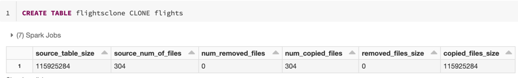

# Clone, Details und Metadaten

Drei ergänzende Tabellenoperationen: das Klonen von Delta-Tabellen (Deep und Shallow Clone, mit einer speziellen Variante für Unity Catalog), das Einsehen von Tabellendetails über `DESCRIBE DETAIL`, und das Anreichern von Tabellen mit benutzerdefinierten Metadaten (Kommentare, Tags, Commit-Metadaten). Basierend auf offiziellen Databricks-Doku-Seiten (jeweils am Ende jedes Abschnitts referenziert).

## Abschnittsübersicht

1. [Tabellen klonen: Deep Clone vs. Shallow Clone](#klonen)
2. [Shallow Clone in Unity Catalog](#uc-shallow-clone)
3. [Tabellendetails einsehen: DESCRIBE DETAIL](#table-details)
4. [Benutzerdefinierte Metadaten](#custom-metadata)
5. [Zusammenfassung](#zusammenfassung)

---

## <a id="klonen">1. Tabellen klonen: Deep Clone vs. Shallow Clone</a>

### 1.1 Deep Clone

SQL-Syntax: `CLONE` oder `DEEP CLONE`. „Kopiert sowohl Daten als auch Metadaten von der Quelltabelle zum Klon-Ziel" — inklusive Stream- und `COPY INTO`-Metadaten, sodass gestoppte Streams und `COPY INTO`-Ladevorgänge auf Klonen fortgesetzt werden können. Teurer, da Daten vollständig dupliziert werden. Unterschied zu `CTAS` (`CREATE TABLE AS SELECT`): Clone kopiert zusätzlich zu den Daten auch die Metadaten.

### 1.2 Shallow Clone

SQL-Syntax: `SHALLOW CLONE`. „Kopiert nur die Metadaten von der Quelltabelle zum Klon-Ziel. Datendateien werden nicht kopiert." Kosteneffizient — nutzt weniger Compute-Ressourcen und Storage. Referenziert die Original-Datendateien; Reader benötigen Zugriff auf sowohl Quell- als auch Klon-Verzeichnis.

**Was geklont wird:** Schema, Partitionierung, Invarianten, Nullability und `TBLPROPERTIES`. **Ausgeschlossen:** Tabellenbeschreibungen, benutzerdefinierte Commit-Metadaten, Delta-Lake-Historie sowie Unity-Catalog-Tags und -Properties.

### 1.3 Syntax-Beispiele

**Deep Clone:**

```sql
CREATE TABLE target_table CLONE source_table;
CREATE OR REPLACE TABLE target_table CLONE source_table;
CREATE TABLE IF NOT EXISTS target_table CLONE source_table;
```

**Shallow Clone (auch versioniert/zeitgesteuert):**

```sql
CREATE TABLE target_table SHALLOW CLONE source_table;
CREATE TABLE target_table SHALLOW CLONE source_table VERSION AS OF version;
CREATE TABLE target_table SHALLOW CLONE source_table TIMESTAMP AS OF timestamp_expression;
```

**Python (DeltaTable-API):**

```python
from delta.tables import *

deltaTable = DeltaTable.forName(spark, "source_table")
deltaTable.clone(target="target_table", isShallow=True, replace=False)
deltaTable.cloneAtVersion(version=1, target="target_table", isShallow=True, replace=False)
deltaTable.cloneAtTimestamp(timestamp="2019-01-01", target="target_table", isShallow=True, replace=False)
```

### 1.4 Klon-Metriken

Operationen liefern folgende Metriken als einzeiliges DataFrame zurück:

| Metrik | Bedeutung |
|---|---|
| `source_table_size` | Bytes in der Quelltabelle |
| `source_num_of_files` | Dateianzahl in der Quelle |
| `num_removed_files` | entfernte Dateien beim Ersetzen |
| `num_copied_files` | kopierte Dateien (0 bei Shallow Clone) |
| `removed_files_size` | Größe entfernter Dateien in Bytes |
| `copied_files_size` | Größe kopierter Dateien in Bytes |



### 1.5 Benötigte Berechtigungen

**Table-Access-Control:** `SELECT` auf der Quelltabelle, `CREATE` auf der Ziel-Datenbank (bei neuen Tabellen), `MODIFY` auf der Zieltabelle (beim Ersetzen).

**Cloud-Provider-Berechtigungen:**

| Klon-Typ | Rolle | Berechtigung |
|---|---|---|
| Deep Clone | Reader | Lesezugriff auf Klon-Verzeichnis |
| Deep Clone | Writer | Schreibzugriff auf Klon-Verzeichnis |
| Shallow Clone | Reader | Lesezugriff auf sowohl Quell-Datendateien als auch Klon-Verzeichnis |
| Shallow Clone | Writer | Schreibzugriff auf Klon-Verzeichnis |

### 1.6 Anwendungsfälle

**Daten-Archivierung** (mit inkrementeller Synchronisierung für Disaster Recovery geeignet):

```sql
CREATE OR REPLACE TABLE archive_table CLONE my_prod_table;
```

**ML-Modell-Reproduktion** (archiviert spezifische Datensatz-Versionen für Modelltraining):

```sql
CREATE TABLE model_dataset CLONE entire_dataset VERSION AS OF 15;
```

**Experimentieren mit Produktionstabellen**, ohne Produktion zu beeinträchtigen:

```sql
CREATE TABLE my_test SHALLOW CLONE my_prod_table;
UPDATE my_test WHERE user_id is null SET invalid=true;
MERGE INTO my_prod_table USING my_test ...;
DROP TABLE my_test;
```

**Tabelleneigenschaften beim Klonen überschreiben:**

```sql
CREATE OR REPLACE TABLE archive_table CLONE prod.my_table
TBLPROPERTIES (delta.logRetentionDuration = '3650 days',
               delta.deletedFileRetentionDuration = '3650 days');
```

```python
dt = DeltaTable.forName(spark, "prod.my_table")
tblProps = {"delta.logRetentionDuration": "3650 days",
            "delta.deletedFileRetentionDuration": "3650 days"}
dt.clone(target="archive_table", isShallow=False, replace=True, tblProps)
```

### 1.7 Einschränkungen

- Streaming Tables und Materialized Views unterstützen `CLONE` weder als Quelle noch als Ziel.
- Shallow Clones hängen von den Quelldateien ab — `VACUUM` auf der Quelle löst `FileNotFoundException` aus.
- In Unity Catalog lässt sich `CREATE OR REPLACE` nicht nutzen, um bestehende Shallow Clones zu überschreiben (`DROP` gefolgt von `CREATE`, oder neuer Tabellenname).
- Geklonte Tabellen haben eine unabhängige Historie — Time-Travel-Queries stimmen nicht mit identischen Parametern auf der Quelle überein.

### 1.8 Weitere Hinweise

`MERGE`-Operationen können die Update-Informationen eines Klons nutzen, um geänderte Dateien gezielt zu identifizieren (Datei-Pruning). Als Alternative für den lesenden Zugriff über Organisationsgrenzen hinweg empfiehlt Databricks **OpenSharing** anstelle von Cloning.

### Quelle

- https://docs.databricks.com/aws/en/tables/operations/clone

---

## <a id="uc-shallow-clone">2. Shallow Clone in Unity Catalog</a>

Shallow Cloning in Unity Catalog (**Public Preview**) unterscheidet sich deutlich vom allgemeinen Cloning aus Abschnitt 1: Es „erstellt Unity-Catalog-Tabellen mit von der Quelltabelle unabhängigen Zugriffskontroll-Berechtigungen, ohne die zugrunde liegenden Datendateien zu kopieren." Wie bei anderen `CREATE TABLE`-Anweisungen wird man beim Ausführen von `SHALLOW CLONE` **Eigentümer der Zieltabelle** — Zugriffsrechte lassen sich damit unabhängig von der Quelltabelle steuern.

### 2.1 Runtime-Anforderungen

| Tabellentyp | Mindest-Runtime |
|---|---|
| Managed Tables | Databricks Runtime 13.3 LTS+ |
| External Tables | Databricks Runtime 14.3 LTS+ |

### 2.2 Tabellentyp-Einschränkungen

„Es lassen sich nur Unity-Catalog-Managed-Tables zu Unity-Catalog-Managed-Tables und Unity-Catalog-External-Tables zu Unity-Catalog-External-Tables klonen." Nur Delta-Lake-Tabellen werden unterstützt — Iceberg- und Nicht-Delta-Tabellen lassen sich nicht klonen.

### 2.3 SQL-Syntax

**Managed Shallow Clone:**

```sql
CREATE TABLE <catalog-name>.<schema-name>.<target-table-name>
SHALLOW CLONE <catalog-name>.<schema-name>.<source-table-name>;
```

**External Shallow Clone:**

```sql
CREATE TABLE <catalog-name>.<schema-name>.<target-table-name>
SHALLOW CLONE <catalog-name>.<schema-name>.<source-table-name>
LOCATION 's3://<bucket-name>/<path-name>/<target-table-name>';
```

### 2.4 Benötigte Berechtigungen

**Für Managed-Klone erstellen:**

- Quelle: `USE SCHEMA`, `USE CATALOG`.
- Ziel: `USE SCHEMA`, `CREATE TABLE`, `USE CATALOG`.

**Für External-Klone (zusätzlich):**

- Ziel-External-Location: `CREATE EXTERNAL TABLE`.

**Für Abfragen im Standard Access Mode:**

- Basis: `USE CATALOG`, `USE SCHEMA`, `SELECT`.
- Modifikationen: `MODIFY` auf dem Ziel.

**Für Abfragen im Dedicated Access Mode:**

- Einfache Abfragen: `USE CATALOG`, `USE SCHEMA`, `SELECT` — jeweils auf der **Quelltabelle**.
- Updates/Inserts: zusätzlich `MODIFY` auf der Quelltabelle.

**Best Practice:** Databricks empfiehlt, Unity-Catalog-Klone auf Compute mit **Standard Access Mode** zu nutzen.

### 2.5 VACUUM-Verhaltensunterschiede

Die Unity-Catalog-Shallow-Clone-Unterstützung verfolgt die Beziehungen zwischen allen geklonten Tabellen und den Quell-Datendateien nach, sodass valide Dateien erweitert werden, um die für Queries sowohl auf Shallow-geklonten Tabellen als auch auf der Quelltabelle notwendigen Datendateien einzuschließen.

**Wichtige Unterschiede:**

- **Managed Tables:** `VACUUM` auf Quelle oder Ziel kann Datendateien der Quelltabelle löschen.
- **External Tables:** `VACUUM` entfernt Dateien nur, wenn es gegen die Quelle ausgeführt wird.
- `VACUUM` auf einem Klon entfernt keine für andere Klone noch gültigen Dateien.
- Empfohlene Mindest-Retention: 7 Tage.
- **Berechtigungs-Nuance:** Selbst nach dem Löschen einer Shallow-geklonten Tabelle kann weiterhin `SELECT`-Zugriff auf diese (gelöschte) Tabelle nötig sein, um `VACUUM` auf der Basistabelle auszuführen.

### 2.6 Löschen der Basistabelle (Dropping Base Tables)

**Standardschutz:** Databricks blockiert standardmäßig das Löschen einer Basistabelle (Quelltabelle), solange aktive Klone davon existieren.

**Override:** `DROP TABLE ... FORCE` löscht die Basistabelle trotzdem sofort.

**Folgen für Klone:**

- Bestehende Klone werden „gebrochen" (broken) — Lese-Zugriffe auf Daten und Metadaten schlagen fehl.
- Metadaten-Operationen wie `SHOW TABLES` oder `DROP TABLE` funktionieren auf gebrochenen Klonen weiterhin.
- Gilt ausschließlich für Managed Tables.

### 2.7 Wichtige Einschränkungen

- Kein `CREATE OR REPLACE` bei bestehenden Klonen — zunächst `DROP TABLE`.
- Keine verschachtelten Klone (Klone von Klonen).
- Keine OpenSharing-Kompatibilität.
- Löschen der Quelltabelle bricht Managed-Table-Klone (External-Klone bleiben unbeeinträchtigt) — siehe `DROP TABLE ... FORCE` oben.
- 7-Tage-`UNDROP`-Fenster für gelöschte Managed-Quellen; Shallow Clones bleiben während dieses Fensters funktionsfähig.

### Quelle

- https://docs.databricks.com/aws/en/tables/operations/clone-unity-catalog

---

## <a id="table-details">3. Tabellendetails einsehen: DESCRIBE DETAIL</a>

Der zentrale Befehl zum Abrufen von Tabellen-Metadaten. Liefert „detaillierte Metadaten über eine Delta-Lake- oder Apache-Iceberg-Tabelle, einschließlich Dateianzahl, Datengröße, Partitionsspalten und aktivierter Tabellen-Features."

### Syntax

```sql
DESCRIBE DETAIL '/data/events/';
DESCRIBE DETAIL eventsTable;
```

### Angezeigte Informationen

`DESCRIBE DETAIL` liefert eine einzelne Ergebniszeile mit folgenden Feldern:

| Feld | Typ | Details |
|---|---|---|
| `format` | string | Tabellenformat (delta, iceberg usw.) |
| `id` | string | eindeutiger Tabellen-Identifier |
| `name` | string | im Metastore definierter Tabellenname |
| `description` | string | Tabellenbeschreibung |
| `location` | string | Tabellen-Speicherort |
| `createdAt` | timestamp | Erstellungszeitpunkt |
| `lastModified` | timestamp | Zeitpunkt der letzten Änderung |
| `partitionColumns` | array | Partitionsspaltennamen |
| `numFiles` | long | Dateianzahl in der neuesten Version |
| `sizeInBytes` | int | Größe des neuesten Snapshots |
| `properties` | map | Tabelleneigenschaften |
| `minReaderVersion` | int | minimale Reader-Protokollversion |
| `minWriterVersion` | int | minimale Writer-Protokollversion |
| `statistics` | map | zusätzliche Tabellenstatistiken |
| `tableFeatures` | array | unterstützte Tabellen-Features |
| `clusteringColumns` | array | Liquid-Clustering-Spalten |

Die sichtbaren Spalten hängen von der Databricks-Runtime-Version und den aktivierten Tabellen-Features ab.

### Quelle

- https://docs.databricks.com/aws/en/tables/operations/table-details

---

## <a id="custom-metadata">4. Benutzerdefinierte Metadaten</a>

### 4.1 Kommentare und KI-Generierung

Es empfiehlt sich, Kommentare für Tabellen und Spalten zu erstellen. Databricks bietet eine Funktion, um „diese Kommentare mittels KI zu generieren", über das Feature „AI-generated comments".

### 4.2 Tags

Unity Catalog unterstützt Tagging-Fähigkeiten — Tags lassen sich auf Unity-Catalog-Securable-Objects anwenden.

### 4.3 Benutzerdefinierte Commit-Metadaten

Über die Option `userMetadata` lassen sich benutzerdefinierte Strings an einzelne Tabellen-Commits anhängen. Diese Metadaten sind über `DESCRIBE HISTORY` zugänglich.

**SQL (Delta-Tabellen):**

```sql
SET spark.databricks.delta.commitInfo.userMetadata=overwrite-comment;
INSERT OVERWRITE target_table SELECT * FROM data_source;
```

**SQL (Iceberg-Tabellen):**

```sql
SET spark.databricks.iceberg.commitInfo.userMetadata=overwrite-comment;
INSERT OVERWRITE target_table SELECT * FROM data_source;
```

**Python:**

```python
df.write.mode("overwrite").option("userMetadata", "overwrite-comment").saveAsTable("target_table")
df.write.mode("append").option("userMetadata", "append-comment").saveAsTable("target_table")
```

### 4.4 Compute-Umgebungs-Hinweise

| Compute-Typ | Unterstützung |
|---|---|
| **Classic Compute** | unterstützt sowohl `DataFrameWriter`-Optionen als auch SparkSession-Konfiguration (`spark.databricks.delta.commitInfo.userMetadata` bzw. `spark.databricks.iceberg.commitInfo.userMetadata`) — sind beide gesetzt, hat die `DataFrameWriter`-Option Vorrang |
| **Serverless Compute** | nur die `DataFrameWriter`-Option `userMetadata` wird unterstützt |

### Quelle

- https://docs.databricks.com/aws/en/tables/operations/custom-metadata

---

## <a id="zusammenfassung">5. Zusammenfassung</a>

- **Deep Clone** kopiert Daten und Metadaten vollständig; **Shallow Clone** kopiert nur Metadaten und referenziert die Original-Dateien — deutlich kosteneffizienter, aber abhängig von der Quelle (Vorsicht bei `VACUUM` auf der Quelltabelle).
- **Shallow Clone in Unity Catalog** (Public Preview) erweitert das Konzept um unabhängige Zugriffskontrolle: Managed-zu-Managed und External-zu-External, mit angepasstem `VACUUM`-Verhalten, das Quell- und Zieldateien gemeinsam nachverfolgt. `DROP TABLE ... FORCE` erzwingt das Löschen einer Basistabelle trotz aktiver Klone und „bricht" diese dabei.
- **`DESCRIBE DETAIL`** liefert eine kompakte Metadaten-Übersicht (Format, Dateianzahl, Größe, Partitionsspalten, Tabellen-Features) in einer einzigen Ergebniszeile.
- **Benutzerdefinierte Metadaten** lassen sich über KI-generierte Kommentare, Unity-Catalog-Tags und die `userMetadata`-Option bei Schreiboperationen anreichern — letztere über `DESCRIBE HISTORY` einsehbar.

---

## Vertiefung: Weitere SQL-Beispiele aus dem Language Manual

### CREATE TABLE ... CLONE

Vollständiges Syntax-Diagramm aus dem Language Manual (ergänzt `TBLPROPERTIES`- und `LOCATION`-Klauseln, die im Tutorial-Abschnitt oben nicht auftauchen):

```sql
CREATE TABLE [IF NOT EXISTS] table_name
  [SHALLOW | DEEP] CLONE source_table_name [TBLPROPERTIES clause] [LOCATION path]

[CREATE OR] REPLACE TABLE table_name
  [SHALLOW | DEEP] CLONE source_table_name [TBLPROPERTIES clause] [LOCATION path]
```

```sql
CREATE TABLE target_catalog.target_schema.target_table
DEEP CLONE source_catalog.source_schema.source_table;

CREATE TABLE target_catalog.target_schema.target_table
SHALLOW CLONE source_catalog.source_schema.source_table;
```

Für **Unity-Catalog-Managed-Iceberg-Tabellen** wird ausschließlich Deep Clone unterstützt (kein Shallow Clone) — die Syntax entspricht der Deep-Clone-Variante oben.

Quelle: https://docs.databricks.com/aws/en/sql/language-manual/delta-clone

### DESCRIBE HISTORY

```sql
DESCRIBE HISTORY table_name
```

Liefert Herkunftsinformationen (Operation, Nutzer usw.) zu jedem Schreibvorgang auf die Tabelle; die Historie wird für Delta-Tabellen standardmäßig 30 Tage aufbewahrt.

Quelle: https://docs.databricks.com/aws/en/sql/language-manual/delta-describe-history

### RESTORE

Setzt eine Delta-Tabelle auf einen früheren Zustand zurück — bisher nicht in dieser Datei behandelt. Syntax:

```sql
RESTORE [ TABLE ] table_name [ TO ]
{ TIMESTAMP AS OF timestamp_expression | VERSION AS OF version }
```

```sql
RESTORE TABLE employee TO VERSION AS OF 1;

RESTORE TABLE employee TO TIMESTAMP AS OF '2022-08-02 00:00:00';

RESTORE TABLE employee TO TIMESTAMP AS OF current_timestamp() - INTERVAL '1' HOUR;
```

`RESTORE` ist selbst eine reversible Operation — sie erzeugt einen neuen Eintrag in `DESCRIBE HISTORY`, sodass sich auch ein `RESTORE`-Vorgang per erneutem `RESTORE` rückgängig machen lässt.

Quelle: https://docs.databricks.com/aws/en/sql/language-manual/delta-restore
