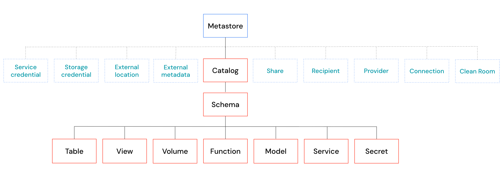
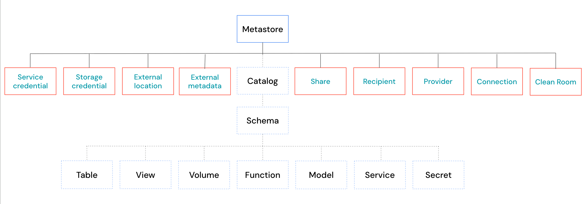

# Securable Objects — schützbare Objekte

Unity Catalog organisiert alle schützbaren Objekte hierarchisch, mit dem **Metastore** als oberster Ebene. Man unterscheidet **Datenobjekte** (dreistufiger Namespace `catalog.schema.objekt`) und **Nicht-Daten-Objekte** (auf Metastore-Ebene). Diese Seite fasst alle Objekttypen kompakt mit ihren wichtigsten Privilegien zusammen; für eine ausführliche Einzelbeschreibung jedes Objekttyps siehe [02 Unity Catalog/](../../../02%20Unity%20Catalog/00%20Overview.md).

## Datenobjekte: Metastore → Catalog → Schema → …

| Objekt | Beschreibung | Wichtige Privilegien |
|---|---|---|
| **Metastore** | Oberstes schützbares Objekt, an eine einzelne Cloud-Region gebunden. Privilegien auf Metastore-Ebene vererben sich **nicht** an Kindobjekte (anders als Catalog/Schema). | — |
| **Catalog** | Container-Objekt. `SELECT` auf einem Catalog vererbt sich automatisch an alle aktuellen und künftigen Kindobjekte. `BROWSE` erlaubt Metadaten-Entdeckung ohne Datenzugriff. | `USE CATALOG`, `BROWSE` |
| **Schema** | Zweite Organisationsebene innerhalb eines Catalogs, ebenfalls mit Vererbung. Zugriff erfordert sowohl `USE CATALOG` als auch `USE SCHEMA`. | `USE SCHEMA` |
| **Tabellen** | Drei Typen: **Managed** (Speicherort von Unity Catalog bestimmt), **External** (nutzerdefinierter Pfad), **Foreign** (aus externen Catalogs). Zugriff erfordert `USE CATALOG` + `USE SCHEMA` + Tabellenprivileg. | `SELECT`, `MODIFY` |
| **Views** | Nur lesbare, per SQL-Query definierte Objekte. Die Privilegien des View-Eigentümers werden zur Laufzeit für die zugrunde liegenden Tabellen verwendet — Nutzer benötigen keine eigenen Rechte darauf. **Materialized Views** berechnen Ergebnisse vor und unterstützen ein `REFRESH`-Privileg. **Metric Views** definieren wiederverwendbare Kennzahlen mit denselben Rechten wie Standard-Views. | — |
| **Volumes** | Objekte für unstrukturierte Daten mit dateibasiertem statt SQL-Zugriff. | `READ VOLUME`, `WRITE VOLUME` |
| **Funktionen** | Wiederverwendbare Logik: UDFs, Stored Procedures, registrierte Modelle. `EXECUTE` erlaubt Aufruf und Einsicht in die Definition. | `EXECUTE` |
| **Modelle** | Versioniertes oder unversioniertes KI-Modell in Unity Catalog. Zusätzlich zu Standard-Funktionsprivilegien: `APPLY TAG`, `CREATE MODEL VERSION`. | `EXECUTE`, `APPLY TAG` |
| **Services** | Governte KI-Assets (Model Services, MCP Services in Beta). | `EXECUTE`, `CREATE SERVICE` |
| **Secrets** | Steuern den Zugriff auf sensible Werte, referenzierbar in Code oder anderen UC-Objekten, ohne den Wert offenzulegen. | `CREATE SECRET`, `READ SECRET`, `WRITE SECRET`, `REFERENCE SECRET` |
| **Features** | ML-Feature-Definitionen (Public Preview). | `CREATE FEATURE`, `READ FEATURE` |

## Nicht-Daten-Objekte (Metastore-Ebene)

**Speicher & externer Zugriff:**

| Objekt | Beschreibung | Wichtige Privilegien |
|---|---|---|
| **Storage Credentials** | Authentifizierungsobjekte für Cloud-Speicherzugriff. | `CREATE STORAGE CREDENTIAL` |
| **External Locations** | Kombinieren ein Storage Credential mit einem konkreten Cloud-Speicherpfad. Databricks empfiehlt, Cloud-Speicherzugriff über Volumes (`READ VOLUME`/`WRITE VOLUME`) statt direkt über `READ FILES`/`WRITE FILES` zu steuern. | — |
| **External Metadata** | Definiert benutzerdefinierte Lineage-Beziehungen für externe Systeme. | `CREATE EXTERNAL METADATA` (Metastore) + `MODIFY` (Objekt) |
| **Service Credentials** | Authentifizierung für externe Cloud-Dienste (getrennt von Storage Credentials). | `CREATE SERVICE CREDENTIAL` |
| **Connections** | Speichern Endpunkte und Credentials für externe Systeme — für Query-/Catalog-Federation, Managed Ingestion, JDBC-Zugriff, HTTP-Services. | `CREATE CONNECTION` |

**Data Sharing:**

| Objekt | Beschreibung | Wichtige Privilegien |
|---|---|---|
| **Shares** | Gruppierung von Assets für OpenSharing. | — |
| **Providers** | Externe Organisationen, die Daten teilen. | — |
| **Recipients** | Organisationen, die geteilte Daten empfangen. | — |
| **Clean Rooms** | Sichere Umgebung zur Zusammenarbeit mit anderen Organisationen an gemeinsamen Daten, ohne dass eine Partei ihre zugrunde liegenden Daten offenlegt. | `EXECUTE CLEAN ROOM TASK`, `MODIFY CLEAN ROOM` |

## Quelle

- https://docs.databricks.com/aws/en/data-governance/unity-catalog/securable-objects
