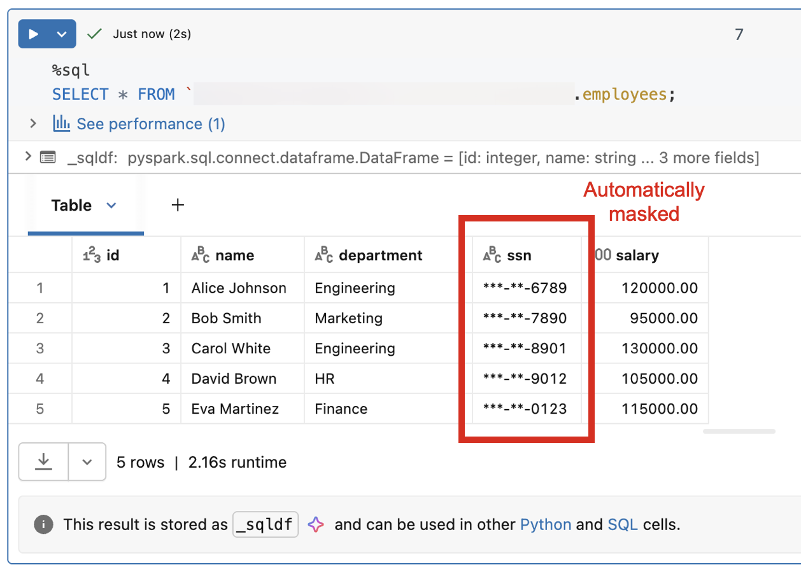
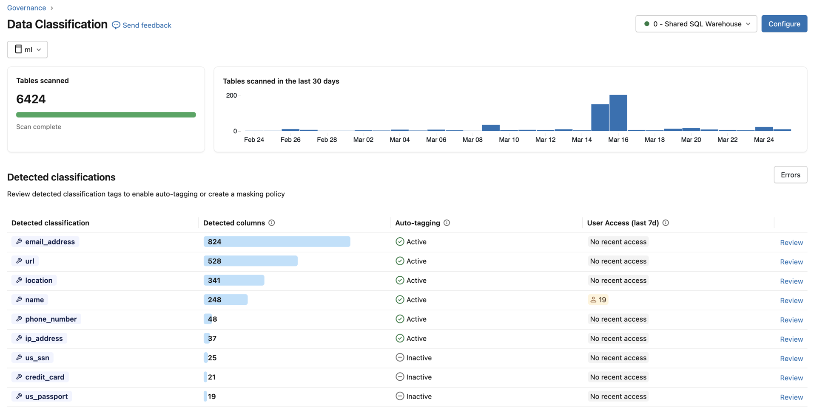
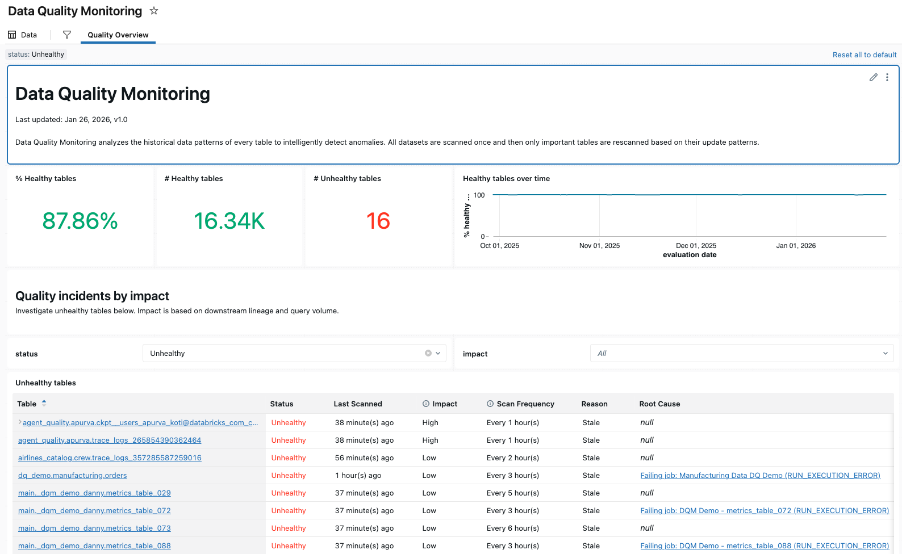
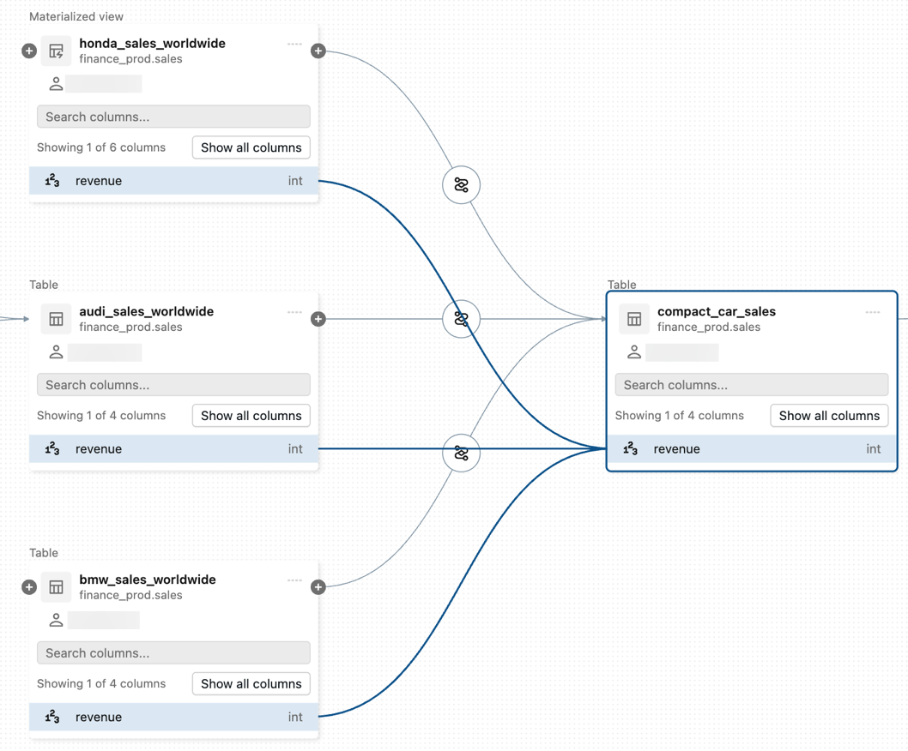

# Erste Schritte mit Unity Catalog

Unity Catalog ist die einheitliche Governance-Schicht für Daten und KI in Databricks — mit zentraler Zugriffskontrolle, Lineage, Auditing und Discovery über Workspaces hinweg.

## Zwei Einstiegspfade

1. **Setup-Anleitung** — für Workspaces, in denen Unity Catalog bereits aktiviert ist: Admin-Rollen, Nutzer, Compute, Berechtigungen und Catalogs konfigurieren (siehe `Unity Catalog einrichten.md`).
2. **Upgrade-Anleitung** — für bestehende Workspaces von vor Unity Catalog: Aktivierung und Datenmigration.

## Fortgeschrittene Governance-Fähigkeiten nach dem Setup

- **Attribute-Based Access Control (ABAC):** dynamische, feingranulare Policies basierend auf Daten- und Nutzer-Attributen — Row-Level-Filtering und Column-Level-Masking ohne Verwaltung einzelner Tabellenberechtigungen.

  

- **Data Classification:** ein Agent scannt Kataloge automatisch, identifiziert und taggt sensible Daten (PII, Finanzdaten, Zugangsdaten) und verknüpft die Klassifizierung mit ABAC-Policies.

  

- **Data Quality Monitoring:** Anomalieerkennung über alle Tabellen eines Schemas sowie Daten-Profiling auf Tabellenebene — erkennt Aktualitäts- und Vollständigkeitsprobleme anhand historischer Muster.

  

- **Data Lineage:** verfolgt den Datenfluss über Tabellen, Notebooks, Jobs und Pipelines bis auf Spaltenebene — ermöglicht Impact-Analysen vor Schema-Änderungen.

  

- **Unity AI Gateway:** erweitert die Governance auf KI-Systeme — Zugriffskontrolle, Audit-Logging und Observability über alle KI-Interaktionen hinweg.

## Quelle

- https://docs.databricks.com/aws/en/data-governance/unity-catalog/get-started
