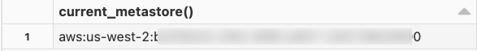

# Unity Catalog einrichten

Anleitung für Workspace-Admins zur initialen Einrichtung von Unity Catalog, in fünf Schritten.

## Begriffe vorab

- **Metastore:** oberster Unity-Catalog-Container, gebunden an eine einzelne Cloud-Region.
- **Catalog:** der höchste Datencontainer innerhalb eines Metastore.
- **Admin-Rollen:** drei Stufen — Account-, Workspace- und Metastore-Administrator.

## Schritt 1: Unity-Catalog-Aktivierung prüfen

- **Account Console:** erfordert Account-Admin-Rechte; Spalte "Metastore" in der Workspace-Übersicht prüfen.
- **SQL-Query:** auf UC-fähigem Compute ausführen:

```sql
SELECT CURRENT_METASTORE();
```



## Schritt 2: Workspace-Zugriff verwalten

- Einzelne Nutzer mit Workspace-Zugriff hinzufügen.
- Nutzer in Gruppen organisieren (empfohlen gegenüber Einzelzuweisungen).
- Admin-Rollen zuweisen — Workspace-Admin ist die primäre Rolle für das Tagesgeschäft.

## Schritt 3: UC-fähiges Compute erstellen

| Compute-Typ | UC-fähig |
|---|---|
| SQL-Warehouse | Ja |
| Serverless Compute | Ja |
| Cluster — Single User | Ja |
| Cluster — Shared | Ja |
| Cluster — No Isolation Shared | Nein |

## Schritt 4: Catalogs und Schemas erstellen

Neue Workspaces erhalten automatisch einen Workspace-Catalog. Zusätzliche Catalogs werden entlang organisatorischer Grenzen empfohlen (Teams, Umgebungen, Projekte):

```sql
CREATE CATALOG IF NOT EXISTS <catalog-name>;
CREATE SCHEMA IF NOT EXISTS <catalog-name>.<schema-name>;
```

## Schritt 5: Privilegien vergeben

**Nur-Lese-Zugriff:**

```sql
GRANT USE CATALOG ON CATALOG <catalog-name> TO `<group-name>`;
GRANT USE SCHEMA ON SCHEMA <catalog-name>.<schema-name> TO `<group-name>`;
GRANT SELECT ON SCHEMA <catalog-name>.<schema-name> TO `<group-name>`;
```

**Lese-Schreib-Zugriff:**

```sql
GRANT USE CATALOG ON CATALOG <catalog-name> TO `<group-name>`;
GRANT USE SCHEMA ON SCHEMA <catalog-name>.<schema-name> TO `<group-name>`;
GRANT SELECT, MODIFY ON SCHEMA <catalog-name>.<schema-name> TO `<group-name>`;
```

Für Data Discovery zusätzlich `BROWSE` vergeben — erlaubt Nutzern zu sehen, dass Objekte existieren, und deren Metadaten einzusehen, ohne die Daten selbst lesen zu können.

## Fortgeschrittene Fähigkeiten nach dem Setup

Nach dem Grundsetup stehen u. a. ABAC, Data Classification und Data Quality Monitoring zur Verfügung (Details in `Erste Schritte.md`):


## Checkliste

1. Unity-Catalog-Aktivierung bestätigt
2. Nutzerverwaltung eingerichtet
3. UC-fähiges Compute verfügbar
4. Catalogs/Schemas organisiert
5. Privilegien konfiguriert

## Quelle

- https://docs.databricks.com/aws/en/data-governance/unity-catalog/setup-uc
