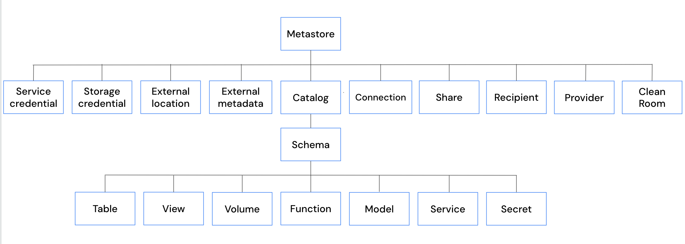

# Privilegien-Referenz

Vollständige Übersicht aller Unity-Catalog-Privilegien, wofür sie gelten und was sie erlauben.

| Privileg | Gilt für | Erlaubt |
|---|---|---|
| `ACCESS` | Service Credential | Ein Service Credential zum Zugriff auf einen externen Dienst nutzen |
| `ALL PRIVILEGES` | Catalog, Schema, Tabelle, View, Materialized View, Volume, Funktion, Feature, Connection, External Location, External Metadata, Secret, Service, Service Credential, Storage Credential | Alle auf das Objekt anwendbaren Fähigkeiten |
| `APPLY TAG` | Catalog, Schema, Tabelle, View, Materialized View, Volume, Funktion (nur Modelle), External Metadata | Tags auf einem Objekt hinzufügen/bearbeiten |
| `BROWSE` | Catalog, External Location, External Metadata, Clean Room | Objekte entdecken, Metadaten einsehen, Zugriff anfragen |
| `CREATE CATALOG` | Metastore | Einen Catalog im Metastore erstellen |
| `CREATE CLEAN ROOM` | Metastore | Multi-Party-Zusammenarbeit ohne Offenlegung der zugrunde liegenden Daten |
| `CREATE CONNECTION` | Metastore, Service Credential | Eine Connection zu einer externen Datenbank erstellen |
| `CREATE EXTERNAL LOCATION` | Metastore, Storage Credential | Cloud-Speicher mit einem Credential verknüpfen |
| `CREATE EXTERNAL METADATA` | Metastore | Objekte für benutzerdefinierte Data Lineage anlegen |
| `CREATE EXTERNAL TABLE` | External Location, Storage Credential | External Tables an Cloud-Speicherpfaden erstellen |
| `CREATE EXTERNAL VOLUME` | External Location | External Volumes über eine External Location erstellen |
| `CREATE FEATURE` | Catalog, Schema | Feature-Erstellung in Schemas |
| `CREATE FOREIGN CATALOG` | Connection | Foreign Catalogs über eine Lakehouse-Federation-Connection erstellen |
| `CREATE FOREIGN SECURABLE` | External Location | Autorisierte Pfade für Foreign Catalogs festlegen |
| `CREATE FUNCTION` | Catalog, Schema | Funktionen in einem Schema erstellen |
| `CREATE MANAGED STORAGE` | External Location | Benutzerdefinierten Speicherort für Managed Tables festlegen |
| `CREATE MATERIALIZED VIEW` | Catalog, Schema | Materialized Views in einem Schema erstellen |
| `CREATE MODEL` | Catalog, Schema | MLflow-registrierte Modelle in einem Schema erstellen |
| `CREATE MODEL VERSION` | Model | Neue Version eines bestehenden MLflow-Modells registrieren |
| `CREATE PROVIDER` | Metastore | Ein OpenSharing-Provider-Objekt erstellen |
| `CREATE RECIPIENT` | Metastore | Ein OpenSharing-Recipient-Objekt erstellen |
| `CREATE SCHEMA` | Catalog | Ein Schema in einem Catalog erstellen |
| `CREATE SECRET` | Catalog, Schema | Ein Secret in einem Schema erstellen |
| `CREATE SERVICE` | Catalog, Schema | Model- oder MCP-Service erstellen |
| `CREATE SERVICE CREDENTIAL` | Metastore | Ein Service Credential im Metastore erstellen |
| `CREATE SHARE` | Metastore | Einen OpenSharing-Share erstellen |
| `CREATE STORAGE CREDENTIAL` | Metastore | Ein Storage Credential im Metastore erstellen |
| `CREATE TABLE` | Catalog, Schema | Tabellen oder Views in einem Schema erstellen |
| `CREATE VOLUME` | Catalog, Schema | Volumes in einem Schema erstellen |
| `EXECUTE` | Catalog, Schema, Funktion, Service | Eine Funktion aufrufen oder ein Modell zur Inferenz laden |
| `EXECUTE CLEAN ROOM TASK` | Clean Room | Notebooks ausführen und Details in einem Clean Room einsehen |
| `EXTERNAL USE LOCATION` | External Location | Zugriff über externe Verarbeitungs-Engines |
| `EXTERNAL USE SCHEMA` | Schema | Zugriff auf Unity-Catalog-Tabellen von externen Engines aus |
| `MANAGE` | Catalog, Schema, Tabelle, View, Materialized View, Volume, Funktion, Feature, Connection, External Location, External Metadata, Secret, Service, Service Credential, Storage Credential, Clean Room | Privilegien verwalten, Eigentümerschaft übertragen, umbenennen, löschen |
| `MANAGE ALLOWLIST` | Metastore | Init-Skripte und Bibliotheken auf Clustern kontrollieren |
| `MODIFY` | Catalog, Schema, Tabelle, External Metadata | Daten in einer Tabelle einfügen, aktualisieren, löschen |
| `MODIFY CLEAN ROOM` | Clean Room | Daten-Assets, Notebooks und Kommentare aktualisieren |
| `READ FEATURE` | Catalog, Schema, Feature | Feature-Metadaten und materialisierte Daten lesen |
| `READ FILES` | External Location | Dateien direkt aus Cloud-Speicher lesen |
| `READ METADATA` | Metastore, Catalog, Schema, Tabelle, View, Materialized View, Volume, Funktion, Feature, Connection, External Location, External Metadata, Secret, Service Credential, Storage Credential, Service, Clean Room | Alle für den Eigentümer sichtbaren Metadaten einsehen, ohne zu ändern |
| `READ SECRET` | Catalog, Schema, Secret | Einen Secret-Wert aus einem Notebook oder Job abrufen |
| `READ VOLUME` | Catalog, Schema, Volume | Dateien und Verzeichnisse in einem Volume lesen |
| `REFERENCE SECRET` | Catalog, Schema, Secret | Secrets referenzieren, ohne den Wert offenzulegen |
| `REFRESH` | Catalog, Schema, Materialized View | Ein manuelles Refresh einer Materialized View auslösen |
| `SELECT` | Catalog, Schema, Tabelle, View, Materialized View, Share | Daten aus einer Tabelle, View oder einem Share abfragen |
| `SET SHARE PERMISSION` | Metastore | Einem OpenSharing-Recipient Zugriff auf einen Share gewähren |
| `USE CATALOG` | Catalog | Erforderlich, um mit Objekten innerhalb eines Catalogs zu interagieren |
| `USE CONNECTION` | Connection | Connection-Details auflisten und einsehen |
| `USE MARKETPLACE ASSETS` | Metastore | Zugriff auf Datenprodukte im Databricks Marketplace |
| `USE PROVIDER` | Metastore | OpenSharing-Provider einsehen und Catalogs mounten |
| `USE RECIPIENT` | Metastore | OpenSharing-Recipients und Shares einsehen |
| `USE SCHEMA` | Catalog, Schema | Erforderlich, um mit Objekten innerhalb eines Schemas zu interagieren |
| `USE SHARE` | Metastore | OpenSharing-Shares und deren Assets einsehen |
| `WRITE FILES` | External Location | Dateien direkt in Cloud-Speicherpfade schreiben |
| `WRITE SECRET` | Catalog, Schema, Secret | Einen Secret-Wert aktualisieren |
| `WRITE VOLUME` | Catalog, Schema, Volume | Dateien in einem Volume hinzufügen, ändern, löschen |

## Wichtige Hinweise

- `ALL PRIVILEGES` schließt explizit `EXTERNAL USE SCHEMA`, `EXTERNAL USE LOCATION`, `MANAGE` und `READ METADATA` **aus**.
- `BROWSE` ermöglicht Discovery, ohne dass `USE CATALOG` oder `USE SCHEMA` nötig sind. `BROWSE` gilt **nicht** für Secrets; `CREATE SECRET` wird auf Catalog- oder Schema-Ebene vergeben.
- `CREATE FOREIGN CATALOG` (Lakehouse Federation) hat eine doppelte Voraussetzung: Neben dem Privileg auf der `CONNECTION` (oder alternativ auf dem Metastore) wird zusätzlich `CREATE CATALOG` auf dem Metastore benötigt, und der Ausführende muss Owner der Connection sein oder `CREATE FOREIGN CATALOG` darauf besitzen. Ist der Foreign Catalog einmal erstellt, gelten für ihn dieselben Regeln wie für jeden regulären Catalog.
- `READ METADATA` ist sicherheitssensibel — es legt Berechtigungen, Row Filter und Column Masks offen.
- Vererbung greift bei Grants auf Container-Ebene (Catalog/Schema).
- Grundsatz: geringstmögliches Privileg. Empfehlung: Erstellungsrechte eher auf Schema- als auf Catalog-Ebene vergeben.

## Quelle

- https://docs.databricks.com/aws/en/data-governance/unity-catalog/access-control/privileges-reference
