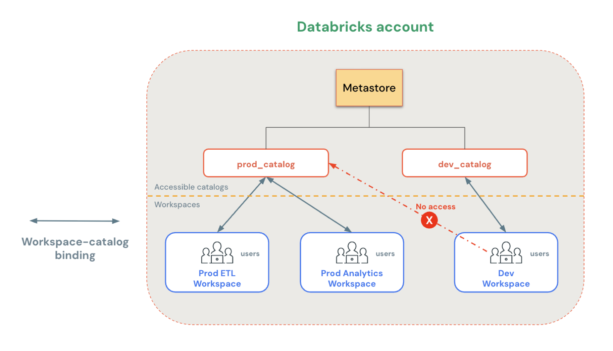

# Workspace-Catalog-Bindung

Workspace-Catalog-Binding erlaubt es, den Zugriff auf einen Catalog auf bestimmte Workspaces zu beschränken. Standardmäßig ist jeder Catalog von jedem Workspace aus zugänglich, der an denselben Metastore angebunden ist — dieses Feature überschreibt dieses Standardverhalten.

## Anwendungsfälle

- Produktionsdaten von Entwicklungs-/Testumgebungen isolieren.
- Verhindern, dass bestimmte Datendomänen zusammen gejoint werden.
- Sicherstellen, dass die Verarbeitung sensibler Daten nur in dafür vorgesehenen Workspaces stattfindet.

## Funktionsweise

Ist ein Catalog an bestimmte Workspaces gebunden, können nur diese zugewiesenen Workspaces darauf zugreifen. Jeder nicht in der Liste enthaltene Workspace erhält beim Zugriffsversuch einen Fehler — **unabhängig von individuellen Privilegien-Grants**, die die betroffenen Nutzer sonst besitzen.

## Weitere Eigenschaften

- **Nur-Lese-Zugriff:** Workspaces lassen sich auf Lesezugriff beschränken, sodass alle Schreiboperationen blockiert werden.
- **Plattformweite Durchsetzung:** Information-Schema-Abfragen, Data Lineage und Catalog Explorer zeigen jeweils nur die im aktuellen Workspace zugänglichen Catalogs.
- **Erweiterter Geltungsbereich:** Workspace-Binding gilt nicht nur für Catalogs, sondern auch für External Locations, Storage Credentials und Service Credentials.

## Voraussetzungen

Zum Definieren oder Bearbeiten von Bindings ist eine der folgenden Rollen nötig: **Metastore-Admin**, **Catalog-Eigentümer** oder `MANAGE`-Privileg auf dem Catalog.

## CLI-Ablauf

1. Isolation Mode auf `ISOLATED` setzen.
2. `workspace-bindings update-bindings` mit dem gewünschten Binding-Typ ausführen — `BINDING_TYPE_READ_WRITE` oder `BINDING_TYPE_READ_ONLY`.

## Quelle

- https://docs.databricks.com/aws/en/data-governance/unity-catalog/access-control/workspace-catalog-binding
