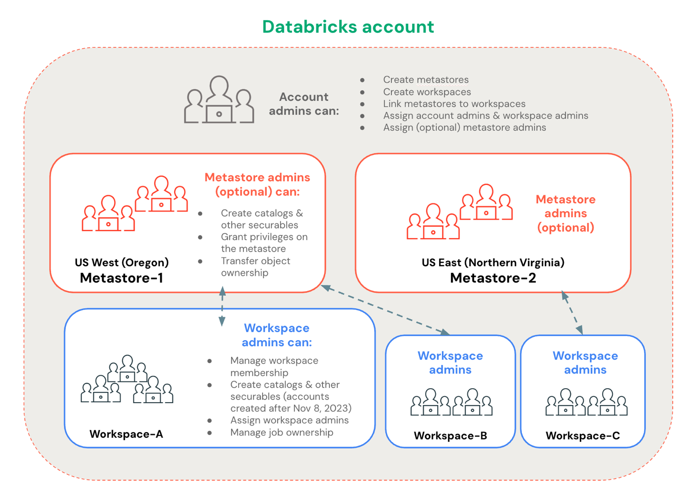

# Admin-Privilegien

Databricks unterscheidet drei Admin-Rollen für die Verwaltung von Unity Catalog.

## Account-Admin

Agiert auf Account-Ebene:

- Metastores und Workspaces erstellen und verwalten
- Metastores mit Workspaces verknüpfen
- Admin-Rollen im gesamten Account zuweisen
- Storage Credentials und System-Tabellen verwalten
- OpenSharing aktivieren

## Workspace-Admin

Verwaltet einzelne Workspaces:

- Catalogs und Metastore-Objekte erstellen (in Workspaces, die nach dem 8. November 2023 für Unity Catalog aktiviert wurden, erhalten Workspace-Admins dafür standardmäßig Metastore-Privilegien)
- Workspace-Mitgliedschaft und Job-Eigentümerschaft verwalten
- Workspace-Objekte kontrollieren (Notebooks, Dashboards, Queries)
- die Workspace-Admin-Rolle an andere vergeben

Workspace-Admins sind standardmäßig Eigentümer des Workspace-Catalogs, sofern für den Workspace einer bereitgestellt wurde.

## Metastore-Admin (optional)

Eine **optionale, aber hochprivilegierte** Rolle für einen einzelnen Metastore:

- Catalogs, Connections, External Locations erstellen
- Storage- und Service-Credentials verwalten
- Shares, Recipients und Providers erstellen
- Objekteigentümerschaft ändern und Privilegien verwalten

Die Zuweisung erfolgt durch einen Account-Admin über die Account Console.

## Quelle

- https://docs.databricks.com/aws/en/data-governance/unity-catalog/manage-privileges/admin-privileges
