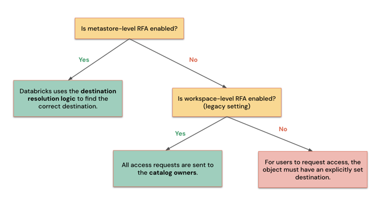
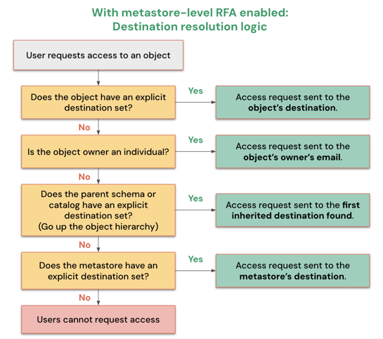
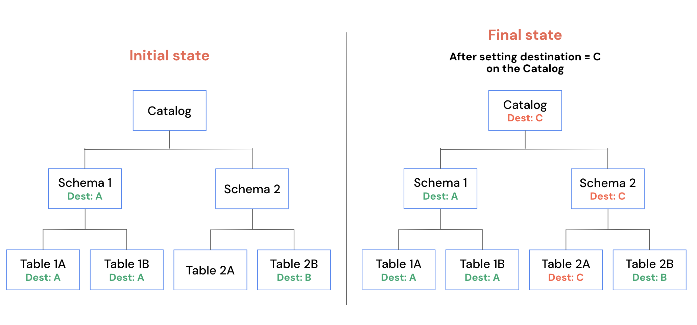

# Access Request Destinations

Das Feature **Request for Access (RFA)** erlaubt es Nutzern, Privilegien für Unity-Catalog-Objekte direkt anzufragen. Admins konfigurieren dafür **Access Request Destinations**, die festlegen, wohin diese Anfragen geleitet werden.

## Mögliche Ziele

- E-Mail-Adressen
- Slack-Kanäle
- Microsoft-Teams-Kanäle
- Webhook-Endpunkte
- Redirect-URLs zu externen Systemen (nur eine pro Objekt möglich)

Ist eine URL gesetzt, können keine weiteren Ziele gesetzt werden — Nutzer werden dann zu dieser URL umgeleitet, statt das In-Product-Anfrageformular zu sehen.

## Einstiegspunkte für Nutzer

- **Catalog Explorer:** Catalog durchsuchen und zusätzliche Privilegien anfragen
- **SQL-Editor/Notebooks:** Zugriff über Berechtigungsfehlermeldungen anfragen
- **AI/BI-Dashboards:** Zugriff für fehlende Datensätze anfragen
- **Genie Agents:** Zugriff über ein "Zugriff verweigert"-Banner anfragen

## Auflösungsreihenfolge der Ziele

Ist Request for Access auf Metastore-Ebene aktiviert, leitet Databricks Anfragen in dieser Reihenfolge:

1. Explizites Ziel auf Objektebene
2. E-Mail des Objekteigentümers (falls Einzelnutzer)
3. Ziel des übergeordneten Objekts (falls Eigentümer eine Gruppe/ein Service Principal ist)
4. Ziel auf Metastore-Ebene

Ziele vererben sich nach unten: Wird ein Ziel auf einer höheren Ebene der Unity-Catalog-Hierarchie konfiguriert, gilt es auch für alle Kindobjekte.

## Konfiguration

Metastore-Admins aktivieren Request for Access auf Metastore-Ebene über die Catalog-Einstellungen. Objekteigentümer oder Nutzer mit `MANAGE`-Privileg konfigurieren Ziele für einzelne Objekte über Catalog Explorer, REST-API oder Terraform.

## Genehmigungsprozess

Genehmiger erhalten Benachrichtigungen mit Links zur Prüfung der Anfrage. Sie können Anfragende entweder zu bestehenden Gruppen hinzufügen oder Privilegien direkt über Presets wie "Data Reader" vergeben.

## Quelle

- https://docs.databricks.com/aws/en/data-governance/unity-catalog/manage-privileges/access-request-destinations
