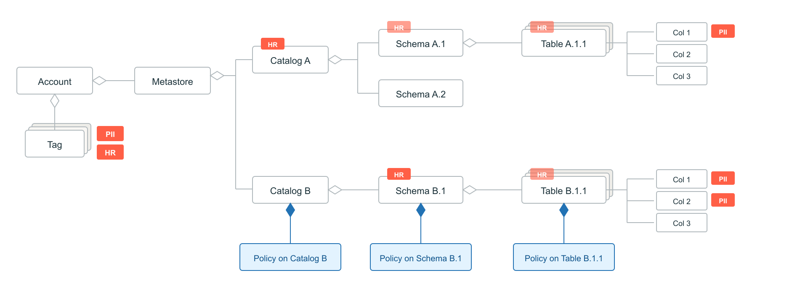
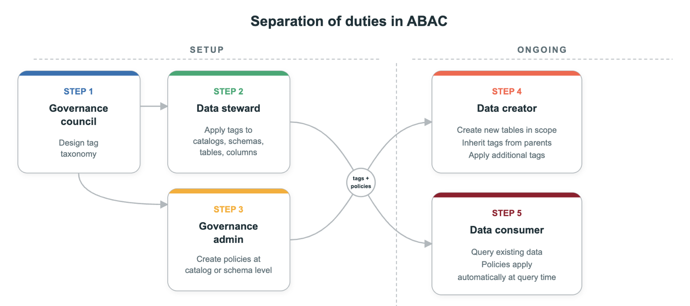

# ABAC — Grundkonzepte

ABAC ist ein dynamisches Zugriffskontrollmodell: Zugriffsentscheidungen basieren auf Policies, die gegen Attribute schützbarer Objekte ausgewertet werden — statt gegen Grants pro Einzelobjekt.

## Governed Tags

Schlüssel-Wert-Paare auf Account-Ebene, angewendet auf Catalogs, Schemas, Tabellen, Spalten, Modelle und Volumes. Tags repräsentieren Eigenschaften wie Sensibilität oder Geschäftsbereich und vererben sich typischerweise vom übergeordneten Objekt — **außer auf Spaltenebene**.

## Drei Policy-Typen

1. **Row-Filter-Policies** — schränken sichtbare Zeilen anhand getaggter Spalten ein.
2. **Column-Mask-Policies** — steuern angezeigte Werte für getaggte Spalten.
3. **GRANT-Policies** (Beta) — vergeben Privilegien dynamisch, wenn Bedingungen zutreffen.

## Eingebaute Funktionen

| Funktion | Zweck |
|---|---|
| `has_tag('tag_key')` | prüft, ob ein Tag vorhanden ist |
| `has_tag_value('tag_key', 'tag_value')` | prüft einen konkreten Tag-Wert |
| `get_tag_value('tag_key')` | extrahiert Tag-Werte zur Nutzung in UDFs |
| Identity-Attribut-Funktionen (Beta) | werten Nutzereigenschaften aus dem Identity Provider aus |

## Separation of Duties (Aufgabentrennung)

Fünf Schritte mit jeweils unterschiedlichen Berechtigungen:

1. Tag-Taxonomie erstellen (Account-Admin)
2. Tags auf Assets anwenden (Data Stewards)
3. Policies verfassen (Governance-Admins)
4. Governte Objekte erstellen (Datenersteller)
5. Auf kontrollierte Daten zugreifen (Endnutzer)

## Vorteile gegenüber Objekt-für-Objekt-Kontrolle

- **Automatische Anwendung** auf neu erstellte Objekte.
- **Geringerer laufender Pflegeaufwand**, da Regeln zentral statt pro Tabelle verwaltet werden.

## Quelle

- https://docs.databricks.com/aws/en/data-governance/unity-catalog/abac/core-concepts
