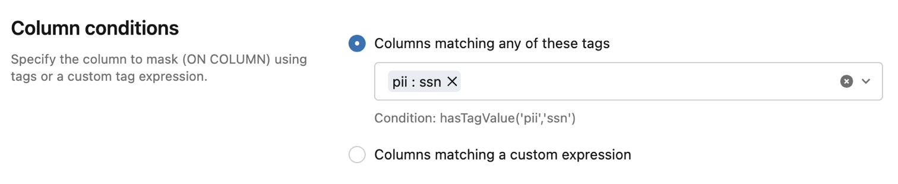
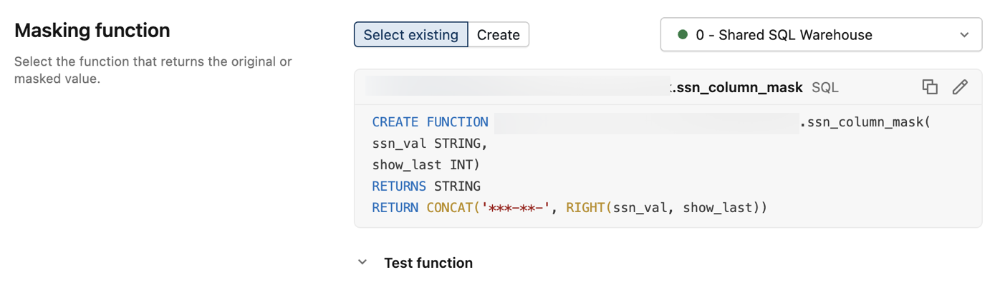
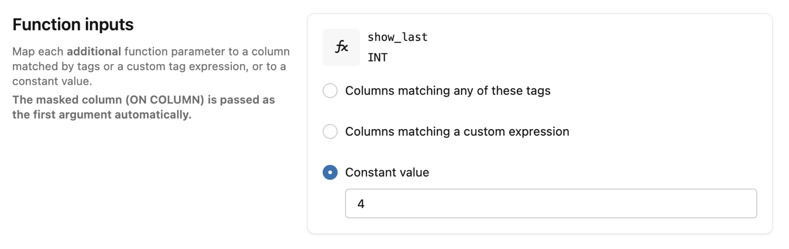
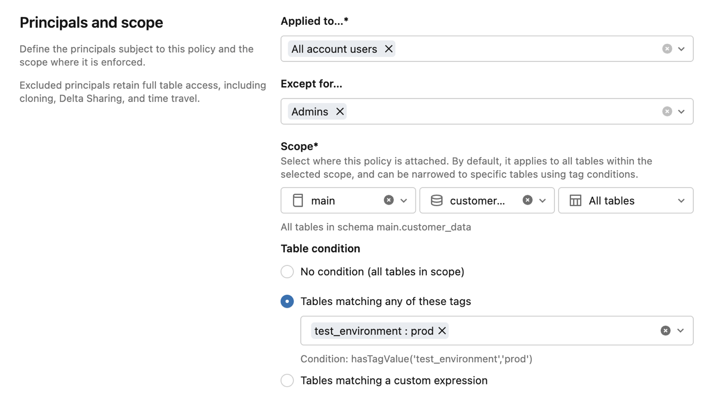
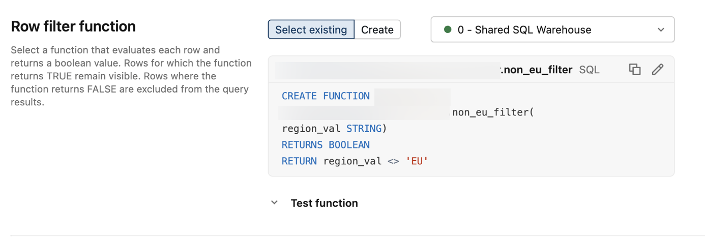
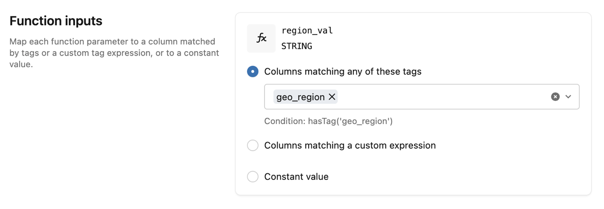

# ABAC-Policies erstellen und verwalten

## Voraussetzungen

- `MANAGE`-Privileg auf dem schützbaren Objekt, oder Eigentümerschaft.
- Databricks Runtime 16.4+ oder Serverless Compute.
- Eine UDF in Unity Catalog mit `EXECUTE`-Privileg, oder eine Inline-SQL-Funktion.
- Governed Tags, angewendet auf die Zielobjekte.

## Policy-Typen

- **Row Filter:** Die UDF wertet jede Zeile aus und liefert einen Boolean. Zeilen, für die die Funktion `FALSE` liefert, werden aus dem Ergebnis ausgeschlossen.
- **Column Mask:** Die UDF nimmt den Spaltenwert als Eingabe und liefert entweder den Originalwert oder eine maskierte Version. Der Rückgabetyp muss in den Zielspaltentyp castbar sein.

## `CREATE POLICY`-Syntax

**Row Filter:**

```sql
CREATE [OR REPLACE] POLICY policy_name
ON { CATALOG catalog_name | SCHEMA schema_name | TABLE table_name }
[COMMENT description]
ROW FILTER function_name
TO principal [, ...]
[EXCEPT principal [, ...]]
FOR TABLES
[WHEN condition]
[MATCH COLUMNS condition [[AS] alias] [, ...]]
[USING COLUMNS (function_arg [, ...])]
```

**Column Mask:**

```sql
CREATE [OR REPLACE] POLICY policy_name
ON { CATALOG catalog_name | SCHEMA schema_name | TABLE table_name }
[COMMENT description]
COLUMN MASK function_name
TO principal [, ...]
[EXCEPT principal [, ...]]
FOR TABLES
[WHEN condition]
[MATCH COLUMNS condition [[AS] alias] [, ...]]
ON COLUMN alias
[USING COLUMNS (function_arg [, ...])]
```

## Beispiel: Column-Mask-Policy

Maskiert SSN-Spalten für US-Analysten (außer Admins) auf die letzten 4 Zeichen:

```sql
CREATE FUNCTION ssn_to_last_nr (ssn STRING, nr INT) RETURNS STRING
RETURN right(ssn, nr);

CREATE POLICY mask_ssn
ON SCHEMA prod.customers
COLUMN MASK ssn_to_last_nr
TO us_analysts EXCEPT admins
FOR TABLES
MATCH COLUMNS has_tag_value('pii', 'ssn') AS ssn
ON COLUMN ssn
USING COLUMNS (4);
```

So sieht dieselbe Column-Mask-Policy im Catalog-Explorer-Formular aus:







## Beispiel: Row-Filter-Policy

Blendet europäische Kunden in sensiblen Tabellen für US-Analysten aus:

```sql
CREATE FUNCTION non_eu_region (geo_region STRING) RETURNS BOOLEAN
RETURN geo_region <> 'eu';

CREATE POLICY hide_eu_customers
ON SCHEMA prod.customers
COMMENT 'Exclude rows with European customers from sensitive tables'
ROW FILTER non_eu_region
TO us_analysts
FOR TABLES
WHEN has_tag_value('sensitivity', 'high')
MATCH COLUMNS has_tag('geo_region') AS region
USING COLUMNS (region);
```

So sieht dieselbe Row-Filter-Policy im Catalog-Explorer-Formular aus:







## Verwaltungsoperationen

| Operation | Mittel |
|---|---|
| Erstellen | Catalog-Explorer-UI, SQL `CREATE POLICY`, Python SDK |
| Bearbeiten | Beschreibung, Principals, Bedingungen und Funktionszuordnung änderbar — Name und Scope **nicht** |
| Löschen | `DROP POLICY` |
| Anzeigen | `SHOW [EFFECTIVE] POLICIES`, `DESCRIBE POLICY` |
| Auditieren | `INFORMATION_SCHEMA.ABAC_POLICY_DEFINITIONS` |

## Scope und Bedingungen

Policies werden an Catalogs, Schemas oder Tabellen angehängt. Tabellenbedingungen unterstützen Tag-basiertes Matching oder eigene Boolean-Ausdrücke über `has_tag()` und `has_tag_value()`. Principals können Gruppen, Service Principals oder "alle Account-Nutzer" sein.

## Vertiefung: Weitere SQL-Beispiele aus dem Language Manual

### `CREATE POLICY` — Language-Manual-Referenzbeispiele

Die formale Syntax-Referenz zeigt dieselben zwei Policy-Typen mit leicht abweichenden, aber lehrreichen Details: Der Column-Mask-Scope ist hier ein `CATALOG` (statt `SCHEMA`), und `TO`/`EXCEPT` verwenden Klartext-Prinzipalnamen in einfachen Anführungszeichen (`'All Users'`, `'HR admins'`):

```sql
CREATE FUNCTION ssn_to_last_nr (ssn STRING, nr INT) RETURNS STRING
  RETURN right(ssn, nr);

CREATE POLICY ssn_mask
  ON CATALOG employees
  COLUMN MASK ssn_to_last_nr
  TO 'All Users' EXCEPT 'HR admins'
  FOR TABLES
  MATCH COLUMNS has_tag('ssn') AS ssn
  ON COLUMN ssn
  USING COLUMNS (4);
```

```sql
CREATE FUNCTION non_eu_region (geo_region STRING) RETURNS BOOLEAN
  RETURN geo_region <> 'eu';

CREATE POLICY hide_eu_customers
  ON SCHEMA prod.customers
  COMMENT 'Hide European customers from sensitive tables'
  ROW FILTER non_eu_region
  TO analysts
  FOR TABLES
  WHEN has_tag_value('sensitivity', 'high')
  MATCH COLUMNS has_tag('geo_region') AS region
  USING COLUMNS (region);
```

Quelle: https://docs.databricks.com/aws/en/sql/language-manual/sql-ref-syntax-ddl-create-policy

### `DROP POLICY`

Beim Löschen muss der Scope (`ON CATALOG`/`SCHEMA`/`TABLE`) exakt mitangegeben werden, unter dem die Policy erstellt wurde — Name und Scope zusammen identifizieren die Policy eindeutig:

```sql
DROP POLICY policy_name
ON { CATALOG catalog_name | SCHEMA schema_name | TABLE table_name }
```

```sql
DROP POLICY ssn_mask ON CATALOG employees;
DROP POLICY hide_eu_customers ON SCHEMA prod.customers;
```

Quelle: https://docs.databricks.com/aws/en/sql/language-manual/sql-ref-syntax-ddl-drop-policy

### `DESCRIBE POLICY` und `SHOW [EFFECTIVE] POLICIES`

`DESCRIBE POLICY` zeigt Details einer einzelnen Policy (Typ, Funktion, Prinzipale, Zeitstempel); `SHOW POLICIES` listet alle direkt an einem Objekt definierten Policies, `SHOW EFFECTIVE POLICIES` zusätzlich die von übergeordneten Containern geerbten:

```sql
{ DESC | DESCRIBE } POLICY policy_name ON { CATALOG catalog_name | SCHEMA schema_name | TABLE table_name }
```

```sql
DESCRIBE POLICY rf ON TABLE datagov.test.orders;
```

```sql
SHOW [ EFFECTIVE ] POLICIES ON { CATALOG catalog_name | SCHEMA schema_name | TABLE table_name }
```

```sql
SHOW POLICIES ON SCHEMA mycatalog.myschema;
SHOW EFFECTIVE POLICIES ON SCHEMA mycatalog.myschema;
```

Quellen: https://docs.databricks.com/aws/en/sql/language-manual/sql-ref-syntax-aux-describe-policy, https://docs.databricks.com/aws/en/sql/language-manual/sql-ref-syntax-aux-show-policies

## Quelle

- https://docs.databricks.com/aws/en/data-governance/unity-catalog/abac/policies
