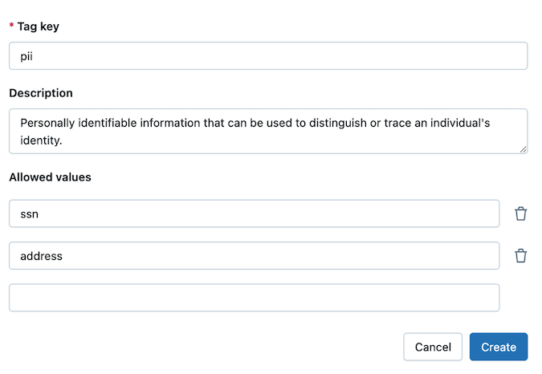
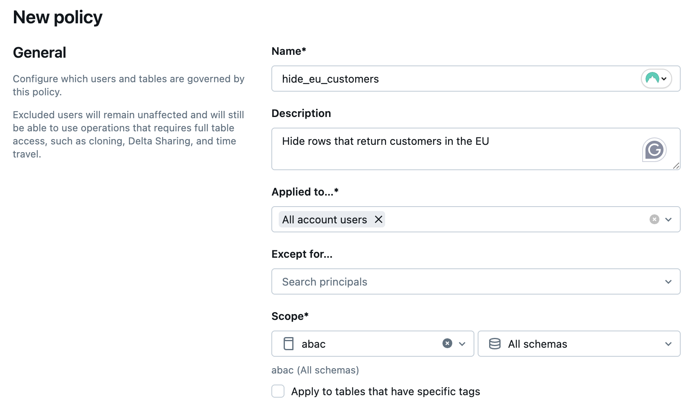
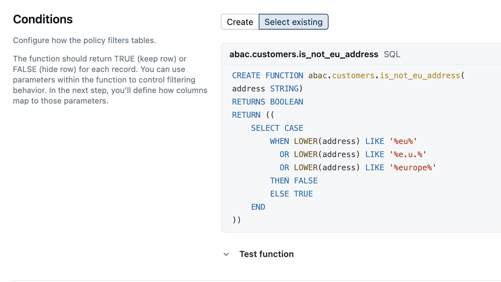
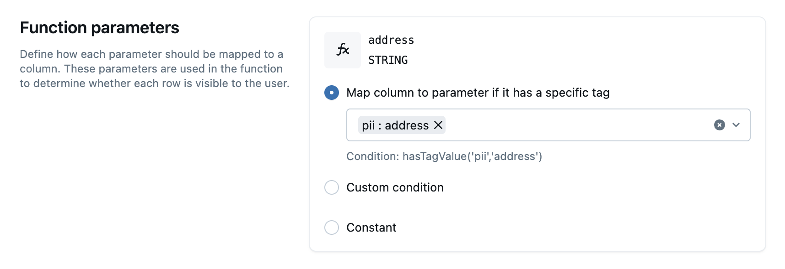
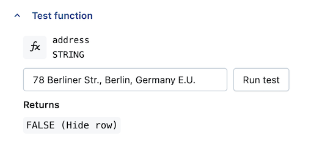
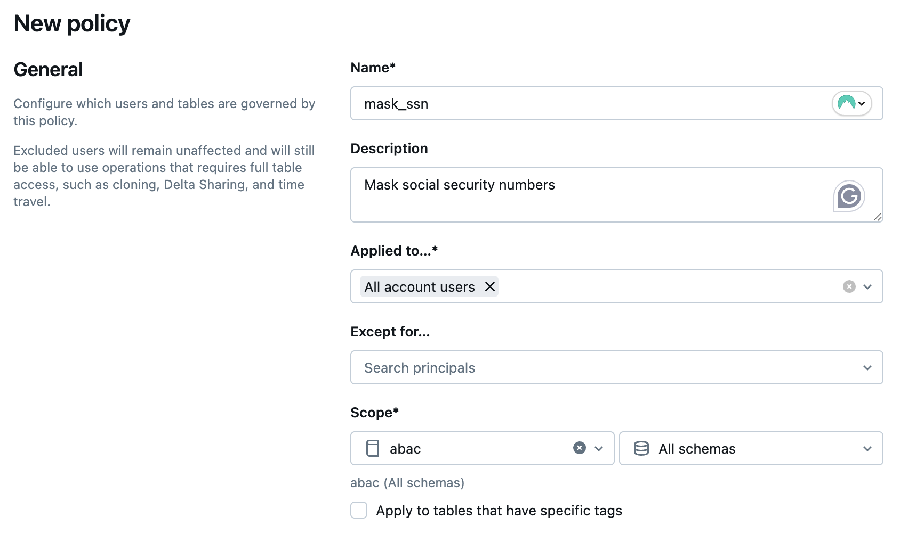
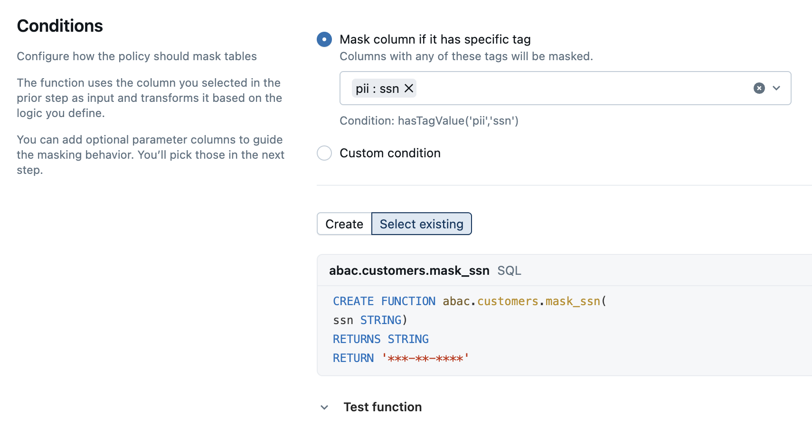
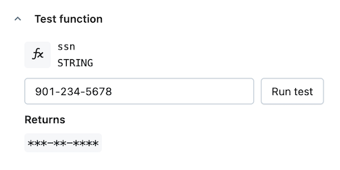

# Tutorial: ABAC über Catalog Explorer konfigurieren

Praxisbeispiel: Ein US-Analyseteam soll keinen Zugriff auf EU-Kundendaten und Sozialversicherungsnummern (SSN) erhalten, aber auf die übrigen Kundendaten derselben Tabelle zugreifen dürfen.

## Voraussetzungen

- Databricks Runtime 16.4+ oder Serverless Compute.
- Account- oder Workspace-Admin-Rechte.
- `ASSIGN` auf Governed Tags und `APPLY TAG` auf der Zieltabelle.
- `MANAGE` auf Ziel-Catalog/-Schema.
- `EXECUTE` auf den UDFs.

## Schritte

1. **Governed Tag erstellen:** Catalog → **Govern** → **Governed Tags**. Tag `pii` mit erlaubten Werten `ssn` und `address`.

   
2. **Kundentabelle erstellen:** Catalog `abac`, Schema `customers`, Tabelle `profiles` mit Spalten `First_Name`, `Last_Name`, `Phone_Number`, `Address`, `SSN` — Beispieldaten für US- und EU-Kunden einfügen.
3. **PII-Spalten taggen:** `SSN` mit `pii:ssn`, `Address` mit `pii:address` über `ALTER TABLE`.
4. **UDF zur EU-Adresserkennung erstellen:**

```sql
CREATE OR REPLACE FUNCTION is_not_eu_address(address STRING)
RETURNS BOOLEAN
RETURN (
    SELECT CASE
        WHEN LOWER(address) LIKE '%eu%'
          OR LOWER(address) LIKE '%e.u.%'
          OR LOWER(address) LIKE '%europe%'
        THEN FALSE
        ELSE TRUE
    END);
```

5. **Row-Filter-Policy `hide_eu_customers` erstellen:** gilt für alle Account-Nutzer, blendet Zeilen aus, für die `is_not_eu_address()` `FALSE` liefert, zugeordnet zu Spalten mit Tag `pii:address`.

   

   

   

   

6. **Testen:** Die Query liefert nur Nicht-EU-Bewohner (10 von 15 Datensätzen).
7. **SSN-Maskierungs-UDF erstellen:**

```sql
CREATE FUNCTION mask_SSN(ssn STRING)
RETURN '***-**-****';
```

8. **Column-Mask-Policy `mask_ssn` erstellen:** gilt für alle Account-Nutzer, maskiert Spalten mit Tag `pii:ssn`.

   

   

   

9. **Kombiniert prüfen:** Die Query zeigt maskierte SSNs (`***-**-****`) ausschließlich für Nicht-EU-Bewohner — Row Filter und Column Mask greifen gemeinsam.

## Ergebnis

Die Kombination aus Row-Level-Filterung nach Adresse und Column-Level-Maskierung von SSNs, beide tag-basiert angewendet, ist gut wartbar, da neue Spalten/Zeilen nur getaggt statt einzeln konfiguriert werden müssen.

## Quelle

- https://docs.databricks.com/aws/en/data-governance/unity-catalog/abac/tutorial
