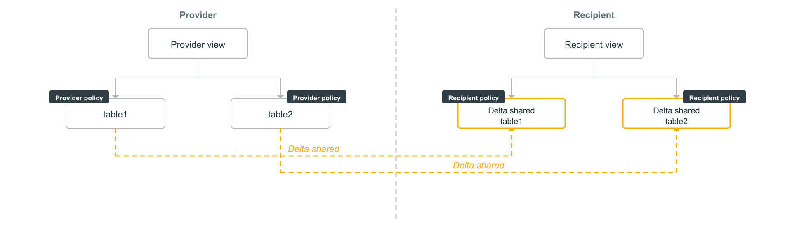

# ABAC und OpenSharing

Wie sich Tabellen und Views, die durch ABAC-Policies geschützt sind, über OpenSharing teilen lassen.

## Voraussetzungen

- Databricks Runtime 16.4+ oder Serverless Compute.
- Account-/Workspace-Admin-Rechte für Governed Tags.
- `MANAGE` auf Ziel-Catalog/-Schema, `EXECUTE` auf den UDFs.
- Konfiguriertes OpenSharing zwischen Provider und Recipient.

## ABAC-geschützte Tabellen teilen

Share-Eigentümer können Tabellen mit ABAC-Schutz weitergeben, wenn sie:

1. die nötigen OpenSharing-Berechtigungen besitzen, **und**
2. über die `EXCEPT`-Klausel von den ABAC-Policies ausgenommen sind.

Der Recipient sieht dann standardmäßig ungefilterte Daten und kann eigene Policies anwenden.

## ABAC-geschützte Views teilen

Share-Eigentümer können auch Views teilen, die auf ABAC-geschützte Basistabellen verweisen — vorausgesetzt, sie sind von den zugrunde liegenden Tabellen-Policies ausgenommen. **Wichtige Änderung seit dem 23. April 2026:** Zuvor musste der *View-Eigentümer* ausgenommen sein, jetzt muss stattdessen der *Share-Eigentümer* ausgenommen sein.

## Recipient-seitige Views über geteilte Tabellen

Wird recipient-seitiger Schutz über Views benötigt: nur Basistabellen teilen (keine providerseitigen Views). Recipients erstellen lokale Views über den geteilten Tabellen in separaten Schemas, da OpenSharing-Schemas nur lesbar sind. ABAC-Policies auf den Basistabellen bleiben auch beim Zugriff über recipient-seitig erstellte Views wirksam.

## Quelle

- https://docs.databricks.com/aws/en/data-governance/unity-catalog/abac/opensharing
