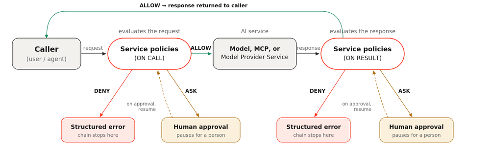
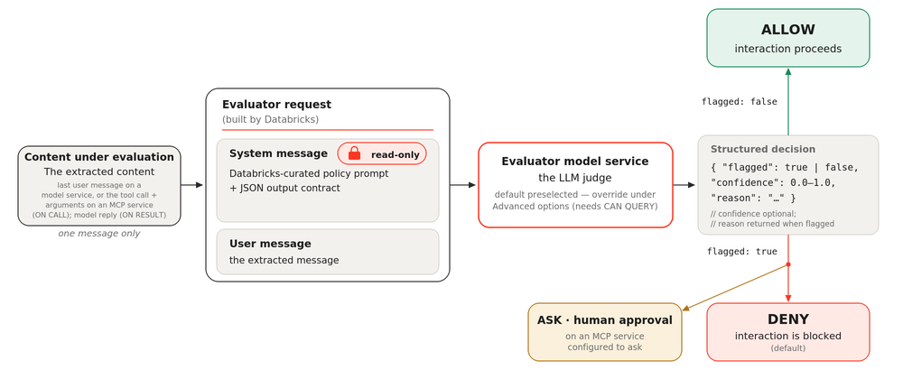

# Service Policies für KI-Assets — Überblick

Service Policies regeln, **wie** KI-Services (Modelle, MCP-Services) mit Nutzern und externen Systemen interagieren — im Unterschied zu klassischer Zugriffskontrolle, die nur regelt, **ob** ein Principal überhaupt zugreifen darf.

## Drei Entscheidungsausgänge

| Ergebnis | Bedeutung |
|---|---|
| `ALLOW` | Interaktion läuft normal weiter |
| `DENY` | Liefert HTTP 200 mit Begründung zurück, verhindert erneutes Auslösen in Folgeschritten |
| `ASK` | Interaktion wird bis zur menschlichen Freigabe zurückgehalten (für sensible Operationen) |

## Auswertungszeitpunkte

- **`ON CALL`** — vor dem Service-Aufruf, prüft die Anfrage.
- **`ON RESULT`** — nach der Service-Antwort, prüft die Antwort.

Für eingebaute LLM-as-a-Judge-Policies sendet Databricks den Policy-Prompt und die extrahierte Nachricht an ein Bewertungsmodell, das ein geflagged/nicht-geflagged-Urteil zurückliefert:

## Ausführungsmodell

Policies werden an Services mit einem **Rang** (Priorität) angehängt. Die Auswertung erfolgt bei `ON CALL` in aufsteigender, bei `ON RESULT` in absteigender Rangfolge. Innerhalb eines Rangs:

1. Blockierende LLM-as-a-Judge-Policies laufen parallel (Latenzoptimierung).
2. Übrige Policies laufen nur sequenziell weiter, wenn die parallelen Policies zugelassen haben.

Die Ausführung stoppt sofort beim ersten `DENY`.

## Eingebaute Policies

Vier vorkonfigurierte Policies im Namespace `system.ai`:

- `system.ai.block_unsafe_content`
- `system.ai.block_jailbreak`
- `system.ai.block_hallucination`
- `system.ai.detect_sensitive_data` (deterministisch, regelbasiert, kann auch redigieren — siehe `Sensible Daten erkennen.md`)

## Unterstützte Services

MCP Services (managed, external, custom), Model Services (gehostete und externe Endpoints), Model Provider Services.

## Fail-Closed-Verhalten

Fehler während der Auswertung führen zu `DENY` — fehlkonfigurierte Policies blockieren Interaktionen, statt sie durchzulassen.

## Quelle

- https://docs.databricks.com/aws/en/data-governance/unity-catalog/service-policies/
