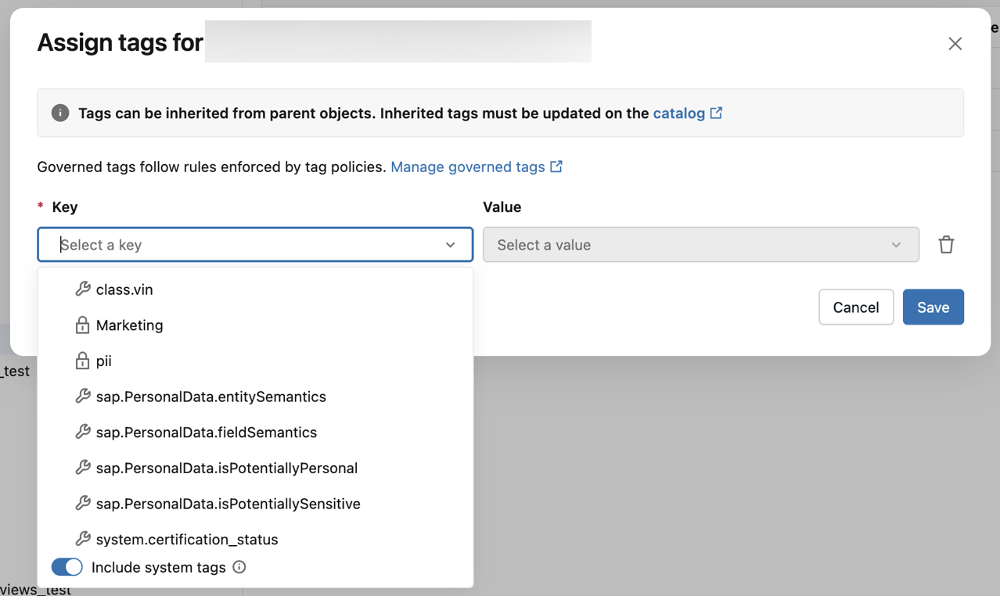
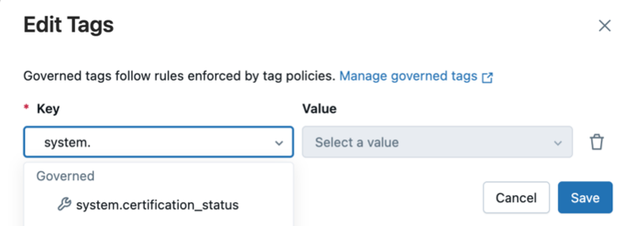

# Governed Tags — Überblick

Governed Tags sind Metadaten-Labels auf **Account-Ebene** mit eingebauten Governance-Regeln. Sie "erzwingen, wie das Tag verwendet werden darf" und stellen sicher, dass Tags konsistent angewendet werden und organisatorischen Standards entsprechen.

## Was Administratoren steuern können

- Bestimmte Tag-Schlüssel als "governed" festlegen.
- Erlaubte Werte pro Tag definieren.
- Festlegen, welche Nutzer/Gruppen Tags zuweisen und Definitionen verwalten dürfen.

Das System erzwingt: Nur Nutzer mit passenden Berechtigungen können einem Tag Werte zuweisen — und das auch nur aus einer vordefinierten Menge erlaubter Werte.

Neben selbst erstellten Governed Tags pflegt Databricks auch vordefinierte **System-Tags**:

## Anwendungsfälle

- Datenklassifizierung und Kennzeichnung von Sensibilität
- Attribute-Based Access Control (ABAC) — siehe `08 ABAC/`
- Kostenstellen-Tracking und Chargeback
- Auffinden und Organisieren von Assets
- Datenzertifizierung und Deprecation-Workflows

## Technische Eckdaten

| Grenzwert | Wert |
|---|---|
| Governed Tags pro Account | max. 1.000 |
| Erlaubte Werte pro Tag | max. 500 |
| Länge von Schlüssel/Wert | max. 256 Zeichen (UTF-8) |
| Groß-/Kleinschreibung | wird unterschieden |
| Verbotene Zeichen | `* . / < > % & ? \ =` |

## Automatisierung

Neben manueller Vergabe (ein Objekt nach dem anderen) unterstützt die Plattform automatisierte Ansätze: Data Classification, benutzerdefinierte Klassifizierer und regelbasierte Tag-Zuweisung (siehe `Automatische Tag-Zuweisung.md`).

## Sicherheitshinweis

Da Tag-Daten als Klartext gespeichert werden: **keine** Tag-Namen, -Werte oder -Beschreibungen verwenden, die die Sicherheit von Ressourcen kompromittieren könnten.

## Quelle

- https://docs.databricks.com/aws/en/admin/governed-tags/
