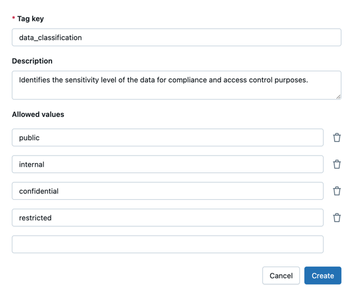

# Governed Tags erstellen und verwalten

## Anforderungen an Schlüssel und Werte

- Maximal 256 Zeichen.
- UTF-8-kodiert, Unicode-fähig.
- Groß-/Kleinschreibung wird unterschieden (`"Department"` ≠ `"department"`).
- Verboten: `* . / < > % & ? \ =` sowie ASCII-Steuerzeichen (0–31).
- Dürfen nicht mit Leerzeichen beginnen oder enden.

## Governed Tags erstellen

**Benötigtes Privileg:** `CREATE` auf Account-Ebene (Account- und Workspace-Admins besitzen es standardmäßig).

**Über Catalog Explorer:**

1. **Catalog** → **Govern** → **Governed Tags**.
2. **Create governed tag** auswählen.
3. Tag-Schlüssel und optionale Beschreibung eingeben.
4. Optional erlaubte Werte festlegen.
5. **Create** klicken.



**Über SQL:**

```sql
CREATE GOVERNED TAG isPii;
CREATE GOVERNED TAG sensitivity_level VALUES ('low', 'medium', 'high');
CREATE GOVERNED TAG pii DESCRIPTION 'Indicates what kind of personal identifiable information the asset contains' VALUES ('ssn', 'ccn', 'dob');
```

**Wichtig:** Wird ein Governed Tag mit einem bereits existierenden **ungoverned** Tag-Schlüssel erstellt, werden automatisch alle bestehenden Zuweisungen mit diesem Schlüssel governt.

## Governed Tags bearbeiten

**Benötigtes Privileg:** `MANAGE` auf dem Tag.

Über die UI: Tag unter Catalog → Govern → Governed Tags öffnen, Beschreibung oder Werte bearbeiten.

**Über SQL:**

```sql
ALTER GOVERNED TAG pii SET DESCRIPTION 'Updated description';
ALTER GOVERNED TAG sensitivity_level SET VALUES ('low', 'medium', 'high');
ALTER GOVERNED TAG isPii SET VALUES ();
```

## Governed Tags löschen

**Benötigtes Privileg:** `MANAGE`.

**Warnung:** Wird ein Governed Tag gelöscht, das in einer ABAC-Policy referenziert wird, schlagen **alle** Queries im Geltungsbereich dieser Policy fehl.

Das Löschen wandelt das Tag in ein **ungoverned** Tag um — bestehende Zuweisungen bleiben erhalten, verlieren aber die Governance-Einschränkungen.

```sql
DROP GOVERNED TAG isPii;
```

## Vertiefung: Weitere SQL-Beispiele aus dem Language Manual

### `CREATE GOVERNED TAG` / `ALTER GOVERNED TAG` / `DROP GOVERNED TAG` — vollständige Syntax

```sql
CREATE GOVERNED TAG tag_key [ DESCRIPTION description ] [ VALUES ( value_name [, ...] ) ]
```

```sql
-- Nur ein Schlüssel, ohne erlaubte Werte (Freitext-Tag)
CREATE GOVERNED TAG isPii;

-- Leere Werteliste explizit angeben
CREATE GOVERNED TAG sensitivity_level VALUES ();
```

```sql
ALTER GOVERNED TAG tag_key { SET DESCRIPTION description | SET VALUES ( value_name [, ...] ) }
```

```sql
-- Alle erlaubten Werte entfernen -> Tag wird wieder werte-frei
ALTER GOVERNED TAG isPii SET VALUES ();
```

```sql
DROP GOVERNED TAG tag_key
```

```sql
DROP GOVERNED TAG isPii;
```

Quellen: https://docs.databricks.com/aws/en/sql/language-manual/sql-ref-syntax-ddl-create-governed-tag, https://docs.databricks.com/aws/en/sql/language-manual/sql-ref-syntax-ddl-alter-governed-tag, https://docs.databricks.com/aws/en/sql/language-manual/sql-ref-syntax-ddl-drop-governed-tag

### `DESCRIBE GOVERNED TAG` und `SHOW GOVERNED TAGS`

```sql
{ DESC | DESCRIBE } GOVERNED TAG tag_key [ AS JSON ]
```

```sql
DESCRIBE GOVERNED TAG isPii;
```

```sql
SHOW GOVERNED TAGS [ [ LIKE ] regex_pattern ]
```

```sql
SHOW GOVERNED TAGS;
SHOW GOVERNED TAGS LIKE 'pii*';
```

Quellen: https://docs.databricks.com/aws/en/sql/language-manual/sql-ref-syntax-aux-describe-governed-tag, https://docs.databricks.com/aws/en/sql/language-manual/sql-ref-syntax-aux-show-governed-tags

### `SET TAG` / `UNSET TAG` — Tag-Zuweisung auf Objekten (inkl. Spalten)

`SET TAG`/`UNSET TAG` weisen einen (governed oder ungoverned) Tag-Schlüssel einem konkreten Objekt zu — Catalog, Schema, Tabelle, View, Spalte, Funktion, Volume oder External Metadata:

```sql
SET TAG ON
  { CATALOG catalog_name |
    COLUMN relation_name.column_name |
    EXTERNAL METADATA external_metadata_name |
    { FUNCTION | PROCEDURE } function_name |
    { SCHEMA | DATABASE } schema_name |
    TABLE relation_name |
    VIEW relation_name |
    VOLUME volume_name }
  tag_key [ = tag_value ]
```

```sql
SET TAG ON CATALOG catalog `cost_center` = `hr`;
UNSET TAG ON CATALOG catalog cost_center;

SET TAG ON TABLE catalog.schema.table cost_center = hr;
UNSET TAG ON TABLE catalog.schema.table cost_center;

-- Spalten-Tag ohne Wert (Boolean-artige Kennzeichnung)
SET TAG ON COLUMN table.ssn pii;
UNSET TAG ON COLUMN table.ssn pii;
```

Zugewiesene Spalten-Tags lassen sich über die `information_schema` abfragen — nützlich, um z. B. alle mit `pii` getaggten Spalten in einem Schema zu finden (Grundlage für `has_tag()`/`has_tag_value()` in ABAC-Policies):

```sql
SELECT catalog_name, schema_name, table_name, tag_name, tag_value
FROM information_schema.column_tags
WHERE tag_name = 'pii' AND schema_name = 'default';
```

Quellen: https://docs.databricks.com/aws/en/sql/language-manual/sql-ref-syntax-ddl-set-tag, https://docs.databricks.com/aws/en/sql/language-manual/sql-ref-syntax-ddl-unset-tag

## Quelle

- https://docs.databricks.com/aws/en/admin/governed-tags/manage-governed-tags
