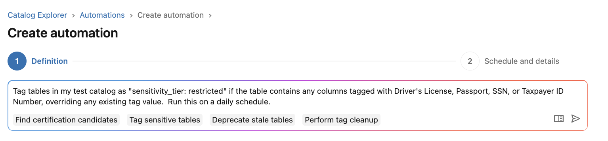
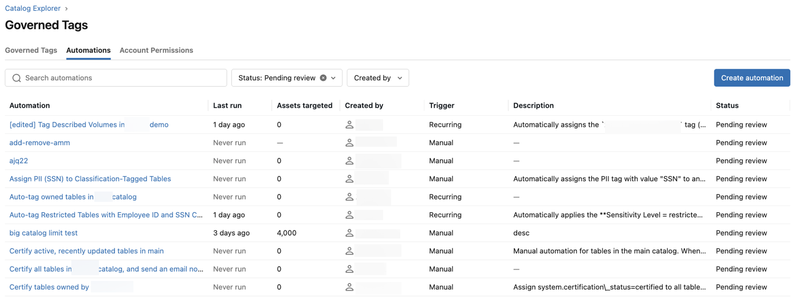

# Automatische Tag-Zuweisung (Beta)

Admins können Governed Tags anhand von Geschäftsregeln **automatisch** auf Unity-Catalog-Tabellen und -Volumes anwenden lassen. Eine Automatisierung kodiert Geschäftsregeln über festgelegte Bedingungen und weist dann Governed Tags auf den zutreffenden Assets zu oder entfernt sie.

## Anwendungsfälle

- Daten zertifizieren, die Reifekriterien erfüllen.
- Veraltete, ungepflegte Daten als "deprecated" markieren.
- Sensibilitätsklassifizierungen von Spalten auf Tabellen-Tags hochrollen.
- Assets kennzeichnen, denen erforderliche Tags fehlen.
- Veraltete Tags bereinigen.

## Erstellungswege

- Über natürlichsprachliche Prompts mit **Genie**.
- Manuell über das Formular in Catalog Explorer.

## Voraussetzungen

- `USE CATALOG`, `USE SCHEMA` und `APPLY TAG` auf dem Ziel-Catalog.
- `MANAGE` auf dem Catalog.
- `ASSIGN` auf jedem beteiligten Governed Tag.

## Bedingungen (Auswahl)

| Bedingung | Gilt für | Beispiel |
|---|---|---|
| Tag/Tag-Wert | bestehende Governed Tags | `cost_center` gleich `finance` |
| Spalten-Tag | Tags auf Spalten (nur Tabellen) | eine Spalte trägt `class.email_address` |
| Query-Anzahl | Lese-/Schreibaktivität (nur Tabellen) | Lesezugriffe größer als 100 |
| Zuletzt abgefragt | Tage seit letzter Query (nur Tabellen) | vor mehr als 90 Tagen |
| Erstellt/Aktualisiert | Alter des Assets | aktualisiert in den letzten 30 Tagen |
| Eigentümer | Asset-Eigentümerschaft | Eigentümer ist einer der angegebenen Principals |
| Beschreibung | Dokumentationsstatus | Beschreibung vorhanden/nicht vorhanden |
| Name | Namensmuster | enthält `_staging` |

## Betriebsfunktionen

- **Benachrichtigungen:** E-Mail-Alerts an Asset-Eigentümer oder festgelegte Empfänger aktivierbar, wenn eine Automatisierung Assets ändert.
- **Ausführungshistorie:** Alle Testläufe (Dry Runs) und echten Ausführungen werden protokolliert — mit Status, Startzeit, Anzahl betroffener Assets und Dauer.
- **Status:** Automatisierungen sind entweder "Pending review" (noch keine Tag-Zuweisung) oder "Enabled" (läuft nach Zeitplan).

## Aktuelle Einschränkungen (Beta)

- Nur ein einzelner Catalog pro Automatisierung.
- Zielt entweder auf Tabellen **oder** Volumes, nicht auf beide gleichzeitig.
- Verarbeitet maximal 500 zutreffende Assets pro Lauf.
- Weist maximal 5 Governed Tags pro Automatisierung zu/entfernt sie.
- Wiederkehrende Läufe sind typischerweise innerhalb von 24 Stunden abgeschlossen.
- Scope und Aktion lassen sich nach dem Erstellen nicht mehr ändern.

## Quelle

- https://docs.databricks.com/aws/en/admin/governed-tags/automate-tag-assignment
