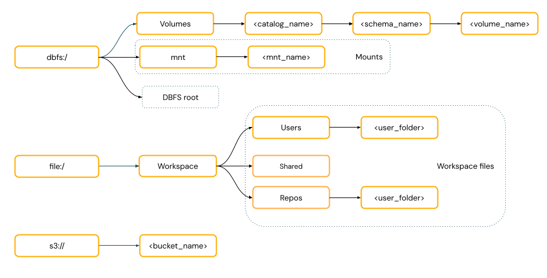
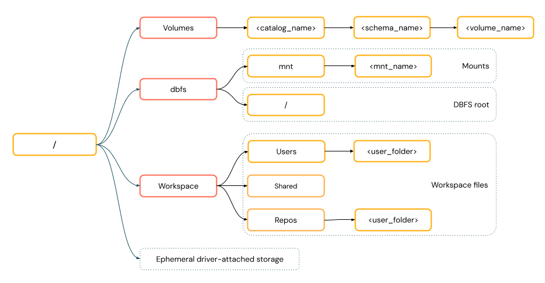
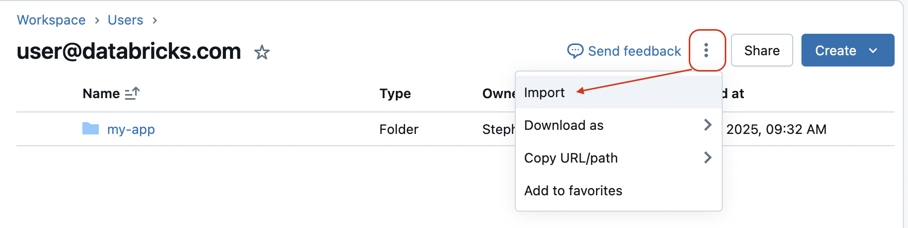
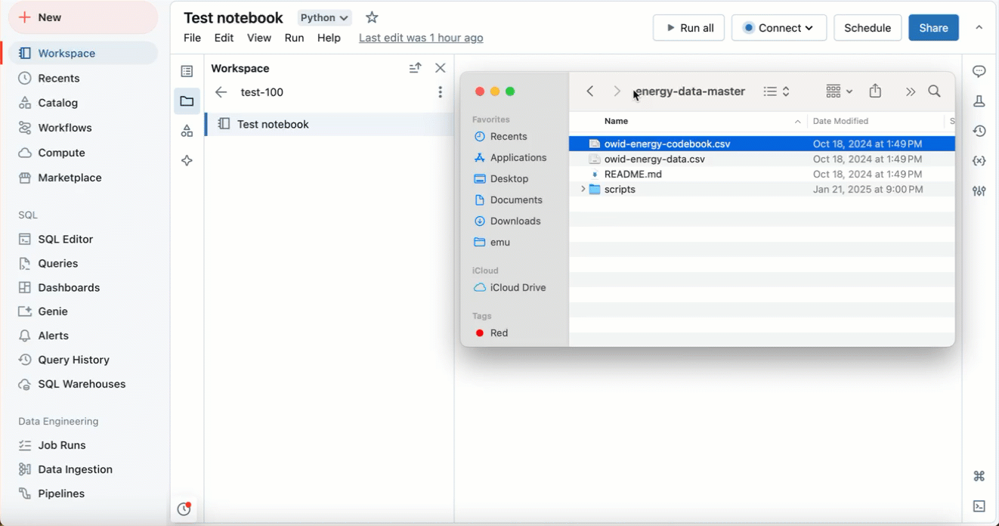
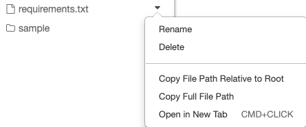

# Datei-Speicheroptionen und Workspace Files

Databricks bietet mehrere Wege, um mit Dateien zu arbeiten — von empfohlenen Unity-Catalog-Volumes über Workspace Files bis zu veralteten DBFS-Mounts. Dieses Dokument gibt zunächst einen Überblick über alle Optionen und behandelt dann Workspace Files im Detail: was sie sind, wie man mit ihnen über UI und Code interagiert.

## Abschnittsübersicht

1. [Fünf Datei-Speicheroptionen im Überblick](#speicheroptionen)
2. [Pfad-Formate: URI-Style vs. POSIX-Style](#pfad-formate)
3. [Was sind Workspace Files?](#was-sind)
4. [Unterstützte Dateitypen](#dateitypen)
5. [Wichtige Einschränkungen](#einschraenkungen)
6. [Workspace Files über die UI erstellen und verwalten](#ui-basics)
7. [Workspace Files hochladen und importieren](#import)
8. [Dateien bearbeiten](#bearbeiten)
9. [Programmatisch mit Workspace Files arbeiten](#programmatisch)
10. [Zusammenfassung](#zusammenfassung)

---

## <a id="speicheroptionen">1. Fünf Datei-Speicheroptionen im Überblick</a>

Databricks unterstützt fünf primäre Datei-Speicherziele:

| Option | Empfehlung |
|---|---|
| **Unity Catalog Volumes** | empfohlen für nicht-tabellarische Daten im Cloud-Storage |
| **Workspace Files** | für Notebooks, Quellcode und kleine Datendateien |
| **Cloud Object Storage** | direkter S3-Zugriff über URIs |
| **DBFS Mounts und DBFS Root** | veraltet — nicht für neue Implementierungen empfohlen |
| **Ephemeral Storage** | temporärer Driver-Node-Storage — verschwindet bei Cluster-Neustart |

### Wann welche Option nutzen

**Unity Catalog Volumes:** Databricks empfiehlt diese Option für „das Konfigurieren von sicherem Zugriff auf Dateien im Cloud-Object-Storage." Umfassende Tooling-Unterstützung über Spark, SQL, CLI, REST API und Python-Bibliotheken (ausführlich in [Unity Catalog Volumes.md](Unity%20Catalog%20Volumes.md)).

**Workspace Files:** am besten geeignet nur für Entwicklung und Tests. Wichtiger Vorbehalt: „Größenbeschränkungen" gelten, daher „empfiehlt Databricks, hier nur kleine Datendateien primär für Entwicklung und Tests zu speichern" (ausführlich in diesem Dokument).

**Cloud Object Storage:** nutzen, wenn direkter S3-Zugriff benötigt wird — erfordert passende URI-Schemata (`s3://`) und Berechtigungskonfiguration. Eingeschränktere Tool-Unterstützung im Vergleich zu Volumes.

**DBFS:** beide Varianten veraltet. „Neue Konten werden ohne Zugriff auf diese Features bereitgestellt" (ausführlich in [DBFS/DBFS Grundlagen.md](DBFS/DBFS%20Grundlagen.md)).

**Ephemeral Storage:** nur temporär — nützlich für Zwischenverarbeitung, bevor Daten in Volumes verschoben werden.

---

## <a id="pfad-formate">2. Pfad-Formate: URI-Style vs. POSIX-Style</a>

Zwei Standards existieren:

- **URI-Style-Pfade:** enthalten ein Schema (z. B. `s3://`, `file:/`) — erforderlich für Cloud-Storage.
- **POSIX-Style-Pfade:** relativ zum Driver-Root (`/`) — benötigt für FUSE-abhängige ML-Frameworks.





---

## <a id="was-sind">3. Was sind Workspace Files?</a>

Workspace Files sind „die Dateien, die im Databricks-Workspace-Dateisystem gespeichert und verwaltet werden." Sie befinden sich im Databricks-Workspace-Dateibaum, der auch mit Git-Repositories verbundene Ordner (**Databricks Git-Ordner**) einschließen kann.

---

## <a id="dateitypen">4. Unterstützte Dateitypen</a>

Die Plattform unterstützt zahlreiche Formate:

- Notebooks (`.ipynb`)
- Quellcode (`.py`, `.sql`, `.r`, `.scala`)
- SQL-Queries (`.dbquery.ipynb`)
- Dashboards (`.lvdash.json`)
- Alerts (`.dbalert.json`)
- Python-Module (`.py`)
- Konfigurationsdateien (`.yaml`, `.yml`)
- Markdown (`.md`)
- Text- und Datendateien (`.txt`, `.csv`)
- Bibliotheken (`.whl`, `.jar`)
- Log-Dateien (`.log`)

**Hinweis:** Genie Agents und Experiments können keine Workspace Files sein.

---

## <a id="einschraenkungen">5. Wichtige Einschränkungen</a>

**Dateigröße:** maximal **500 MB** — Operationen, die dies überschreiten, schlagen fehl.

**Zugriffsberechtigungen:** „Berechtigungen zum Zugriff auf Dateien in Ordnern unter `/Workspace` laufen nach 36 Stunden für interaktives Compute und nach 30 Tagen für Jobs ab."

**Weitere Einschränkungen:**

- Executors können nicht in Workspace Files schreiben.
- Symlinks nur auf Ziele innerhalb von `/Workspace` beschränkt.
- UDF-Zugriffseinschränkungen bei bestimmten Runtime-Versionen.
- Notebooks nur ab Databricks Runtime 16.2+ unterstützt.

### Anwendungsfälle

Nutzer können Dateien über vertraute Notebook-Muster erstellen, bearbeiten und den Zugriff verwalten, relative Pfade für Bibliotheks-Importe nutzen, und Workspace Files für Init-Skripte über Runtime-Versionen hinweg verwenden (siehe [Workspace Files als Code-Module.md](Workspace%20Files%20als%20Code-Module.md)).

---

## <a id="ui-basics">6. Workspace Files über die UI erstellen und verwalten</a>

### Datei erstellen

In ein beliebiges Databricks-Verzeichnis navigieren und **Create** > **File** wählen.

---

## <a id="import">7. Workspace Files hochladen und importieren</a>

Zwei Import-Methoden:

1. **Über das Kebab-Menü:** Kebab-Menü im Verzeichnis anklicken und **Import** wählen. Ein Dialog erscheint, in dem Dateien per Drag-and-drop oder über Browse ausgewählt werden können.
2. **Drag and Drop:** Dateien lassen sich direkt in den Workspace ziehen — funktioniert sowohl im Haupt-Datei-Browser als auch im Workspace-Datei-Browser-Seitenpanel, das von Notebooks, Queries und dem Datei-Editor aus zugänglich ist.





**Import-Einschränkungen:**

- „Nur Notebooks können von einer URL importiert werden."
- Zip-Dateien werden automatisch extrahiert, alle Inhalte werden importiert.
- `.whl`-Dateien können zur Bibliotheksnutzung importiert werden.

---

## <a id="bearbeiten">8. Dateien bearbeiten</a>

Jeder Dateiname im Workspace-Browser lässt sich anklicken, um die Datei zu öffnen und zu bearbeiten. Das System bietet „Autocomplete, Multicursor-Unterstützung und die Möglichkeit, Code auszuführen." Änderungen werden automatisch gespeichert.

Bei Markdown-Dateien wird standardmäßig eine Vorschau angezeigt — Doppelklick zum Bearbeiten, Klick außerhalb der Zelle, um zur Vorschau zurückzukehren.

---

## <a id="programmatisch">9. Programmatisch mit Workspace Files arbeiten</a>

### 9.1 Kernfähigkeiten

Databricks ermöglicht programmatische Dateiinteraktionen einschließlich „Speichern kleiner Datendateien neben Notebooks und Code" und „Schreiben von Notebook-Output." Erfordert Databricks Runtime 11.3 LTS oder höher, mit Notebook-Unterstützung ab Runtime 16.2.

### 9.2 Dateipfade ermitteln

Über Shell-Befehle lässt sich der Pfad identifizieren:

- **Außerhalb von Repos:** liefert `/databricks/driver`.
- **In Repos:** liefert virtualisierte Pfade wie `/Workspace/Repos/name@domain.com/repo_name`.



### 9.3 Datendateien lesen

**Über pandas (CSV):**

```python
import pandas as pd

df = pd.read_csv("./data/winequality-red.csv")
```

**Über Spark mit vollständig qualifizierten Pfaden:**

```python
import os

spark.read.format("csv").load(f"file:{os.getcwd()}/my_data.csv")
```

**Pfad-Formate:**

- Git-Ordner: `file:/Workspace/Repos/<user>/<repo>/path/to/file`
- Persönliches Verzeichnis: `file:/Workspace/Users/<user>/path/to/file`

### 9.4 Dateien manipulieren

**Erstellen und Bearbeiten:**

```python
import os

os.mkdir('dir1')
with open('dir1/new_file.txt', "w") as f:
    f.write("new content")
with open('dir1/new_file.txt', "a") as f:
    f.write(" continued")
```

**Löschen:**

```python
os.remove('dir1/new_file.txt')
os.rmdir('dir1')
```

**Kopieren und Verschieben:**

```python
import shutil

shutil.copy("my-dashboard.lvdash.json", "my-dashboard-copy.lvdash.json")
shutil.move("test-query.dbquery", "shared-queries/")
```

---

## <a id="zusammenfassung">10. Zusammenfassung</a>

- Databricks bietet fünf Datei-Speicheroptionen — **Unity Catalog Volumes** sind für nicht-tabellarische Cloud-Daten empfohlen, **Workspace Files** eignen sich nur für Entwicklung/Tests mit kleinen Dateien, DBFS-Mounts und -Root sind veraltet.
- Zwei Pfad-Formate koexistieren: **URI-Style** (mit Schema, für Cloud-Storage) und **POSIX-Style** (root-relativ, für FUSE-abhängige Frameworks).
- **Workspace Files** unterstützen zahlreiche Dateitypen (Notebooks, Quellcode, Konfigurationsdateien, kleine Datendateien), mit einer harten Grenze von **500 MB** pro Datei und ablaufenden Zugriffsberechtigungen (36 Stunden interaktiv, 30 Tage für Jobs).
- Über die UI lassen sich Dateien erstellen, per Kebab-Menü oder Drag-and-Drop importieren, und direkt im Browser mit Autocomplete bearbeiten.
- Programmatischer Zugriff über Standard-Python-Module (`os`, `shutil`, `pandas`) funktioniert wie auf einem normalen Dateisystem — mit `file:`-URI-Präfix für Spark-Lesevorgänge.
