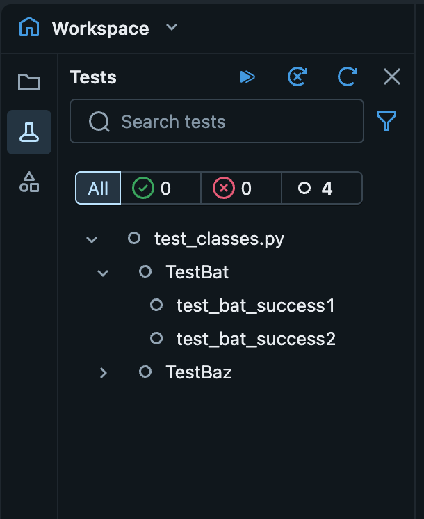
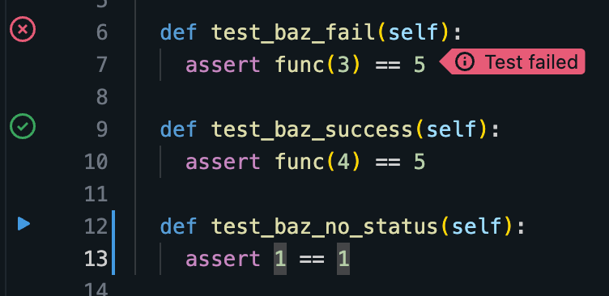
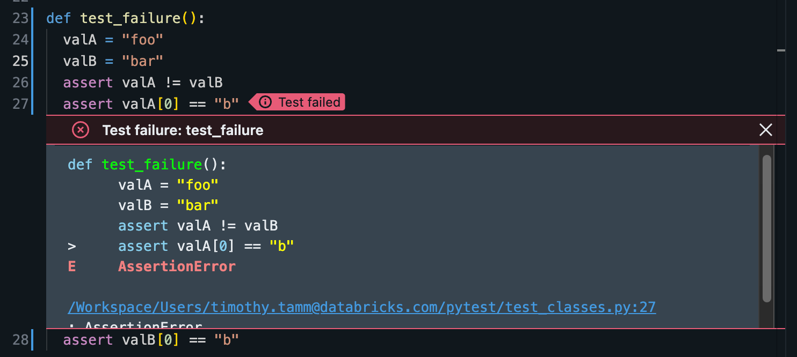
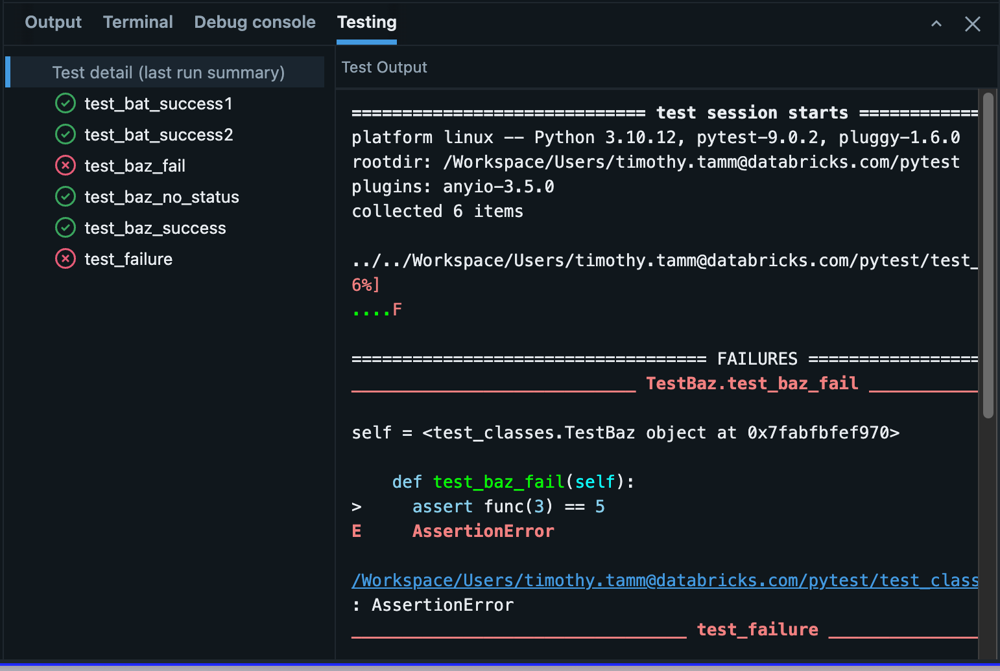

# Workspace Files als Code-Module

Über die reine Dateiverwaltung hinaus lassen sich Workspace Files als vollwertige Python-Module importieren, als Cluster-Init-Skripte nutzen, mit integrierten Unit-Tests versehen — und ihr Verhalten bezüglich des Arbeitsverzeichnisses hat sich mit Databricks Runtime 14.0 grundlegend geändert. Basierend auf offiziellen Databricks-Doku-Seiten (jeweils am Ende jedes Abschnitts referenziert).

## Abschnittsübersicht

1. [Workspace Files als Python-Module importieren](#module-importieren)
2. [Autoreload für die Entwicklung](#autoreload)
3. [Cluster-Init-Skripte als Workspace Files](#init-scripts)
4. [Python-Unit-Tests im Workspace](#unit-tests)
5. [Arbeitsverzeichnis-Verhalten ab Databricks Runtime 14.0](#cwd-verhalten)
6. [Zusammenfassung](#zusammenfassung)

---

## <a id="module-importieren">1. Workspace Files als Python-Module importieren</a>

### 1.1 `sys.path`-Nutzung

Um Module aus einem anderen Verzeichnis zu importieren, wird das Verzeichnis über einen relativen Pfad zu `sys.path` hinzugefügt:

```python
import sys
import os

sys.path.append(os.path.abspath('..'))
```

### 1.2 Modul-Imports

Nach der Pfad-Konfiguration lassen sich Funktionen aus Workspace-File-Modulen wie aus Standardbibliotheken importieren:

```python
from sample import power
power.powerOfTwo(3)
```

**Für R-Module:**

```r
source("sample.R")
power.powerOfTwo(3)
```

### 1.3 Wichtige Verhaltenshinweise

| Runtime | Verhalten |
|---|---|
| **14.0+** | das Standard-Arbeitsverzeichnis wird automatisch auf das Verzeichnis gesetzt, das das Notebook enthält (siehe Abschnitt 5) |
| **13.3 LTS+** | Verzeichnisse im Python-`sys.path` oder Python-Pakete werden automatisch an alle Cluster-Executors verteilt |
| **11.3 LTS+** | das aktuelle Arbeitsverzeichnis des Notebooks wird automatisch zum Python-Pfad hinzugefügt |

### Quelle

- https://docs.databricks.com/aws/en/files/workspace-modules

---

## <a id="autoreload">2. Autoreload für die Entwicklung</a>

Automatisches Neuladen von Modulen während der Entwicklung aktivieren:

```python
%load_ext autoreload
%autoreload 2
```

**Wichtige Einschränkung:** Autoreload wirkt nur auf den Spark-Driver-Prozess, nicht auf Executor-Prozesse. Bei der Entwicklung von Modulen für Worker-Knoten (etwa UDFs) sollte Autoreload nicht genutzt werden.

**Runtime 16.0+ Features:**

- Unterstützt „gezieltes Neuladen von Modulen bei Änderungen innerhalb von Funktionen" (targeted reloading).
- Databricks schlägt automatisch vor, Autoreload zu aktivieren, wenn ein importiertes Workspace-File-Modul seit dem letzten Import geändert wurde.

**Weiterführend:** Die offizielle Databricks-Doku verweist für Details zur Autoreload-Extension selbst auf die [IPython-autoreload-Dokumentation](https://ipython.readthedocs.io/en/stable/config/extensions/autoreload.html).

### Quelle

- https://docs.databricks.com/aws/en/files/workspace-modules#autoreload-for-python-modules

---

## <a id="init-scripts">3. Cluster-Init-Skripte als Workspace Files</a>

### 3.1 Empfehlung und Voraussetzungen

„Databricks empfiehlt, Init-Skripte in Workspace Files zu speichern, ab Databricks Runtime 11.3 LTS und höher, sofern Unity Catalog nicht genutzt wird." Für frühere Versionen gelten Einschränkungen: Unterstützung existiert für Databricks Runtime 9.1 LTS und 10.4 LTS, „diese Unterstützung deckt jedoch nicht alle gängigen Nutzungsmuster für Init-Skripte ab, wie etwa das Referenzieren anderer Dateien aus Init-Skripten heraus."

### 3.2 Speicherort und Berechtigungen

Init-Skripte lassen sich überall dort speichern, wo der hochladende Nutzer Zugriff hat. Das System nutzt Access Control Lists (ACLs) zur Berechtigungsverwaltung — standardmäßig haben „nur der Nutzer, der ein Init-Skript hochlädt, und Workspace-Admins" Berechtigungen. Manche ACLs werden von Verzeichnissen auf alle darin enthaltenen Dateien vererbt.

### Quelle

- https://docs.databricks.com/aws/en/files/workspace-init-scripts

---

## <a id="unit-tests">4. Python-Unit-Tests im Workspace</a>

### 4.1 Überblick

Databricks bietet integrierte Tools zum Entdecken, Ausführen und Nachverfolgen von Python-Unit-Tests direkt in der Workspace-Umgebung. Die Plattform erkennt gültige Testdateien automatisch und bietet ein Seitenpanel mit Ausführungssteuerung und Ergebnis-Tracking.

### 4.2 Testdatei-Struktur

**Gültige Dateinamens-Muster** (nach Pytest-Konventionen):

- `test_*.py`
- `*_test.py`

### 4.3 Test-Erkennungsregeln

Die Plattform identifiziert Tests über folgende Namenskonventionen:

1. **Eigenständige Testfunktionen:** Funktionen mit Präfix `test_` außerhalb jeder Klasse.
2. **Klassenbasierte Tests:** Methoden mit Präfix `test_` innerhalb von Klassen mit Präfix `Test_` (ohne `__init__`-Methoden).
3. **Spezialmethoden:** Funktionen mit `@staticmethod`- oder `@classmethod`-Dekorator innerhalb von `Test_`-präfigierten Klassen.

```python
class TestClass():
    def test_1(self):
        assert True

    def test_3(self):
        assert 4 == 3

def test_foo():
    assert "foo" == "bar"
```

Dieses Beispiel zeigt sowohl klassenbasierte Tests (`TestClass`) als auch eigenständige Testfunktionen (`test_foo`).

### 4.4 Kernfunktionen

**Testing-Seitenpanel:** Klick auf das Tests-Icon öffnet Ausführungssteuerung, Statusanzeigen und Ergebnisfilter.



**Inline-Ausführung:** Run-Buttons erscheinen neben jedem Testfall zur individuellen Ausführung.



**Fehler-Indikatoren:** Fehlgeschlagene Tests zeigen Inline-Fehleranzeigen mit vollständigen Fehlermeldungen, zugänglich über ein Modal.



**Ergebnis-Panel:** Ein dedizierter Testing-Tab im unteren Bereich zeigt umfassende Testergebnisse und Zusammenfassungen.



### Quelle

- https://docs.databricks.com/aws/en/files/python-unit-tests

---

## <a id="cwd-verhalten">5. Arbeitsverzeichnis-Verhalten ab Databricks Runtime 14.0</a>

### 5.1 Was sich geändert hat

**Vorher (DBR 13.3 LTS und darunter):**

- Für Code außerhalb von `/Workspace/Repos`: Das Arbeitsverzeichnis (CWD) zeigte auf ephemeren Storage (gelöscht bei Cluster-Terminierung).
- Für Code in `/Workspace/Repos`: Verhalten hing von der Admin-Konfiguration und Runtime-Version ab.

**Nachher (DBR 14.0+):**

„In Databricks Runtime 14.0 und höher ist das CWD das **Verzeichnis, das das ausgeführte Notebook oder Skript enthält**. Dies gilt unabhängig davon, ob sich der Code in `/Workspace/Repos` befindet."

### 5.2 Auswirkung auf Workloads

Wichtige Änderung: „In Databricks Runtime 14.0 und höher erzeugt das Standardverhalten dieser Operationen Workspace Files, die neben dem laufenden Notebook gespeichert werden und bis zur expliziten Löschung bestehen bleiben." Das steht im Gegensatz zu früheren Versionen, in denen standardmäßig gespeicherte Daten bei Cluster-Terminierung verloren gingen.

### 5.3 Code-Beispiele

**Aktuelles Arbeitsverzeichnis abrufen:**

```python
import os

cwd = os.getcwd()
```

**Zum Legacy-Verhalten (ephemerer Storage) zurückkehren:**

```python
import os

os.chdir("/tmp")
```

### 5.4 Migrationsleitfaden

Um das Legacy-Verhalten beizubehalten, sollte `os.chdir("/tmp")` in die erste Zelle von Notebooks eingefügt werden, bevor weiterer Code ausgeführt wird. Alternativ lässt sich das neue, persistente Workspace-File-Storage-Verhalten nutzen, indem das Standard-Notebook-Verzeichnis als CWD beibehalten wird.

### Quelle

- https://docs.databricks.com/aws/en/files/cwd-dbr-14

---

## <a id="zusammenfassung">6. Zusammenfassung</a>

- Workspace Files lassen sich über `sys.path.append()` als reguläre Python-Module importieren — ab Runtime 13.3 LTS werden `sys.path`-Verzeichnisse automatisch an alle Executors verteilt.
- **Autoreload** (`%autoreload 2`) erleichtert die Entwicklung, wirkt aber nur auf den Driver-Prozess — ungeeignet für Worker-Code wie UDFs.
- **Cluster-Init-Skripte** lassen sich ab Runtime 11.3 LTS als Workspace Files speichern (ohne Unity Catalog), mit ACL-basierter Zugriffskontrolle.
- **Python-Unit-Tests** werden über Pytest-Namenskonventionen (`test_*.py`, `Test_`-Klassen) automatisch erkannt und lassen sich direkt im Workspace über ein integriertes Testing-Panel ausführen und auswerten.
- **Ab Databricks Runtime 14.0** ist das Arbeitsverzeichnis immer das Verzeichnis des laufenden Notebooks — Standard-Dateioperationen erzeugen dadurch persistente Workspace Files statt (wie zuvor) ephemere, bei Cluster-Terminierung verlorene Daten. `os.chdir("/tmp")` stellt bei Bedarf das alte Verhalten wieder her.
