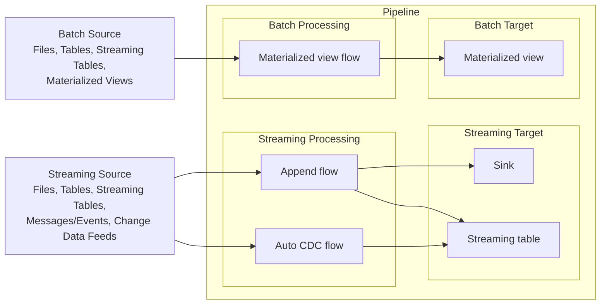

# Übersicht: Was sind Lakeflow-Pipelines?

Deutsche Übersetzung/Zusammenfassung der Konzepte-Landingpage "What are Lakeflow pipelines?", verifiziert per `WebFetch` gegen die Azure-Spiegelseite (`learn.microsoft.com/en-us/azure/databricks/ldp/concepts/`). Diese Seite bündelt in Kurzform, was die einzelnen Dateien in diesem Ordner und den Ordnern `04`–`09` im Detail behandeln — für Details bitte jeweils der Verweis am Abschnittsende folgen, um Dopplung zu vermeiden.

Lakeflow-Pipelines sind ein deklaratives Framework für Batch- und Streaming-Datenpipelines in SQL und Python. Die fünf Kernkonzepte — Pipeline, Flow, Streaming Table, Materialized View und Sink — arbeiten zusammen und übernehmen Orchestrierung sowie inkrementelle Aktualisierung automatisch. Lakeflow-Pipelines bauen auf Apache Spark™ Declarative Pipelines (SDP) auf (siehe `Was ist Spark Declarative Pipelines.md`).

## Abschnittsübersicht

1. [Vorteile gegenüber manueller Orchestrierung](#vorteile)
2. [Kernkonzepte im Überblick](#kernkonzepte)
3. [Datasets](#datasets)
4. [Flows](#flows)
5. [Sinks](#sinks)
6. [Pipelines](#pipelines)
7. [Data Ingestion](#ingestion)
8. [Data Quality](#quality)
9. [Delta-Integration](#delta)
10. [Quellen](#quellen)

---

## <a id="vorteile">1. Vorteile gegenüber manueller Orchestrierung</a>

Im Vergleich zu handgeschriebenem Spark- und Structured-Streaming-Code mit manueller Orchestrierung über Lakeflow Jobs bieten Pipelines drei Vorteile:

- **Automatische Orchestrierung:** Verarbeitungsschritte ("Flows") laufen in korrekter Reihenfolge, mit maximaler Parallelität; transiente Fehler werden stufenweise erneut versucht — vom einzelnen Spark-Task über den Flow bis zur gesamten Pipeline.
- **Deklarative Verarbeitung:** Wenige deklarative Definitionen ersetzen hunderte Zeilen manuellen Spark-/Structured-Streaming-Code. Die AUTO-CDC-API übernimmt Change-Data-Capture-Events (inkl. SCD Typ 1 und 2) ohne manuellen Code für unsortierte Events oder Watermarks.
- **Inkrementelle Verarbeitung:** Eine Engine hält Materialized Views aktuell, indem sie Transformationslogik mit Batch-Semantik entgegennimmt, aber nur neue oder geänderte Quelldaten neu verarbeitet, wo immer möglich.

## <a id="kernkonzepte">2. Kernkonzepte im Überblick</a>

Nachgezeichnet nach dem Kernkonzepte-Diagramm der Quelle (`_static/images/dlt/dlt-core-concepts.png`):

Zwei Quellarten speisen die Pipeline: **Streaming-Quellen** (Dateien, Tabellen, Streaming Tables, Messages/Events, Change-Data-Feeds) laufen über Append- oder Auto-CDC-Flows in einen Sink oder eine Streaming Table; **Batch-Quellen** (Dateien, Tabellen, Streaming Tables, Materialized Views) laufen über den impliziten Materialized-View-Flow in eine Materialized View. Views sind in diesem Diagramm bewusst nicht enthalten — sie lesen bei Bedarf aus Streaming Tables oder Materialized Views, ohne selbst gespeichert zu werden (siehe `Views.md`).

## <a id="datasets">3. Datasets</a>

Eine Pipeline erzeugt drei Arten von Datasets mit unterschiedlicher Verarbeitungssemantik:

| Dataset-Typ | Verarbeitung |
|---|---|
| Streaming Table | jeder Datensatz genau einmal, Append-only-Quelle vorausgesetzt |
| Materialized View | wird bei Bedarf neu berechnet, um den aktuellen Datenstand zu spiegeln |
| View | wird bei Abfrage ausgewertet, nicht persistiert |

Vollständige Definitionen, Beispiele und die Entscheidungshilfe zwischen den drei Typen stehen in `Streaming Tables.md`, `Materialized Views.md` und `Views.md`.

## <a id="flows">4. Flows</a>

Ein Flow ist die grundlegende Verarbeitungseinheit einer Pipeline und unterstützt sowohl Streaming- als auch Batch-Semantik. Pipelines teilen sich die Streaming-Flow-Typen von Spark Structured Streaming (Append, Update, Complete — aktuell sind nur Append und Update freigeschaltet) und ergänzen zwei eigene Flow-Typen: Auto CDC (Streaming, nur Lakeflow, nicht in SDP verfügbar) und Materialized View (Batch, stets implizit definiert). Details, weitere Flow-Typen (REPLACE USING, REPLACE WHERE) und Architekturmuster (Fan-in, Fan-out, Multiplex) stehen in `06 Flows/`.

## <a id="sinks">5. Sinks</a>

Ein Sink ist ein Streaming-Ziel außerhalb des von der Pipeline verwalteten Bereichs — unterstützt werden Delta-Tabellen, Apache-Kafka-Topics, Azure-Event-Hubs-Topics und benutzerdefinierte Python-Datenquellen. Ein Sink kann von einem oder mehreren Append- oder Update-Flows beschrieben werden. Details stehen in `09 Sinks/`.

## <a id="pipelines">6. Pipelines</a>

Eine Pipeline ist die Entwicklungs- und Ausführungseinheit: der Container für alle definierten Flows, Streaming Tables, Materialized Views und Sinks. Beim Ausführen analysiert die Pipeline automatisch die Abhängigkeiten ihrer Datasets und orchestriert Reihenfolge sowie Parallelisierung. Materialized Views und Streaming Tables lassen sich auch einzeln als Standalone-Objekte außerhalb einer Lakeflow-Pipeline betreiben; eine Pipeline läuft zudem entweder im Triggered- oder im Continuous-Modus. Details stehen in `Pipelines.md`, `Standalone Pipelines.md` und `Pipeline-Modi (Triggered vs Continuous).md`.

## <a id="ingestion">7. Data Ingestion</a>

Pipelines lesen aus jeder von Databricks unterstützten Datenquelle. Für die meisten Ingestion-Fälle empfiehlt Databricks Streaming Tables: Auto Loader für Dateien in Cloud-Objektspeicher, direktes Lesen für Message Busse wie Kafka, Event Hubs, Kinesis oder Pub/Sub. Details stehen in `04 Ingestion und Laden von Daten/Daten laden.md`.

## <a id="quality">8. Data Quality</a>

Expectations sind optionale Klauseln auf Datasets, die Datensätze beim Durchfließen der Pipeline validieren. Eine Expectation ist ein SQL-Boolean-Constraint; bei Verletzung entscheidet die gewählte Aktion, ob der Datensatz nur protokolliert (`warn`), verworfen (`drop`) oder das Update gestoppt wird (`fail`). Details stehen in `08 Data Quality (Expectations)/`.

## <a id="delta">9. Delta-Integration</a>

Alle von einer Pipeline verwalteten Tabellen sind Delta-Tabellen mit denselben Garantien wie Delta Lake generell: ACID-Transaktionen, Time Travel, Schema Enforcement. Pipelines ergänzen zusätzliche Tabelleneigenschaften und pflegen die Tabellen automatisch über Predictive Optimization, einschließlich `OPTIMIZE` und `VACUUM`. Details stehen in `Pipelines.md`, Abschnitt 7, und in `11 Konfiguration und Compute/`.

---

## <a id="quellen">10. Quellen</a>

- What are Lakeflow pipelines? (Azure, vollständig als Rohtext abgerufen): https://learn.microsoft.com/en-us/azure/databricks/ldp/concepts/
- What are Lakeflow pipelines? (AWS): https://docs.databricks.com/aws/en/ldp/concepts/

**Stand:** 2026-08-20.
