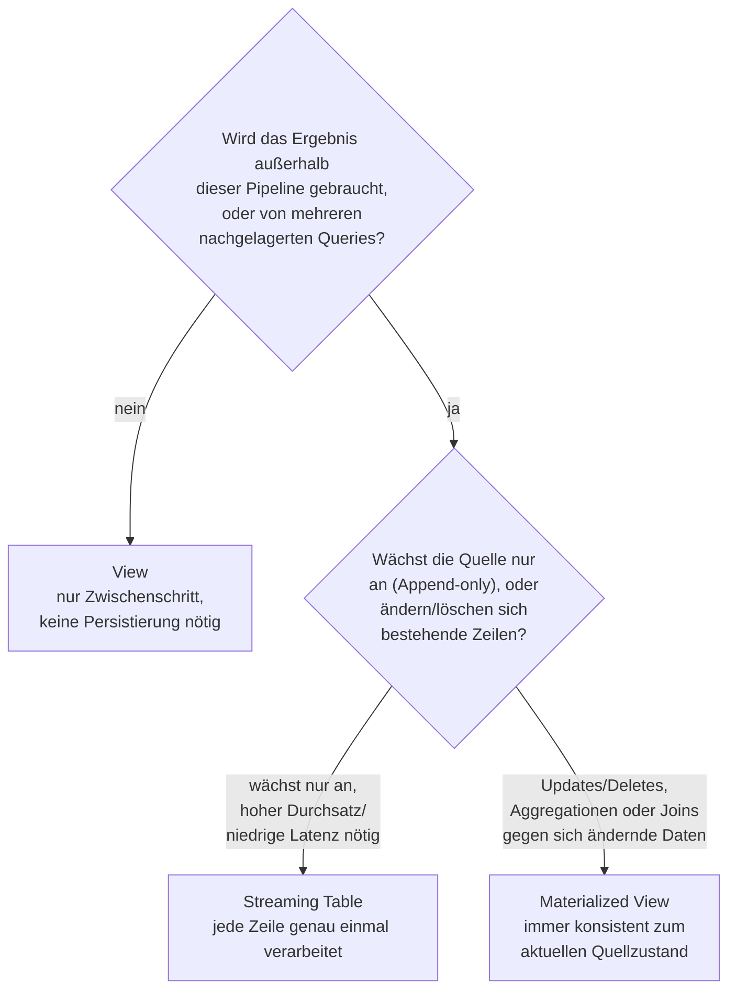

# Views

Referenz zum Konzept "View" in Lakeflow-Pipelines sowie zur Entscheidung zwischen View, Streaming Table und Materialized View. Basierend auf der Konzepte-Übersichtsseite `https://docs.databricks.com/aws/en/ldp/concepts/` (Abschnitt "Datasets"), verifiziert per `WebFetch` gegen die Azure-Spiegelseite (`learn.microsoft.com/en-us/azure/databricks/ldp/concepts/`).

## Abschnittsübersicht

1. [Was ist eine View?](#definition)
2. [Wann eine View verwenden?](#wann-view)
3. [Entscheidung: View, Materialized View oder Streaming Table?](#entscheidung)
4. [Quellen](#quellen)

---

## <a id="definition">1. Was ist eine View?</a>

Eine View wird bei jeder Abfrage neu ausgewertet ("evaluated on demand") und nicht persistiert. Anders als eine Streaming Table oder eine Materialized View ist eine View **kein** Unity-Catalog-Managed-Table und erzeugt daher weder Speicherkosten noch einen eigenen Refresh-Zyklus.

```python
from pyspark import pipelines as dp

@dp.view
def customers_filtered():
  return spark.read.table("customers_raw").where("email IS NOT NULL")
```

```sql
CREATE OR REFRESH TEMPORARY VIEW customers_filtered
AS SELECT * FROM customers_raw WHERE email IS NOT NULL;
```

Eine View lässt sich nur innerhalb derselben Pipeline abfragen, die sie definiert — im Gegensatz zu Materialized Views und Streaming Tables, die als Unity-Catalog-Tabellen auch außerhalb der definierenden Pipeline abfragbar sind.

## <a id="wann-view">2. Wann eine View verwenden?</a>

Laut Doku eignet sich eine View für:

- **Zerlegung großer oder komplexer Queries** in besser wartbare Teil-Queries.
- **Validierung von Zwischenergebnissen** über Expectations, ohne das Zwischenergebnis selbst zu veröffentlichen (siehe `08 Data Quality (Expectations)/Expectations-Grundlagen.md`).
- **Reduzierung von Speicher- und Compute-Kosten** für Ergebnisse, die nicht persistiert werden müssen — materialisierte Tabellen benötigen zusätzliche Rechen- und Speicherressourcen, eine View nicht.

## <a id="entscheidung">3. Entscheidung: View, Materialized View oder Streaming Table?</a>



| | View | Materialized View | Streaming Table |
|---|---|---|---|
| Persistiert? | nein, bei jeder Abfrage neu berechnet | ja, als Unity-Catalog-Tabelle | ja, als Unity-Catalog-Tabelle |
| Außerhalb der Pipeline abfragbar? | nein | ja | ja |
| Verarbeitungssemantik | on demand | Batch, hält Ergebnis konsistent zum aktuellen Quellzustand | jede Zeile genau einmal (Append-only-Quelle vorausgesetzt) |
| Passt zu | Zwischenschritte, Validierung, Kostenersparnis | Aggregationen/Joins gegen sich ändernde Daten, von mehreren Konsumenten gelesene Ergebnisse, Zwischenprüfung während der Entwicklung | kontinuierlich wachsende Quellen, hoher Durchsatz, niedrige Latenz |

Konkrete Empfehlungen laut Doku:

**Materialized View verwenden, wenn:**
- mehrere nachgelagerte Queries dieselbe Tabelle lesen — die Materialized View cacht ihr Ergebnis, sodass nachgelagerte Queries das vorberechnete Ergebnis lesen statt es erneut zu berechnen;
- andere Pipelines, Jobs oder Queries die Tabelle konsumieren sollen — da sie als Unity-Catalog-Tabelle materialisiert ist, können auch externe Konsumenten sie lesen;
- Ergebnisse während der Entwicklung inspiziert werden sollen — nach der Validierung lassen sich Queries, die keine Materialisierung brauchen, zu Views vereinfachen;
- die Query Aggregationen oder Joins durchführt oder sich die Quelldaten durch Updates/Deletes ändern können, nicht nur durch Wachstum.

**Streaming Table verwenden, wenn:**
- die Query gegen eine kontinuierlich oder inkrementell wachsende Quelle definiert ist;
- Ergebnisse inkrementell berechnet werden sollen;
- die Pipeline hohen Durchsatz und niedrige Latenz benötigt.

Details zu den beiden materialisierten Typen stehen in `Streaming Tables.md` und `Materialized Views.md` in diesem Ordner.

---

## <a id="quellen">4. Quellen</a>

- What are Lakeflow pipelines? — Concepts-Übersicht (Azure, vollständig als Rohtext abgerufen): https://learn.microsoft.com/en-us/azure/databricks/ldp/concepts/
- Concepts-Übersicht (AWS): https://docs.databricks.com/aws/en/ldp/concepts/

**Stand:** 2026-08-20.
