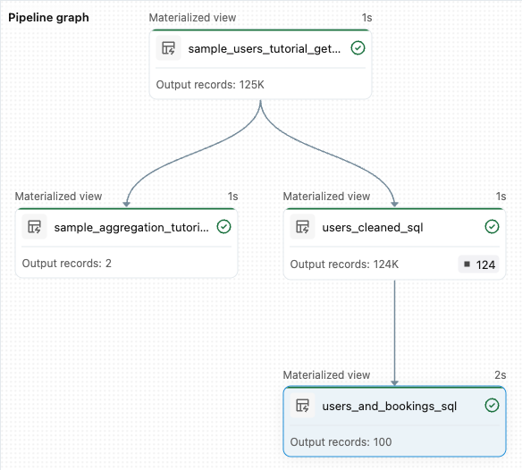

# Tutorial: Erste Pipeline

Referenz zum Einsteiger-Tutorial für Lakeflow-Pipelines, basierend auf `https://docs.databricks.com/aws/en/ldp/tutorial-get-started`.

## Abschnittsübersicht

1. [Was baut man in diesem Tutorial?](#einleitung)
2. [Voraussetzungen](#voraussetzungen)
3. [Schritt 1: Pipeline erstellen](#schritt1)
4. [Schritt 2: Datenqualitätsprüfungen anwenden](#schritt2)
5. [Schritt 3: Top-User analysieren](#schritt3)
6. [Nächste Schritte](#naechste-schritte)
7. [Quellen](#quellen)

---

## <a id="einleitung">1. Was baut man in diesem Tutorial?</a>

Das Tutorial zeigt, wie eine neue Lakeflow-Pipeline für Datenorchestrierung mit Auto Loader erstellt wird, um anschließend die mitgelieferte Beispiel-Pipeline zu erweitern: Zunächst werden die Daten bereinigt, danach wird eine Query erstellt, die die Top-100-Nutzer ermittelt.

Konkret wird im Editor gelernt:

- Eine neue Pipeline mit der Standard-Ordnerstruktur zu erstellen und mit einem Satz von Beispieldateien zu starten.
- Datenqualitäts-Constraints über Expectations zu definieren.
- Die Editor-Funktionen zu nutzen, um die Pipeline um eine neue Transformation zur Datenanalyse zu erweitern.

## <a id="voraussetzungen">2. Voraussetzungen</a>

Vor Beginn muss Folgendes erfüllt sein:

- In einem Databricks-Workspace angemeldet sein.
- Unity Catalog muss für den Workspace aktiviert sein.
- Berechtigung, eine Compute-Ressource zu erstellen, oder Zugriff auf eine bestehende Compute-Ressource.
- Berechtigungen zum Erstellen von Schemas, entweder über `ALL PRIVILEGES` oder die Kombination aus `USE CATALOG` und `CREATE SCHEMA`.
- Vollständige Rechte, um Pipelines zu erstellen, auszuführen, zu aktualisieren und deren Ausgabe einzusehen (siehe Berechtigungsverwaltung für Pipelines).

## <a id="schritt1">3. Schritt 1: Pipeline erstellen</a>

1. Im Workspace auf das Plus-Symbol (**New**) klicken, anschließend das Pipeline-Symbol für **ETL Pipeline** auswählen.
2. (Optional) Einen beschreibenden Pipeline-Namen eingeben.
3. (Optional) Rechts neben dem Namen über den Katalog-/Schema-Selektor die Standardwerte anpassen (Katalog und Schema, für die Schreibrechte bestehen).
4. (Optional) Über das Sprach-Dropdown **Python** oder **SQL** für die Transformationsdatei wählen.
5. Auf das Code-Symbol klicken und **Use sample code** auswählen.
6. **Run pipeline** klicken, um den Code auszuführen.

Nach dem Lauf erstellt das System zwei Tabellen: `sample_users_<date_time>` und `sample_aggregation_<date_time>`. Diese basieren auf der Beispieldatenquelle `wanderbricks` (Tabelle `users`).

## <a id="schritt2">4. Schritt 2: Datenqualitätsprüfungen anwenden</a>

In diesem Schritt werden über Pipeline-Expectations Datenqualitäts-Constraints hinzugefügt, um ungültige E-Mail-Adressen herauszufiltern und eine bereinigte Tabelle auszugeben.

```sql
-- Zeilen ohne E-Mail-Adresse verwerfen
CREATE MATERIALIZED VIEW users_cleaned(
  CONSTRAINT non_null_email EXPECT (email IS NOT NULL) ON VIOLATION DROP ROW)
AS SELECT * FROM sample_users_<date_time>;
```

```python
from pyspark import pipelines as dp

@dp.materialized_view
@dp.expect_or_drop("no null emails", "email IS NOT NULL")
def users_cleaned():
    return spark.read.table("sample_users_<date_time>")
```

Hier wird `sample_users_<date_time>` durch den tatsächlichen, beim Erstellen der Pipeline generierten Tabellennamen ersetzt.

## <a id="schritt3">5. Schritt 3: Top-User analysieren</a>

Dieser Schritt erstellt eine Transformation, die die bereinigten Nutzerdaten (`users_cleaned`) mit den Buchungen (`bookings`) verknüpft, um die Top-100-Nutzer nach Buchungsanzahl zu ermitteln.

```sql
CREATE OR REFRESH MATERIALIZED VIEW users_and_bookings AS
SELECT u.name AS name, COUNT(b.booking_id) AS booking_count
FROM users_cleaned u
JOIN samples.wanderbricks.bookings b ON u.user_id = b.user_id
GROUP BY u.name ORDER BY booking_count DESC LIMIT 100;
```

```python
from pyspark import pipelines as dp
from pyspark.sql.functions import col, count, desc

@dp.materialized_view
def users_and_bookings():
    return (spark.read.table("users_cleaned")
        .join(spark.read.table("samples.wanderbricks.bookings"), "user_id")
        .groupBy(col("name"))
        .agg(count("booking_id").alias("booking_count"))
        .orderBy(desc("booking_count")).limit(100))
```

Nach diesem Schritt enthält der Pipeline-Graph vier Tabellen (die beiden ursprünglichen Beispieltabellen plus `users_cleaned` und `users_and_bookings`):



## <a id="naechste-schritte">6. Nächste Schritte</a>

Die Doku verweist abschließend auf weitere Editor-Funktionen, die es zu erkunden lohnt:

- Selective Execution (gezielte Ausführung einzelner Datasets)
- Data Previews (Datenvorschauen)
- Interaktiver Pipeline-Graph
- Integration mit Declarative Automation Bundles für effiziente Zusammenarbeit, Versionskontrolle und CI/CD-Integration

## <a id="quellen">Quellen</a>

- https://docs.databricks.com/aws/en/ldp/tutorial-get-started
