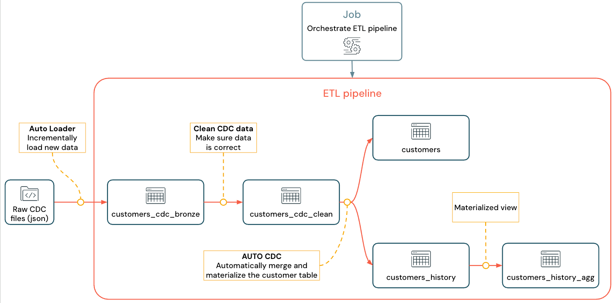

# Tutorial: Pipelines mit mehreren Quellen (ETL mit CDC)

Referenz zum Tutorial "Build an ETL pipeline with change data capture (CDC)", basierend auf `https://docs.databricks.com/aws/en/ldp/tutorial-pipelines`. Der Original-Titel bezieht sich auf Change Data Capture; die Doku zeigt darin, wie mehrere aufeinanderfolgende Verarbeitungsstufen (Bronze/Silver/Gold, inkl. SCD-Type-2-Historie) zu einer vollständigen Pipeline kombiniert werden.

## Abschnittsübersicht

1. [Was baut man in diesem Tutorial?](#einleitung)
2. [Voraussetzungen](#voraussetzungen)
3. [Schritt 1: Pipeline erstellen](#schritt1)
4. [Schritt 2: Beispieldaten erzeugen](#schritt2)
5. [Schritt 3: Inkrementeller Dateneingang mit Auto Loader (Bronze)](#schritt3)
6. [Schritt 4: Bereinigung und Expectations (Silver)](#schritt4)
7. [Schritt 5: Customers-Tabelle mit AUTO CDC materialisieren (Gold, SCD Type 1)](#schritt5)
8. [Schritt 6: Update-Historie mit SCD Type 2 nachverfolgen](#schritt6)
9. [Schritt 7: Materialized View für Aggregation erstellen](#schritt7)
10. [Schritt 8: Job zur Zeitplanung erstellen](#schritt8)
11. [Quellen](#quellen)

---

## <a id="einleitung">1. Was baut man in diesem Tutorial?</a>

Es wird eine ETL-Pipeline (Extract, Transform, Load) mit Change Data Capture (CDC) erstellt und bereitgestellt, unter Verwendung von Lakeflow-Pipelines für die Datenorchestrierung und Auto Loader für den Dateneingang.

## <a id="voraussetzungen">2. Voraussetzungen</a>

- Unity Catalog ist für den Workspace aktiviert.
- Serverless Compute ist im Workspace verfügbar (standardmäßig aktiviert in Workspaces mit Unity Catalog).
- Berechtigung, eine Compute-Ressource zu erstellen, oder Zugriff auf eine bestehende.
- Berechtigungen, ein neues Schema in einem Katalog zu erstellen.
- Berechtigungen, ein neues Volume in einem bestehenden Schema zu erstellen.
- Für die vollständigen Rechte zum Erstellen, Ausführen, Aktualisieren und Einsehen von Pipelines und deren Ausgabe verweist die Doku auf die Berechtigungsverwaltung für Pipelines.

## <a id="schritt1">3. Schritt 1: Pipeline erstellen</a>

Im Workspace wird auf das Plus-Symbol geklickt, dann **ETL Pipeline** ausgewählt. Ein beschreibender Name wird vergeben; rechts daneben werden Katalog und Schema mit Schreibrechten gewählt. Optional lässt sich aus dem Sprach-Dropdown **Python** oder **SQL** wählen. Über das Code-Symbol wird **Use sample code** ausgewählt.

## <a id="schritt2">4. Schritt 2: Beispieldaten erzeugen</a>

Mit der Python-Bibliothek `Faker` werden künstliche CDC-Datensätze (Kunden mit den Operationen `APPEND`, `DELETE`, `UPDATE`) erzeugt und als JSON in ein Unity-Catalog-Volume geschrieben.

```python
%pip install faker

catalog = "<my_catalog>"
schema = db = dbName = db = "<my_schema>"
spark.sql(f'USE CATALOG `{catalog}`')
spark.sql(f'USE SCHEMA `{schema}`')
spark.sql(f'CREATE VOLUME IF NOT EXISTS `{catalog}`.`{db}`.`raw_data`')
```

```python
volume_folder = f"/Volumes/{catalog}/{db}/raw_data"
try:
  dbutils.fs.ls(volume_folder+"/customers")
except:
  print(f"folder doesn't exist, generating the data under {volume_folder}...")
  from pyspark.sql import functions as F
  from faker import Faker
  from collections import OrderedDict
  import uuid
  fake = Faker()
  import random
  fake_firstname = F.udf(fake.first_name)
  fake_lastname = F.udf(fake.last_name)
  fake_email = F.udf(fake.ascii_company_email)
  fake_date = F.udf(lambda:fake.date_time_this_month().strftime("%m-%d-%Y %H:%M:%S"))
  fake_address = F.udf(fake.address)
  operations = OrderedDict([("APPEND", 0.5),("DELETE", 0.1),("UPDATE", 0.3),(None, 0.01)])
  fake_operation = F.udf(lambda:fake.random_elements(elements=operations, length=1)[0])
  fake_id = F.udf(lambda: str(uuid.uuid4()) if random.uniform(0, 1) < 0.98 else None)
  df = spark.range(0, 100000).repartition(100)
  df = df.withColumn("id", fake_id())
  df = df.withColumn("firstname", fake_firstname())
  df = df.withColumn("lastname", fake_lastname())
  df = df.withColumn("email", fake_email())
  df = df.withColumn("address", fake_address())
  df = df.withColumn("operation", fake_operation())
  df_customers = df.withColumn("operation_date", fake_date())
  df_customers.repartition(100).write.format("json").mode("overwrite").save(volume_folder+"/customers")
```

Die erzeugten Daten lassen sich zur Kontrolle anzeigen:

```python
catalog = "<my_catalog>"
schema = "<my_schema>"
display(spark.read.json(f"/Volumes/{catalog}/{schema}/raw_data/customers"))
```

## <a id="schritt3">5. Schritt 3: Inkrementeller Dateneingang mit Auto Loader (Bronze)</a>

Die rohen CDC-Nachrichten werden inkrementell über Auto Loader in eine Bronze-Streaming-Table geladen.

```python
from pyspark import pipelines as dp
from pyspark.sql.functions import *

path = "/Volumes/<catalog>/<schema>/raw_data/customers"
dp.create_streaming_table("customers_cdc_bronze",
  comment="New customer data incrementally ingested from cloud object storage landing zone")

@dp.append_flow(target = "customers_cdc_bronze", name = "customers_bronze_ingest_flow")
def customers_bronze_ingest_flow():
  return (
      spark.readStream
          .format("cloudFiles")
          .option("cloudFiles.format", "json")
          .option("cloudFiles.inferColumnTypes", "true")
          .load(f"{path}")
  )
```

```sql
CREATE OR REFRESH STREAMING TABLE customers_cdc_bronze
COMMENT "New customer data incrementally ingested from cloud object storage landing zone";

CREATE FLOW customers_bronze_ingest_flow AS
INSERT INTO customers_cdc_bronze BY NAME
  SELECT *
  FROM STREAM read_files(
    "/Volumes/<catalog>/<schema>/raw_data/customers",
    format => "json",
    inferColumnTypes => "true"
  )
```

## <a id="schritt4">6. Schritt 4: Bereinigung und Expectations (Silver)</a>

Über `expect_all_or_drop` bzw. entsprechende `CONSTRAINT`-Klauseln in SQL werden Zeilen mit fehlerhaften Daten verworfen: geretteten Daten (`_rescued_data`), fehlender `id` oder ungültiger `operation`.

```python
from pyspark import pipelines as dp
from pyspark.sql.functions import *

dp.create_streaming_table(
  name = "customers_cdc_clean",
  expect_all_or_drop = {"no_rescued_data": "_rescued_data IS NULL",
"valid_id": "id IS NOT NULL",
"valid_operation": "operation IN ('APPEND', 'DELETE', 'UPDATE')"}
  )

@dp.append_flow(target = "customers_cdc_clean",
  name = "customers_cdc_clean_flow")
def customers_cdc_clean_flow():
  return (
      spark.readStream.table("customers_cdc_bronze")
          .select("address", "email", "id", "firstname", "lastname",
          "operation", "operation_date", "_rescued_data")
  )
```

```sql
CREATE OR REFRESH STREAMING TABLE customers_cdc_clean (
  CONSTRAINT no_rescued_data EXPECT (_rescued_data IS NULL) ON VIOLATION DROP ROW,
  CONSTRAINT valid_id EXPECT (id IS NOT NULL) ON VIOLATION DROP ROW,
  CONSTRAINT valid_operation EXPECT (operation IN ('APPEND', 'DELETE', 'UPDATE'))
    ON VIOLATION DROP ROW)
COMMENT "New customer data incrementally ingested from cloud object storage landing zone";

CREATE FLOW customers_cdc_clean_flow AS
INSERT INTO customers_cdc_clean BY NAME
SELECT * FROM STREAM customers_cdc_bronze;
```

## <a id="schritt5">7. Schritt 5: Customers-Tabelle mit AUTO CDC materialisieren (Gold, SCD Type 1)</a>

Mit `create_auto_cdc_flow` (Python) bzw. `AUTO CDC INTO` (SQL) wird aus den bereinigten CDC-Datensätzen eine finale, konsolidierte `customers`-Tabelle erzeugt (SCD Type 1 — nur der aktuelle Stand wird gehalten).

```python
from pyspark import pipelines as dp
from pyspark.sql.functions import *

dp.create_streaming_table(name="customers",
  comment="Clean, materialized customers")

dp.create_auto_cdc_flow(
  target="customers",
  source="customers_cdc_clean",
  keys=["id"],
  sequence_by=col("operation_date"),
  ignore_null_updates=False,
  apply_as_deletes=expr("operation = 'DELETE'"),
  except_column_list=["operation", "operation_date", "_rescued_data"],
)
```

```sql
CREATE OR REFRESH STREAMING TABLE customers;

CREATE FLOW customers_cdc_flow
AS AUTO CDC INTO customers
FROM stream(customers_cdc_clean)
KEYS (id)
APPLY AS DELETE WHEN
operation = "DELETE"
SEQUENCE BY operation_date
COLUMNS * EXCEPT (operation, operation_date, _rescued_data)
STORED AS SCD TYPE 1;
```

## <a id="schritt6">8. Schritt 6: Update-Historie mit SCD Type 2 nachverfolgen</a>

Zusätzlich zur SCD-Type-1-Tabelle `customers` wird eine `customers_history`-Tabelle erzeugt, die als Slowly Changing Dimension Type 2 die vollständige Änderungshistorie je Kunde festhält (`stored_as_scd_type="2"` bzw. `STORED AS SCD TYPE 2`).

```python
from pyspark import pipelines as dp
from pyspark.sql.functions import *

dp.create_streaming_table(
    name="customers_history",
    comment="Slowly Changing Dimension Type 2 for customers")

dp.create_auto_cdc_flow(
    target="customers_history",
    source="customers_cdc_clean",
    keys=["id"],
    sequence_by=col("operation_date"),
    ignore_null_updates=False,
    apply_as_deletes=expr("operation = 'DELETE'"),
    except_column_list=["operation", "operation_date", "_rescued_data"],
    stored_as_scd_type="2",
)
```

```sql
CREATE OR REFRESH STREAMING TABLE customers_history;

CREATE FLOW customers_history_cdc
AS AUTO CDC INTO customers_history
FROM stream(customers_cdc_clean)
KEYS (id)
APPLY AS DELETE WHEN
operation = "DELETE"
SEQUENCE BY operation_date
COLUMNS * EXCEPT (operation, operation_date, _rescued_data)
STORED AS SCD TYPE 2;
```

## <a id="schritt7">9. Schritt 7: Materialized View für Aggregation erstellen</a>

Abschließend wird aus der SCD-Type-2-Historie eine aggregierte Analyse-View erstellt, die je Kunde zählt, wie viele unterschiedliche Adressen, E-Mails, Vor- und Nachnamen im Zeitverlauf aufgetreten sind.

```python
from pyspark import pipelines as dp
from pyspark.sql.functions import *

@dp.table(
  name = "customers_history_agg",
  comment = "Aggregated customer history")
def customers_history_agg():
  return (
    spark.read.table("customers_history")
      .groupBy("id")
      .agg(
          count_distinct("address").alias("address_count"),
          count_distinct("email").alias("email_count"),
          count_distinct("firstname").alias("firstname_count"),
          count_distinct("lastname").alias("lastname_count")
      )
  )
```

```sql
CREATE OR REPLACE MATERIALIZED VIEW customers_history_agg AS
SELECT
  id,
  count(distinct address) as address_count,
  count(distinct email) AS email_count,
  count(distinct firstname) AS firstname_count,
  count(distinct lastname) AS lastname_count
FROM customers_history
GROUP BY id
```

Die vollständige Pipeline (Bronze → Silver → Gold + SCD2-Historie + Aggregation) sieht im Pipeline-Graph wie folgt aus:



## <a id="schritt8">10. Schritt 8: Job zur Zeitplanung erstellen</a>

Um die Pipeline automatisch laufen zu lassen, wird oben im Editor der **Schedule**-Button gewählt. Erscheint der Dialog **Schedules**, wird **Add schedule** gewählt. Im Dialog **New schedule** kann optional ein Name für den Job vergeben werden; anschließend wird die gewünschte Zeitplan-Einstellung gesetzt. Mit **Create** wird der Job erstellt und die Änderungen übernommen.

## <a id="quellen">Quellen</a>

- https://docs.databricks.com/aws/en/ldp/tutorial-pipelines
