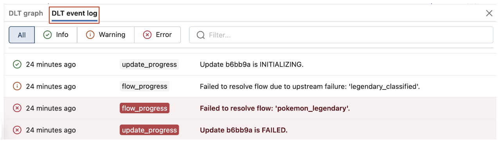
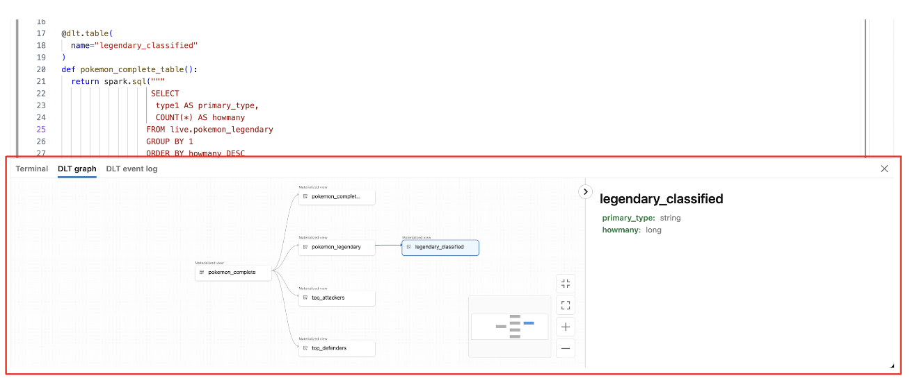
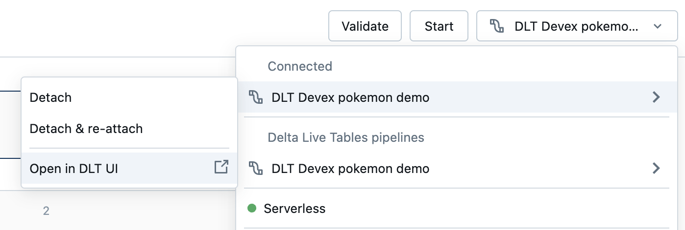
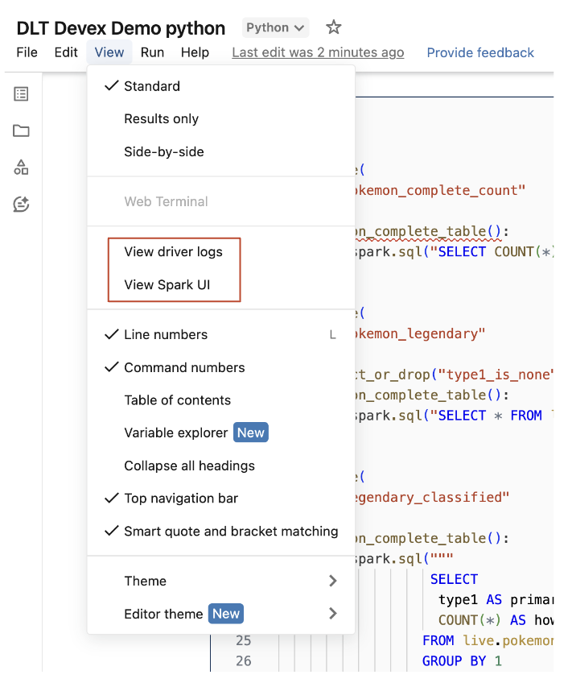

# Notebook-Entwicklungserfahrung (Legacy) — Referenz

Dieses Dokument fasst die Databricks-Dokumentationsseite "Develop and debug pipelines with a notebook (legacy)" zusammen — die **veraltete** Notebook-basierte Entwicklungserfahrung für Lakeflow Declarative Pipelines (LDP, früher DLT), die durch den Lakeflow Pipelines Editor (siehe `Multi-File-Editor.md` in diesem Ordner) abgelöst wurde. Jede faktische Aussage wurde per `WebFetch` gegen die offizielle Databricks-Online-Dokumentation (AWS-Seite `docs.databricks.com/aws/en/ldp/notebook-devex`) verifiziert; zusätzlich wurde die Azure/Microsoft-Learn-Spiegelseite (`learn.microsoft.com/en-us/azure/databricks/ldp/notebook-devex`) im Volltext abgerufen und zum wörtlichen Abgleich herangezogen — beide Fassungen stimmen inhaltlich und nahezu wortgleich überein (die Azure-Fassung nennt die Plattform lediglich "Azure Databricks" statt "Databricks"). Screenshots aus der Doku wurden heruntergeladen und lokal eingebunden.

## Abschnittsübersicht

1. [Status: Legacy-Feature](#status)
2. [Überblick über Notebooks in Pipelines](#ueberblick)
3. [Voraussetzungen](#voraussetzungen)
4. [Einschränkungen](#einschraenkungen)
5. [Ein Notebook mit einer Pipeline verbinden](#notebook-verbinden)
6. [Cluster-Status der Pipeline einsehen](#cluster-status)
7. [Pipeline-Code validieren](#code-validieren)
8. [Ein Pipeline-Update starten](#update-starten)
9. [Status eines Updates einsehen](#update-status)
10. [Fehler und Diagnosen einsehen](#fehler-diagnosen)
11. [Pipeline-Ereignisse einsehen](#pipeline-ereignisse)
12. [Den Dataflow-Graphen der Pipeline einsehen](#dataflow-graph)
13. [Zugriff auf die Pipeline-UI aus dem Notebook](#pipeline-ui-zugriff)
14. [Zugriff auf Treiber-Logs und die Spark-UI aus dem Notebook](#treiber-logs-spark-ui)
15. [Quellen](#quellen)

---

## <a id="status">1. Status: Legacy-Feature</a>

Die Doku-Seite kennzeichnet dieses Feature durchgehend mit zwei wichtigen Hinweisen, wörtlich übersetzt:

**Public-Preview-Hinweis:** "Dieses Feature befindet sich in der Public Preview."

**Deprecation-Hinweis (wörtlich, zentrale Aussage der Seite):** "Diese Seite beschreibt die Legacy-Notebook-Bearbeitungserfahrung. Dieses Feature kann nicht mehr aktiviert werden und ist nur in Workspaces zugänglich, die zuvor gegen den Lakeflow Pipelines Editor optiert haben (also den Wechsel zum neuen Editor abgelehnt/aufgeschoben haben)." Die Azure-Fassung ergänzt explizit: Die Notebook-Bearbeitungserfahrung ist deprecated und wird entfernt werden.

Die Standard-Entwicklungserfahrung ist der **Lakeflow Pipelines Editor** (siehe `Multi-File-Editor.md`); dieser wird zum Bearbeiten von Notebooks sowie Python- oder SQL-Code-Dateien für eine Pipeline empfohlen.

---

## <a id="ueberblick">2. Überblick über Notebooks in Pipelines</a>

Arbeitet man an einem Python- oder SQL-Notebook, das als Quellcode für eine bestehende Pipeline konfiguriert ist, lässt sich das Notebook direkt mit der Pipeline verbinden. Ist das Notebook mit der Pipeline verbunden, stehen laut Doku folgende Funktionen zur Verfügung:

- Die Pipeline aus dem Notebook heraus starten und validieren.
- Den Dataflow-Graphen und das Event Log des letzten Updates der Pipeline im Notebook einsehen.
- Pipeline-Diagnosen im Notebook-Editor einsehen.
- Den Status des Pipeline-Clusters im Notebook einsehen.
- Aus dem Notebook auf die Pipeline-UI zugreifen.

---

## <a id="voraussetzungen">3. Voraussetzungen</a>

Laut Doku wörtlich:

- Es muss eine bestehende Pipeline mit einem als Quellcode konfigurierten Python- oder SQL-Notebook vorhanden sein.
- Man muss entweder Owner der Pipeline sein oder über die Berechtigung `CAN_MANAGE` verfügen.

---

## <a id="einschraenkungen">4. Einschränkungen</a>

Laut Doku wörtlich:

- Die in diesem Artikel beschriebenen Funktionen sind ausschließlich in Databricks-Notebooks verfügbar. Workspace-Dateien werden nicht unterstützt.
- Das Web-Terminal ist nicht verfügbar, wenn ein Notebook mit einer Pipeline verbunden ist. Entsprechend ist es im unteren Panel nicht als Tab sichtbar.

---

## <a id="notebook-verbinden">5. Ein Notebook mit einer Pipeline verbinden</a>

Im Notebook auf das Dropdown-Menü zur Auswahl des Compute klicken. Das Dropdown-Menü zeigt alle Pipelines, die dieses Notebook als Quellcode verwenden. Um das Notebook mit einer Pipeline zu verbinden, wird sie aus der Liste ausgewählt.

---

## <a id="cluster-status">6. Cluster-Status der Pipeline einsehen</a>

Um den Zustand des Pipeline-Clusters einfach nachvollziehen zu können, wird sein Status im Compute-Dropdown-Menü angezeigt — eine grüne Farbe zeigt an, dass der Cluster läuft.

---

## <a id="code-validieren">7. Pipeline-Code validieren</a>

Die Pipeline lässt sich validieren, um Syntaxfehler im Quellcode zu prüfen, ohne dabei Daten zu verarbeiten. Um eine Pipeline zu validieren, kann laut Doku eine der folgenden Aktionen ausgeführt werden:

- Oben rechts im Notebook auf **Validate** klicken.
- `Shift+Enter` in einer beliebigen Notebook-Zelle drücken.
- Im Dropdown-Menü einer Zelle auf **Validate Pipeline** klicken.

**Hinweis aus der Doku (wörtlich):** Versucht man, die Pipeline zu validieren, während bereits ein Update läuft, erscheint ein Dialogfeld mit der Frage, ob das laufende Update beendet werden soll. Klickt man auf **Yes**, stoppt das laufende Update, und automatisch startet ein *Validate*-Update.

---

## <a id="update-starten">8. Ein Pipeline-Update starten</a>

Um ein Update der Pipeline zu starten, wird oben rechts im Notebook auf den Button **Start** geklickt.

---

## <a id="update-status">9. Status eines Updates einsehen</a>

Das obere Panel im Notebook zeigt an, ob ein Pipeline-Update sich in einem der folgenden Zustände befindet:

- Starting
- Validating
- Stopping

---

## <a id="fehler-diagnosen">10. Fehler und Diagnosen einsehen</a>

Nachdem ein Pipeline-Update oder eine Validierung gestartet wurde, werden etwaige Fehler inline mit einer roten Unterstreichung angezeigt. Beim Hovern über einen Fehler erscheinen weitere Informationen.

---

## <a id="pipeline-ereignisse">11. Pipeline-Ereignisse einsehen</a>

Ist ein Notebook mit einer Pipeline verbunden, gibt es am unteren Rand des Notebooks einen Tab für das Pipeline-Event-Log.

---

## <a id="dataflow-graph">12. Den Dataflow-Graphen der Pipeline einsehen</a>

Um den Dataflow-Graphen einer Pipeline einzusehen, wird der Tab für den Pipeline-Graphen am unteren Rand des Notebooks verwendet. Die Auswahl eines Knotens im Graphen zeigt dessen Schema im rechten Panel an.

---

## <a id="pipeline-ui-zugriff">13. Zugriff auf die Pipeline-UI aus dem Notebook</a>

Um schnell zur Pipeline-UI zu wechseln, wird das Menü oben rechts im Notebook verwendet.

---

## <a id="treiber-logs-spark-ui">14. Zugriff auf Treiber-Logs und die Spark-UI aus dem Notebook</a>

Die Treiber-Logs (Driver Logs) und die Spark-UI der Pipeline, an der gerade entwickelt wird, lassen sich bequem über das **View**-Menü des Notebooks aufrufen.

---

## <a id="quellen">15. Quellen</a>

- https://docs.databricks.com/aws/en/ldp/notebook-devex (abgerufen 2026-08-19)
- https://learn.microsoft.com/en-us/azure/databricks/ldp/notebook-devex (Zweitquelle zum wörtlichen Abgleich, abgerufen 2026-08-19)
