# Lakeflow Pipelines Editor (Multi-File-Editor) — Referenz

Dieses Dokument beschreibt den **Lakeflow Pipelines Editor** — die IDE-artige Oberfläche zur Entwicklung von Lakeflow Declarative Pipelines (LDP, früher DLT).

## Abschnittsübersicht

1. [Was ist der Lakeflow Pipelines Editor?](#ueberblick)
2. [Überblick über die Benutzeroberfläche](#benutzeroberflaeche)
3. [Eine neue ETL-Pipeline erstellen](#pipeline-erstellen)
4. [Eine bestehende ETL-Pipeline öffnen](#pipeline-oeffnen)
5. [Der Pipeline-Asset-Browser](#asset-browser)
6. [Pipeline-Quelldateien bearbeiten](#quelldateien-bearbeiten)
7. [Pipeline-Code ausführen](#code-ausfuehren)
8. [Pipeline-Graph](#pipeline-graph)
9. [Datenvorschauen](#datenvorschauen)
10. [Ausführungs-Insights](#ausfuehrungs-insights)
11. [Pipeline-Konfiguration](#pipeline-konfiguration)
12. [Pipelines überwachen](#pipelines-ueberwachen)
13. [Genie Code für die Pipeline-Entwicklung](#genie-code)
14. [Einschränkungen und bekannte Probleme](#einschraenkungen)
15. [FAQ](#faq)

---

## <a id="ueberblick">1. Was ist der Lakeflow Pipelines Editor?</a>

Man entwickelt und debuggt ETL-Pipelines (Extract, Transform, Load) im Lakeflow Pipelines Editor, einer IDE, die speziell für die Pipeline-Entwicklung gebaut wurde.

Der Lakeflow Pipelines Editor ist eine IDE für die Entwicklung von Pipelines. Er vereint alle Aufgaben der Pipeline-Entwicklung auf einer einzigen Oberfläche und unterstützt code-first-Workflows, ordnerbasierte Code-Organisation, selektive Ausführung, Datenvorschauen und Pipeline-Graphen. Durch die Integration in die Databricks-Plattform ermöglicht er zudem Versionskontrolle, Code-Reviews und geplante Ausführungen.

---

## <a id="benutzeroberflaeche">2. Überblick über die Benutzeroberfläche</a>

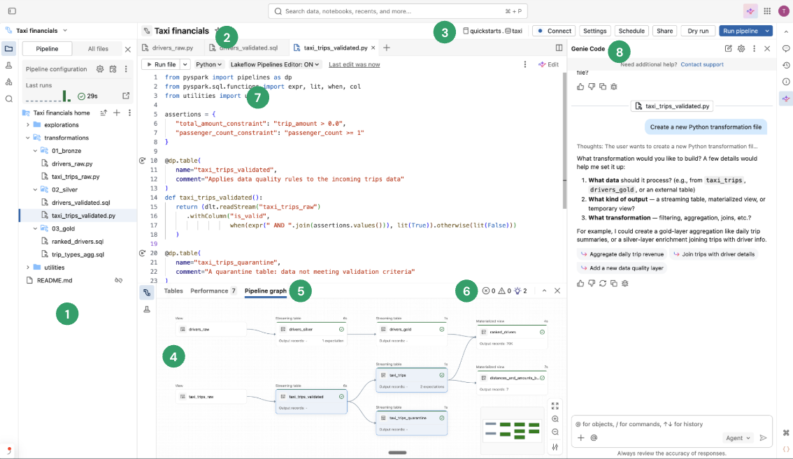

Die Oberfläche besteht aus folgenden Kernbestandteilen:

1. **Pipeline-Asset-Browser:** Erstellen, Löschen, Umbenennen und Organisieren von Pipeline-Assets. Enthält außerdem Shortcuts zur Pipeline-Konfiguration.
2. **Multi-File-Code-Editor mit Tabs:** Arbeiten über mehrere, einer Pipeline zugeordnete Code-Dateien hinweg.
3. **Pipeline-spezifische Toolbar:** Enthält Konfigurationsoptionen der Pipeline sowie Aktionen zum Ausführen auf Pipeline-Ebene.
4. **Interaktiver Pipeline-Graph:** Verschafft einen Überblick über die Tabellen, öffnet die Datenvorschauen in der unteren Leiste und ermöglicht weitere tabellenbezogene Aktionen.
5. **Tabellen-Ausführungs-Insights:** Liefert Ausführungs-Insights für alle Tabellen oder eine einzelne Tabelle einer Pipeline. Die Insights beziehen sich auf den letzten Pipeline-Lauf.
6. **Issues-Panel:** Fasst Fehler, Warnungen und Insights über alle Dateien der Pipeline hinweg zusammen; man kann zu der Stelle in einer bestimmten Datei navigieren, an der der Fehler aufgetreten ist. Dies ergänzt die code-nahen Fehleranzeigen direkt im Editor.
7. **Selektive Ausführung:** Der Code-Editor bietet Funktionen für schrittweise Entwicklung, etwa die Möglichkeit, mit der Aktion **Run file** nur die Tabellen der aktuellen Datei zu aktualisieren oder eine einzelne Tabelle zu aktualisieren.
8. **Genie Code:** Erstellen, Aktualisieren und Debuggen von Pipelines mithilfe von Genie Code — einer agentenbasierten Erfahrung, die mehrstufige Workflows automatisiert, von der Datenerkennung über die Code-Generierung bis zur Pipeline-Ausführung und der Behebung von Datenqualitätsproblemen.

Weitere wichtige Funktionen:

- **Datenvorschau (Data preview):** Inspektion der Daten von Streaming Tables und materialisierten Sichten (Materialized Views).
- **Standard-Pipeline-Ordnerstruktur:** Neue Pipelines enthalten eine vordefinierte Ordnerstruktur sowie Beispielcode als Ausgangspunkt.

---

## <a id="pipeline-erstellen">3. Eine neue ETL-Pipeline erstellen</a>

Um eine neue ETL-Pipeline über den Lakeflow Pipelines Editor zu erstellen:

1. Am oberen Rand der Seitenleiste auf **New** und anschließend **ETL pipeline** klicken.

   Eine Pipeline wird automatisch mit folgenden Standardeinstellungen erstellt:
   - Unity Catalog
   - Current channel (aktueller Release-Kanal)
   - Serverless compute

   Diese Einstellungen lassen sich über die Pipeline-Toolbar anpassen.
2. Der Pipeline oben einen eindeutigen Namen geben.
3. Neben dem Namen werden der für die Pipeline gewählte Standard-Catalog und das Standard-Schema angezeigt.

   Der Standard-Catalog und das Standard-Schema sind die Orte, aus denen Datensätze gelesen bzw. in die geschrieben wird, wenn Datensätze im Code nicht mit Catalog oder Schema qualifiziert werden. Durch Klick auf Catalog und Schema lassen sich die Standardwerte für die Pipeline ändern.
4. Die Pipeline enthält standardmäßig eine leere Datei `my_transformation`. Diese Datei lässt sich über die Sprachauswahl zwischen Python und SQL umschalten. Man kann direkt Code in diese Datei schreiben oder eine der folgenden Optionen für einen schnellen Einstieg wählen:
   - **Create with Genie Code:** Die Pipeline in natürlicher Sprache beschreiben und von Genie Code erstellen lassen.
   - **Use sample code:** Erstellt eine Standard-Ordnerstruktur und Beispielcode in der Sprache der aktuellen Datei.

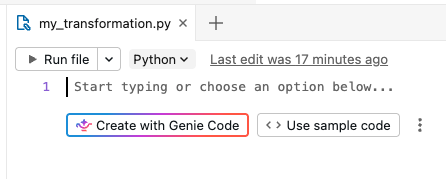

   Für weitere, fortgeschrittene Optionen lässt sich das Kebab-Menü (rechts neben dem Button **Use sample code**) aufklappen:
   - **Add existing source code:** Die Pipeline mit bereits im Workspace vorhandenen Code-Dateien verknüpfen, einschließlich Git-Ordnern.
   - **Set up as source controlled:** Ein Declarative-Automation-Bundles-Projekt für Versionskontrolle und CI/CD-Unterstützung verwenden.
   - **Use Hive metastore:** Eine Pipeline mit Legacy-Einstellungen erstellen.

**Hinweis zur Terminologie:** "Declarative Automation Bundles" ist der neue Name für die zuvor als **Databricks Asset Bundles** bekannte Funktion. Das Tool unterstützt Software-Engineering-Best-Practices wie Versionskontrolle, Code-Reviews, Tests und CI/CD für Daten- und KI-Projekte.

Alternativ lässt sich eine ETL-Pipeline auch über den Workspace-Browser erstellen:

1. In der linken Seitenleiste auf **Workspace** klicken.
2. Einen beliebigen Ordner auswählen, einschließlich Git-Ordnern.
3. Oben rechts auf **Create** und dann auf **ETL pipeline** klicken.

Ebenso lässt sich eine ETL-Pipeline über die Jobs-und-Pipelines-Seite erstellen:

1. Im Workspace in der Seitenleiste auf **Jobs & Pipelines** klicken.
2. Unter **New** auf **ETL Pipeline** klicken.

**Tipp:** Die Databricks CLI bietet Befehle, um Pipelines über ein Terminal zu erstellen, zu ändern und zu verwalten (siehe die `pipelines`-Befehlsgruppe der CLI-Referenz).

---

## <a id="pipeline-oeffnen">4. Eine bestehende ETL-Pipeline öffnen</a>

Es gibt mehrere Wege, eine bestehende ETL-Pipeline im Lakeflow Pipelines Editor zu öffnen:

- **Eine beliebige, der Pipeline zugeordnete Quelldatei öffnen:**
  1. In der Seitenleiste auf **Workspace** klicken.
  2. Zu einem Ordner mit Quellcode-Dateien der Pipeline navigieren.
  3. Auf die Quellcode-Datei klicken, um die Pipeline im Editor zu öffnen.
- **Eine zuletzt bearbeitete Pipeline öffnen:**
  - Im Editor lässt sich zu anderen, zuletzt bearbeiteten Pipelines navigieren, indem man auf den Namen der Pipeline oben im Asset-Browser klickt und eine andere Pipeline aus der erscheinenden Liste zuletzt verwendeter Pipelines auswählt.
  - Außerhalb des Editors lässt sich über die Seite **Recents** in der linken Seitenleiste eine Pipeline oder eine als Quellcode einer Pipeline konfigurierte Datei öffnen.
- **Beim Betrachten einer Pipeline an anderer Stelle im Produkt zum Bearbeiten wechseln:**
  - Auf der Pipeline-Monitoring-Seite auf **Edit pipeline** klicken.
  - Auf der Seite **Jobs & Pipelines** in der linken Seitenleiste auf das Stift-Symbol klicken, um die Pipeline zu bearbeiten.
  - Beim Bearbeiten eines Jobs mit einer Pipeline-Aufgabe lässt sich beim Auswählen einer Pipeline unter **Pipeline** auf das Symbol "In neuem Tab öffnen" klicken.
- Wird im Asset-Browser unter **All files** eine Quellcode-Datei einer anderen Pipeline geöffnet, erscheint oben im Editor ein Banner, das anbietet, die zugehörige Pipeline zu öffnen.

---

## <a id="asset-browser">5. Der Pipeline-Asset-Browser</a>

Beim Bearbeiten einer Pipeline nutzt die linke Workspace-Seitenleiste einen speziellen Modus, den sogenannten **Pipeline-Asset-Browser**. Standardmäßig fokussiert der Pipeline-Asset-Browser auf den Pipeline-Root sowie Ordner und Dateien innerhalb dieses Roots. Man kann auch **All files** wählen, um Dateien außerhalb des Pipeline-Root zu sehen. Die im Pipeline-Editor beim Bearbeiten einer bestimmten Pipeline geöffneten Tabs werden gespeichert; wechselt man zu einer anderen Pipeline, werden die beim letzten Bearbeiten dieser Pipeline geöffneten Tabs wiederhergestellt.

**Hinweis:** Der Editor besitzt außerdem einen eigenen Kontext zum Bearbeiten von SQL-Dateien (genannt **Databricks SQL Editor**) sowie einen allgemeinen Kontext zum Bearbeiten von Workspace-Dateien, die weder SQL- noch Pipeline-Dateien sind. Jeder dieser Kontexte merkt sich die zuletzt in ihm geöffneten Tabs und stellt sie wieder her. Der Kontext lässt sich oben in der linken Seitenleiste wechseln: durch Klick auf die Kopfzeile kann zwischen Workspace, SQL Editor oder zuletzt bearbeiteten Pipelines gewählt werden.

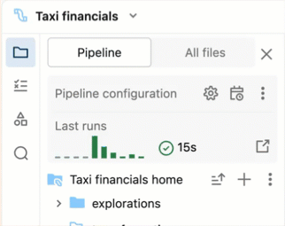

Öffnet man eine Datei über die Workspace-Browser-Seite, öffnet sie sich im dazu passenden Editor. Ist die Datei einer Pipeline zugeordnet, ist das der Lakeflow Pipelines Editor.

Um eine Datei zu öffnen, die nicht Teil der Pipeline ist, dabei aber den Pipeline-Kontext beizubehalten, öffnet man die Datei über den **All files**-Tab des Asset-Browsers.

Der Pipeline-Asset-Browser besitzt zwei Tabs:

- **Pipeline:** Hier finden sich alle der Pipeline zugeordneten Dateien. Sie lassen sich erstellen, löschen, umbenennen und in Ordnern organisieren. Dieser Tab enthält außerdem Shortcuts zur Pipeline-Konfiguration und eine grafische Übersicht der letzten Ausführungen.
- **All files:** Hier sind alle übrigen Workspace-Assets verfügbar. Nützlich, um Dateien zu finden, die der Pipeline hinzugefügt werden sollen, oder um andere, mit der Pipeline verwandte Dateien einzusehen — etwa eine YAML-Datei, die ein Declarative-Automation-Bundles-Projekt definiert.

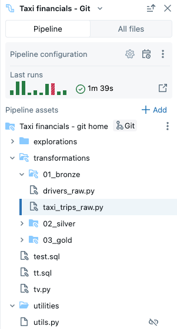

Es gibt zwei Arten von Dateien in der Pipeline:

- **Quellcode-Dateien (Source code files):** Diese Dateien sind Teil der Quellcode-Definition der Pipeline, einsehbar unter **Settings**. Databricks empfiehlt, Quellcode-Dateien stets innerhalb des Pipeline-Root-Ordners zu speichern; andernfalls werden sie in einem Abschnitt für externe Dateien am unteren Rand des Browsers angezeigt und haben einen eingeschränkteren Funktionsumfang.
- **Nicht-Quellcode-Dateien (Non-source code files):** Diese Dateien liegen innerhalb des Pipeline-Root-Ordners, sind aber nicht Teil der Quellcode-Definition der Pipeline.

**Wichtiger Hinweis:** Zur Verwaltung von Dateien und Ordnern der Pipeline muss der Pipeline-Asset-Browser unter dem Tab **Pipeline** verwendet werden. Nur so werden die Pipeline-Einstellungen korrekt aktualisiert. Werden Dateien und Ordner stattdessen über den Workspace-Browser oder den Tab **All files** verschoben oder umbenannt, wird die Pipeline-Konfiguration beschädigt und muss anschließend manuell unter **Settings** behoben werden.

### Root-Ordner

Der Pipeline-Asset-Browser ist an einem Pipeline-Root-Ordner verankert. Beim Erstellen einer neuen Pipeline wird der Root-Ordner im persönlichen Home-Ordner des Nutzers angelegt.

Der Root-Ordner lässt sich im Pipeline-Asset-Browser ändern — nützlich, wenn eine Pipeline zunächst in einem Ordner erstellt wurde und später alles in einen anderen Ordner verschoben werden soll, etwa um den Quellcode zur Versionskontrolle in einen Git-Ordner zu verlegen.

1. Auf das Kebab-Menü (Overflow-Menü) des Root-Ordners klicken.
2. **Configure new root folder** anklicken.
3. Unter **Pipeline root folder** auf das Ordner-Symbol klicken und einen anderen Ordner als Pipeline-Root-Ordner wählen.
4. Auf **Save** klicken.

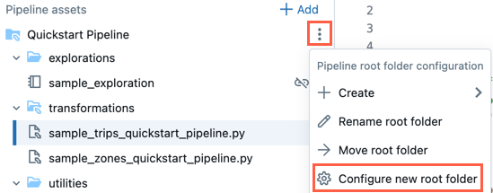

Im Kebab-Menü des Root-Ordners lässt sich außerdem über **Rename root folder** der Ordnername ändern sowie über **Move root folder** der Root-Ordner verschieben, zum Beispiel in einen Git-Ordner.

Der Pipeline-Root-Ordner lässt sich alternativ auch über die Einstellungen ändern:

1. Auf **Settings** klicken.
2. Unter **Code assets** auf **Configure paths** klicken.
3. Unter **Pipeline root folder** auf das Ordner-Symbol klicken, um den Ordner zu ändern.
4. Auf **Save** klicken.

**Hinweis:** Ändert man den Pipeline-Root-Ordner, wirkt sich das auf die vom Pipeline-Asset-Browser angezeigte Dateiliste aus — die Dateien im vorherigen Root-Ordner werden dann als externe Dateien angezeigt.

#### Bestehende Pipeline ohne Root-Ordner

Eine bestehende Pipeline, die mit der Legacy-Notebook-Entwicklungserfahrung erstellt wurde, verfügt über keinen konfigurierten Root-Ordner. Öffnet man eine Pipeline ohne konfigurierten Root-Ordner und möchte diesen konfigurieren:

1. Im Pipeline-Asset-Browser auf **Configure** klicken.
2. Auf das Ordner-Symbol klicken, um den Root-Ordner unter **Pipeline root folder** auszuwählen.
3. Auf **Save** klicken.

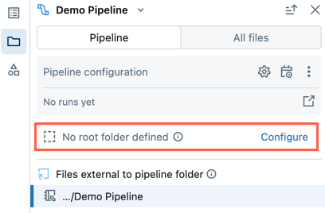

### Standard-Ordnerstruktur

Beim Erstellen einer neuen Pipeline wird eine Standard-Ordnerstruktur angelegt. Dies ist die von Databricks empfohlene Struktur zur Organisation der Quellcode- und Nicht-Quellcode-Dateien der Pipeline. Eine kleine Anzahl an Beispieldateien wird ebenfalls in dieser Ordnerstruktur erzeugt.

| Ordnername | Empfohlener Inhalt |
|---|---|
| `<pipeline_root_folder>` | Root-Ordner, der alle Ordner und Dateien der Pipeline enthält. |
| `transformations` | Quellcode-Dateien, z. B. Python- oder SQL-Code-Dateien mit Tabellendefinitionen. |
| `explorations` | Nicht-Quellcode-Dateien, z. B. Notebooks, Queries und Dateien für explorative Datenanalyse. |
| `utilities` | Nicht-Quellcode-Dateien mit Python-Modulen, die aus anderen Code-Dateien importiert werden können. Wird als Sprache für den Beispielcode SQL gewählt, wird dieser Ordner nicht angelegt. |

Die Ordnernamen lassen sich umbenennen bzw. die Struktur an den eigenen Workflow anpassen. Um einen neuen Quellcode-Ordner hinzuzufügen:

1. Im Pipeline-Asset-Browser auf **Add** klicken.
2. Auf **Create pipeline source code folder** klicken.
3. Einen Ordnernamen eingeben und auf **Create** klicken.

### Beispiel: reale Multi-Datei-Pipeline-Struktur

In der Praxis wird der `transformations`-Ordner häufig in eine separate `.sql`-Datei je Medaillon-Schicht aufgeteilt — jede Datei enthält die `CREATE [OR REFRESH] STREAMING TABLE`- bzw. `CREATE MATERIALIZED VIEW`-Definitionen einer Schicht sowie ggf. zugehörige `CREATE FLOW`-Statements:

```
ecommerce_pipeline/
└── transformations/
    ├── bronze_ingestion.sql        -- Rohdaten-Ingestion (Streaming Tables, ggf. mehrere Flows)
    ├── silver_transformation.sql   -- Bereinigung/Transformation (Streaming Tables)
    └── gold_analytics.sql          -- Aggregationen (Materialized Views)
```

Diese Aufteilung ist keine Pflicht des Editors — Databricks wertet beim Pipeline-Lauf alle Quellcode-Dateien eines Ordners gemeinsam aus, sodass Tabellen aus verschiedenen Dateien einander referenzieren können (siehe Abschnitt 6 oben). Die Trennung nach Bronze/Silver/Gold in einzelne Dateien ist lediglich eine gängige Konvention zur Übersichtlichkeit größerer Pipelines mit mehreren Flows und Schichten.

In `bronze_ingestion.sql` wird die Bronze-Tabelle zusätzlich mit `TBLPROPERTIES ('pipelines.reset.allowed' = false)` versehen, um einen versehentlichen Full Refresh der Rohdaten-Tabelle zu verhindern — siehe [Properties.md](../12%20Unity%20Catalog%20und%20Schema-Verwaltung/Properties.md), Abschnitt 4, für die vollständige Dokumentation dieser Tabellen-Property.

### Quellcode-Dateien

Quellcode-Dateien sind Teil der Quellcode-Definition der Pipeline. Beim Ausführen der Pipeline werden diese Dateien ausgewertet. Dateien und Ordner, die Teil der Quellcode-Definition sind, besitzen ein spezielles Symbol mit einem kleinen, überlagerten Pipeline-Icon.

Um eine neue Quellcode-Datei hinzuzufügen:

1. Neben dem Root-Ordner auf das Plus-Symbol klicken.
2. Auf **Transformation** klicken.
3. Einen **Name** für die Datei eingeben und als **Language** **Python** oder **SQL** wählen.
4. Auf **Create** klicken.

Inline-Hilfen unterstützen dabei, mit Genie Code zu starten oder kurze Code-Snippets für den gewünschten Datensatztyp zu generieren (zum Beispiel materialisierte Sicht oder Streaming Table).

Der Ordner `transformations` für Quellcode wird beim Erstellen einer neuen Pipeline standardmäßig angelegt. Er ist der empfohlene Speicherort für Pipeline-Quellcode, etwa Python- oder SQL-Code-Dateien mit Tabellendefinitionen der Pipeline.

### Nicht-Quellcode-Dateien

Nicht-Quellcode-Dateien liegen innerhalb des Pipeline-Root-Ordners, sind aber nicht Teil der Quellcode-Definition der Pipeline. Diese Dateien werden beim Ausführen der Pipeline nicht ausgewertet. Nicht-Quellcode-Dateien können keine externen Dateien sein.

Anwendungsbeispiele:

- Notebooks für Ad-hoc-Explorationen, die auf Compute außerhalb des Lebenszyklus einer Pipeline ausgeführt werden.
- Python-Module, die nicht zusammen mit dem Quellcode ausgewertet werden sollen, es sei denn, sie werden explizit in den Quellcode-Dateien importiert.

Um eine neue Nicht-Quellcode-Datei hinzuzufügen:

1. Neben dem Root-Ordner auf das Plus-Symbol klicken.
2. Auf **Exploration** oder **Utility** klicken.
3. Einen **Name** für die Datei eingeben.
4. Auf **Create** klicken.

Beim Erstellen einer neuen Pipeline werden standardmäßig folgende Ordner für Nicht-Quellcode-Dateien angelegt:

| Ordnername | Beschreibung |
|---|---|
| `explorations` | Empfohlener Speicherort für Notebooks, Queries, Dashboards und andere Dateien, die man auf Compute außerhalb des Ausführungs-Lebenszyklus der Pipeline laufen lässt, wie man es normalerweise außerhalb einer Pipeline tun würde. |
| `utilities` | Empfohlener Speicherort für Python-Module, die über direkte Imports (`from <dateiname> import`) aus anderen Dateien importiert werden können, sofern ihr übergeordneter Ordner hierarchisch unterhalb des Root-Ordners liegt. |

Python-Module lassen sich auch aus Speicherorten außerhalb des Root-Ordners importieren; in diesem Fall muss der Ordnerpfad im Python-Code an `sys.path` angehängt werden:

```python
import sys, os
sys.path.append(os.path.abspath('<alternate_path_for_utilities>/utilities'))
from utils import *
```

### Externe Dateien

Der Abschnitt **External files** des Pipeline-Browsers zeigt Quellcode-Dateien, die außerhalb des Root-Ordners liegen.

Um eine externe Datei in den Root-Ordner zu verschieben, etwa in den Ordner `transformations`:

1. Im Asset-Browser für die Datei auf das Kebab-Menü klicken und **Move** wählen.
2. Den Zielordner auswählen und auf **Move** klicken.

### Dateien, die mehreren Pipelines zugeordnet sind

Ist eine Datei mehr als einer Pipeline zugeordnet, wird in der Kopfzeile der Datei ein Badge angezeigt. Es enthält die Anzahl der zugeordneten Pipelines und erlaubt das Wechseln zu den anderen Pipelines.

### Der Bereich "All files"

Neben dem Bereich **Pipeline** gibt es den Bereich **All files**, in dem sich jede beliebige Datei im Workspace öffnen lässt. Dort lässt sich:

- eine Datei außerhalb des Root-Ordners in einem Tab öffnen, ohne den Lakeflow Pipelines Editor zu verlassen;
- zu den Quellcode-Dateien einer anderen Pipeline navigieren und diese öffnen — dabei erscheint ein Banner mit der Option, den Editor-Fokus auf diese zweite Pipeline umzuschalten;
- Dateien in den Root-Ordner der Pipeline verschieben;
- Dateien außerhalb des Root-Ordners in die Quellcode-Definition der Pipeline aufnehmen.

---

## <a id="quelldateien-bearbeiten">6. Pipeline-Quelldateien bearbeiten</a>

Öffnet man eine Pipeline-Quelldatei über den Workspace-Browser oder den Pipeline-Asset-Browser, öffnet sie sich in einem Editor-Tab im Lakeflow Pipelines Editor. Werden weitere Dateien geöffnet, entstehen separate Tabs, sodass mehrere Dateien gleichzeitig bearbeitet werden können.

**Hinweis:** Öffnet man über den Workspace-Browser eine Datei, die keiner Pipeline zugeordnet ist, öffnet sich der Editor in einem anderen Kontext (entweder im allgemeinen **Workspace**-Editor oder, bei SQL-Dateien, im **SQL Editor**). Öffnet man dagegen über den **All files**-Tab des Pipeline-Asset-Browsers eine Nicht-Pipeline-Datei, öffnet sie sich in einem neuen Tab im Pipeline-Kontext.

Der Pipeline-Quellcode besteht aus mehreren Dateien. Standardmäßig liegen die Quelldateien im Ordner `transformations` des Pipeline-Asset-Browsers. Quellcode-Dateien können Python-Dateien (`*.py`) oder SQL-Dateien (`*.sql`) sein. Der Quellcode einer Pipeline kann eine Mischung aus Python- und SQL-Dateien enthalten, und Code in einer Datei kann eine in einer anderen Datei definierte Tabelle oder Sicht referenzieren.

Der Ordner `transformations` kann außerdem Markdown-Dateien (`*.md`) enthalten. Markdown-Dateien lassen sich für Dokumentation oder Notizen verwenden, werden beim Ausführen eines Pipeline-Updates jedoch ignoriert.

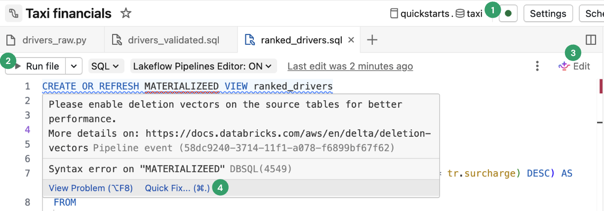

Folgende Funktionen sind spezifisch für den Lakeflow Pipelines Editor:

1. **Connect:** Verbindung zu Serverless- oder klassischem Compute herstellen, um die Pipeline auszuführen. Alle der Pipeline zugeordneten Dateien nutzen dieselbe Compute-Verbindung — ist die Verbindung einmal hergestellt, ist für andere Dateien derselben Pipeline keine erneute Verbindung nötig. Für Nicht-Pipeline-Dateien, etwa ein exploratives Notebook, ist die Connect-Option ebenfalls verfügbar, gilt dann aber nur für diese einzelne Datei.
2. **Run file:** Führt den Code aus, um die in dieser Quelldatei definierten Tabellen zu aktualisieren.
3. **Edit:** Nutzt Genie Code, um Code in der Datei zu bearbeiten oder hinzuzufügen.
4. **Quick fix:** Nutzt Genie Code, um Fehler zu beheben oder auf Insights im Code zu reagieren.

Das untere Panel passt sich je nach aktuellem Tab an. Pipeline-Informationen im unteren Panel sind stets verfügbar. Nicht der Pipeline zugeordnete Dateien, etwa SQL-Editor-Dateien, zeigen ihre Ausgabe ebenfalls im unteren Panel, aber in einem eigenen Tab.

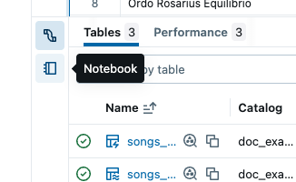

---

## <a id="code-ausfuehren">7. Pipeline-Code ausführen</a>

Es gibt fünf Optionen, um Pipeline-Code auszuführen:

**1. Alle Quellcode-Dateien der Pipeline ausführen**

Auf **Run pipeline** oder **Run pipeline with full table refresh** klicken, um alle Tabellendefinitionen in allen als Pipeline-Quellcode definierten Dateien auszuführen.

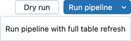

Zusätzlich lässt sich **Dry run** anklicken, um die Pipeline zu validieren, ohne Daten zu aktualisieren.

**2. Den Code einer einzelnen Datei ausführen**

Auf **Run file** oder **Run file with full table refresh** klicken, um alle Tabellendefinitionen der aktuellen Datei auszuführen. Andere Dateien der Pipeline werden dabei nicht ausgewertet.

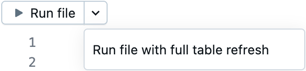

Diese Option eignet sich zum Debuggen beim schnellen Bearbeiten und Iterieren einer Datei. Beim Ausführen nur einer einzelnen Datei gibt es Nebeneffekte:

- Da andere Dateien nicht ausgewertet werden, werden Fehler in diesen Dateien nicht gefunden.
- In anderen Dateien materialisierte Tabellen nutzen die zuletzt materialisierte Version der Tabelle, selbst wenn aktuellere Quelldaten vorliegen.
- Es kann zu Fehlern kommen, wenn eine referenzierte Tabelle noch nicht materialisiert wurde.
- Der Pipeline-Graph kann für Tabellen in noch nicht materialisierten anderen Dateien unvollständig oder inkorrekt dargestellt sein. Databricks bemüht sich, den Graphen korrekt zu halten, wertet dafür aber keine anderen Dateien aus.

Nach dem Debuggen und Bearbeiten einer Datei empfiehlt Databricks, alle Quellcode-Dateien der Pipeline auszuführen, um zu überprüfen, dass die Pipeline End-to-End funktioniert, bevor sie produktiv gesetzt wird.

**3. Den Code für eine einzelne Tabelle ausführen**

Neben der Definition einer Tabelle in der Quellcode-Datei auf das Symbol **Run table icon** klicken und im Dropdown entweder **Refresh table** oder **Full refresh table** wählen. Das Ausführen des Codes für eine einzelne Tabelle hat ähnliche Nebeneffekte wie das Ausführen einer einzelnen Datei.

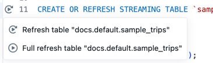

**Hinweis:** Das Ausführen des Codes für eine einzelne Tabelle ist für Streaming Tables und materialisierte Sichten verfügbar. Sinks und (reguläre) Views werden nicht unterstützt.

**4. Den Code für eine Auswahl von Tabellen ausführen**

Tabellen lassen sich im Pipeline-Graph auswählen, um eine Liste auszuführender Tabellen zu erstellen. Dazu über die Tabelle im Pipeline-Graph hovern, das Kebab-Menü anklicken und **Select table for refresh** wählen. Nach der Auswahl der zu aktualisierenden Tabellen unten im Pipeline-Graph entweder die Option **Run** oder **Run with full refresh** wählen.

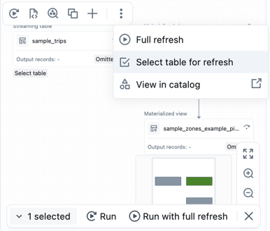

**5. Ausgewählten Code ausführen**

SQL-Code markieren und auf **Run selected code** klicken, um Ausgaben schnell zu inspizieren, ohne die Daten zu materialisieren. Die Ausgaben werden im Tab **Query Results** im unteren Panel angezeigt.

---

## <a id="pipeline-graph">8. Pipeline-Graph</a>

Nachdem alle Quellcode-Dateien der Pipeline ausgeführt oder validiert wurden, erscheint der **Pipeline-Graph**, auch als gerichteter azyklischer Graph (Directed Acyclic Graph, DAG) bezeichnet. Der Graph zeigt den Abhängigkeitsgraphen der Tabellen. Jeder Knoten durchläuft verschiedene Zustände im Pipeline-Lebenszyklus, etwa validiert, laufend oder fehlerhaft.

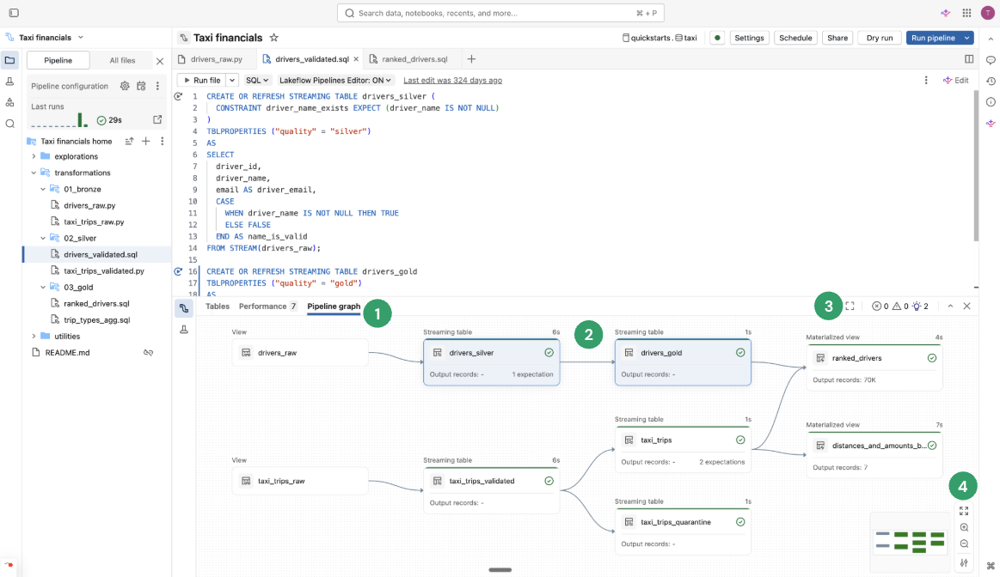

1. **Pipeline graph:** Der Graph lässt sich über den Tab **Pipeline graph** im unteren Panel öffnen.
2. **Knoten (Nodes):** Zeigen die Abhängigkeiten der zur Pipeline gehörenden Tabellen sowie zugehörige Metriken. Knoten, die zu den aktuell geöffneten Dateien gehören, sind im Graph hervorgehoben. Beim Hovern über einen Knoten erscheint eine Toolbar mit Optionen, unter anderem zum Aktualisieren der Query; Rechtsklick liefert dieselben Optionen als Kontextmenü. Ein Klick auf einen Knoten zeigt die Datenvorschau und die Tabellendefinition. Beim Bearbeiten einer Datei werden die darin definierten Tabellen im Graph hervorgehoben.
3. **Open in tab:** Um den Graph zu maximieren, oben rechts im unteren Panel auf das entsprechende Symbol klicken, um ihn in einem separaten Tab zu öffnen.
4. **Weitere Optionen:** Unten rechts finden sich weitere Optionen, darunter Zoom-Einstellungen sowie **More options** zum Anzeigen des Graphen in vertikaler oder horizontaler Ausrichtung.

---

## <a id="datenvorschauen">9. Datenvorschauen</a>

Der Bereich für Datenvorschauen zeigt Beispieldaten für eine ausgewählte Tabelle.

Eine Vorschau der Tabellendaten erscheint, sobald man auf einen Knoten im Pipeline-Graph klickt. Um zur Datenvorschau einer anderen Tabelle direkt im unteren Panel zu wechseln, wählt man **Back to graph** oder klickt, falls der Pipeline-Graph in einem separaten Tab geöffnet ist, auf einen anderen Knoten.

Alternativ lässt sich über den Bereich **Tables** und einen Klick auf **View data preview** navigieren. Wurde bereits eine Tabelle ausgewählt, führt ein Klick auf **All tables** zurück zur Gesamtübersicht.

Bei der Vorschau der Tabellendaten lassen sich die Daten direkt filtern und sortieren. Für komplexere Analysen lässt sich ein Notebook im Ordner **Explorations** verwenden oder erstellen (sofern die Standard-Ordnerstruktur beibehalten wurde). Quellcode in diesem Ordner wird standardmäßig bei einem Pipeline-Update nicht ausgeführt, sodass sich dort Queries erstellen lassen, ohne die Pipeline-Ausgabe zu beeinflussen.

---

## <a id="ausfuehrungs-insights">10. Ausführungs-Insights</a>

Ausführungs-Insights zum letzten Pipeline-Update lassen sich in den Panels am unteren Rand des Editors einsehen:

| Panel | Beschreibung |
|---|---|
| Tables | Listet alle Tabellen mit ihrem Status und ihren Metriken. Bei Auswahl einer Tabelle werden Metriken, Performance und ein Tab für die Datenvorschau angezeigt. Bei materialisierten Sichten zeigt die Spalte **Incrementalization**, wie die Tabelle aktualisiert wurde bzw. würde, und liefert Incrementalization-Insights. |
| Performance | Query-Historie und Profile für alle Flows der Pipeline. Während und nach der Ausführung sind Ausführungsmetriken und detaillierte Query-Pläne zugänglich. |
| Issues panel | Zeigt eine vereinfachte Übersicht über Fehler, Warnungen und Insights der Pipeline. Ein Klick auf einen Eintrag zeigt weitere Details und navigiert zur Stelle im Code, an der der Fehler aufgetreten ist; liegt der Fehler in einer anderen als der aktuell angezeigten Datei, springt man zur betreffenden Datei. **View details** zeigt den zugehörigen Event-Log-Eintrag mit vollständigen Details, **View logs** das vollständige Event Log. **Diagnose error** ermöglicht das Debuggen mit Genie Code. Code-nahe Fehleranzeigen markieren Fehler an der jeweiligen Code-Stelle; ein Klick auf das Fehler-Symbol oder Hovern über die rote Linie zeigt ein Pop-up mit weiteren Informationen; über **Quick fix** lassen sich Maßnahmen zur Fehlerbehebung anzeigen. |
| Event log | Alle während des letzten Pipeline-Laufs ausgelösten Ereignisse, zugänglich über **View logs** oder jeden Eintrag im Issues-Panel. |

---

## <a id="pipeline-konfiguration">11. Pipeline-Konfiguration</a>

Die Pipeline lässt sich direkt aus dem Pipeline-Editor konfigurieren — Änderungen an Einstellungen, Zeitplan (Schedule) oder Berechtigungen sind möglich. Jeder dieser Bereiche ist über einen Button in der Kopfzeile des Editors oder über Symbole im Asset-Browser (linke Seitenleiste) erreichbar.

- **Settings** (bzw. Zahnrad-Symbol im Asset-Browser): Im Einstellungs-Panel lassen sich allgemeine Informationen, Root-Ordner und Quellcode-Konfiguration, Compute-Konfiguration, Benachrichtigungen, erweiterte Einstellungen und mehr bearbeiten.
- **Schedule** (bzw. Kalender-Uhr-Symbol im Asset-Browser): Über den Schedule-Dialog lassen sich ein oder mehrere Zeitpläne für die Pipeline erstellen — etwa ein täglicher Lauf. Dabei wird ein Job erstellt, der die Pipeline nach dem gewählten Zeitplan ausführt. Zeitpläne lassen sich hinzufügen oder entfernen.
- **Share** (bzw. Share-Symbol im Kebab-Menü des Asset-Browsers): Über den Berechtigungsdialog der Pipeline lassen sich Berechtigungen für Nutzer und Gruppen verwalten.

### Event Log

Das Event Log einer Pipeline lässt sich in Unity Catalog veröffentlichen. Standardmäßig wird das Event Log der Pipeline in der UI angezeigt und ist für den Owner abfragbar.

1. **Settings** öffnen.
2. Neben **Advanced settings** auf den Pfeil klicken.
3. Auf **Edit advanced settings** klicken.
4. Unter **Event logs** auf **Publish to catalog** klicken.
5. Namen, Catalog und Schema für das Event Log angeben.
6. Auf **Save** klicken.

Die Pipeline-Ereignisse werden anschließend in die angegebene Tabelle veröffentlicht.

### Pipeline-Environment

Für den Quellcode lässt sich unter **Settings** eine Umgebung mit Abhängigkeiten erstellen.

1. **Settings** öffnen.
2. Unter **Pipeline environment** auf **Edit environment** klicken.
3. Auf **Add dependency** klicken, um eine Abhängigkeit hinzuzufügen — so, als würde man sie einer `requirements.txt`-Datei hinzufügen.

Databricks empfiehlt, die Version mit `==` zu fixieren (pinnen). Die Umgebung gilt für alle Quellcode-Dateien der Pipeline.

### Notifications

Benachrichtigungen lassen sich über die Pipeline-Einstellungen hinzufügen.

1. **Settings** öffnen.
2. Im Bereich **Notifications** auf **Add notification** klicken.
3. Eine oder mehrere E-Mail-Adressen sowie die gewünschten Ereignisse angeben.
4. Auf **Add notification** klicken.

**Hinweis:** Benutzerdefinierte Reaktionen auf Ereignisse, einschließlich Benachrichtigungen oder eigener Behandlung, lassen sich über Python-Event-Hooks erstellen.

---

## <a id="pipelines-ueberwachen">12. Pipelines überwachen</a>

Databricks bietet zudem Funktionen zur Überwachung laufender Pipelines. Der Editor zeigt Ergebnisse und Ausführungs-Insights zum jeweils letzten Lauf und ist darauf ausgelegt, effizientes, interaktives Iterieren während der Entwicklung zu unterstützen.

Die Pipeline-Monitoring-Seite erlaubt die Ansicht historischer Läufe — nützlich, wenn eine Pipeline über einen Job nach Zeitplan läuft.

**Hinweis:** Es gibt eine Standard-Monitoring-Erfahrung sowie eine aktualisierte Preview-Monitoring-Erfahrung.

Die Monitoring-Erfahrung ist über den Button **Jobs & Pipelines** links im Workspace zugänglich. Aus dem Editor lässt sich auch direkt über die Ausführungsergebnisse im Pipeline-Asset-Browser zur Monitoring-Seite springen.

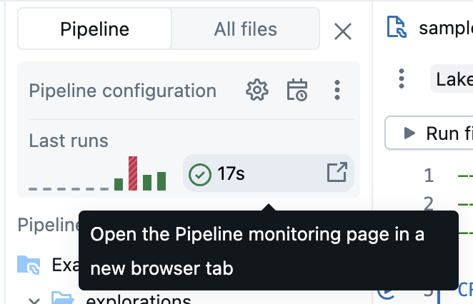

Die Monitoring-UI erlaubt über **Edit pipeline** in der Kopfzeile die Rückkehr zum Lakeflow Pipelines Editor.

---

## <a id="genie-code">13. Genie Code für die Pipeline-Entwicklung</a>

**Hinweis:** Dieses Feature befindet sich in der Public Preview.

Der Lakeflow Pipelines Editor ist mit Genie Code integriert, das ganze Pipelines direkt aus natürlicher Sprache generieren, verändern und debuggen kann.

---

## <a id="einschraenkungen">14. Einschränkungen und bekannte Probleme</a>

Für den ETL-Pipeline-Editor gelten folgende Einschränkungen und bekannten Probleme:

1. Die Workspace-Browser-Seitenleiste fokussiert nicht automatisch auf die Pipeline, wenn man zunächst eine Datei im Ordner `explorations` oder ein Notebook öffnet, da diese Dateien bzw. Notebooks nicht Teil der Quellcode-Definition der Pipeline sind. Um in den Pipeline-Fokus-Modus im Workspace-Browser zu gelangen, muss eine der Pipeline zugeordnete Datei geöffnet werden.
2. Datenvorschauen werden für reguläre Views (nicht materialisiert) nicht unterstützt.
3. Python-Module werden innerhalb einer UDF nicht gefunden, selbst wenn sie im Root-Ordner liegen oder sich auf `sys.path` befinden. Der Zugriff lässt sich ermöglichen, indem der Pfad innerhalb der UDF an `sys.path` angehängt wird, zum Beispiel:

   ```python
   sys.path.append(os.path.abspath("/Workspace/Users/path/to/modules"))
   ```
4. `%pip install` wird in Dateien (dem Standard-Asset-Typ des neuen Editors) nicht unterstützt. Abhängigkeiten lassen sich stattdessen unter Settings hinzufügen (siehe Abschnitt "Pipeline-Environment"). Alternativ lässt sich `%pip install` weiterhin in einem der Pipeline zugeordneten Notebook verwenden, das Teil der Quellcode-Definition ist.

---

## <a id="faq">15. FAQ</a>

**Warum Dateien statt Notebooks für Quellcode?**

Die zellenbasierte Ausführung von Notebooks ist mit Pipelines nicht kompatibel. Standardfunktionen von Notebooks sind bei der Arbeit mit Pipelines entweder deaktiviert oder verändert, was bei Nutzern, die mit dem gewohnten Notebook-Verhalten vertraut sind, zu Verwirrung führen kann. Im Lakeflow Pipelines Editor dient der Datei-Editor als Grundlage für einen vollwertigen Pipeline-Editor. Funktionen sind explizit auf Pipelines zugeschnitten, etwa **Run table**, statt vertraute Funktionen mit abweichendem Verhalten zu überladen.

**Lassen sich weiterhin Notebooks als Quellcode verwenden?**

Ja. Allerdings fehlen dabei manche Funktionen wie **Run table** oder **Run file**. Bestehende Pipelines mit Notebooks funktionieren weiterhin im neuen Editor; für neue Pipelines empfiehlt Databricks jedoch den Wechsel zu Dateien.

**Wie lässt sich bestehender Code zu einer neu erstellten Pipeline hinzufügen?**

Bestehende Quellcode-Dateien lassen sich einer neuen Pipeline hinzufügen. Um einen Ordner mit bestehenden Dateien hinzuzufügen:

1. Auf **Settings** klicken.
2. Unter **Source code** auf **Configure paths** klicken.
3. Auf **Add path** klicken und den Ordner mit den bestehenden Dateien auswählen.
4. Auf **Save** klicken.

Einzelne Dateien lassen sich ebenfalls hinzufügen:

1. Im Pipeline-Asset-Browser auf **All files** klicken.
2. Zur gewünschten Datei navigieren, das Kebab-Menü anklicken und **Include in pipeline** wählen.

Es empfiehlt sich, diese Dateien in den Pipeline-Root-Ordner zu verschieben; bleiben sie außerhalb, werden sie im Abschnitt **External files** angezeigt.

**Lässt sich der Pipeline-Quellcode in Git verwalten?**

Der Pipeline-Quellcode lässt sich in Git verwalten, indem beim initialen Erstellen der Pipeline ein Git-Ordner gewählt wird.

**Hinweis:** Die Verwaltung des Quellcodes in einem Git-Ordner sorgt für Versionskontrolle des Quellcodes. Um jedoch auch die Konfiguration zu versionieren, empfiehlt Databricks, Declarative Automation Bundles zu verwenden, um die Pipeline-Konfiguration in Bundle-Konfigurationsdateien zu definieren, die in Git (oder einem anderen Versionskontrollsystem) gespeichert werden können.

Wurde die Pipeline nicht bereits initial in einem Git-Ordner erstellt, lässt sich der Quellcode nachträglich in einen Git-Ordner verschieben. Databricks empfiehlt dafür die Editor-Aktion zum Verschieben des gesamten Root-Ordners in einen Git-Ordner, da dadurch alle Einstellungen entsprechend aktualisiert werden (siehe Abschnitt "Root-Ordner"). Im Pipeline-Asset-Browser dazu:

1. Kebab-Menü des Root-Ordners anklicken.
2. **Move root folder** anklicken.
3. Einen neuen Speicherort für den Root-Ordner wählen und auf **Move** klicken.

Nach dem Verschieben erscheint neben dem Namen des Root-Ordners das vertraute Git-Symbol.

**Wichtiger Hinweis:** Um den Pipeline-Root-Ordner zu verschieben, müssen der Pipeline-Asset-Browser und die oben beschriebenen Schritte verwendet werden. Ein anderweitiges Verschieben beschädigt die Pipeline-Konfiguration; der korrekte Ordnerpfad muss dann manuell unter **Settings** konfiguriert werden.

**Können mehrere Pipelines denselben Root-Ordner nutzen?**

Das ist möglich, Databricks empfiehlt jedoch, pro Root-Ordner nur eine einzige Pipeline zu betreiben.

**Wann sollte ein Dry Run ausgeführt werden?**

Auf **Dry run** klicken, um den Code zu überprüfen, ohne die Tabellen zu aktualisieren.

**Wann sollten temporäre Views und wann materialisierte Sichten im Code verwendet werden?**

Temporäre Views eignen sich, wenn die Daten nicht materialisiert werden sollen — zum Beispiel als Zwischenschritt einer Schrittfolge zur Datenaufbereitung, bevor die Daten über eine Streaming Table oder materialisierte Sicht im Catalog registriert und materialisiert werden.
