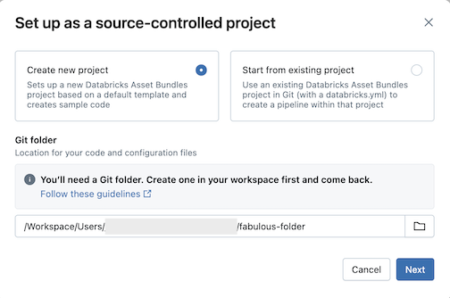
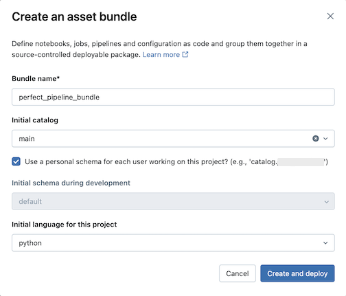
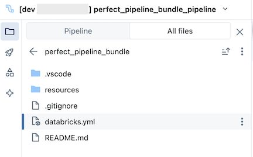
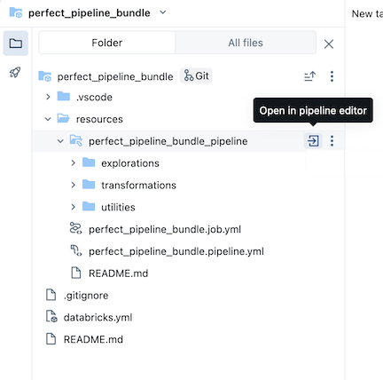
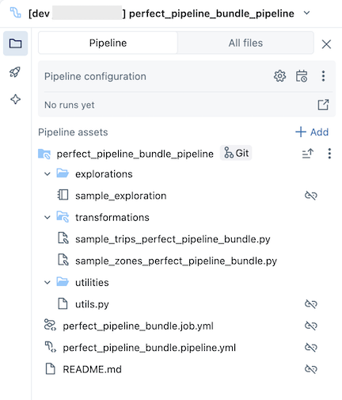
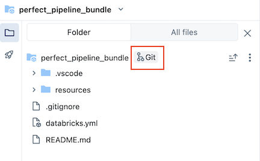
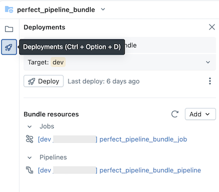

# Source Control für Lakeflow Declarative Pipelines — Referenz

Dieses Dokument fasst zusammen, wie sich Lakeflow Declarative Pipelines (LDP) über Databricks Declarative Automation Bundles (früher Databricks Asset Bundles, DABs) source-controllen lassen. Jede faktische Aussage wurde per `WebFetch` gegen die offizielle Databricks-Online-Dokumentation verifiziert; die AWS-Seite lieferte zunächst nur zusammengefasste Auszüge, weshalb zusätzlich die Azure/Microsoft-Learn-Spiegelseite abgerufen wurde, die den vollständigen Roh-Markdown-Text der Seite lieferte (inklusive aller Bilder, Hinweisboxen und Links). Alle wörtlichen Zitate stammen aus diesem vollständigen Abruf; Abweichungen zwischen AWS- und Azure-Fassung (z. B. "Databricks" vs. "Azure Databricks") sind rein produktbezogen und wurden im Fließtext neutral als "Databricks" wiedergegeben.

## Abschnittsübersicht

1. [Grundidee und Nutzen](#grundidee)
2. [Verhältnis zwischen Bundle und Pipeline](#verhaeltnis)
3. [Voraussetzungen](#voraussetzungen)
4. [Eine neue Pipeline in einem Bundle erstellen](#neue-pipeline)
5. [Das Pipeline-Bundle erkunden](#bundle-erkunden)
6. [Die Pipeline ausführen](#pipeline-ausfuehren)
7. [Die Pipeline aktualisieren](#pipeline-aktualisieren)
8. [Eine bestehende Pipeline zu einem Bundle hinzufügen](#bestehende-pipeline)
9. [Quellen](#quellen)

---

## <a id="grundidee">1. Grundidee und Nutzen</a>

In Databricks lässt sich eine Pipeline und der gesamte mit ihr verbundene Code source-controllen. Durch das Source-Controlling aller mit der Pipeline verbundenen Dateien werden Änderungen am Transformationscode, am Explorations-Code und an der Pipeline-Konfiguration alle in Git versioniert und können in der Entwicklung getestet sowie zuversichtlich in die Produktion deployt werden.

Eine source-controllte Pipeline bietet laut Doku folgende Vorteile:

- **Traceability (Nachvollziehbarkeit):** Jede Änderung wird in der Git-Historie erfasst.
- **Testing (Testen):** Pipeline-Änderungen lassen sich in einem Entwicklungs-Workspace validieren, bevor sie in einen gemeinsam genutzten Produktions-Workspace befördert werden. Jeder Entwickler hat seine eigene Entwicklungs-Pipeline auf seinem eigenen Code-Branch in einem Git-Folder und in seinem eigenen Schema.
- **Collaboration (Zusammenarbeit):** Ist die individuelle Entwicklung und das Testen abgeschlossen, werden Code-Änderungen in die Haupt-Produktions-Pipeline gepusht.
- **Governance:** Ausrichtung an Enterprise-CI/CD- und Deployment-Standards.

Databricks erlaubt es, Pipelines und ihre Quelldateien gemeinsam über Declarative Automation Bundles source-zu-controllen. Mit Bundles wird die Pipeline-Konfiguration in Form von YAML-Konfigurationsdateien neben den Python- oder SQL-Quelldateien einer Pipeline source-controllt. Ein Bundle kann eine oder mehrere Pipelines enthalten, ebenso wie weitere Ressourcentypen wie Jobs.

Diese Seite zeigt, wie eine source-controllte Pipeline mithilfe von Declarative Automation Bundles (früher bekannt als Databricks Asset Bundles) eingerichtet wird.

## <a id="verhaeltnis">2. Verhältnis zwischen Bundle und Pipeline</a>

Ein zentraler, wörtlich zitierter Hinweis der Doku stellt klar, wie Bundle und Pipeline zueinander stehen:

> "Ein Bundle ist kein eigenständiges Extract-Transform-Load-(ETL-)Framework und keine Alternative zu Lakeflow-Pipelines. Es ist ein Packaging- und Deployment-Format: der Projekt- und CI/CD-Wrapper um die Pipeline herum. Die Datenlogik verbleibt in Lakeflow-Pipelines (`@dp.table`, `CREATE STREAMING TABLE`, Expectations und `AUTO CDC`), und das Bundle definiert, wie dieser Code in einen Workspace und über Umgebungen hinweg deployt wird. Beides wird zusammen verwendet: Lakeflow-Pipelines für das, was die Pipeline tut, und ein Bundle für das, wie sie ausgeliefert wird."

## <a id="voraussetzungen">3. Voraussetzungen</a>

Um eine source-controllte Pipeline zu erstellen, muss bereits vorhanden sein:

- Ein im Workspace erstellter und konfigurierter Git-Folder. Ein Git-Folder erlaubt es einzelnen Nutzern, Änderungen zu autorisieren und zu testen, bevor sie in ein Git-Repository committet werden.
- Der Lakeflow Pipelines Editor.
- Für den vollständigen Satz an Privilegien, die zum Erstellen, Ausführen, Refreshen und Anzeigen von Pipelines und ihrer Ausgabe erforderlich sind, verweist die Doku auf die Seite zur Verwaltung von Identitäten, Berechtigungen und Privilegien für Pipelines.

## <a id="neue-pipeline">4. Eine neue Pipeline in einem Bundle erstellen</a>

Databricks empfiehlt, eine Pipeline zu erstellen, die von Anfang an source-controllt ist. Alternativ kann eine bestehende Pipeline zu einem bereits source-controllten Bundle hinzugefügt werden (siehe Abschnitt 8).

Um eine neue source-controllte Pipeline zu erstellen:

1. Oben in der Sidebar auf **New** klicken und dann **ETL pipeline** auswählen.
2. Beliebige Änderungen am Pipeline-Namen oder Schema vornehmen.
3. Das Kebab-Menü (rechts neben dem Button **Use sample code**) anklicken und **Set up as source-controlled** auswählen.
4. **Create new project** klicken, dann einen Git-Folder auswählen, in den Code und Konfiguration abgelegt werden sollen:

   
5. **Next** klicken.
6. Im Dialog **Create an asset bundle** Folgendes eingeben:
   - **Bundle name**: Der Name des Bundles.
   - **Initial catalog**: Der Name des Katalogs, der das zu verwendende Schema enthält.
   - **Use a personal schema**: Diese Checkbox angehakt lassen, wenn Änderungen auf ein persönliches Schema isoliert werden sollen, sodass Nutzer, die gemeinsam an demselben Projekt arbeiten, sich in der Entwicklung nicht gegenseitig überschreiben.
   - **Initial language**: Die anfängliche Sprache für die Beispiel-Pipeline-Dateien des Projekts, entweder Python oder SQL.

   
7. **Create and deploy** klicken. Ein Bundle mit einer Pipeline wird im Git-Folder erstellt.

## <a id="bundle-erkunden">5. Das Pipeline-Bundle erkunden</a>

Das Bundle, das sich im Git-Folder befindet, enthält Bundle-Systemdateien und die Datei `databricks.yml`, die Variablen, Ziel-Workspace-URLs und Berechtigungen sowie weitere Einstellungen für das Bundle definiert. Da `databricks.yml` im Bundle-Root liegt (dem übergeordneten Verzeichnis des Pipeline-Roots), muss zum Tab **All files** im Pipeline-Asset-Browser gewechselt werden, um sie zu sehen. Der Ordner `resources` eines Bundles ist der Ort, an dem Definitionen für Ressourcen wie Pipelines und Jobs enthalten sind.

Den Ordner `resources` öffnen, dann den Pipeline-Editor-Button anklicken, um die source-controllte Pipeline anzuzeigen:

Das Beispiel-Pipeline-Bundle enthält folgende Dateien:

- Ein Beispiel-Explorations-Notebook
- Zwei Beispiel-Code-Dateien, die Transformationen auf Tabellen durchführen
- Eine Beispiel-Code-Datei, die eine Utility-Funktion enthält
- Eine Job-Konfigurations-YAML-Datei, die den Job im Bundle definiert, der die Pipeline ausführt
- Eine Pipeline-Konfigurations-YAML-Datei, die die Pipeline definiert

  **Wichtig:** Diese Datei muss bearbeitet werden, um Konfigurationsänderungen an der Pipeline dauerhaft zu persistieren — einschließlich Änderungen, die über die UI vorgenommen wurden —, andernfalls werden UI-Änderungen beim erneuten Deployen des Bundles überschrieben. Um beispielsweise einen anderen Standard-Katalog für die Pipeline festzulegen, muss das Feld `catalog` in dieser Konfigurationsdatei bearbeitet werden.
- Eine README-Datei mit zusätzlichen Details zum Beispiel-Pipeline-Bundle und Anweisungen, wie die Pipeline ausgeführt wird

## <a id="pipeline-ausfuehren">6. Die Pipeline ausführen</a>

Es lassen sich entweder einzelne Transformationen oder die gesamte source-controllte Pipeline ausführen:

- Um eine einzelne Transformation in der Pipeline auszuführen und in der Vorschau anzuzeigen, wird die Transformationsdatei im Workspace-Browser-Baum ausgewählt, um sie im Datei-Editor zu öffnen. Oben in der Datei im Editor wird der Play-Button **Run file** angeklickt.
- Um alle Transformationen in der Pipeline auszuführen, wird der Button **Run pipeline** oben rechts im Databricks-Workspace angeklickt.

## <a id="pipeline-aktualisieren">7. Die Pipeline aktualisieren</a>

Artefakte in der Pipeline lassen sich aktualisieren oder zusätzliche Explorationen und Transformationen hinzufügen — anschließend müssen diese Änderungen aber nach GitHub gepusht werden. Dazu wird das **Git**-Icon, das mit dem Pipeline-Bundle verknüpft ist, angeklickt, oder das Kebab-Menü des Ordners und dann **Git...**, um auszuwählen, welche Änderungen gepusht werden sollen.

Zusätzlich gilt: Wenn Pipeline-Konfigurationsdateien aktualisiert oder Dateien im Bundle hinzugefügt oder entfernt werden, werden diese Änderungen erst dann in den Ziel-Workspace propagiert, wenn das Bundle explizit deployt wird.

**Hinweis der Doku:** Databricks empfiehlt, das Standard-Setup für source-controllte Pipelines beizubehalten. Das Standard-Setup ist so konfiguriert, dass die YAML-Konfiguration des Pipeline-Bundles nicht bearbeitet werden muss, wenn über die UI zusätzliche Dateien hinzugefügt werden.

## <a id="bestehende-pipeline">8. Eine bestehende Pipeline zu einem Bundle hinzufügen</a>

Um eine bestehende Pipeline zu einem Bundle hinzuzufügen, wird zunächst ein Bundle im Workspace erstellt, dann die Pipeline-YAML-Definition zum Bundle hinzugefügt, wie auf folgenden Seiten beschrieben:

- Tutorial: Create and deploy a bundle in the workspace
- Add an existing resource to a bundle

Für Informationen dazu, wie Ressourcen über die Databricks CLI zu einem Bundle migriert werden, verweist die Doku auf die Seite "Migrate existing resources to a bundle".

---

## <a id="quellen">9. Quellen</a>

Beide Fassungen der Seite wurden am 19.08.2026 per `WebFetch` abgerufen. Die AWS-Fassung lieferte zunächst nur eine Zusammenfassung sowie die exakten Bild-URLs; der vollständige, wörtlich zitierbare Roh-Markdown-Text (inkl. aller Hinweisboxen, Bildunterschriften und Links) stammt aus dem Abruf der Azure/Microsoft-Learn-Spiegelseite. Beide Fassungen stimmen inhaltlich überein (produktbezogene Unterschiede wie "Databricks" vs. "Azure Databricks" ausgenommen).

- Create a source-controlled pipeline (AWS): https://docs.databricks.com/aws/en/ldp/source-controlled
- Create a source-controlled pipeline (Azure-Spiegelseite, für vollständigen Wortlaut und Bildunterschriften genutzt): https://learn.microsoft.com/en-us/azure/databricks/ldp/source-controlled

**Bilder:** Alle 7 auf der Seite eingebundenen Screenshots wurden erfolgreich heruntergeladen und liegen im Unterordner `images/` neben dieser Datei:

- `images/pipeline-source-controlled-create.png` ("New project"-Dialog)
- `images/pipeline-source-controlled-create-bundle.png` ("New bundle"-Dialog)
- `images/pipeline-source-controlled-bundle.png` (Bundle in einem Git-Folder)
- `images/pipeline-source-controlled-editor.png` (Pipeline-Editor öffnen)
- `images/pipeline-source-controlled-tree.png` (Bundle mit Pipeline-Baum)
- `images/pipeline-source-controlled-git.png` (Änderungen zu Git pushen)
- `images/pipeline-source-controlled-update.png` (Pipeline aktualisieren)

**Ungeklärt:** Keine offenen Punkte — beide Quellenabrufe stimmten inhaltlich vollständig überein, sodass keine Aussage als unverifiziert markiert werden musste.
