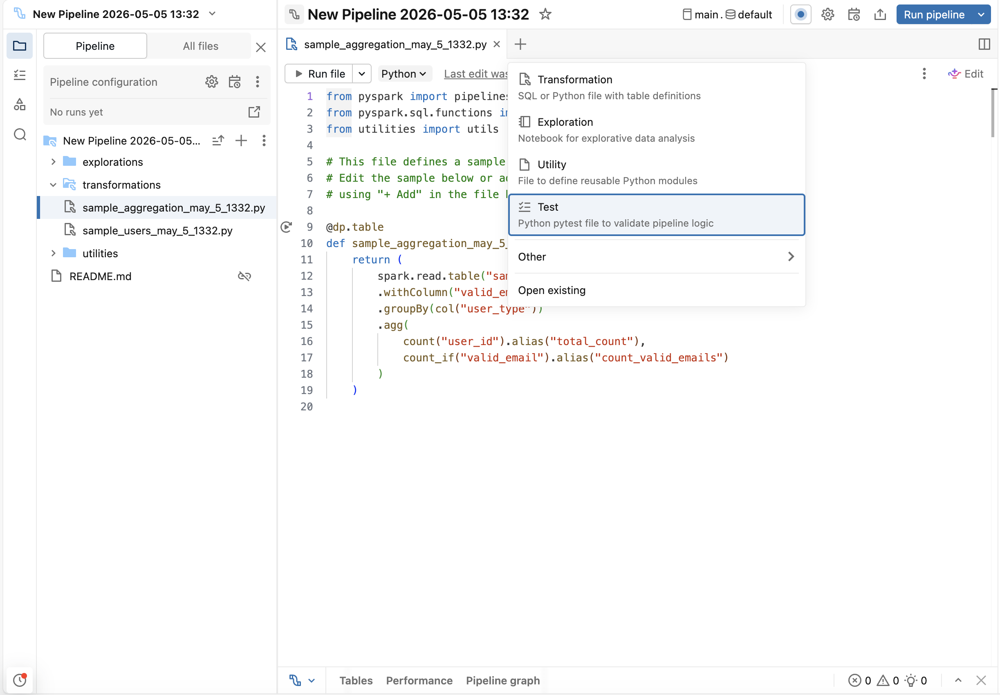
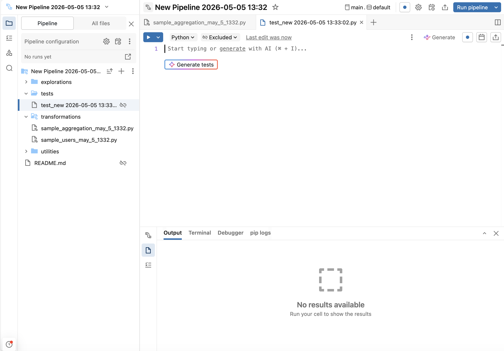
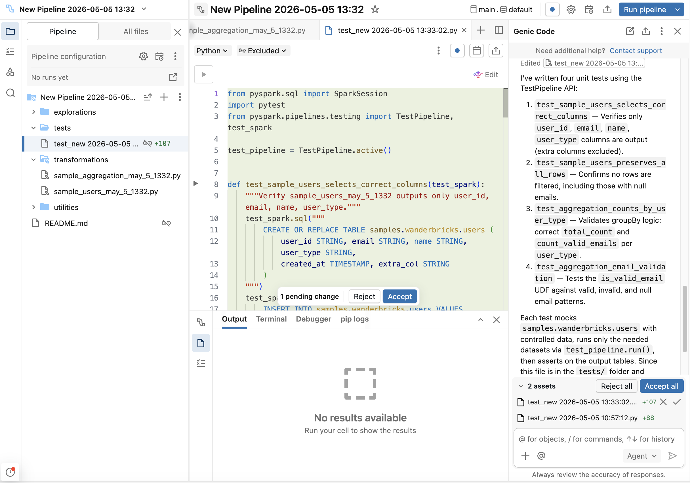

# Unit Testing für Pipelines — Referenz

Mit der Beta-Funktion "Unit testing for pipelines" lässt sich Python- oder SQL-Transformationslogik von Lakeflow Declarative Pipelines (LDP) im webbasierten Lakeflow Pipelines Editor mit Mock-Daten validieren.

## Abschnittsübersicht

1. [Überblick (Beta-Funktion)](#ueberblick)
2. [Wann Unit Testing verwenden](#wann-verwenden)
3. [Voraussetzungen](#voraussetzungen)
4. [Einschränkungen: Test-Isolation nur nach Tabellenname](#isolation-limits)
5. [Einschränkungen: Governance- und DDL-Operationen](#governance-limits)
6. [Einschränkungen: Betriebliche Grenzen](#operative-limits)
7. [Einschränkungen: Autorenschaft und Wiedergabetreue](#autoren-limits)
8. [Schritt 1: Pipeline-Einstellungen aktualisieren](#schritt1)
9. [Schritt 2: Testdatei erstellen](#schritt2)
10. [Schritt 3: Tests generieren](#schritt3)
11. [Schritt 4: Tests ausführen](#schritt4)
12. [Testing-APIs](#testing-apis)
13. [Mock-Daten erzeugen](#mock-daten)
14. [Die Pipeline oder einzelne Tabellen ausführen](#run-pipeline)
15. [Beispiel 1: Aggregationen (Zeilenzahl, Schema, Null-Handling)](#beispiel1)
16. [Beispiel 2: Auto CDC](#beispiel2)
17. [Beispiel 3: Auto CDC aus Snapshot](#beispiel3)
18. [Beispiel 4: Joins und Expectations](#beispiel4)

---

## <a id="ueberblick">1. Überblick (Beta-Funktion)</a>

**Diese Funktion befindet sich in Beta.**

Lakeflow-Pipelines unterstützen das Schreiben von Python-Unit-Tests im webbasierten Lakeflow Pipelines Editor. Damit lässt sich Python- oder SQL-Transformationslogik mit Mock-Daten validieren. Mit dem Pipeline-Testing-Framework lassen sich Edge Cases testen, proprietäre Pipeline-APIs validieren (Auto CDC, Streaming Tables, Expectations, Append Flows) und mit Mock-Eingaben für unterstützte tabellenbasierte Operationen iterieren. Die Einschränkungen zur Isolation sollten vor dem Ausführen von Tests geprüft werden (siehe Abschnitte 4–7).

Kernfähigkeiten:

- **Isolierte Testausführung**: Das Framework stellt eine SparkSession bereit, die Tabellenoperationen in ein temporäres Test-Schema im Standardkatalog der Pipeline umleitet, sodass Eingabedaten gemockt und Testausgaben geschrieben werden können, ohne produktive Tabellen zu beeinflussen. Die Isolation gilt für Operationen, die eine Tabelle über ihren Namen referenzieren.
- **Flexibler Testumfang**: Ein Teilbereich einer Pipeline (einzelne Tabellen, Ketten abhängiger Tabellen oder ganze Pipelines) lässt sich auf der Compute der Pipeline über die Test-SparkSession ausführen.
- **Ergebnisvalidierung**: Die Ergebnisse isolierter Ausgabetabellen, die in einem Test erzeugt wurden, lassen sich mit Standard-pytest-Assertions überprüfen.

---

## <a id="wann-verwenden">2. Wann Unit Testing verwenden</a>

Typische Anwendungsfälle:

- **Neue Transformationslogik validieren**: Prüfen, ob eine Transformation vor dem Lauf gegen Produktionsdaten das erwartete Schema, die erwarteten Zeilenzahlen, Aggregationen und Geschäftslogik liefert.
- **Auto-CDC-Spezifikationen testen**: Validieren, dass Auto-CDC-Flow-Definitionen Change-Events korrekt verarbeiten — Inserts, Updates, Deletes und SCD-Typen (Slowly Changing Dimension) — mit Mock-Daten.
- **Expectations und Datenqualitätsregeln testen**: Prüfen, dass Expectations fehlschlagen, wenn sie sollen, und bestehen, wenn die Daten gültig sind.
- **Über abhängige Tabellen hinweg testen**: Ketten von Transformationen (z. B. Bronze, Silver, Gold) testen, um zu validieren, dass Daten korrekt durch den Pipeline-Graphen fließen.

---

## <a id="voraussetzungen">3. Voraussetzungen</a>

Um Unit-Tests auszuführen, sind erforderlich:

- **Die Pipeline-Berechtigung `Owner`**, zusätzlich die Privilegien `USE CATALOG` und `CREATE SCHEMA` auf dem Standardkatalog der Pipeline. Das Framework benötigt diese Privilegien, um das temporäre Test-Schema anzulegen, in dem die Tests laufen.

  Um die Pipeline-Berechtigung zu prüfen oder zu setzen: Pipeline öffnen und auf **Share** klicken. Es muss der Pipeline-**Owner** (`IS OWNER`) sein — `CAN RUN` und `CAN MANAGE` reichen nicht aus, um Tests auszuführen.

  Um die Katalog-Privilegien zu prüfen oder zu setzen: Katalog im Catalog Explorer öffnen, Tab **Permissions** auswählen und `USE CATALOG` sowie `CREATE SCHEMA` bestätigen. Ein Katalog-Owner, ein Metastore-Admin oder ein Nutzer mit dem `MANAGE`-Privileg kann diese gewähren, auch per SQL:

  ```sql
  GRANT USE CATALOG, CREATE SCHEMA ON CATALOG <catalog_name> TO `<principal>`;
  ```

- Die Pipeline muss im **getriggerten (nicht-kontinuierlichen) Modus** konfiguriert sein.
- Die Pipeline muss auf dem **PREVIEW**-Channel sein. Unit Testing ist in Beta und nur auf PREVIEW verfügbar.
- **Spark Connect wird nicht unterstützt.**

---

## <a id="isolation-limits">4. Einschränkungen: Test-Isolation nur nach Tabellenname</a>

**Wichtiger Warnhinweis:** Manche Operationen umgehen die Test-Isolation und können echte Produktionsdaten oder -metadaten verändern. Die Test-Isolation deckt Tabellenoperationen ab, die eine Tabelle **über ihren Namen** referenzieren. Operationen, die die Isolation umgehen, können sowohl im eigenen Testcode als auch in beliebigem Pipeline-Code auftreten, der durch die ausgewählten Ausgaben ausgeführt wird — einschließlich transitiver Abhängigkeiten. Eine scheinbar sichere Testdatei kann trotzdem einen Pipeline-Flow ausführen, der über Pfad oder Connector liest oder schreibt und damit auf Produktionsdaten wirkt.

Um zu verhindern, dass Tests Produktionsdaten oder -metadaten beeinflussen, gelten folgende Regeln:

- Jede Tabelle über ihren Namen referenzieren (`catalog.schema.table`) und alle Eingaben über den Namen mocken. Nicht über Pfad lesen oder schreiben (`/Volumes/...`, `dbfs:/...`, `s3://...`, `abfss://...`) und nicht von Connectoren wie Kafka oder Auto Loader lesen — diese umgehen die Isolation und wirken auf reale Produktivsysteme.
  - **Über Pfad schreiben** (z. B. `df.write.save("/Volumes/...")`, ein `dbfs:/`-Pfad oder ein Cloud-/External-Location-Pfad wie `s3://...` oder `abfss://...`) schreibt in echten Produktionsspeicher und kann Produktionsdaten überschreiben.
  - **Über Pfad lesen** (z. B. `spark.read.load(path)` oder `spark.read.format("delta").load(path)`) liefert echte Produktionsdaten statt der Mock-Daten.
  - **Von einem Connector lesen** verbindet sich mit der echten Produktionsquelle. Das betrifft **Kafka** (liest von den echten Brokern) und **Auto Loader** (`cloudFiles`, liest vom echten Cloud-Speicherpfad). Keines von beidem wird zu den Mock-Daten umgeleitet.
- **Die Tabellenfunktion `event_log()` sollte in einem Pipeline-Unit-Test nicht verwendet werden.** Im Testmodus wird `event_log()` nicht zum Event-Log des Testlaufs umgeleitet — sie kann das Produktions- oder ein zuvor registriertes Event-Log zurückgeben, sodass Assertions dagegen unter Umständen Produktionsdaten lesen. Stattdessen sollte der von einem Testlauf zurückgegebene `event_log_table_name` verwendet und über `test_spark` abgefragt werden. `event_log_table_name` kann `None` sein (z. B. wenn der Name der Event-Log-Tabelle nicht aufgelöst werden kann) und sollte daher vor der Abfrage geprüft werden:

  ```python
  status = test_pipeline.run(test_spark, set(["catalog.schema.table"]))
  assert status.event_log_table_name is not None
  events = test_spark.table(status.event_log_table_name)
  ```

  `status.is_success` sollte nicht geprüft werden, bevor das Event-Log gelesen wird, wenn das Ziel ist, ein fehlgeschlagenes Update zu diagnostizieren — das Event-Log ist häufig genau das, was zur Fehleranalyse eines fehlgeschlagenen Updates herangezogen wird.

---

## <a id="governance-limits">5. Einschränkungen: Governance- und DDL-Operationen</a>

**Katalog-, Schema-, Berechtigungs-, Owner-, Tag- und Policy-Mutationen werden nicht unterstützt.** Das umfasst `CREATE`/`DROP`/`ALTER CATALOG`, `CREATE`/`DROP`/`ALTER SCHEMA` (einschließlich `SET MANAGED LOCATION`), `GRANT`/`REVOKE`, `ALTER ... OWNER TO`, `SET`/`UNSET TAGS` sowie `CREATE`/`DROP POLICY`. Manche SQL-Formen, die über `test_spark` ausgeführt werden, werden als zusätzliche Sicherheitsmaßnahme ("defense in depth") abgelehnt; andere Formen — oder dieselben Operationen über direkte APIs aufgerufen — können reale Produktionsobjekte erreichen. Diese Schutzmaßnahmen sollten nicht als Isolationsgrenze betrachtet werden. Solche Anweisungen sollten sowohl aus eigenem Testcode als auch aus jeglichem Pipeline-Code, der durch die ausgewählten Ausgaben ausgeführt wird, ferngehalten werden.

---

## <a id="operative-limits">6. Einschränkungen: Betriebliche Grenzen</a>

- **Parallele Ausführung wird nicht unterstützt**: Einen Test und ein Pipeline-Update gleichzeitig auszuführen ist nicht unterstützt, und das System verhindert es nicht. Es findet keine Koordination zwischen beiden statt, sodass paralleles Ausführen Ressourcen-Konflikte verursachen kann, die die Performance eines Produktions-Updates erheblich beeinträchtigen oder dazu führen können, dass der Test nicht startet. Ein Test sollte nicht gestartet werden, während die Pipeline ein Update ausführt (und umgekehrt) — es sollte gewartet werden, bis ein laufendes Update abgeschlossen ist, bevor Tests ausgeführt werden.
- **Temporäre Schemas nach abnormaler Beendigung**: Jeder Testlauf erzeugt ein temporäres Schema (benannt `redirecting_<id>`) im Standardkatalog der Pipeline und löscht es automatisch, sobald der Lauf beendet ist. Endet ein Lauf abnormal (z. B. weil die Compute verloren geht), kann das temporäre Schema zurückbleiben und die Mock- sowie Ausgabetabellen des Laufs enthalten — dies beeinträchtigt keine Produktionsdaten. Um Speicherplatz zurückzugewinnen, sollten übrig gebliebene Schemas mit dem Namenspräfix `redirecting_` im Standardkatalog der Pipeline manuell gelöscht werden.
- **Testläufe verbrauchen Compute**: Testläufe werden auf der Compute der Pipeline ausgeführt und wie normale Pipeline-Updates abgerechnet. Es gibt keine gesonderte Abrechnung für Testläufe.
- **Full Refresh wird nicht unterstützt**: Nur der selektive Refresh ist verfügbar. `test_pipeline.run()` aktualisiert die ausgewählten Ausgaben (oder alle Ausgaben, wenn keine Auswahl übergeben wird) — Full Refresh und Full-Refresh-Auswahl sind nicht implementiert.

---

## <a id="autoren-limits">7. Einschränkungen: Autorenschaft und Wiedergabetreue</a>

- **Nur Editor-Ausführung**: Tests müssen aus dem webbasierten Lakeflow Pipelines Editor heraus ausgeführt werden.
- **Nur Python-Tests**: Tests müssen in Python geschrieben werden. SQL-Pipelines lassen sich testen, aber die Tests selbst müssen in Python verfasst sein.
- **Governance-Wiedergabetreue**: Mock-Daten erben keine Row Filters oder Column Masks, die auf den produktiven Tabellen definiert sind, die sie ersetzen. Testergebnisse spiegeln die Mock-Eingaben exakt so wider, wie sie bereitgestellt wurden, und können sich davon unterscheiden, wie dieselbe Abfrage sich auf governance-geschützten Produktionsdaten verhalten würde.

---

## <a id="schritt1">8. Schritt 1: Pipeline-Einstellungen aktualisieren</a>

Die Pipeline muss auf dem **PREVIEW**-Channel im getriggerten Modus laufen.

1. In der UI die Pipeline öffnen und **Settings** → **Advanced settings** → **Channel** → **Preview** wählen.
2. **Pipeline mode** auf **Triggered** setzen (nicht Continuous verwenden).

Alternativ lässt sich die Pipeline-Einstellungs-JSON direkt bearbeiten:

```json
"continuous": false,
"channel": "PREVIEW"
```

---

## <a id="schritt2">9. Schritt 2: Testdatei erstellen</a>

Im Lakeflow Pipelines Editor auf die Schaltfläche **+** (Add) klicken und **Test** auswählen. Dadurch wird eine Testdatei erstellt (sowie der Ordner `tests`, falls er noch nicht existiert), die nicht zum Pipeline-Quellcode zählt. Der `tests`-Ordner muss nicht manuell angelegt werden.



---

## <a id="schritt3">10. Schritt 3: Tests generieren</a>

Genie Code kann Test-Scaffolding generieren:

- Innerhalb der Testdatei auf die Schaltfläche **Generate tests** klicken.

  

- Alternativ `/tests` im Genie-Code-Agent-Modus verwenden.

  

Genie Code sollte für das Boilerplate genutzt und anschließend für eigene Edge Cases angepasst werden.

Alternativ lässt sich der Testcode auch manuell schreiben. Dazu folgende Imports an den Anfang jeder Testdatei setzen:

```python
import pytest
from pyspark.pipelines.testing import TestPipeline, test_spark

test_pipeline = TestPipeline.active()
```

---

## <a id="schritt4">11. Schritt 4: Tests ausführen</a>

Tests werden aus dem Lakeflow Pipelines Editor heraus ausgeführt:

- Auf das Play-Symbol im Randbereich (Gutter) neben einer Testfunktion klicken, um einen einzelnen Test auszuführen.
- Auf **Run tests in file** oben in der Testdatei klicken, um alle Tests dieser Datei auszuführen.

Testergebnisse (Erfolg oder Fehlschlag) erscheinen im unteren Panel des Editors. Bei Fehlschlägen sollten die Assertion-Fehler zur Fehlersuche geprüft werden.

---

## <a id="testing-apis">12. Testing-APIs</a>

| API | Beschreibung |
|---|---|
| `TestPipeline.active()` | Gibt ein `TestPipeline`-Objekt für die aktuell im Lakeflow Pipelines Editor bearbeitete Pipeline zurück. Dieses Objekt ist eine Referenz auf die Pipeline einschließlich ihres Quellcodes, ihrer Konfigurationen, des Standardkatalogs/-schemas usw. |
| `test_pipeline.run(test_spark, set([table_names]))` | Führt synchron ein Update der Pipeline aus und macht dabei einen selektiven Refresh, sofern Tabellennamen angegeben sind. Kehrt zurück, nachdem die Pipeline-Ausführung erfolgreich war oder mit einer Exception terminiert. |
| `test_spark`-Fixture | Erzeugt eine Test-SparkSession mit Katalog-Tabellen-Umleitung, die Tabellenlese- und -schreiboperationen, die eine Tabelle **über ihren Namen** referenzieren (z. B. `spark.read.table("catalog.schema.table")` oder `df.write.saveAsTable("catalog.schema.table")`), automatisch in ein temporäres Test-Schema umleitet. Die Umleitung gilt nur für namensbasierte Tabellenoperationen — sie deckt **nicht** Lese-/Schreibvorgänge ab, die über einen Pfad oder einen Connector adressiert werden; diese wirken direkt auf das reale System. |

---

## <a id="mock-daten">13. Mock-Daten erzeugen</a>

Eingabedaten lassen sich entweder per SQL oder per `createDataFrame` mocken:

```python
# Option 1: Using SQL
test_spark.sql("""
    CREATE TABLE catalog.schema.table_name AS
    SELECT * FROM VALUES
        (1, 'value1'),
        (2, 'value2')
    AS t(id, name)
""")

# Option 2: Using createDataFrame
df = test_spark.createDataFrame(
    [(1, 'value1'), (2, 'value2')],
    schema=["id", "name"]
)
df.write.saveAsTable("catalog.schema.table_name")
```

Um größere Mengen realistischer synthetischer Daten zu erzeugen, kann die Bibliothek [Faker](https://faker.readthedocs.io/) verwendet werden. Dazu zunächst `%pip install faker` in der Pipeline ausführen und anschließend einen DataFrame aus Faker-basierten UDFs aufbauen:

```python
# Option 3: Using Faker for synthetic data
from pyspark.sql import functions as F
from faker import Faker

fake = Faker()
fake_firstname = F.udf(fake.first_name)
fake_lastname = F.udf(fake.last_name)
fake_email = F.udf(fake.ascii_company_email)

df = (
    test_spark.range(0, 100)
    .withColumn("firstname", fake_firstname())
    .withColumn("lastname", fake_lastname())
    .withColumn("email", fake_email())
)
df.write.saveAsTable("catalog.schema.table_name")
```

---

## <a id="run-pipeline">14. Die Pipeline oder einzelne Tabellen ausführen</a>

```python
# Run specific tables
test_pipeline.run(test_spark, set(["catalog.schema.table1", "catalog.schema.table2"]))

# Run all tables in the pipeline
test_pipeline.run(test_spark)
```

---

## <a id="beispiel1">15. Beispiel 1: Aggregationen (Zeilenzahl, Schema, Null-Handling)</a>

**Ziel:** Validieren, dass die Nutzer-Aggregation Nutzer korrekt nach Typ zählt, `NULL`-E-Mails korrekt behandelt und das erwartete Schema erzeugt.

**Pipeline-Transformationen:** Diese Transformationen erzeugen eine einfache zweistufige Pipeline: `users` selektiert Nutzerdaten, `counts` gruppiert Nutzer nach Typ und zählt Gesamtanzahl sowie gültige E-Mails.

```python
from pyspark import pipelines as dp
from pyspark.sql.functions import col, count, count_if

@dp.table
def users():
    return (
        spark.read.table("catalog.schema.wanderbricks_users")
        .select("user_id", "email", "name", "user_type")
    )

@dp.table
def counts():
    return (
        spark.read.table("catalog.schema.users")
        .withColumn("valid_email", col("email").isNotNull())
        .groupBy("user_type")
        .agg(
            count("user_id").alias("total_count"),
            count_if("valid_email").alias("count_valid_emails")
        )
    )
```

**Tests:** Diese Tests validieren Zeilenzahlen, Schema-Struktur, Null-Handling und Aggregationslogik, indem Mock-Nutzerdaten mit gezielten `NULL`-Werten erstellt und die Pipeline isoliert ausgeführt wird.

```python
import pytest
from pyspark.pipelines.testing import TestPipeline, test_spark
from pyspark.testing import assertDataFrameEqual

test_pipeline = TestPipeline.active()

# Mock data fixture
def mock_users(session):
    session.sql("""
        CREATE TABLE catalog.schema.wanderbricks_users AS
        SELECT * FROM VALUES
            (1, 'alice@example.com', 'Alice', 'admin'),
            (2, NULL, 'Bob', 'user'),
            (3, 'charlie@example.com', 'Charlie', 'user'),
            (4, NULL, 'Dana', 'admin')
        AS t(user_id, email, name, user_type)
    """)

# Test 1: Row count
def test_users_row_count(test_spark):
    mock_users(test_spark)
    test_pipeline.run(test_spark, set(["catalog.schema.users"]))
    result = test_spark.table("catalog.schema.users")
    assert result.count() == 4

# Test 2: Schema validation
def test_users_schema(test_spark):
    mock_users(test_spark)
    test_pipeline.run(test_spark, set(["catalog.schema.users"]))
    result = test_spark.table("catalog.schema.users")
    expected_fields = {"user_id", "email", "name", "user_type"}
    actual_fields = set(f.name for f in result.schema.fields)
    assert expected_fields == actual_fields

# Test 3: Null handling
def test_users_null_handling(test_spark):
    mock_users(test_spark)
    test_pipeline.run(test_spark, set(["catalog.schema.users"]))
    result = test_spark.table("catalog.schema.users")
    null_emails = result.filter("email IS NULL").count()
    assert null_emails == 2

# Test 4: Aggregation
def test_counts(test_spark):
    mock_users(test_spark)
    # Run both tables since counts depends on users
    test_pipeline.run(test_spark, set(["catalog.schema.users", "catalog.schema.counts"]))
    result = test_spark.table("catalog.schema.counts")
    # Check counts for each user_type
    admin_row = result.filter("user_type = 'admin'").collect()[0]
    user_row = result.filter("user_type = 'user'").collect()[0]
    assert admin_row["total_count"] == 2
    assert admin_row["count_valid_emails"] == 1
    assert user_row["total_count"] == 2
    assert user_row["count_valid_emails"] == 1

# Test 5: Full DataFrame comparison with assertDataFrameEqual
def test_counts_full_dataframe(test_spark):
    mock_users(test_spark)
    test_pipeline.run(test_spark, set(["catalog.schema.users", "catalog.schema.counts"]))
    result = test_spark.table("catalog.schema.counts")
    expected = test_spark.createDataFrame(
        [("admin", 2, 1), ("user", 2, 1)],
        schema=["user_type", "total_count", "count_valid_emails"]
    )
    assertDataFrameEqual(result, expected)
```

---

## <a id="beispiel2">16. Beispiel 2: Auto CDC</a>

**Ziel:** Validieren, dass Auto CDC einen Change-Feed mit Inserts und Updates korrekt verarbeitet.

**Pipeline-Transformation:** Diese Transformation richtet Auto CDC aus einem Change Feed ein, der Streaming-Änderungen liest und sie als SCD Type 1 (behält nur die neueste Version) auf die Zieltabelle anwendet.

```python
from pyspark import pipelines as dp
from pyspark.sql.functions import col

@dp.view
def users():
    return spark.readStream.table("catalog.schema.change_feed")

dp.create_streaming_table("target_autocdc")
dp.create_auto_cdc_flow(
    target="target_autocdc",
    source="users",
    keys=["userId"],
    sequence_by=col("ts"),
    stored_as_scd_type=1
)
```

**Tests:** Der erste Test erstellt einen Mock-Change-Feed mit mehreren Datensätzen für dieselbe `userId` (simuliert ein Update) und prüft, dass in der Zieltabelle nur der neueste Datensatz erhalten bleibt. Der zweite Test simuliert verspätet eintreffende und nicht-geordnete Events, indem die Pipeline ausgeführt, weitere Events an den Change Feed angehängt und die Pipeline erneut ausgeführt wird.

```python
import pytest
from pyspark.pipelines.testing import TestPipeline, test_spark

test_pipeline = TestPipeline.active()

# Test 1: Standard inserts and updates
def test_auto_cdc_flow(test_spark):
    # Create a mock change feed table
    test_spark.sql("""
        CREATE TABLE catalog.schema.change_feed AS
        SELECT * FROM VALUES
            (1, 'Alice', 1000),
            (2, 'Bob', 1001),
            (1, 'Alice Updated', 1002)
        AS t(userId, name, ts)
    """)
    # Run the pipeline
    test_pipeline.run(test_spark, set(["catalog.schema.target_autocdc"]))
    # Read the output
    result = test_spark.table("catalog.schema.target_autocdc")
    # Verify two users exist
    user_ids = set(row["userId"] for row in result.collect())
    assert user_ids == {1, 2}
    # Verify latest record for userId=1 has ts=1002
    latest_user1 = result.filter("userId = 1").collect()[0]
    assert latest_user1["ts"] == 1002
    assert latest_user1["name"] == "Alice Updated"
    # Verify userId=2 has ts=1001
    user2 = result.filter("userId = 2").collect()[0]
    assert user2["ts"] == 1001

# Test 2: Late-arriving and out-of-order events
def test_auto_cdc_late_arriving(test_spark):
    # First batch of change events
    test_spark.sql("""
        CREATE TABLE catalog.schema.change_feed AS
        SELECT * FROM VALUES
            (1, 'Alice', 1000),
            (2, 'Bob', 1001)
        AS t(userId, name, ts)
    """)
    # Run the pipeline with the initial batch
    test_pipeline.run(test_spark, set(["catalog.schema.target_autocdc"]))

    # Append late-arriving events to the change feed:
    # - A newer event for userId=1 (ts=1003) that arrived after the first run
    # - A stale event for userId=2 (ts=999) with a timestamp older than what is already applied
    test_spark.sql("""
        INSERT INTO catalog.schema.change_feed VALUES
            (1, 'Alice Updated', 1003),
            (2, 'Bob (stale)', 999)
    """)
    # Re-run the pipeline. sequence_by=ts ensures stale events do not overwrite newer state.
    test_pipeline.run(test_spark, set(["catalog.schema.target_autocdc"]))

    result = test_spark.table("catalog.schema.target_autocdc")
    # userId=1 should reflect the newer late-arriving event
    alice = result.filter("userId = 1").collect()[0]
    assert alice["ts"] == 1003
    assert alice["name"] == "Alice Updated"
    # userId=2 should be unchanged: the stale event with an older ts is ignored
    bob = result.filter("userId = 2").collect()[0]
    assert bob["ts"] == 1001
    assert bob["name"] == "Bob"
```

---

## <a id="beispiel3">17. Beispiel 3: Auto CDC aus Snapshot</a>

**Ziel:** Validieren, dass CDC Snapshot-Änderungen korrekt verarbeitet, einschließlich Inserts, Updates und Deletes.

**Pipeline-Transformation:** Diese Transformation richtet Auto CDC aus einem Snapshot ein, der aus einer Snapshot-Tabelle liest und Änderungen über die Zeit als SCD Type 2 (behält die vollständige Historie) nachverfolgt.

```python
from pyspark import pipelines as dp

@dp.view(name="source")
def source():
    return spark.read.table("catalog.schema.snapshot")

dp.create_streaming_table("catalog.schema.target")
dp.create_auto_cdc_from_snapshot_flow(
    target="target",
    source="source",
    keys=["userId"],
    stored_as_scd_type=2
)
```

**Test:** Dieser Test erstellt einen initialen Snapshot, führt die Pipeline aus und simuliert anschließend ein Snapshot-Update durch Leeren (Truncate) und Einfügen neuer Daten, um zu prüfen, dass CDC alle Änderungen erfasst.

```python
import pytest
from pyspark.pipelines.testing import TestPipeline, test_spark

test_pipeline = TestPipeline.active()

def test_auto_cdc_from_snapshot_flow(test_spark):
    # Create initial snapshot
    test_spark.sql("""
        CREATE TABLE catalog.schema.snapshot AS
        SELECT * FROM VALUES
            (1, 'Alice', '2024-01-01'),
            (2, 'Bob', '2024-01-02')
        AS t(userId, name, created_at)
    """)
    # Run the pipeline
    test_pipeline.run(test_spark, set(["catalog.schema.target"]))
    # Simulate a new snapshot by truncating and inserting updated data
    test_spark.sql("TRUNCATE TABLE catalog.schema.snapshot")
    test_spark.sql("INSERT INTO catalog.schema.snapshot VALUES (2, 'Bob', '2024-01-03')")
    test_pipeline.run(test_spark, set(["catalog.schema.target"]))
    # Verify SCD Type 2: should have 3 rows (original Alice, original Bob, updated Bob)
    result = test_spark.table("catalog.schema.target")
    assert result.count() == 3
    user_ids = [row["userId"] for row in result.collect()]
    assert set(user_ids) == {1, 2}
```

---

## <a id="beispiel4">18. Beispiel 4: Joins und Expectations</a>

**Ziel:** Validieren, dass Joins korrekt funktionieren und Expectations ungültige Daten herausfiltern.

**Pipeline-Transformation:** Diese Transformation verknüpft Property-Images mit Amenities und wendet eine Expectation an, um Bilder herauszufiltern, die vor Januar 2024 hochgeladen wurden.

```python
from pyspark import pipelines as dp

@dp.table
@dp.expect_or_drop("uploaded after Jan 2024", "uploaded_at > '2024-01-01'")
def property_images_amenities_join():
    return (
        spark.read.table("catalog.schema.property_images")
        .join(
            spark.read.table("catalog.schema.property_amenities"),
            on="property_id",
            how="inner"
        )
    )
```

**Tests:** Diese Tests prüfen, dass der Join die korrekte Anzahl Zeilen liefert und dass die Expectation Datensätze mit ungültigem Upload-Datum erfolgreich herausfiltert.

```python
import pytest
from pyspark.pipelines.testing import TestPipeline, test_spark

test_pipeline = TestPipeline.active()

# Mock property datasets
def mock_properties(session):
    session.sql("""
        CREATE TABLE catalog.schema.property_images AS
        SELECT * FROM VALUES
            (101, 'img1.jpg', '2024-02-01'),
            (102, 'img2.jpg', '2024-01-15'),
            (103, 'img3.jpg', '2024-12-20')
        AS t(property_id, image_url, uploaded_at)
    """)
    session.sql("""
        CREATE TABLE catalog.schema.property_amenities AS
        SELECT * FROM VALUES
            (101, 'wifi'),
            (102, 'pool'),
            (103, 'parking')
        AS t(property_id, amenity)
    """)

# Test 1: Join
def test_property_join(test_spark):
    mock_properties(test_spark)
    test_pipeline.run(test_spark, set(["catalog.schema.property_images_amenities_join"]))
    result = test_spark.table("catalog.schema.property_images_amenities_join")
    # Should have 3 rows after join
    assert result.count() == 3
    # Check all property_ids are present
    property_ids = set(row["property_id"] for row in result.collect())
    assert property_ids == {101, 102, 103}

# Test 2: Expectation
def test_property_expectation(test_spark):
    mock_properties(test_spark)
    # Add a row with uploaded_at before Jan 2024
    test_spark.sql("""
        INSERT INTO catalog.schema.property_images VALUES (104, 'img4.jpg', '2023-12-31')
    """)
    # Add a matching row in the amenities table for the join
    test_spark.sql("""
        INSERT INTO catalog.schema.property_amenities VALUES (104, 'gym')
    """)
    test_pipeline.run(test_spark, set(["catalog.schema.property_images_amenities_join"]))
    result = test_spark.table("catalog.schema.property_images_amenities_join")
    # Only property_ids with uploaded_at > '2024-01-01' should be present
    valid_ids = set(row["property_id"] for row in result.collect())
    assert 104 not in valid_ids
    assert valid_ids == {101, 102, 103}
```
