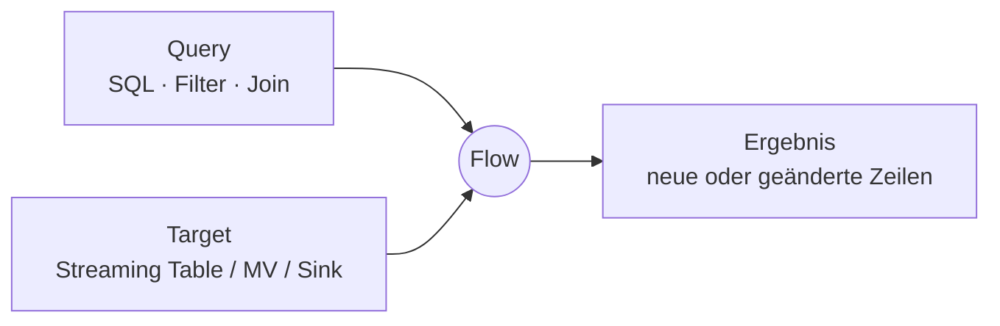
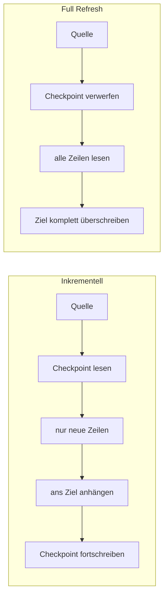

# Flows

Grundlagenreferenz zum Konzept "Flow" in Lakeflow-Pipelines. Ein Flow ist die kleinste Verarbeitungseinheit einer Pipeline — alle weiteren Dokumente in diesem Ordner beschreiben einzelne Flow-Typen oder Einsatzmuster im Detail. Verifiziert per `WebFetch` gegen die Azure-Spiegelseite (`learn.microsoft.com/en-us/azure/databricks/ldp/concepts/flows`) sowie die Referenzseite zu `update_flow`.

## Abschnittsübersicht

1. [Was ist ein Flow?](#definition)
2. [Flow-Typen im Überblick](#typen)
3. [Standard-Flow vs. explizit definierter Flow](#standard-vs-explizit)
4. [Verarbeitungsmodi: inkrementell und Full Refresh](#verarbeitungsmodi)
5. [Checkpoints und Flow-Namen](#checkpoints)
6. [Update-Flows (Public Preview)](#update-flows)
7. [Mehrere Quellen kombinieren](#mehrere-quellen)
8. [Quellen](#quellen)

---

## <a id="definition">1. Was ist ein Flow?</a>

"Daten werden in Pipelines über *Flows* verarbeitet. Jeder Flow besteht aus einer *Query* und, typischerweise, einem *Target*." Der Flow verarbeitet die Query entweder als Batch oder inkrementell als Datenstrom in das Target. Ein Flow existiert immer innerhalb einer Lakeflow-Pipeline.



## <a id="typen">2. Flow-Typen im Überblick</a>

| Flow-Typ | Semantik | Erlaubtes Ziel | Kurzbeschreibung | Details |
|---|---|---|---|---|
| **Append** | Streaming | Streaming Table, Sink | Häufigster Typ — hängt bei jedem Update neue Zeilen an | Abschnitt 3 dieser Seite, `Flow-Beispiele.md` |
| **Materialized View** | Batch | nur Materialized View | wird immer implizit mit der Materialized View definiert; verarbeitet, wann immer möglich, nur neue/geänderte Quelldaten | `01 Concepts/Materialized Views.md` |
| **Auto CDC** | Streaming | nur Streaming Table | verarbeitet Change-Data-Capture-Events (Insert/Update/Delete), inkl. SCD Typ 1/2 | `05 CDC/CDC-Grundlagen.md` |
| **REPLACE USING** *(Beta)* | Streaming | Streaming Table | ersetzt Zeilen anhand Key + Sequenz aus einer Serie partieller Snapshots | `Flows mit REPLACE USING.md` |
| **REPLACE WHERE** | Batch | Streaming Table | berechnet und überschreibt ein per Prädikat definiertes Batch-Fenster neu | `Flows mit REPLACE WHERE.md` |
| **Update** *(Public Preview)* | Streaming | nur Sink (kein Delta-Ziel) | gibt globale, nicht-watermarked Streaming-Aggregate aus, nur geänderte Zeilen | Abschnitt 6 dieser Seite |

Alle Typen außer Update lassen sich sowohl in SQL als auch in Python definieren; Update-Flows sind auf Python beschränkt.

**Einordnung der Streaming-Flow-Typen:** Append und Update entsprechen den gleichnamigen Output-Modes von Spark Structured Streaming; Auto CDC ist ein Lakeflow-spezifischer Streaming-Flow-Typ ohne Structured-Streaming-Äquivalent. Der dritte Structured-Streaming-Output-Mode, *Complete*, ist laut Doku als Flow-Typ derzeit nicht freigeschaltet ("currently, only the Append and Update flows are exposed").

## <a id="standard-vs-explizit">3. Standard-Flow vs. explizit definierter Flow</a>

Beim Anlegen einer Tabelle wird meist automatisch ein **Standard-Flow** miterzeugt — für eine Streaming Table ist das ein Append-Flow mit demselben Namen wie die Tabelle:

```sql
CREATE OR REFRESH STREAMING TABLE customers_silver
AS SELECT * FROM STREAM(customers_bronze)
```

Ein Flow lässt sich aber auch **getrennt vom Ziel** definieren. Das erlaubt es, mehrere Flows an dasselbe Ziel anzuhängen — etwa um zusätzliche Streaming-Quellen ohne Full Refresh zu ergänzen, historische Daten nachzuladen (Backfill) oder mehrere Quellen ohne `UNION`-Klausel zu kombinieren. Vollständige Beispiele dazu stehen in `Flow-Beispiele.md` und `Flow-Muster (Fan-in, Fan-out, Multiplex).md`.

## <a id="verarbeitungsmodi">4. Verarbeitungsmodi: inkrementell und Full Refresh</a>

Ein Flow läuft bei jedem Update seiner Pipeline und aktualisiert sein Ziel mit den aktuellsten Daten — abhängig vom Flow-Typ entweder inkrementell oder per Full Refresh.



- **Inkrementell:** verarbeitet nur neue Datensätze seit dem letzten Lauf — effizient für große, laufend wachsende Quellen wie Kafka oder Auto Loader.
- **Full Refresh:** verwirft den Checkpoint und verarbeitet die Quelle vollständig neu — notwendig, wenn sich Transformationslogik ändert oder ein sauberer Neustart gebraucht wird.

## <a id="checkpoints">5. Checkpoints und Flow-Namen</a>

Jeder Flow verwaltet seinen Streaming-Checkpoint unter seinem eigenen **Flow-Namen**. Daraus folgen vier Regeln:

- **Name = Checkpoint-Identität:** Der Flow-Name bestimmt, unter welchem Pfad der Fortschritt gespeichert wird.
- **Unabhängiger Fortschritt:** Jeder Flow verarbeitet in seinem eigenen Tempo — ein langsamer Flow bremst andere Flows derselben Pipeline nicht aus.
- **Umbenennen setzt zurück:** Ein umbenannter Flow verliert seinen Checkpoint und verarbeitet die Quelle beim nächsten Lauf komplett neu, als hätte er nie zuvor existiert.
- **Fehler-Isolation:** Schlägt ein Flow fehl, laufen die übrigen Flows der Pipeline normal weiter — der Fehler bleibt auf den einzelnen Flow beschränkt.

Ein Flow-Name lässt sich innerhalb einer Pipeline nicht wiederverwenden, da der bestehende Checkpoint nicht zu einer neu definierten Query passt.

## <a id="update-flows">6. Update-Flows (Public Preview)</a>

Ein Update-Flow schreibt mit `update`-Output-Mode in einen **Sink** und gibt dabei ausschließlich die pro Batch geänderten Zeilen aus. Anders als Append-Flows unterstützen Update-Flows **zustandsbehaftete Aggregationen ohne Watermark** — sie eignen sich damit für global fortlaufend aktualisierte Kennzahlen statt für reine Anhänge. Delta-Tabellen werden **nicht** als Ziel unterstützt; das Ziel muss ein Sink sein (z. B. Kafka), und Update-Flows lassen sich nur in Python definieren.

```python
from pyspark import pipelines as dp
from pyspark.sql.functions import col

dp.create_sink("event_counts_sink", "kafka", {
    "kafka.bootstrap.servers": broker_address,
    "topic": output_topic,
})

@dp.update_flow(
    name="event_counts_flow",
    target="event_counts_sink",
)
def event_counts():
    return (
        spark.readStream
            .format("kafka")
            .option("kafka.bootstrap.servers", broker_address)
            .option("subscribe", input_topic)
            .load()
            .selectExpr("CAST(key AS STRING) AS event_type")
            .groupBy(col("event_type"))
            .count()
    )
```

**Hinweis laut Doku:** Über den `spark_conf`-Parameter lässt sich ein Update-Flow zusätzlich für den *Real-Time Mode* konfigurieren (`pipelines.trigger: "RealTime"`), ebenfalls Public Preview.

## <a id="mehrere-quellen">7. Mehrere Quellen kombinieren</a>

Append-Flows lassen sich einsetzen, um mehrere Datenquellen in ein gemeinsames Ziel zu schreiben — etwa mehrere Kafka-Topics oder Regionaldaten, ohne `UNION`-Klausel und ohne Full Refresh bei neuen Quellen. Praxisbeispiele dazu stehen in `Flow-Beispiele.md`; die dahinterliegenden Architekturmuster (Fan-in, Fan-out, Multiplexing) beschreibt `Flow-Muster (Fan-in, Fan-out, Multiplex).md`.

---

## <a id="quellen">8. Quellen</a>

- Load and process data incrementally with Lakeflow pipeline flows (Azure): https://learn.microsoft.com/en-us/azure/databricks/ldp/concepts/flows
- Load and process data incrementally with Lakeflow pipeline flows (AWS): https://docs.databricks.com/aws/en/ldp/concepts/flows
- `update_flow`-Referenz (Azure): https://learn.microsoft.com/en-us/azure/databricks/ldp/developer/ldp-python-ref-update-flow
- What are Lakeflow pipelines? — Concepts-Übersicht (Flow-Typen, Structured-Streaming-Output-Modes): https://learn.microsoft.com/en-us/azure/databricks/ldp/concepts/

**Stand:** 2026-08-20.
