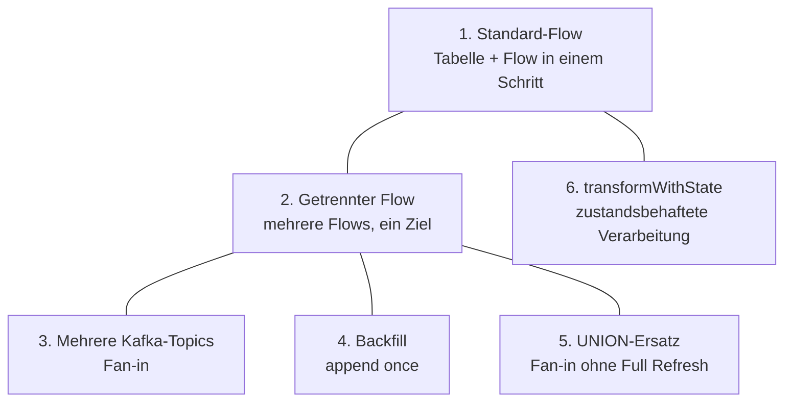

# Flows in Lakeflow-Pipelines verwenden — Referenz

Dieses Dokument sammelt Praxisbeispiele für Flows in Lakeflow-Declarative-Pipelines (LDP): Standard-Flows, vom Ziel getrennt definierte Flows, das Schreiben aus mehreren Kafka-Topics in eine Streaming Table, einmalige Backfills und den Ersatz von `UNION`-Queries durch Append-Flow-Verarbeitung.

Für die Datei-basierte Variante des Multi-Flow-Musters (mehrere Quellordner, ein gemeinsames Ziel) siehe ergänzend `Lakeflow Connect/Lakeflow Connect Standard Connectors/Working with Files/_fileIngestionScenarios.md` Abschnitt 5d in diesem Projekt — dort wird derselbe Baustein aus der Perspektive der Datei-Ingestion-Taxonomie behandelt (mit identischem `raw_orders_us`/`eu`/`apac`-Beispielcode). Die dahinterliegenden Architekturmuster (Fan-in, Fan-out, Multiplexing) beschreibt `Flow-Muster (Fan-in, Fan-out, Multiplex).md` in diesem Ordner.



## Abschnittsübersicht

1. [Beispiel: einen Standard-Flow anlegen](#standard-flow)
2. [Beispiel: einen Flow getrennt von seinem Ziel definieren](#getrennter-flow)
3. [Beispiel: in eine Streaming Table aus mehreren Kafka-Topics schreiben](#mehrere-kafka-topics)
4. [Beispiel: einen einmaligen Daten-Backfill ausführen](#backfill)
5. [Beispiel: Append-Flow-Verarbeitung statt `UNION`](#union-ersatz)
6. [Beispiel: `transformWithState` zur Sensor-Heartbeat-Überwachung](#transform-with-state)
7. [Praxisbeispiel: Multi-Format-Bronze mit mehreren Quellen](#multi-format-bronze)

---

## <a id="standard-flow">1. Beispiel: einen Standard-Flow anlegen</a>

Beim Anlegen einer Pipeline wird typischerweise eine Tabelle oder View zusammen mit der sie stützenden Query definiert. Die folgende Query legt eine Streaming Table `customers_silver` an, die aus `customers_bronze` liest. Streaming Table und ihr Standard-Flow werden dabei in einem einzigen Schritt erzeugt:

```sql
CREATE OR REFRESH STREAMING TABLE customers_silver
AS SELECT * FROM STREAM(customers_bronze)
```

```python
from pyspark import pipelines as dp

@dp.table()
def customers_silver():
  return spark.readStream.table("customers_bronze")
```

Der Standard-Flow einer Streaming Table ist ein *Append*-Flow, der bei jedem Update neue Zeilen hinzufügt, und trägt denselben Namen wie das Ziel. Dies ist die häufigste Art, Pipelines zu nutzen — Flow und Ziel in einem einzigen Schritt zu erzeugen — und eignet sich sowohl für Ingestion als auch für Transformation.

## <a id="getrennter-flow">2. Beispiel: einen Flow getrennt von seinem Ziel definieren</a>

Ein Flow lässt sich auch für eine separat definierte Tabelle anlegen. Das Ergebnis ist identisch zum Standard-Flow, einschließlich desselben Namens für Streaming Table und Flow:

```python
from pyspark import pipelines as dp

# create streaming table
dp.create_streaming_table("customers_silver")

# add a flow
@dp.append_flow(
  target = "customers_silver")
def customer_silver():
  return spark.readStream.table("customers_bronze")
```

```sql
-- create a streaming table
CREATE OR REFRESH STREAMING TABLE customers_silver;

-- add a flow
CREATE FLOW customers_silver
AS INSERT INTO customers_silver BY NAME
SELECT * FROM STREAM(customers_bronze);
```

Einen Flow getrennt von seinem Ziel zu definieren erlaubt es, mehrere Flows anzulegen, die an dasselbe Ziel anhängen. Der `@dp.append_flow`-Dekorator (Python) bzw. die `CREATE FLOW...INSERT INTO`-Klausel (SQL) eignet sich für Aufgaben wie:

- Streaming-Quellen hinzufügen, die Daten an eine bestehende Streaming Table anhängen, ohne einen Full Refresh zu erfordern — etwa eine Tabelle, die regionale Daten aus allen betriebenen Regionen kombiniert; werden neue Regionen ausgerollt, lassen sich deren Daten ohne Full Refresh ergänzen (siehe Abschnitt 3).
- Eine Streaming Table durch Anhängen fehlender historischer Daten aktualisieren (Backfilling) — über die `INSERT INTO ONCE`-Syntax lässt sich ein einmalig laufender historischer Backfill erzeugen (siehe Abschnitt 4 und `Backfill mit Flows.md` in diesem Ordner).
- Daten aus mehreren Quellen kombinieren und in eine einzelne Streaming Table schreiben, statt die `UNION`-Klausel in einer Query zu verwenden — Append-Flow-Verarbeitung statt `UNION` erlaubt es, die Zieltabelle inkrementell zu aktualisieren, ohne ein Full-Refresh-Update auszuführen (siehe Abschnitt 5).

Für Python-Queries dient die Funktion `create_streaming_table()`, um eine Zieltabelle anzulegen.

**Wichtige Hinweise:**

- Werden Datenqualitätsbedingungen mit Expectations benötigt, müssen diese auf der Zieltabelle definiert werden — als Teil der `create_streaming_table()`-Funktion oder einer bestehenden Tabellendefinition. Expectations lassen sich **nicht** innerhalb der `@append_flow`-Definition selbst festlegen.
- Flows werden über einen *Flow-Namen* identifiziert, der zur Identifikation von Streaming-Checkpoints dient. Daraus folgt:
  - Wird ein bestehender Flow in einer Pipeline umbenannt, geht der Checkpoint nicht mit über — der umbenannte Flow ist effektiv ein vollständig neuer Flow.
  - Ein Flow-Name kann innerhalb einer Pipeline nicht wiederverwendet werden, da der bestehende Checkpoint nicht zur neuen Flow-Definition passt.

## <a id="mehrere-kafka-topics">3. Beispiel: in eine Streaming Table aus mehreren Kafka-Topics schreiben</a>

Das folgende Beispiel legt eine Streaming Table `kafka_target` an und schreibt aus zwei Kafka-Topics hinein:

```python
from pyspark import pipelines as dp

dp.create_streaming_table("kafka_target")

# Kafka stream from multiple topics
@dp.append_flow(target = "kafka_target")
def topic1():
  return (
    spark.readStream
      .format("kafka")
      .option("kafka.bootstrap.servers", "host1:port1,...")
      .option("subscribe", "topic1")
      .load()
  )

@dp.append_flow(target = "kafka_target")
def topic2():
  return (
    spark.readStream
      .format("kafka")
      .option("kafka.bootstrap.servers", "host1:port1,...")
      .option("subscribe", "topic2")
      .load()
  )
```

```sql
CREATE OR REFRESH STREAMING TABLE kafka_target;

CREATE FLOW
  topic1
AS INSERT INTO
  kafka_target BY NAME
SELECT * FROM
  read_kafka(bootstrapServers => 'host1:port1,...', subscribe => 'topic1');

CREATE FLOW
  topic2
AS INSERT INTO
  kafka_target BY NAME
SELECT * FROM
  read_kafka(bootstrapServers => 'host1:port1,...', subscribe => 'topic2');
```

In Python lassen sich programmatisch mehrere Flows erzeugen, die dieselbe Tabelle ansteuern — das folgende Beispiel zeigt dieses Muster für eine Liste von Kafka-Topics.

**Hinweis:** Dieses Muster hat dieselben Anforderungen wie das Anlegen von Tabellen in einer `for`-Schleife — ein Python-Wert muss explizit an die den Flow definierende Funktion übergeben werden.

```python
from pyspark import pipelines as dp

dp.create_streaming_table("kafka_target")

topic_list = ["topic1", "topic2", "topic3"]

for topic_name in topic_list:

  @dp.append_flow(target = "kafka_target", name=f"{topic_name}_flow")
  def topic_flow(topic=topic_name):
    return (
      spark.readStream
        .format("kafka")
        .option("kafka.bootstrap.servers", "host1:port1,...")
        .option("subscribe", topic)
        .load()
    )
```

## <a id="backfill">4. Beispiel: einen einmaligen Daten-Backfill ausführen</a>

Soll eine Query Daten an eine bestehende Streaming Table anhängen, wird `append_flow` verwendet. Nach dem Anhängen eines bestehenden Datensatzes gibt es mehrere Optionen:

- Soll die Query neue Daten anhängen, falls sie im Backfill-Verzeichnis eintreffen, bleibt die Query bestehen.
- Soll es ein einmaliger Backfill sein, der nie wieder läuft, wird die Query nach dem einmaligen Pipeline-Lauf entfernt.
- Soll die Query einmal laufen und nur bei einem Full Refresh der Daten erneut laufen, wird der `once`-Parameter des Append Flows auf `True` gesetzt (SQL: `INSERT INTO ONCE`).

```python
from pyspark import pipelines as dp

@dp.table()
def csv_target():
  return spark.readStream
    .format("cloudFiles")
    .option("cloudFiles.format","csv")
    .load("path/to/sourceDir")

@dp.append_flow(
  target = "csv_target",
  once = True)
def backfill():
  return spark.read
    .format("cloudFiles")
    .option("cloudFiles.format","csv")
    .load("path/to/backfill/data/dir")
```

```sql
CREATE OR REFRESH STREAMING TABLE csv_target
AS SELECT * FROM
  read_files(
    "path/to/sourceDir",
    "csv"
  );

CREATE FLOW
  backfill
AS INSERT INTO ONCE
  csv_target BY NAME
SELECT * FROM
  read_files(
    "path/to/backfill/data/dir",
    "csv"
  );
```

Für ein vertiefteres Beispiel siehe `Backfill mit Flows.md` in diesem Ordner.

## <a id="union-ersatz">5. Beispiel: Append-Flow-Verarbeitung statt `UNION`</a>

Statt einer Query mit `UNION`-Klausel lassen sich Append-Flow-Queries verwenden, um mehrere Quellen zu kombinieren und in eine einzelne Streaming Table zu schreiben — das erlaubt das Anhängen an eine Streaming Table aus mehreren Quellen, ohne einen Full Refresh auszuführen.

Das folgende Python-Beispiel kombiniert mehrere Datenquellen mit einer `UNION`-Klausel:

```python
@dp.create_table(name="raw_orders")
def unioned_raw_orders():
  raw_orders_us = (
    spark.readStream
      .format("cloudFiles")
      .option("cloudFiles.format", "csv")
      .load("/path/to/orders/us")
  )

  raw_orders_eu = (
    spark.readStream
      .format("cloudFiles")
      .option("cloudFiles.format", "csv")
      .load("/path/to/orders/eu")
  )

  return raw_orders_us.union(raw_orders_eu)
```

Die folgenden Beispiele ersetzen die `UNION`-Query durch Append-Flow-Queries:

```python
dp.create_streaming_table("raw_orders")

@dp.append_flow(target="raw_orders")
def raw_orders_us():
  return spark.readStream
    .format("cloudFiles")
    .option("cloudFiles.format", "csv")
    .load("/path/to/orders/us")

@dp.append_flow(target="raw_orders")
def raw_orders_eu():
  return spark.readStream
    .format("cloudFiles")
    .option("cloudFiles.format", "csv")
    .load("/path/to/orders/eu")

# Additional flows can be added without the full refresh that a UNION query would require:
@dp.append_flow(target="raw_orders")
def raw_orders_apac():
  return spark.readStream
    .format("cloudFiles")
    .option("cloudFiles.format", "csv")
    .load("/path/to/orders/apac")
```

```sql
CREATE OR REFRESH STREAMING TABLE raw_orders;

CREATE FLOW
  raw_orders_us
AS INSERT INTO
  raw_orders BY NAME
SELECT * FROM
  STREAM read_files(
    "/path/to/orders/us",
    format => "csv"
  );

CREATE FLOW
  raw_orders_eu
AS INSERT INTO
  raw_orders BY NAME
SELECT * FROM
  STREAM read_files(
    "/path/to/orders/eu",
    format => "csv"
  );

-- Additional flows can be added without the full refresh that a UNION query would require:
CREATE FLOW
  raw_orders_apac
AS INSERT INTO
  raw_orders BY NAME
SELECT * FROM
  STREAM read_files(
    "/path/to/orders/apac",
    format => "csv"
  );
```

## <a id="transform-with-state">6. Beispiel: `transformWithState` zur Sensor-Heartbeat-Überwachung</a>

Das folgende Beispiel zeigt einen zustandsbehafteten Prozessor, der aus Kafka liest und prüft, ob Sensoren regelmäßig Heartbeats senden. Wird innerhalb von 5 Minuten kein Heartbeat empfangen, gibt der Prozessor einen Eintrag in der Ziel-Delta-Tabelle zur Analyse aus.

**Hinweis:** RocksDB ist ab Databricks Runtime 17.2 der Standard-State-Provider. Schlägt die Query wegen einer nicht unterstützten Provider-Exception fehl, werden folgende Pipeline-Konfigurationen ergänzt, ein Full Refresh bzw. Checkpoint-Reset durchgeführt, und die Pipeline erneut gestartet:

```json
"configuration": {
    "spark.sql.streaming.stateStore.providerClass": "com.databricks.sql.streaming.state.RocksDBStateStoreProvider",
    "spark.sql.streaming.stateStore.rocksdb.changelogCheckpointing.enabled": "true"
}
```

```python
from typing import Iterator

import pandas as pd

from pyspark import pipelines as dp
from pyspark.sql.functions import col, from_json
from pyspark.sql.streaming import StatefulProcessor, StatefulProcessorHandle
from pyspark.sql.types import StructType, StructField, LongType, StringType, TimestampType

KAFKA_TOPIC = "<your-kafka-topic>"

output_schema = StructType([
    StructField("sensor_id", LongType(), False),
    StructField("sensor_type", StringType(), False),
    StructField("last_heartbeat_time", TimestampType(), False)])

class SensorHeartbeatProcessor(StatefulProcessor):
    def init(self, handle: StatefulProcessorHandle) -> None:
        # Define state schema to store sensor information (sensor_id is the grouping key)
        state_schema = StructType([
            StructField("sensor_type", StringType(), False),
            StructField("last_heartbeat_time", TimestampType(), False)])
        self.sensor_state = handle.getValueState("sensorState", state_schema)
        # State variable to track the previously registered timer
        timer_schema = StructType([StructField("timer_ts", LongType(), False)])
        self.timer_state = handle.getValueState("timerState", timer_schema)
        self.handle = handle

    def handleInputRows(self, key, rows, timerValues) -> Iterator[pd.DataFrame]:
        # Process one row from input and update state
        pdf = next(rows)
        row = pdf.iloc[0]
        # Store or update the sensor information in state using current timestamp
        current_time = pd.Timestamp(timerValues.getCurrentProcessingTimeInMs(), unit='ms')
        self.sensor_state.update((
            row["sensor_type"],
            current_time
        ))

        # Delete old timer if already registered
        if self.timer_state.exists():
            old_timer = self.timer_state.get()[0]
            self.handle.deleteTimer(old_timer)

        # Register a timer for 5 minutes from current processing time
        expiry_time = timerValues.getCurrentProcessingTimeInMs() + (5 * 60 * 1000)
        self.handle.registerTimer(expiry_time)
        # Store the new timer timestamp in state
        self.timer_state.update((expiry_time,))

        # No output on input processing, output only on timer expiry
        return iter([])

    def handleExpiredTimer(self, key, timerValues, expiredTimerInfo) -> Iterator[pd.DataFrame]:
        # Emit output row based on state store
        if self.sensor_state.exists():
            state = self.sensor_state.get()
            output = pd.DataFrame({
                "sensor_id": [key[0]],  # Use grouping key as sensor_id
                "sensor_type": [state[0]],
                "last_heartbeat_time": [state[1]]
            })
            # Remove the entry for the sensor from the state store
            self.sensor_state.clear()
            # Remove the timer state entry
            self.timer_state.clear()
            yield output

    def close(self) -> None:
        pass

dp.create_streaming_table("sensorAlerts")

# Define the schema for the Kafka message value
sensor_schema = StructType([
    StructField("sensor_id", LongType(), False),
    StructField("sensor_type", StringType(), False),
    StructField("sensor_value", LongType(), False)])

@dp.append_flow(target = "sensorAlerts")
def kafka_delta_flow():
    return (
      spark.readStream
        .format("kafka")
        .option("subscribe", KAFKA_TOPIC)
        .option("startingOffsets", "earliest")
        .load()
        .select(from_json(col("value").cast("string"), sensor_schema).alias("data"), col("timestamp"))
        .select("data.*", "timestamp")
        .withWatermark('timestamp', '1 hour')
        .groupBy(col("sensor_id"))
        .transformWithStateInPandas(
          statefulProcessor = SensorHeartbeatProcessor(),
          outputStructType = output_schema,
          outputMode = 'update',
          timeMode = 'ProcessingTime'))
```

## <a id="multi-format-bronze">7. Praxisbeispiel: Multi-Format-Bronze mit mehreren Quellen</a>

Dieses Praxisbeispiel illustriert, wie sich das Fan-in-Muster aus Abschnitt 3 mit **unterschiedlichen Quelldateiformaten** und einer nachgelagerten, schemafesten Silver-Tabelle kombinieren lässt. Drei Quellen (zwei CSV, eine JSON) werden über je einen eigenen Flow in dieselbe Bronze-Streaming-Table geschrieben:

```sql
CREATE OR REPLACE STREAMING TABLE bronze.orders_bronze
(
  subsidiary_id STRING, order_id STRING, order_timestamp STRING, customer_id STRING,
  region STRING, country STRING, city STRING, channel STRING, sku STRING, category STRING,
  qty STRING, unit_price STRING, discount_pct STRING, coupon_code STRING, total_amount STRING,
  order_date STRING,
  source_file STRING,      -- über die _metadata-Spalte befüllt
  file_mod_time TIMESTAMP  -- über die _metadata-Spalte befüllt
)
TBLPROPERTIES ('pipelines.reset.allowed' = false);  -- schützt die Bronze-Tabelle vor versehentlichem Full Refresh

CREATE FLOW bright_home_orders_flow
AS INSERT INTO bronze.orders_bronze BY NAME
SELECT
  CAST(subsidiary_id AS STRING) AS subsidiary_id, -- ... übrige Spalten analog gecastet
  _metadata.file_name AS source_file,
  _metadata.file_modification_time AS file_mod_time
FROM STREAM read_files('${bright_home_orders_source}', format => 'csv', header => true);

-- Zwei weitere, strukturell identische Flows lesen dieselbe Zielspalten aus zwei
-- anderen Quellen — eine zweite CSV-Quelle (lumina_sports_orders_flow) und eine
-- JSON-Quelle (northstar_outfitters_orders_flow, format => 'json') — und schreiben
-- ebenfalls per INSERT INTO ... BY NAME in bronze.orders_bronze.
```

Die nachgelagerte Silver-Tabelle normalisiert die durchgehend als `STRING` eingelesenen Bronze-Spalten über `TRY_CAST` auf ihre Zieltypen, erzwingt ein festes Schema (verhindert unbeabsichtigte Schema-Evolution), setzt Datenqualitäts-Constraints und nutzt `CLUSTER BY AUTO` (Liquid Clustering) für automatisch optimiertes physisches Layout:

```sql
CREATE OR REFRESH STREAMING TABLE silver.orders_silver
(
  subsidiary_id STRING, order_id STRING,
  order_timestamp TIMESTAMP, order_date DATE,
  qty INT, unit_price DOUBLE, discount_pct DOUBLE, total_amount DOUBLE,
  CONSTRAINT qty_valid          EXPECT (qty >= 0) ON VIOLATION DROP ROW,
  CONSTRAINT total_amount_valid EXPECT (total_amount >= 0) ON VIOLATION DROP ROW,
  CONSTRAINT timestamp_not_null EXPECT (order_timestamp IS NOT NULL) ON VIOLATION FAIL UPDATE
)
CLUSTER BY AUTO
AS SELECT
  subsidiary_id, order_id,
  TRY_CAST(order_timestamp AS TIMESTAMP) AS order_timestamp,
  TRY_CAST(order_date      AS DATE)      AS order_date,
  TRY_CAST(qty          AS INT)    AS qty,
  TRY_CAST(unit_price   AS DOUBLE) AS unit_price,
  TRY_CAST(discount_pct AS DOUBLE) AS discount_pct,
  TRY_CAST(total_amount AS DOUBLE) AS total_amount
FROM STREAM bronze.orders_bronze;
```

Zwei Gold-Materialized-Views aggregieren anschließend aus der Silver-Tabelle, z. B. eine tägliche Scorecard je Subsidiary (`GROUP BY order_date, subsidiary_id`) und eine Produktperformance je Subsidiary und SKU (`GROUP BY subsidiary_id, category, sku`) — beides reguläre `CREATE OR REPLACE MATERIALIZED VIEW`-Definitionen ohne pipeline-spezifische Besonderheiten.

