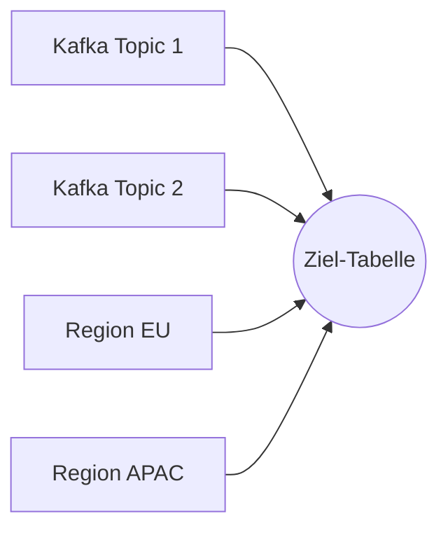
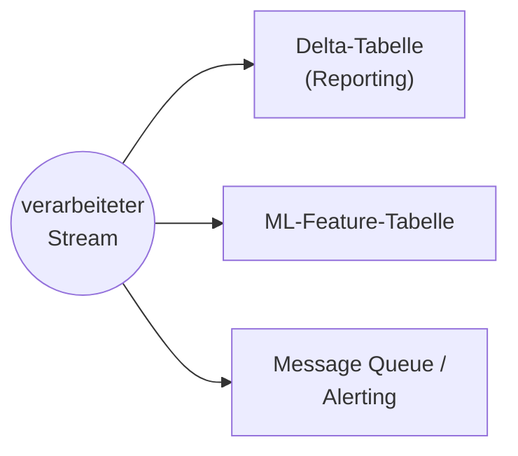
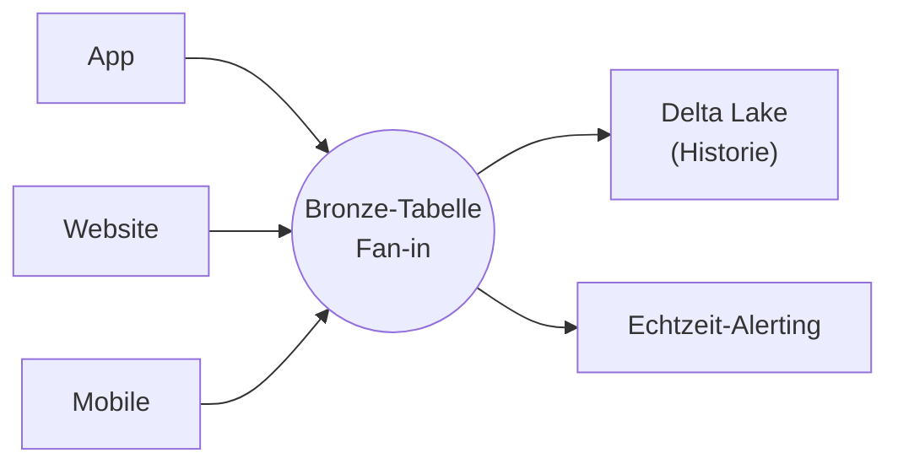
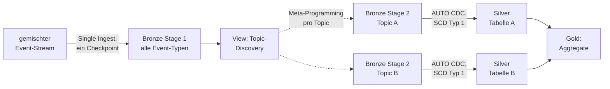

# Flow-Muster: Fan-in, Fan-out und Multiplexing

Dieses Dokument beschreibt drei verbreitete Architekturmuster, die sich mit Flows umsetzen lassen: **Fan-in** (viele Quellen → ein Ziel), **Fan-out** (eine Quelle → viele Ziele) sowie das darauf aufbauende **Multiplex-Pattern** (dynamisches Fan-out nach Event-Typ). Fan-in und Fan-out sind offiziell dokumentierte Muster, verifiziert per `WebFetch` gegen die Azure-Spiegelseite `learn.microsoft.com/en-us/azure/databricks/data-engineering/fan-in-fan-out`. Das Multiplex-Pattern stammt aus einem Databricks-Blogpost über eine konkrete Kundenlösung (Uplift) und ist als solches gekennzeichnet — es ist kein offizieller Produkt-Terminus, sondern eine verbreitete, gut belegte Anwendung derselben Bausteine.

## Abschnittsübersicht

1. [Fan-in: viele Quellen, ein Ziel](#fan-in)
2. [Fan-out: eine Quelle, viele Ziele](#fan-out)
3. [Fan-in und Fan-out kombiniert](#kombiniert)
4. [Multiplex-Pattern](#multiplex)
5. [Best Practices und Limitierungen](#best-practices)
6. [Quellen](#quellen)

---

## <a id="fan-in">1. Fan-in: viele Quellen, ein Ziel</a>

Fan-in ist das Muster, bei dem Daten aus mehreren Quellen in einer einzigen Pipeline zusammengeführt und verarbeitet werden — etwa aus Event-Streams (Kafka, Kinesis), Cloud-Speicher, relationalen Datenbanken oder IoT-Quellen. Das Konsolidieren unterschiedlicher Datenströme in einer Verarbeitungsschicht ermöglicht konsistente Transformation, Deduplizierung und Anreicherung, bevor die Daten weiterfließen.



Append-Flows setzen Fan-in ohne komplexe `UNION`-Queries oder manuelles Checkpointing um: Jede Quelle bekommt ihren eigenen Flow mit eigenem Checkpoint und schreibt unabhängig in dieselbe Streaming Table.

```python
from pyspark import pipelines as dp

dp.create_streaming_table("all_topics")

@dp.append_flow(target="all_topics")
def topic1():
    return spark.readStream.format("kafka") \
        .option("kafka.bootstrap.servers", "host1:port1,...") \
        .option("subscribe", "topic1") \
        .load()

@dp.append_flow(target="all_topics")
def topic2():
    return spark.readStream.format("kafka") \
        .option("kafka.bootstrap.servers", "host1:port1,...") \
        .option("subscribe", "topic2") \
        .load()
```

```sql
CREATE OR REFRESH STREAMING TABLE all_topics;

CREATE FLOW topic1
AS INSERT INTO all_topics BY NAME
SELECT * FROM read_kafka(bootstrapServers => 'host1:port1,...', subscribe => 'topic1');

CREATE FLOW topic2
AS INSERT INTO all_topics BY NAME
SELECT * FROM read_kafka(bootstrapServers => 'host1:port1,...', subscribe => 'topic2');
```

Ein vollständigeres Beispiel mit einer per Python-Schleife erzeugten Topic-Liste sowie die Variante "Append-Flows statt `UNION`" stehen in `Flow-Beispiele.md`, Abschnitte 3 und 5.

## <a id="fan-out">2. Fan-out: eine Quelle, viele Ziele</a>

Fan-out folgt dem umgekehrten Prinzip: ein einzelner verarbeiteter Datenstrom wird an mehrere Ziele verteilt — etwa Delta-Tabellen, Alerting-Systeme, ML-Feature-Tabellen oder Message Queues. So erhält jedes nachgelagerte System die Daten im passenden Format.



Lakeflow-Pipelines unterstützen drei Fan-out-Varianten, je nach Anwendungsfall:

**a) `for`-Schleifen für identische Logik pro Ziel** — wenn dieselbe Transformation für mehrere Ziele wiederholt wird, erzeugt eine parametrisierte Python-Schleife die Tabellen dynamisch:

```python
regions = ["US", "EU", "APAC"]

for region in regions:
    @dp.materialized_view(name=f"orders_{region.lower()}_filtered")
    def filtered_orders(region_filter=region):
        return spark.read.table("combined_orders").filter(f"region = '{region_filter}'")
```

**Achtung laut Doku:** Jede erzeugte Tabelle liest die komplette Quelle unabhängig — bei Quellen mit begrenztem Durchsatz (z. B. Kafka) kann das die Performance spürbar belasten.

**b) Unabhängige Flows für zielspezifische Logik** — wenn sich die Transformation je Ziel deutlich unterscheidet:

```python
from pyspark import pipelines as dp
from pyspark.sql.functions import col

@dp.materialized_view(name="orders_sink")
def region_orders():
    return spark.read.table("combined_orders").groupBy("region").count()

@dp.materialized_view(name="orders_bi_materialized")
def orders_bi():
    return spark.read.table("combined_orders").select("order_id", "amount", "region")

@dp.materialized_view(name="orders_ml_features")
def orders_ml():
    return (
        spark.read.table("combined_orders")
        .withColumn("high_value_order", col("amount") > 1000)
        .select("order_id", "high_value_order", "region")
    )
```

**c) ForEachBatch für individuelles Routing** — wenn Ziele kein natives Streaming unterstützen (z. B. JDBC) oder Batches per Custom-Code an mehrere Systeme verteilt werden sollen. Details und weitere Beispiele stehen in `foreachBatch.md`.

```python
@dp.foreach_batch_sink(name="user_events_feb")
def user_events_handler(batch_df, batch_id):
    batch_df.write.format("delta").mode("append").saveAsTable("my_catalog.my_schema.my_delta_table")
    batch_df.write.format("json").mode("append").save("/Volumes/path/to/json_target")

@dp.append_flow(target="user_events_feb", name="user_events_flow")
def read_user_events():
    return (
        spark.readStream.format("cloudFiles")
        .option("cloudFiles.format", "json")
        .load("/data/incoming/events")
    )
```

`foreach_batch_sink` unterstützt laut Doku drei wiederkehrende Kombinationen:

| Kombination | Wann einsetzen |
|---|---|
| Ein Flow → ein Sink mit mehreren Ausgabezielen | einfache Multi-Output-Fälle mit gemeinsamer Transformationslogik |
| Mehrere Flows → ein gemeinsamer Sink | zentralisiert Transformation, Fehlerbehandlung und Checkpoint (nur einer statt vieler) — nützlich bei vielen Kafka-Topics oder APIs |
| Ein Flow → ein dedizierter Sink (viele unabhängige Paare) | viele unabhängige Streams mit jeweils eigener Verarbeitungslogik, isolierte Fehlerbehandlung |

## <a id="kombiniert">3. Fan-in und Fan-out kombiniert</a>

In der Praxis treten beide Muster meist gemeinsam auf: Ein Unternehmen sammelt Nutzeraktivitäten aus mehreren Apps, Websites und mobilen Geräten (Fan-in), speichert die verarbeiteten Daten dauerhaft in Delta Lake und löst gleichzeitig Echtzeit-Alerts bei Auffälligkeiten aus (Fan-out).



Ein gängiges Vorgehen: `for`-Schleifen erzeugen die Fan-in-Flows dynamisch, `foreach_batch_sink` übernimmt anschließend das Fan-out-Routing.

## <a id="multiplex">4. Multiplex-Pattern</a>

**Herkunft:** Dieses Muster ist aus dem Databricks-Blogpost "How Uplift built CDC and Multiplexing data pipelines with Databricks Delta Live Tables" (2022) übernommen und dort als Praxisbericht eines Kunden beschrieben, nicht als offiziell benannter Produkt-Baustein.

### 4.1 Ausgangslage: Uplift und das Problem mit 100+ Datenquellen

Uplift ist ein Buy-Now-Pay-Later-Fintech-Unternehmen mit über 200 Merchant-Partnern (Online-, Call-Center- und Vor-Ort-Kanäle). Die Plattform musste **100+ Topics aus Kafka und S3** ins Lakehouse einlesen, wobei jede Quelle ihr eigenes, unabhängig evolvierendes Schema hatte. Konkrete Anforderungen: neue Kafka-Topics ohne manuellen Eingriff dynamisch als Tabellen anlegen, Schema-Änderungen je Topic automatisch nachziehen, eine konfigurierbare nachgelagerte Schicht mit Schema-Erzwingung/Data-Quality-Expectations/Typ-Mappings bereitstellen, SCD-Typ-1-Updates auf explizit konfigurierten Tabellen anwenden, und darauf aufbauende Aggregat-Tabellen für Reporting ermöglichen. Vor der Umstellung erforderte das **100+ einzeln gepflegte Notebooks**.

### 4.2 Warum nicht klassisches Spark Structured Streaming?

Uplift evaluierte zunächst einen Ansatz mit **Spark Structured Streaming + Delta Lake**: ein einzelner Kafka-Stream, der über `foreachBatch` in mehrere Zieltabellen schreibt. Laut Blogpost erwiesen sich dabei folgende Einschränkungen als entscheidend gegen diesen Ansatz:

- **Serielle Schreibvorgänge:** Da Spark-Code der Reihe nach ausgeführt wird, muss jedes Schreib-Statement abgeschlossen sein, bevor das nächste beginnt — die Cluster-Laufzeit wächst mit jeder zusätzlichen Zieltabelle.
- **Hartkodierte Komplexität:** Für jedes Topic ist ein fest programmierter Schreibvorgang nötig; neue Datenquellen erfordern einen Code-Release samt Redeployment.
- **Starrheit:** Unterschiedliche Refresh-Raten, Qualitätsanforderungen und Vorverarbeitungslogik je Quelle verlangen separate Jobs.
- **Schlechte Cluster-Auslastung:** Stark unterschiedliche Datenvolumina je Quelle erschweren eine gleichmäßige Lastverteilung — Load-Balancing müsste manuell entwickelt werden.

Die Lösung (Solution 2) setzt stattdessen auf **Lakeflow Pipelines (damals: Delta Live Tables) mit Multiplexing und CDC**, kombiniert mit Meta-Programming zur dynamischen Pipeline-Generierung.

### 4.3 Architektur: Bronze (Multiplex) → Silver (CDC) → Gold

Die vollständige Architektur besteht aus fünf Stufen, nicht nur der reinen Fan-out-Aufteilung:

1. **Bronze Stage 1 — Roh-Ingestion:** Ein einzelner `readStream` liest **alle** Kafka-Topics in eine gemeinsame Bronze-Tabelle mit gemischten Event-Typen (ein Checkpoint, ein gemeinsamer Quell-Scan).
2. **Dynamische Topic-Erkennung:** Eine View über Bronze Stage 1 ermittelt die aktuell beobachteten, eindeutigen Topics — optional angebunden an eine Schema-Registry oder mit dynamischer Schema-Inferenz aus dem JSON-Payload je Topic.
3. **Bronze Stage 2 — Fan-out per Meta-Programming:** Für jedes in der Discovery-View gefundene Topic wird programmatisch eine eigene Bronze-Stage-2-Tabelle erzeugt — neue Topics werden bei jedem Pipeline-Lauf automatisch erkannt und provisioniert, ganz ohne Code-Änderung.
4. **Silver Stage — CDC via `AUTO CDC`/`APPLY CHANGES INTO`:** Aus Bronze Stage 2 werden die Silver-Tabellen über die native CDC-Funktionalität befüllt (im Blogpost noch `APPLY CHANGES INTO` genannt, heute `AUTO CDC ... INTO` — siehe [CDC-Grundlagen.md](../05%20CDC/01%20CDC-Grundlagen.md) für die aktuelle Syntax) und implementieren so **SCD-Typ-1-Updates** für alle explizit konfigurierten Tabellen. Eine separate JSON-Konfiguration registriert "produktisierte" Tabellen mit eigenen Data-Quality-Expectations und Typ-Erzwingungen — unabhängig vom Pipeline-Code.
5. **Gold Stage — Aggregation:** Aus den Silver-Tabellen entstehen Aggregat-Tabellen für nachgelagerte Reporting-Anwendungen.

Orchestriert wird das Ganze als **Multi-Task-Job**: ein Task für die Kafka-Ingestion (Task A), gefolgt von der eigentlichen Pipeline (Task B) — die vollständige DAG-Visualisierung zeigt die Abhängigkeitskette von Bronze Stage 1 bis zu den Gold-Aggregaten.



Vereinfachtes Code-Skelett für die Bronze-Stage-2-Aufteilung (die Liste der Typen kann aus einer Konfiguration oder per Vorab-Query auf `event_type` stammen):

```python
from pyspark import pipelines as dp

@dp.table(name="events_bronze")
def events_bronze():
    return spark.readStream.format("kafka") \
        .option("kafka.bootstrap.servers", "host1:port1,...") \
        .option("subscribe", "all-events") \
        .load()

event_types = ["order", "payment", "shipment"]  # z. B. aus einer Konfigurationsdatei

for event_type in event_types:
    @dp.table(name=f"events_{event_type}")
    def events_by_type(t=event_type):
        return spark.readStream.table("events_bronze").where(f"event_type = '{t}'")
```

**Konfigurationsgetriebenes Design:** Zentrales Prinzip laut Blogpost ist, dass sich in Lakeflow Pipelines „alle Aspekte jeder Tabelle unabhängig über die Konfiguration der Tabellen steuern lassen, ohne den Pipeline-Code zu ändern" — Schema-Erzwingung, Data-Quality-Expectations, Typ-Mappings, Refresh-Raten (Echtzeit vs. Batch) und Partitionierungsstrategie werden je Tabelle über JSON-Konfiguration statt über Code-Änderungen gesteuert.

### 4.4 Ergebnisse laut Blogpost

- Reduktion von **100+ Notebooks auf wenige Pipeline-Tasks** (rund 98 % weniger verwaltete Code-Artefakte).
- Parallele statt serieller Tabellengenerierung dank paralleler Verarbeitung und Auto-Scaling — keine seriellen Schreib-Engpässe mehr wie bei Solution 1.
- Die gesamte 100+-Tabellen-Pipeline läuft „in einem Job, der die gesamte Streaming-Infrastruktur zu einer einfachen Konfiguration abstrahiert".
- Data-Quality-Management für alle unterstützten Tabellen zentral über eine einfache UI, statt manueller Qualitätsüberwachung über 100+ Notebooks hinweg.
- Wegfall „tausender Zeilen 'Hausmeister-Code' (janitor code)" — Uplift kann sich stattdessen auf Produktangebote für Partner konzentrieren.

### 4.5 Design-Trade-off (Warnung laut Blogpost)

Der Blogpost weist ausdrücklich darauf hin, dass Multiplexing „ein komplexes Streaming-Design-Pattern mit anderen Trade-offs als das typische Muster einer 1:1-Zuordnung von Quelle zu Ziel-Stream" ist, und empfiehlt, zunächst grundlegende Streaming-Production-Practices zu etablieren, bevor Multiplexing eingeführt wird. Die Lösung tauscht die Komplexität dynamischer Tabellengenerierung und Konfigurationsverwaltung gegen die operativen Vorteile eines zentralisierten Job-Managements und automatischer Infrastruktur-Skalierung.

## <a id="best-practices">5. Best Practices und Limitierungen</a>

**Best Practices laut Doku:**

- Quell-Schema und Ziel-Schema müssen bei Append-Flows übereinstimmen — Expectations helfen, Abweichungen frühzeitig zu erkennen.
- `for`-Schleifen-Logik einfach und gut lesbar halten.
- Flows und Tabellen eindeutig benennen.
- Ressourcennutzung beobachten, um Engpässe zu vermeiden.
- Bei Message Queues einen gemeinsamen `foreach_batch_sink` mit konsolidierendem Append-Flow verwenden, um Checkpoint-Verwaltung zu vereinfachen.

**Limitierungen laut Doku:**

- Die Lineage-UI zeigt für neu hinzugefügte Append-Flow-Quellen unter Umständen keine vollständigen Metriken.
- Werte aus einer `for`-Schleifen-Liste dürfen nur ergänzt, nicht entfernt werden — ein weggelassener Eintrag lässt die zugehörige Tabelle automatisch aus dem Ziel-Schema fallen und führt zu ungewolltem Datenverlust.
- `foreach_batch_sink` befindet sich in Public Preview (PREVIEW-Channel) und führt Schreibvorgänge pro Batch unabhängig aus — schlägt ein Ziel fehl, werden bereits erfolgreiche Writes an andere Ziele nicht zurückgerollt (siehe `foreachBatch.md`).

---

## <a id="quellen">6. Quellen</a>

- Fan-in and fan-out architecture in Lakeflow pipelines (Azure, vollständig als Rohtext abgerufen): https://learn.microsoft.com/en-us/azure/databricks/data-engineering/fan-in-fan-out
- Fan-in and fan-out architecture in Lakeflow pipelines (AWS): https://docs.databricks.com/aws/en/data-engineering/fan-in-fan-out
- How Uplift built CDC and Multiplexing data pipelines with Databricks Delta Live Tables: https://www.databricks.com/blog/2022/04/27/how-uplift-built-cdc-and-multiplexing-data-pipelines-with-databricks-delta-live-tables.html

**Stand:** 2026-08-19.
