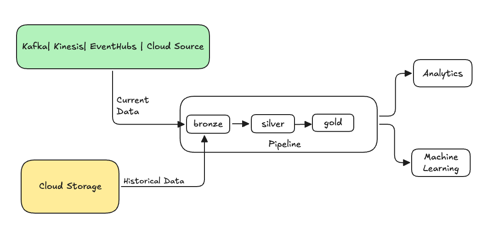

# Backfill historischer Daten mit Pipelines — Referenz

Dieses Dokument beschreibt, wie historische Daten nachträglich in eine Lakeflow-Declarative-Pipeline (LDP) eingespielt werden ("Backfilling") — über einen spezialisierten Append-Flow mit der `ONCE`-Option. Verifiziert per `WebFetch` gegen die Azure-Spiegelseite (`learn.microsoft.com/en-us/azure/databricks/ldp/flows-backfill`), die eine vollständige, wörtliche Wiedergabe des Roh-Markdowns lieferte. Ein Bild wurde erfolgreich heruntergeladen und liegt lokal unter `images/dlt-backfill-process.png`.

## Abschnittsübersicht

1. [Was ist Backfilling?](#was-ist-backfilling)
2. [Überlegungen beim Backfill in eine Streaming Table](#ueberlegungen)
3. [Beispiel: Backfill zu einer bestehenden Pipeline hinzufügen](#beispiel-backfill)
4. [Beispiel: SCD-Ziel während einer Migration befüllen](#beispiel-scd-migration)
5. [Quellen](#quellen)

---

## <a id="was-ist-backfilling">1. Was ist Backfilling?</a>

In der Data-Engineering-Praxis bezeichnet *Backfilling* den Prozess, historische Daten nachträglich durch eine Pipeline zu verarbeiten, die ursprünglich für die Verarbeitung aktueller oder streamender Daten konzipiert wurde. Typischerweise handelt es sich dabei um einen separaten Flow, der Daten in bestehende Tabellen einspeist.



Szenarien, die einen Backfill erfordern können:

- Historische Daten aus einem Legacy-System verarbeiten, um ein ML-Modell zu trainieren oder ein historisches Trend-Dashboard aufzubauen.
- Eine Teilmenge der Daten wegen eines Datenqualitätsproblems in Upstream-Quellen erneut verarbeiten.
- Geänderte Geschäftsanforderungen erfordern einen Backfill für einen anderen Zeitraum, der von der initialen Pipeline nicht abgedeckt war.
- Geänderte Geschäftslogik erfordert die Neuverarbeitung sowohl historischer als auch aktueller Daten.

Ein Backfill in Lakeflow-Pipelines wird über einen spezialisierten Append-Flow mit der `ONCE`-Option unterstützt (siehe `append_flow`- bzw. `CREATE FLOW`-Referenz).

## <a id="ueberlegungen">2. Überlegungen beim Backfill in eine Streaming Table</a>

- Historische Daten typischerweise an die Bronze-Streaming-Table anhängen — nachgelagerte Silver-/Gold-Layer übernehmen die neuen Daten automatisch aus der Bronze-Schicht.
- Sicherstellen, dass die Pipeline doppelte Daten robust handhabt, falls dieselben Daten mehrfach angehängt werden.
- Sicherstellen, dass das historische Datenschema mit dem aktuellen Datenschema kompatibel ist.
- Datenvolumen und benötigtes Verarbeitungs-SLA berücksichtigen und Cluster- sowie Batch-Größen entsprechend konfigurieren.

## <a id="beispiel-backfill">3. Beispiel: Backfill zu einer bestehenden Pipeline hinzufügen</a>

Ausgangslage: Eine Pipeline liest rohe Event-Registrierungsdaten aus einer Cloud-Speicherquelle ein, beginnend ab dem 01.01.2025. Später soll ein Backfill der vorangegangenen drei Jahre historischer Daten für nachgelagertes Reporting ergänzt werden. Alle Daten liegen an einem Ort, partitioniert nach Jahr, Monat und Tag, im JSON-Format.

### Ausgangs-Pipeline

Inkrementelle Ingestion der rohen Event-Registrierungsdaten aus Cloud-Speicher:

```python
from pyspark import pipelines as dp

source_root_path = spark.conf.get("registration_events_source_root_path")
begin_year = spark.conf.get("begin_year")
incremental_load_path = f"{source_root_path}/*/*/*"

# create a streaming table and the default flow to ingest streaming events
@dp.table(name="registration_events_raw", comment="Raw registration events")
def ingest():
    return (
        spark
        .readStream
        .format("cloudFiles")
        .option("cloudFiles.format", "json")
        .option("cloudFiles.inferColumnTypes", "true")
        .option("cloudFiles.maxFilesPerTrigger", 100)
        .option("cloudFiles.schemaEvolutionMode", "addNewColumns")
        .option("modifiedAfter", "2025-01-01T00:00:00.000+00:00")
        .load(incremental_load_path)
        .where(f"year(timestamp) >= {begin_year}") # safeguard to not process data before begin_year
    )
```

```sql
-- create a streaming table and the default flow to ingest streaming events
CREATE OR REFRESH STREAMING LIVE TABLE registration_events_raw AS
SELECT * FROM read_files(
  "/Volumes/gc/demo/apps_raw/event_registration/*/*/*",
  format => "json",
  inferColumnTypes => true,
  maxFilesPerTrigger => 100,
  schemaEvolutionMode => "addNewColumns",
  modifiedAfter => "2024-12-31T23:59:59.999+00:00"
)
WHERE year(timestamp) >= '2025'; -- safeguard to not process data before begin_year
```

Die Auto-Loader-Option `modifiedAfter` sorgt dafür, dass nicht alle Daten aus dem Cloud-Speicherpfad verarbeitet werden — die inkrementelle Verarbeitung ist an dieser Grenze gekappt.

**Tipp laut Doku:** Andere Datenquellen wie Kafka, Kinesis und Azure Event Hubs haben äquivalente Reader-Optionen, um dasselbe Verhalten zu erreichen.

### Backfill der vorangegangenen 3 Jahre

Ein oder mehrere Flows werden ergänzt, um vorherige Daten zu befüllen:

- Der `append once`-Flow wird verwendet — führt einen einmaligen Backfill durch, ohne nach diesem ersten Backfill weiterzulaufen. Der Code bleibt in der Pipeline; wird die Pipeline jemals vollständig refresht, läuft der Backfill erneut.
- Drei Backfill-Flows werden angelegt, einer pro Jahr (hier sind die Daten pfadweise nach Jahr aufgeteilt). In Python wird die Flow-Erstellung parametrisiert, in SQL wird der Code dreimal wiederholt, einmal pro Flow.

Bei Nicht-Serverless-Compute kann es sinnvoll sein, die maximale Worker-Zahl der Pipeline zu erhöhen, um ausreichend Ressourcen für die parallele Verarbeitung historischer und aktueller Streaming-Daten innerhalb des erwarteten SLA sicherzustellen.

**Tipp laut Doku:** Bei Serverless Compute mit Enhanced Autoscaling (Standard) skaliert der Cluster bei steigender Last automatisch.

```python
from pyspark import pipelines as dp

source_root_path = spark.conf.get("registration_events_source_root_path")
begin_year = spark.conf.get("begin_year")
backfill_years = spark.conf.get("backfill_years") # e.g. "2024,2023,2022"
incremental_load_path = f"{source_root_path}/*/*/*"

# meta programming to create append once flow for a given year (called later)
def setup_backfill_flow(year):
    backfill_path = f"{source_root_path}/year={year}/*/*"
    @dp.append_flow(
        target="registration_events_raw",
        once=True,
        name=f"flow_registration_events_raw_backfill_{year}",
        comment=f"Backfill {year} Raw registration events")
    def backfill():
        return (
            spark
            .read
            .format("json")
            .option("inferSchema", "true")
            .load(backfill_path)
        )

# create the streaming table
dp.create_streaming_table(name="registration_events_raw", comment="Raw registration events")

# append the original incremental, streaming flow
@dp.append_flow(
        target="registration_events_raw",
        name="flow_registration_events_raw_incremental",
        comment="Raw registration events")
def ingest():
    return (
        spark
        .readStream
        .format("cloudFiles")
        .option("cloudFiles.format", "json")
        .option("cloudFiles.inferColumnTypes", "true")
        .option("cloudFiles.maxFilesPerTrigger", 100)
        .option("cloudFiles.schemaEvolutionMode", "addNewColumns")
        .option("modifiedAfter", "2024-12-31T23:59:59.999+00:00")
        .load(incremental_load_path)
        .where(f"year(timestamp) >= {begin_year}")
    )

# parallelize one time multi years backfill for faster processing
# split backfill_years into array
for year in backfill_years.split(","):
    setup_backfill_flow(year) # call the previously defined append_flow for each year
```

```sql
-- create the streaming table
CREATE OR REFRESH STREAMING TABLE registration_events_raw;

-- append the original incremental, streaming flow
CREATE FLOW
  registration_events_raw_incremental
AS INSERT INTO
  registration_events_raw BY NAME
SELECT * FROM STREAM read_files(
  "/Volumes/gc/demo/apps_raw/event_registration/*/*/*",
  format => "json",
  inferColumnTypes => true,
  maxFilesPerTrigger => 100,
  schemaEvolutionMode => "addNewColumns",
  modifiedAfter => "2024-12-31T23:59:59.999+00:00"
)
WHERE year(timestamp) >= '2025';

-- one time backfill 2024
CREATE FLOW
  registration_events_raw_backfill_2024
AS INSERT INTO ONCE
  registration_events_raw BY NAME
SELECT * FROM read_files(
  "/Volumes/gc/demo/apps_raw/event_registration/year=2024/*/*",
  format => "json",
  inferColumnTypes => true
);

-- one time backfill 2023
CREATE FLOW
  registration_events_raw_backfill_2023
AS INSERT INTO ONCE
  registration_events_raw BY NAME
SELECT * FROM read_files(
  "/Volumes/gc/demo/apps_raw/event_registration/year=2023/*/*",
  format => "json",
  inferColumnTypes => true
);

-- one time backfill 2022
CREATE FLOW
  registration_events_raw_backfill_2022
AS INSERT INTO ONCE
  registration_events_raw BY NAME
SELECT * FROM read_files(
  "/Volumes/gc/demo/apps_raw/event_registration/year=2022/*/*",
  format => "json",
  inferColumnTypes => true
);
```

Diese Implementierung veranschaulicht mehrere wichtige Muster:

**Trennung der Zuständigkeiten:** Inkrementelle Verarbeitung ist unabhängig von Backfill-Operationen. Jeder Flow hat seine eigene Konfiguration und Optimierungseinstellungen. Es gibt eine klare Trennung zwischen inkrementellen und Backfill-Operationen.

**Kontrollierte Ausführung:** Die `ONCE`-Option stellt sicher, dass jeder Backfill genau einmal läuft. Der Backfill-Flow bleibt im Pipeline-Graph, wird aber nach Abschluss idle — bereit für den automatischen erneuten Einsatz bei einem Full Refresh. Es entsteht eine klare Audit-Spur der Backfill-Operationen in der Pipeline-Definition.

**Verarbeitungsoptimierung:** Ein großer Backfill lässt sich in mehrere kleinere Backfills aufteilen, für schnellere Verarbeitung oder zur Steuerung. Enhanced Autoscaling skaliert die Clustergröße dynamisch je nach aktueller Last.

**Schema-Evolution:** `schemaEvolutionMode="addNewColumns"` handhabt Schema-Änderungen robust; konsistente Schema-Inferenz über historische und aktuelle Daten hinweg; sichere Behandlung neuer Spalten in neueren Daten.

## <a id="beispiel-scd-migration">4. Beispiel: SCD-Ziel während einer Migration befüllen</a>

Ein verbreitetes Migrationsszenario ist eine Slowly-Changing-Dimension-(SCD)-Tabelle, die bereits in einem Legacy-System mit jahrelang akkumulierter Historie existiert, deren ursprünglicher Change Feed aber nicht mehr verfügbar ist. Da die ursprünglichen Change-Events fehlen, wird stattdessen die Historie der Legacy-Tabelle selbst einmalig in das neue `AUTO CDC`-Ziel eingespielt, und anschließend ein frischer CDC-Feed für die Zukunft angehängt.

Das Muster ist ein einmaliger `AUTO CDC`-Flow in dieselbe Streaming Table, die der laufende `AUTO CDC`-Flow anspricht. Ein `AUTO CDC`-Ziel akzeptiert nur `AUTO CDC`-Flows — die Seed-Ladung muss daher ebenfalls ein `AUTO CDC`-Flow sein. Ein einfacher `INSERT INTO ONCE`-Append-Flow in dieselbe Tabelle schlägt bei der Validierung fehl:

1. **Ziel-Streaming-Table anlegen**, in die der `AUTO CDC`-Flow schreibt.
2. **Legacy-Historie einmalig einspielen** mit einem `AUTO CDC ONCE`-Flow, der die Legacy-SCD-Tabelle als Stream liest, sequenziert nach der Legacy-Gültigkeits-Startspalte. Die Legacy-Zeilen werden als Change-Events wiederabgespielt, statt sie selbst zu formen — `AUTO CDC` baut die `__START_AT`-/`__END_AT`-Historienspalten für ein SCD-Typ-2-Ziel selbst auf, diese Spalten sollten also nicht direkt geschrieben werden.
3. **Laufenden `AUTO CDC`-Flow anhängen**, der den frischen Change Feed liest. `AUTO CDC` löst die Reihenfolge pro Key auf, daher muss der Cutover für jeden Business Key einzeln gelten: Die erste Live-Änderung jedes Keys muss zeitlich nach der letzten geseedeten Änderung desselben Keys liegen. Ein Sequenzwert, der lediglich später als das globale Legacy-Maximum liegt, kann für einen einzelnen Key dennoch veraltet sein — dessen erste Live-Änderung wird dann ignoriert oder falsch eingeordnet.

```sql
CREATE OR REFRESH STREAMING TABLE customers_history;

-- One-time seed: replay the legacy history as change events
CREATE FLOW customers_history_seed
AS AUTO CDC ONCE INTO customers_history
FROM stream(legacy.customers_scd2)
KEYS (customer_id)
SEQUENCE BY valid_from
STORED AS SCD TYPE 2;

-- Ongoing live CDC into the same target
CREATE FLOW customers_history_cdc
AS AUTO CDC INTO customers_history
FROM stream(customers_cdc_bronze)
KEYS (customer_id)
SEQUENCE BY change_timestamp
STORED AS SCD TYPE 2;
```

Beide Flows müssen bei Keys, SCD-Typ und dem Datentyp ihrer Sequenzierungsspalte übereinstimmen. Im obigen Beispiel sequenzieren beide Flows nach einem Zeitstempel, wodurch ein einzelner Cutover-Zeitpunkt die geseedete Historie von der Live-Zufuhr trennt. Sequenziert die Legacy-Tabelle nach einem Wert eines anderen Typs als der Live-Feed, muss einer der beiden gecastet werden, damit die Typen übereinstimmen.

Dasselbe Muster funktioniert für ein SCD-Typ-1-Ziel: `STORED AS SCD TYPE 2` wird in beiden Flows zu `STORED AS SCD TYPE 1` geändert, das Ziel behält dann nur die aktuelle Zeile pro Key. Vor dem produktiven Einsatz beider Varianten sollte an einer Stichprobe von Keys validiert werden, dass die erste Live-Änderung für einen geseedeten Key genau eine neue Version erzeugt und die vorherige korrekt schließt — eine Sequenzierungslücke pro Key zeigt sich normalerweise genau an dieser Stelle.

---

## <a id="quellen">5. Quellen</a>

- Backfilling historical data with pipelines (Azure-Spiegelseite, vollständig als Rohtext abgerufen, inkl. Bild-URL): https://learn.microsoft.com/en-us/azure/databricks/ldp/flows-backfill
- Backfilling historical data with pipelines (AWS): https://docs.databricks.com/aws/en/ldp/flows-backfill
- Bild-Original: https://learn.microsoft.com/en-us/azure/databricks/_static/images/dlt/dlt-backfill-process.png (lokal gespeichert unter `images/dlt-backfill-process.png`)

**Stand:** 2026-08-19.
