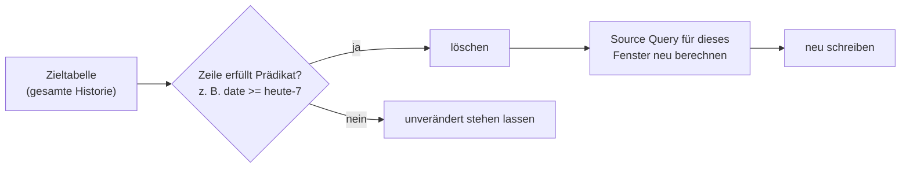

# Batch-Verarbeitung mit REPLACE-WHERE-Flows — Referenz

Dieses Dokument beschreibt REPLACE-WHERE-Flows in Lakeflow-Declarative-Pipelines (LDP): Sie berechnen und überschreiben eine gezielte Teilmenge einer Tabelle neu, ohne die gesamte Tabellenhistorie erneut zu verarbeiten. Verifiziert per `WebFetch` gegen die Azure-Spiegelseite (`learn.microsoft.com/en-us/azure/databricks/ldp/flows-replace-where`), die eine vollständige, wörtliche Wiedergabe des Roh-Markdowns lieferte.

## Abschnittsübersicht

1. [Grundprinzip](#grundprinzip)
2. [Voraussetzungen](#voraussetzungen)
3. [Wann REPLACE-WHERE-Flows einsetzen](#wann-einsetzen)
4. [Einen REPLACE-WHERE-Flow anlegen](#anlegen)
5. [Historische Daten nachträglich einspielen (Backfill)](#backfill)
6. [Full-Refresh-Verhalten](#full-refresh)
7. [Inkrementelles Refresh](#inkrementelles-refresh)
8. [Limitierungen](#limitierungen)
9. [Beispiele](#beispiele)
10. [Quellen](#quellen)

---

## <a id="grundprinzip">1. Grundprinzip</a>

REPLACE-WHERE-Flows berechnen und überschreiben eine gezielte Teilmenge einer Tabelle, ohne die gesamte Tabellenhistorie neu zu verarbeiten. Sie handhaben verspätet eintreffende Daten, Upstream-Reprocessing, Schema-Evolution und Backfills.

Bei einem REPLACE-WHERE-Flow wird ein Prädikat auf der Zieltabelle definiert. Alle Zeilen, die dem Prädikat entsprechen, werden gelöscht und durch erneute Auswertung der Source Query für denselben Prädikatsbereich ersetzt. Zeilen, die dem Prädikat nicht entsprechen, bleiben unangetastet.



## <a id="voraussetzungen">2. Voraussetzungen</a>

- Databricks empfiehlt Unity Catalog und Serverless Compute. **Inkrementelles Refresh wird nur auf Serverless Compute unterstützt.**

## <a id="wann-einsetzen">3. Wann REPLACE-WHERE-Flows einsetzen</a>

- **Inkrementelle Batch-Verarbeitung ohne Streaming-Semantik:** Neue Zeilen in Batches verarbeiten, ohne Streaming-Konzepte wie Watermarks zu verwalten.
- **Selektives Reprocessing:** Nur Zeilen neu berechnen, die einem Prädikat entsprechen — alle anderen Zeilen bleiben unangetastet.
- **Szenarien jenseits der Fähigkeiten von Standard-Materialized-Views:**
  - Zieltabellen mit längerer Aufbewahrungsdauer als die Quelle.
  - Verhinderung von Neuberechnung, wenn sich eine Dimensionstabelle ändert.
  - Schema-Evolution ohne Neuberechnung der gesamten Historie.

## <a id="anlegen">4. Einen REPLACE-WHERE-Flow anlegen</a>

REPLACE-WHERE-Flows lassen sich in SQL oder Python definieren.

**SQL — `FLOW REPLACE WHERE`-Klausel inline mit `CREATE STREAMING TABLE`:**

```sql
CREATE STREAMING TABLE orders_enriched
FLOW REPLACE WHERE date >= date_add(current_date(), -7) BY NAME
SELECT
  o.order_id,
  o.date,
  o.region,
  p.product_name,
  o.qty,
  o.price
FROM orders_fct o
JOIN product_dim p
  ON o.product_id = p.product_id;
```

Alternativ die Langform mit `CREATE FLOW`:

```sql
CREATE STREAMING TABLE orders_enriched;

CREATE FLOW orders_enriched AS
INSERT INTO orders_enriched BY NAME
REPLACE WHERE date >= date_add(current_date(), -7)
SELECT
  o.order_id,
  o.date,
  o.region,
  p.product_name,
  o.qty,
  o.price
FROM orders_fct o
JOIN product_dim p
  ON o.product_id = p.product_id;
```

**Python** — Tabelle und Flow werden in einer einzigen Anweisung definiert; der Flow erbt den Namen der Tabelle:

```python
from pyspark import pipelines as dp
from pyspark.sql import functions as F
from pyspark.sql.functions import col

@dp.table(
  replace_where=col("date") >= F.date_sub(F.current_date(), 7)
)
def orders_enriched():
  orders_fct = spark.read.table("orders_fct").select("date", "order_id", "region", "qty", "price")
  product_dim = spark.read.table("product_dim")
  return orders_fct.join(product_dim, "product_id")
```

Der `replace_where`-Parameter akzeptiert entweder einen PySpark-Column-Ausdruck oder einen String-Prädikat.

In diesen Beispielen werden alle Zeilen der letzten 7 Tage aus `orders_enriched` gelöscht und über die Source Query neu berechnet. Das Prädikat muss nicht selbst zur Source Query hinzugefügt werden — die Pipeline-Engine wendet es beim Lesen aus der Quelle automatisch an.

**Hinweis:** `BY NAME` ist in SQL erforderlich — es matched Spalten nach Name statt nach Position.

## <a id="backfill">5. Historische Daten nachträglich einspielen (Backfill)</a>

Um historische oder korrigierte Zeilen außerhalb geplanter Refreshes in die Zieltabelle zu schreiben, gibt es zwei Mechanismen, je nachdem wo die historischen Daten liegen:

- **Predicate Overrides:** Die Source Query des Flows für einen einmaligen Prädikatsbereich erneut ausführen. Einsatz, wenn die historischen Daten aus derselben Quelle stammen wie die inkrementellen Daten.
- **DML-Anweisungen:** Direkt in die Zieltabelle einfügen, am Flow vorbei. Einsatz, wenn die historischen Daten in einer anderen Quelle liegen als die inkrementellen Daten.

### Predicate Overrides

Überschreiben das REPLACE-WHERE-Prädikat für ein einzelnes Pipeline-Update, ohne die Pipeline-Definition zu ändern. Predicate Overrides sind einmalig, gelten nur für das aktuelle Update und wirken sich nicht auf künftige Läufe aus.

**Beispiel — initiale historische Befüllung:**

```python
pipeline_id = "<pipeline-id>"
overrides = [
  {
    "flow_name": "orders_enriched",
    "predicate_override": "date BETWEEN '2020-01-01' AND '2024-12-31'",
  }
]

resp = start_update_with_replace_where(
  pipeline_id=pipeline_id,
  replace_where_overrides=overrides,
)
print(resp)
```

**Beispiel — Spalte für einen bestimmten Zeitraum korrigieren:**

```python
pipeline_id = "<pipeline-id>"
overrides = [
  {
    "flow_name": "orders_enriched",
    "predicate_override": "date >= date_add(current_date(), -30)",
  }
]

resp = start_update_with_replace_where(
  pipeline_id=pipeline_id,
  replace_where_overrides=overrides,
  refresh_selection=["orders_enriched"],
)
print(resp)
```

Mehrere Dimensionen lassen sich in einem Predicate Override kombinieren:

```python
overrides = [
  {
    "flow_name": "orders_enriched",
    "predicate_override": "date >= date_add(current_date(), -30) AND region = 'asia'",
  }
]
```

**Helper-Funktion `start_update_with_replace_where`** — nutzt die Pipeline-Update-API aus einem Notebook, um Predicate Overrides zu übermitteln:

```python
from databricks.sdk import WorkspaceClient
from databricks.sdk.service.pipelines import StartUpdateResponse

def start_update_with_replace_where(
  pipeline_id: str,
  replace_where_overrides: list[dict],
  refresh_selection: list[str] = None,
) -> StartUpdateResponse:
  """Start a pipeline update with REPLACE WHERE predicate overrides."""
  client = WorkspaceClient()

  body = {
    "pipeline_id": pipeline_id,
    "cause": "JOB_TASK",
    "update_cause_details": {
      "job_details": {"performance_target": "PERFORMANCE"}
    },
    "replace_where_overrides": replace_where_overrides,
  }

  if refresh_selection:
    body["refresh_selection"] = refresh_selection

  res = client.api_client.do(
    "POST",
    f"/api/2.0/pipelines/{pipeline_id}/updates",
    body=body,
    headers={"Accept": "application/json", "Content-Type": "application/json"},
  )

  return StartUpdateResponse.from_dict(res)
```

### DML-Anweisungen

DML-Anweisungen lassen sich direkt auf der Zieltabelle außerhalb der Pipeline ausführen, etwa für initiale Ladungen oder Korrekturen — z. B. das Laden aus einer Legacy-Tabelle:

```sql
INSERT INTO orders_enriched
SELECT *
FROM orders_enriched_legacy
WHERE date < '2025-01-01';
```

Über DML eingefügte Zeilen unterliegen nicht dem REPLACE-WHERE-Prädikat und bleiben über geplante Refreshes hinweg bestehen, sofern sie nicht in den Prädikatsbereich eines künftigen Laufs fallen.

## <a id="full-refresh">6. Full-Refresh-Verhalten</a>

Ein Full Refresh eines REPLACE-WHERE-Flows führt die Source Query erneut aus, nur unter Verwendung des aktuellen Prädikats. Zeilen, die durch Predicate Overrides oder DML-Anweisungen außerhalb des aktuellen Prädikatsbereichs eingefügt wurden, werden dabei dauerhaft gelöscht.

**Warnung:** Ein Full Refresh löscht alle bestehenden Daten und führt den Flow ausschließlich mit seinem definierten Prädikat erneut aus. Läuft eine Pipeline seit einem Jahr mit einem 7-Tage-Prädikat, enthält die Tabelle nach einem Full Refresh nur noch die letzten 7 Tage — alle älteren Zeilen werden dauerhaft gelöscht.

Um Full Refreshes auf einer Tabelle zu verhindern, wird die Tabellen-Property `pipelines.reset.allowed` auf `false` gesetzt.

## <a id="inkrementelles-refresh">7. Inkrementelles Refresh</a>

REPLACE-WHERE-Flows nutzen wo möglich inkrementelles Refresh — dabei wird nur die seit dem letzten Refresh geänderte Quelldaten neu verarbeitet, statt das gesamte Replace-Fenster neu zu berechnen. **Inkrementelles Refresh setzt Serverless Compute voraus.**

### Wann inkrementelles Refresh greift

Alle folgenden Bedingungen müssen erfüllt sein:

- Die Pipeline läuft auf Serverless Compute.
- Die Query-Form wird unterstützt (siehe `Inkrementelles Refresh.md` in `07 Transformationen` für die unterstützten Operatoren).
- Das Prädikat referenziert Basis-Spalten aus einer Quelltabelle. Prädikate auf abgeleiteten Werten (z. B. Aggregat- oder Fensterfunktions-Ausgaben) lassen sich nicht zur Quelle durchreichen, was inkrementelles Refresh deaktiviert.
- Kein externes DML hat Zeilen im aktuellen Replace-Fenster verändert. DML außerhalb des aktuellen Fensters ist davon nicht betroffen.
- Das aktuelle Replace-Fenster enthält keine Zeilen, die das vorherige Prädikat ausgeschlossen hat. Wird das Prädikat auf einen zuvor nicht verarbeiteten Bereich erweitert, fällt genau dieses eine Refresh auf vollständige Neuberechnung zurück — nachfolgende Refreshes sind wieder für inkrementelles Refresh geeignet.
- Das Prädikat ist deterministisch. Prädikate mit nicht-deterministischen Funktionen wie `rand()` deaktivieren inkrementelles Refresh; zeitliche Funktionen wie `current_date()` sind erlaubt.

Das erste Refresh eines jeden Flows ist immer eine vollständige Berechnung. Ist eine Bedingung nicht erfüllt, fällt das jeweilige Refresh auf vollständige Neuberechnung des aktuellen Replace-Fensters zurück.

### Best Practices für inkrementelles Refresh

**Bewegliche untere Grenze verwenden** — Prädikate mit beweglicher unterer Grenze bleiben dauerhaft für inkrementelles Refresh geeignet:

```sql
FLOW REPLACE WHERE date >= date_add(current_date(), -7)
```

Eine bewegliche obere Grenze (z. B. `date BETWEEN date_add(current_date(), -7) AND current_date()`) kann das Fenster so verschieben, dass zuvor ausgeschlossene Zeilen einbezogen werden — das löst einen einmaligen Rückfall auf vollständige Neuberechnung aus.

**Prädikatsspalte in `GROUP BY` einschließen** — bei Aggregationen muss die Prädikatsspalte in `GROUP BY` enthalten sein, damit die Engine das Prädikat unter die Aggregation durchreichen kann:

```sql
FLOW REPLACE WHERE date >= date_add(current_date(), -7) BY NAME
SELECT date, region, SUM(amount) AS total
FROM sales
GROUP BY date, region;
```

Fehlt die Prädikatsspalte in `GROUP BY`, lässt sich das Prädikat nicht unter die Aggregation durchreichen und die Quelle wird vollständig gescannt.

**Prädikatsspalte in Join-Keys einschließen** — damit die Engine alle gejointen Quellen einschränken kann:

```sql
FLOW REPLACE WHERE date >= date_add(current_date(), -7) BY NAME
SELECT f.date, f.user_id, d.region, f.revenue
FROM fact f
JOIN dim d ON f.date = d.date AND f.user_id = d.user_id;
```

Legt eine gejointe Tabelle die Prädikatsspalte nicht offen, wird diese Tabelle bei jedem Refresh vollständig gescannt.

### Rückfall auf vollständige Neuberechnung diagnostizieren

Fällt ein Refresh auf vollständige Neuberechnung zurück, wird der Grund im `planning_information`-Event des Flows berichtet:

| Grund | Bedeutung |
|---|---|
| `EXTERNAL_CHANGE_IN_REPLACE_WINDOW` | Ein externes DML hat Zeilen im aktuellen Replace-Fenster verändert. |
| `REPLACE_WHERE_NOT_DETERMINISTIC` | Das Prädikat verwendet nicht-deterministische Ausdrücke. |
| `PRIOR_REPLACE_WHERE_NOT_DETERMINISTIC` | Das vorherige Refresh nutzte ein nicht-deterministisches Prädikat. |
| `UNSUPPORTED_REPLACE_WHERE_PREDICATE` | Das Prädikat lässt sich zu keiner Quelle durchreichen, das aktuelle Fenster enthält vom vorherigen Prädikat nicht verarbeitete Zeilen, oder der Lauf nutzt einen Predicate Override. |

## <a id="limitierungen">8. Limitierungen</a>

- Die Zieltabelle muss innerhalb der Pipeline erstellt werden.
- Pro Zieltabelle ist nur ein REPLACE-WHERE-Flow zulässig.
- Eine von einem REPLACE-WHERE-Flow angesteuerte Tabelle kann nicht gleichzeitig Ziel eines anderen Flow-Typs sein (z. B. AUTO-CDC-Flow oder Append-Flow).
- Expectations werden auf Tabellen, die von REPLACE-WHERE-Flows angesteuert werden, nicht unterstützt.
- Für eigenständige Streaming Tables (außerhalb von Lakeflow-Pipelines) gelten abweichende Syntax und Backfill-Details (separate Doku-Seite "REPLACE WHERE flows for standalone streaming tables").

## <a id="beispiele">9. Beispiele</a>

### Beispiel 1: Historische Aggregate aus einer Quelle mit begrenzter Aufbewahrung erhalten

Pflegt tägliche Aggregate dauerhaft, auch nachdem Rohdaten aus der Quelltabelle herausfallen (3-Tage-Retention):

```sql
CREATE STREAMING TABLE events_agg
FLOW REPLACE WHERE date >= date_add(current_date(), -3) BY NAME
SELECT
  date,
  key,
  SUM(val) AS agg
FROM events_raw
GROUP BY ALL;
```

```python
from pyspark import pipelines as dp
from pyspark.sql import functions as F
from pyspark.sql.functions import col

@dp.table(
  replace_where=col("date") >= F.date_sub(F.current_date(), 3)
)
def events_agg():
  return (
    spark.read.table("events_raw")
      .groupBy("date", "key")
      .agg(F.sum("val").alias("agg"))
  )
```

### Beispiel 2: Neuberechnung bei Änderung einer Dimensionstabelle verhindern

Hält historische Faktenzeilen unverändert, wenn sich Dimensionsattribute ändern:

```sql
CREATE STREAMING TABLE fact_dim_join
FLOW REPLACE WHERE f.date >= date_add(current_date(), -1) BY NAME
SELECT
  f.date,
  f.user_id,
  d.region,
  f.revenue
FROM fact_table f
JOIN dim_users d
  ON f.user_id = d.user_id;
```

```python
from pyspark import pipelines as dp
from pyspark.sql import functions as F
from pyspark.sql.functions import col

@dp.table(
  replace_where=col("date") >= F.date_sub(F.current_date(), 1)
)
def fact_dim_join():
  fact_table = spark.read.table("fact_table").alias("f")
  dim_users = spark.read.table("dim_users").alias("d")
  return (
    fact_table.join(dim_users, col("f.user_id") == col("d.user_id"))
      .select(
        col("f.date"),
        col("f.user_id"),
        col("d.region"),
        col("f.revenue"),
      )
  )
```

Ändert sich die Region eines Nutzers, werden nur aktuelle Zeilen neu berechnet — historische Zeilen behalten den Regionswert zum Schreibzeitpunkt. Zur Korrektur historischer Zeilen wird ein gezielter Backfill über Predicate Overrides ausgeführt.

### Beispiel 3: Neue Metrik ergänzen, ohne die gesamte Historie neu zu berechnen

1. Initiale Tabellendefinition:

```sql
CREATE STREAMING TABLE clickstream_daily
FLOW REPLACE WHERE event_date >= date_add(current_date(), -7) BY NAME
SELECT
  event_date,
  page_id,
  COUNT(*) AS clicks
FROM clickstream_raw
GROUP BY ALL;
```

```python
from pyspark import pipelines as dp
from pyspark.sql import functions as F
from pyspark.sql.functions import col

@dp.table(
  replace_where=col("event_date") >= F.date_sub(F.current_date(), 7)
)
def clickstream_daily():
  return (
    spark.read.table("clickstream_raw")
      .groupBy("event_date", "page_id")
      .agg(F.count("*").alias("clicks"))
  )
```

2. Query um `uniq_users` erweitern:

```sql
CREATE STREAMING TABLE clickstream_daily
FLOW REPLACE WHERE event_date >= date_add(current_date(), -7) BY NAME
SELECT
  event_date,
  page_id,
  COUNT(*) AS clicks,
  COUNT(DISTINCT user_id) AS uniq_users
FROM clickstream_raw
GROUP BY ALL;
```

```python
@dp.table(
  replace_where=col("event_date") >= F.date_sub(F.current_date(), 7)
)
def clickstream_daily():
  return (
    spark.read.table("clickstream_raw")
      .groupBy("event_date", "page_id")
      .agg(
        F.count("*").alias("clicks"),
        F.countDistinct("user_id").alias("uniq_users"),
      )
  )
```

3. Neue Metrik für die letzten 30 Tage nachträglich einspielen:

```python
overrides = [
  {
    "flow_name": "clickstream_daily",
    "predicate_override": "event_date BETWEEN '2026-01-01' AND '2026-01-30'",
  }
]

resp = start_update_with_replace_where(
  pipeline_id="<pipeline-id>",
  replace_where_overrides=overrides,
  refresh_selection=["clickstream_daily"],
)
```

Zeilen außerhalb des nachträglich befüllten Bereichs enthalten `NULL` für `uniq_users`.

### Beispiel 4: Auf einem kleinen Fenster iterieren, bevor die volle Historie befüllt wird

Zeigt, wie Query-Logik an einem kleinen Datenfenster validiert wird, bevor der volle historische Bereich verarbeitet wird. Zunächst ein kurzes Fenster, sodass jedes Refresh nur die letzten 7 Tage neu berechnet, während die Query überarbeitet wird:

```sql
CREATE STREAMING TABLE revenue_attribution
FLOW REPLACE WHERE event_date >= date_add(current_date(), -7) BY NAME
SELECT
  event_date,
  campaign_id,
  SUM(revenue) AS total_revenue
FROM marketing_events
GROUP BY ALL;
```

```python
from pyspark import pipelines as dp
from pyspark.sql import functions as F
from pyspark.sql.functions import col

@dp.table(
  replace_where=col("event_date") >= F.date_sub(F.current_date(), 7)
)
def revenue_attribution():
  return (
    spark.read.table("marketing_events")
      .groupBy("event_date", "campaign_id")
      .agg(F.sum("revenue").alias("total_revenue"))
  )
```

Ist die Query finalisiert, wird über einen Predicate Override ein einmaliger historischer Backfill ausgeführt:

```python
overrides = [
  {
    "flow_name": "revenue_attribution",
    "predicate_override": "event_date >= date_add(current_date(), -365)",
  }
]

resp = start_update_with_replace_where(
  pipeline_id="<pipeline-id>",
  replace_where_overrides=overrides,
  refresh_selection=["revenue_attribution"],
)
```

---

## <a id="quellen">10. Quellen</a>

- Batch processing with REPLACE WHERE flows (Azure-Spiegelseite, vollständig als Rohtext abgerufen): https://learn.microsoft.com/en-us/azure/databricks/ldp/flows-replace-where
- Batch processing with REPLACE WHERE flows (AWS): https://docs.databricks.com/aws/en/ldp/flows-replace-where
- https://docs.databricks.com/aws/en/dev-tools/sdk-python (`WorkspaceClient`-Grundlagen für das SDK-Beispiel oben; vollständige SDK-Referenz siehe [Databricks SDK für Python.md](../../../../10%20Developers/07%20Databricks%20SDK%20fuer%20Python.md))

**Stand:** 2026-09-01.
