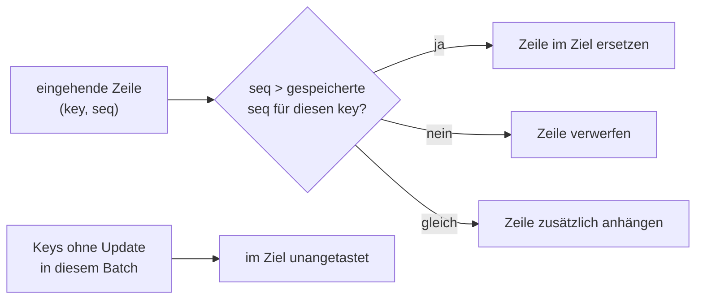
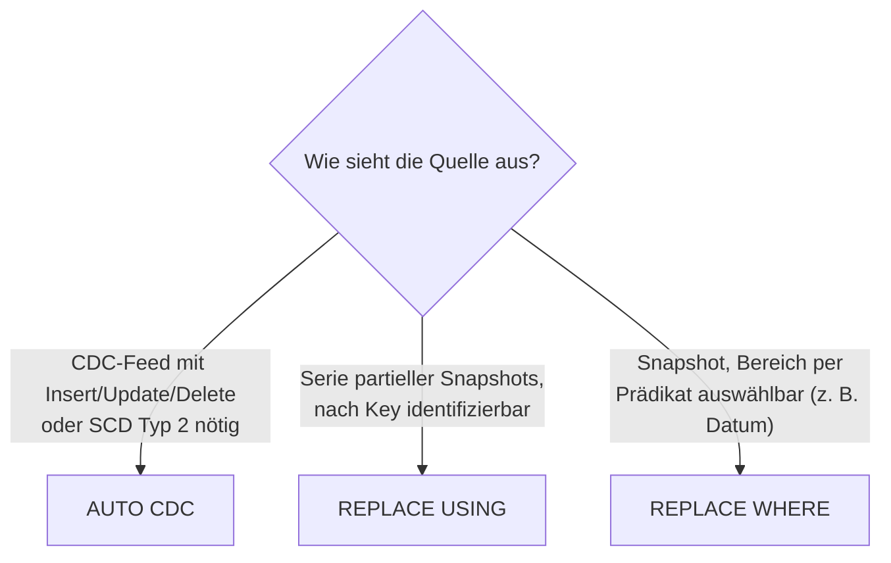

# Partieller Snapshot-Ersatz mit REPLACE-USING-Flows — Referenz

**Dieses Feature ist in Beta.**

Dieses Dokument beschreibt REPLACE-USING-Flows in Lakeflow-Declarative-Pipelines (LDP): Sie halten eine Zieltabelle mit einer streamenden Quelle synchron, indem sie alle Zeilen ersetzen, die den angegebenen Key-Spalten entsprechen, und alle übrigen Daten unverändert lassen. Verifiziert per `WebFetch` gegen die Azure-Spiegelseite (`learn.microsoft.com/en-us/azure/databricks/ldp/flows-replace-using`), die eine vollständige, wörtliche Wiedergabe des Roh-Markdowns lieferte.

## Abschnittsübersicht

1. [Grundprinzip](#grundprinzip)
2. [Wie REPLACE USING funktioniert](#funktionsweise)
3. [Voraussetzungen](#voraussetzungen)
4. [Wann REPLACE-USING-Flows einsetzen](#wann-einsetzen)
5. [Einen REPLACE-USING-Flow anlegen](#anlegen)
6. [Sequenzierung und nicht-geordnete Daten](#sequenzierung)
7. [Expectations](#expectations)
8. [Limitierungen](#limitierungen)
9. [Beispiele](#beispiele)
10. [Quellen](#quellen)

---

## <a id="grundprinzip">1. Grundprinzip</a>

Ein REPLACE-USING-Flow hält eine Zieltabelle mit einer streamenden Quelle synchron: Er ersetzt alle Zeilen, die den angegebenen Key-Spalten entsprechen, und lässt alle übrigen Daten unverändert.

Eine `SEQUENCE BY`-Spalte ordnet die Updates, sodass das Ergebnis auch bei nicht-geordnet eintreffenden Updates korrekt bleibt. Für jeden Key gewinnt die höchste Sequenz; eine Zeile mit niedrigerer Sequenz überschreibt niemals eine bereits im Ziel vorhandene Zeile mit höherer Sequenz. Zeilen mit gleichem Key **und** gleicher Sequenz werden angehängt statt ersetzt.



## <a id="funktionsweise">2. Wie REPLACE USING funktioniert</a>

Beispiel: Eine Events-Tabelle mit Click- und Conversion-Events für zwei Regionen, sequenziert nach `seq`:

| region_id | device_type | event_type | seq |
|---|---|---|---|
| 1 | iOS | click | 1 |
| 1 | Android | conversion | 1 |
| 2 | iOS | click | 1 |
| 2 | desktop | click | 1 |

Ein `REPLACE USING (region_id) SEQUENCE BY seq`-Flow erhält Updates für Region 1 und 3. Region 2 erhält keine Updates:

| region_id | device_type | event_type | seq |
|---|---|---|---|
| 1 | iOS | click | 2 |
| 1 | Android | conversion | 2 |
| 1 | desktop | click | 2 |
| 3 | iOS | click | 1 |
| 3 | desktop | click | 2 |

Die Zieltabelle wird zu:

| region_id | device_type | event_type | seq | Ergebnis |
|---|---|---|---|---|
| 1 | iOS | click | 2 | Ersetzt, da seq 2 größer als seq 1 |
| 1 | Android | conversion | 2 | Ersetzt, da seq 2 größer als seq 1 |
| 1 | desktop | click | 2 | Ersetzt, da seq 2 größer als seq 1 |
| 2 | iOS | click | 1 | Unangetastet, da der Key in diesem Update nicht vorkommt |
| 2 | desktop | click | 1 | Unangetastet, da der Key in diesem Update nicht vorkommt |
| 3 | desktop | click | 2 | Hinzugefügt. Die seq-1-Zeile für Region 3 wird nicht hinzugefügt, da nur die höchste Sequenz pro Key angewendet wird. |

## <a id="voraussetzungen">3. Voraussetzungen</a>

- REPLACE-USING-Flows laufen ab **Databricks Runtime 18.2**, auf Classic oder Serverless Compute. Databricks empfiehlt Unity Catalog.
- Die Quelle muss eine streamende Quelle sein — REPLACE USING lehnt nicht-streamende Quellen ab.
- Mindestens eine Key-Spalte und genau eine `SEQUENCE BY`-Spalte müssen angegeben werden.

## <a id="wann-einsetzen">4. Wann REPLACE-USING-Flows einsetzen</a>

Lakeflow-Pipelines bieten drei Flow-Typen, die bestehende Zeilen überschreiben — die Wahl richtet sich danach, wie die Quelle aussieht und wie sie die zu ersetzenden Zeilen identifiziert:

- **REPLACE USING**, wenn die Quelle eine Serie partieller Snapshots ist, die nach Spalte(n) mit Key versehen sind. REPLACE USING überschreibt nur Daten mit einem Match in den eingehenden Daten und lässt alles andere unangetastet — erfordert keinen Primärschlüssel.
- **AUTO CDC**, wenn die Quelle ein Change-Data-Capture-Feed mit expliziten **Insert-**, **Update-** und **Delete**-Operationen ist, oder **SCD-Typ-2**-Historie benötigt wird. AUTO CDC erfordert einen echten Primärschlüssel (siehe `CDC-Grundlagen.md` in `05 CDC`).
- **REPLACE WHERE**, wenn die Quelle ein Snapshot ist und ein per Prädikat ausgewählter Bereich der Zieltabelle als Batch-Operation neu berechnet und überschrieben werden soll (z. B. die letzten 7 Tage) — erfordert keinen Primärschlüssel (siehe `Flows mit REPLACE WHERE.md` in diesem Ordner).



## <a id="anlegen">5. Einen REPLACE-USING-Flow anlegen</a>

REPLACE-USING-Flows lassen sich in SQL oder Python definieren.

**SQL — `FLOW REPLACE USING`-Klausel inline mit `CREATE STREAMING TABLE`:**

```sql
CREATE STREAMING TABLE payments_current
FLOW REPLACE USING (payment_id) SEQUENCE BY payment_date BY NAME
SELECT payment_id, booking_id, status, payment_date
FROM STREAM(samples.wanderbricks.payments);
```

Alternativ die Langform mit `CREATE FLOW`:

```sql
CREATE STREAMING TABLE payments_current;

CREATE FLOW payments_flow AS
INSERT INTO payments_current BY NAME
REPLACE USING (payment_id) SEQUENCE BY payment_date
SELECT payment_id, booking_id, status, payment_date
FROM STREAM(samples.wanderbricks.payments);
```

**Hinweis:** `BY NAME` ist in SQL erforderlich — matched Spalten nach Name statt nach Position.

**Python** — Tabelle und Flow zusammen mit `@dp.table` deklariert:

```python
from pyspark import pipelines as dp

@dp.table(name="payments_current", replace_using=["payment_id"], sequence_by="payment_date")
def payments_current():
  return spark.readStream.table("samples.wanderbricks.payments")
```

Alternativ eine bestehende Streaming Table über `@dp.replace_flow` ansteuern:

```python
from pyspark import pipelines as dp

dp.create_streaming_table("payments_current")

@dp.replace_flow(target="payments_current", replace_using=["payment_id"], sequence_by="payment_date")
def payments_flow():
  return spark.readStream.table("samples.wanderbricks.payments")
```

`replace_using` ist eine Liste von Key-Spalten. `sequence_by` ist ein Spaltenname oder ein `Column`-Ausdruck und ist immer erforderlich, sobald `replace_using` gesetzt ist.

## <a id="sequenzierung">6. Sequenzierung und nicht-geordnete Daten</a>

Die `SEQUENCE BY`-Spalte macht das Ergebnis unabhängig von der Reihenfolge, in der Updates eintreffen. Eine Zeile wird nur dann auf einen Key angewendet, wenn ihre Sequenz größer ist als die bereits für diesen Key gespeicherte — eine verspätete oder wiederholte Zeile, die älter als der aktuelle Wert ist, wird ignoriert. Keys, die in einem Update nicht vorkommen, bleiben unangetastet.

| Praxis | Begründung |
|---|---|
| Eine Sequenz verwenden, die pro Key-Version strikt monoton steigt (z. B. Zeitstempel, Versionsnummer, Log-Offset). | Zwei Zeilen mit gleichem Key und gleicher Sequenz werden beide behalten — das führt zu doppelten Zeilen für diesen Key. |
| Eine nicht-null Sequenz verwenden. | Eine `null`-Sequenz kann zu undefiniertem Verhalten führen. |

## <a id="expectations">7. Expectations</a>

REPLACE-USING-Flows unterstützen Expectations. `warn` und `fail` verhalten sich wie bei anderen Flow-Typen: `warn` behält verletzende Zeilen und zeichnet die Verletzung auf, `fail` stoppt das Update.

Eine `drop`-Expectation behandelt eine verletzende Zeile so, als hätte die Quelle sie nie erzeugt. Die verworfene Zeile ersetzt, löscht oder ändert keine übereinstimmenden Keys in der Zieltabelle:

- Das Verwerfen geschieht vor der Deduplizierung, sodass der Flow die zuletzt gültige Version für den Key behält.
- Werden alle eingehenden Zeilen für einen Key verworfen, bleiben dessen bestehende Zeilen unangetastet.
- Da eine verworfene Zeile keine Sequenz-Untergrenze setzt, landet ein späteres gültiges Update dennoch, selbst wenn dessen Sequenz niedriger ist als die der verworfenen Zeile.

## <a id="limitierungen">8. Limitierungen</a>

- REPLACE USING unterstützt nur einen einzigen Flow pro Zieltabelle. Die Kombination von REPLACE USING mit einem anderen Flow-Typ auf demselben Ziel wird nicht unterstützt.
- Die Zieltabelle muss innerhalb der Pipeline erstellt werden.
- Die Quelle muss eine streamende Quelle sein.
- Mindestens eine Key-Spalte und eine `SEQUENCE BY`-Spalte müssen angegeben werden. Key-Spalten dürfen nicht wiederholt werden, und der Typ jeder Key-Spalte muss sortierbar sein — atomare Typen (Integer, String, Date) sind als Key zulässig, `MAP` und `VARIANT` nicht.
- Für eigenständige Streaming Tables gelten abweichende Syntax-Details (separate Doku-Seite "Apply partial snapshot replacement with REPLACE USING flows").

## <a id="beispiele">9. Beispiele</a>

Die folgenden Beispiele lesen aus `samples.wanderbricks.booking_updates`, einer Beispieltabelle mit Buchungs-Zustandsänderungen, die in jedem Unity-Catalog-aktivierten Workspace verfügbar ist. Jede Buchung erscheint einmal pro Änderung, sodass sich `booking_id` mit jeweils neuer `booking_update_id` wiederholt.

### Beispiel 1: Den neuesten Datensatz je Key behalten

Behält nur den aktuellen Stand jeder Buchung. Der Flow verwendet `booking_id` als Key und sequenziert nach `booking_update_id`, sodass das jüngste Update einer Buchung ihre früheren Versionen ersetzt. AUTO CDC stattdessen verwenden, wenn die Quelle ein Change Feed mit expliziten Insert-/Update-/Delete-Operationen ist.

```sql
CREATE OR REFRESH STREAMING TABLE bookings_current
FLOW REPLACE USING (booking_id) SEQUENCE BY booking_update_id BY NAME
SELECT booking_id, status, total_amount, booking_update_id
FROM STREAM(samples.wanderbricks.booking_updates);
```

```python
from pyspark import pipelines as dp

@dp.table(
  name="bookings_current",
  replace_using=["booking_id"],
  sequence_by="booking_update_id"
)
def bookings_current():
  return spark.readStream.table("samples.wanderbricks.booking_updates")
```

Dieses Beispiel sequenziert nach `booking_update_id` statt nach dem `updated_at`-Zeitstempel, da mehrere Updates derselben Buchung denselben Zeitstempel teilen können. Zeilen mit gleicher Sequenz werden angehängt statt ersetzt, was sonst mehr als eine Zeile für diese Buchungen hinterließe.

### Beispiel 2: Nach mehr als einer Spalte mit Key versehen

Wird ein Datensatz durch eine Kombination von Spalten identifiziert, werden alle in `REPLACE USING` gelistet. Hier wird jede Buchung durch `(property_id, booking_id)` identifiziert, sodass der Flow den aktuellen Stand jeder Buchung pro Unterkunft behält. Kann eine Key-Spalte `null` sein, matched REPLACE USING `null` gegen `null`, statt die Zeile zu überspringen.

```sql
CREATE OR REFRESH STREAMING TABLE bookings_by_property
FLOW REPLACE USING (property_id, booking_id) SEQUENCE BY booking_update_id BY NAME
SELECT property_id, booking_id, status, total_amount, booking_update_id
FROM STREAM(samples.wanderbricks.booking_updates);
```

```python
from pyspark import pipelines as dp

@dp.table(
  name="bookings_by_property",
  replace_using=["property_id", "booking_id"],
  sequence_by="booking_update_id"
)
def bookings_by_property():
  return spark.readStream.table("samples.wanderbricks.booking_updates")
```

### Beispiel 3: Ungültige Datensätze per Expectation verwerfen

Eine Expectation hält fehlerhafte Zeilen aus dem Ziel heraus. Eine verworfene Zeile wird behandelt, als hätte die Quelle sie nie erzeugt: Sie ersetzt oder löscht den übereinstimmenden Key nicht, und der Flow fällt auf die zuletzt gültige Zeile für diesen Key zurück. Dieser Flow verwirft Updates ohne positiven `total_amount`:

```python
from pyspark import pipelines as dp

@dp.table(
  name="bookings_validated",
  replace_using=["booking_id"],
  sequence_by="booking_update_id"
)
@dp.expect_or_drop("positive_amount", "total_amount > 0")
def bookings_validated():
  return spark.readStream.table("samples.wanderbricks.booking_updates")
```

---

## <a id="quellen">10. Quellen</a>

- Partial snapshot replacement with REPLACE USING flows (Azure-Spiegelseite, vollständig als Rohtext abgerufen): https://learn.microsoft.com/en-us/azure/databricks/ldp/flows-replace-using
- Partial snapshot replacement with REPLACE USING flows (AWS): https://docs.databricks.com/aws/en/ldp/flows-replace-using

**Stand:** 2026-08-19.
