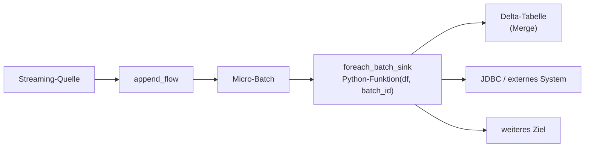

# ForEachBatch: Schreiben in beliebige Daten-Sinks in Pipelines — Referenz

Dieses Dokument beschreibt den ForEachBatch-Sink in Lakeflow-Declarative-Pipelines (LDP): Er verarbeitet einen Stream als Serie von Micro-Batches, wobei jeder Batch in Python mit benutzerdefinierter Logik verarbeitet werden kann — analog zu `foreachBatch` in Apache Spark Structured Streaming (reine PySpark-API-Referenz für `DataStreamWriter.foreachBatch()`, ohne Pipeline-Kontext: [08 Apache Spark/02 PySpark/05 DataStreamWriter/10 foreachBatch.md](../../../../08%20Apache%20Spark/02%20PySpark/05%20DataStreamWriter/10%20foreachBatch.md)). Verifiziert per `WebFetch` gegen die Azure-Spiegelseite (`learn.microsoft.com/en-us/azure/databricks/ldp/for-each-batch`), die eine vollständige, wörtliche Wiedergabe des Roh-Markdowns lieferte.

## Abschnittsübersicht

1. [Funktionsumfang des ForEachBatch-Sinks](#funktionsumfang)
2. [Wann ein ForEachBatch-Sink eingesetzt wird](#wann-einsetzen)
3. [Full Refresh](#full-refresh)
4. [Unity-Catalog-Features nutzen](#unity-catalog)
5. [Event-Log-Einträge](#event-log)
6. [Verwendung mit Databricks Connect](#databricks-connect)
7. [Best Practices](#best-practices)
8. [Limitierungen](#limitierungen)
9. [Beispiele](#beispiele)
10. [FAQ](#faq)
11. [Quellen](#quellen)

---

## <a id="funktionsumfang">1. Funktionsumfang des ForEachBatch-Sinks</a>

Mit dem Lakeflow-Pipelines-ForEachBatch-Sink lassen sich Streaming-Daten transformieren, mergen oder in ein oder mehrere Ziele schreiben, die native Streaming-Writes nicht unterstützen.



Der Sink bietet:

- **Benutzerdefinierte Logik pro Micro-Batch:** ForEachBatch ist ein flexibler Streaming-Sink — beliebige Aktionen (Merge in eine externe Tabelle, Schreiben an mehrere Ziele, Upserts) lassen sich mit Python-Code umsetzen.
- **Full-Refresh-Unterstützung:** Pipelines verwalten Checkpoints pro Flow, sodass Checkpoints bei einem Full Refresh der Pipeline automatisch zurückgesetzt werden. Beim ForEachBatch-Sink liegt die Verantwortung für den nachgelagerten Daten-Reset bei diesem Ereignis selbst beim Anwender.
- **Unity-Catalog-Unterstützung:** Alle Unity-Catalog-Features werden unterstützt, etwa Lesen aus/Schreiben in Unity-Catalog-Volumes oder -Tabellen.
- **Eingeschränktes Housekeeping:** Die Pipeline verfolgt nicht, welche Daten aus einem ForEachBatch-Sink geschrieben werden, und kann sie daher nicht bereinigen — die Verantwortung für nachgelagertes Datenmanagement liegt beim Anwender.
- **Event-Log-Einträge:** Das Pipeline-Event-Log zeichnet Erstellung und Nutzung jedes ForEachBatch-Sinks auf. Ist die Python-Funktion nicht serialisierbar, erscheint ein Warning-Eintrag im Event Log mit weiteren Vorschlägen.

**Hinweise laut Doku:**

- Der ForEachBatch-Sink ist für Streaming-Queries wie `append_flow` konzipiert — nicht für reine Batch-Pipelines oder für `AutoCDC`-Semantik gedacht.
- Der hier beschriebene ForEachBatch-Sink gilt für Pipelines. Apache Spark Structured Streaming unterstützt ebenfalls `foreachBatch` — für Details zum Structured-Streaming-`foreachBatch` siehe die separate Doku-Seite "Use foreachBatch to write to arbitrary data sinks".

## <a id="wann-einsetzen">2. Wann ein ForEachBatch-Sink eingesetzt wird</a>

Ein ForEachBatch-Sink wird immer dann eingesetzt, wenn die Pipeline Funktionalität benötigt, die über ein eingebautes Sink-Format wie `delta` oder `kafka` nicht verfügbar ist. Typische Anwendungsfälle:

- **Mergen/Upserten in eine Delta-Lake-Tabelle:** benutzerdefinierte Merge-Logik pro Micro-Batch (z. B. Behandlung aktualisierter Datensätze).
- **Schreiben an mehrere oder nicht unterstützte Ziele:** Ausgabe jedes Batches an mehrere Tabellen oder externe Speichersysteme, die keine Streaming-Writes unterstützen (etwa bestimmte JDBC-Sinks).
- **Anwenden benutzerdefinierter Logik/Transformationen:** direkte Datenmanipulation in Python (z. B. mit spezialisierten Bibliotheken oder fortgeschrittenen Transformationen).

ForEachBatch ist außerdem der zentrale Baustein für individuelles Fan-out-Routing — siehe `Flow-Muster (Fan-in, Fan-out, Multiplex).md`, Abschnitt 2c, für die drei wiederkehrenden Kombinationsmuster (ein Flow → mehrere Ziele, mehrere Flows → ein Sink, ein Flow → ein dedizierter Sink).

## <a id="full-refresh">3. Full Refresh</a>

Da ForEachBatch eine Streaming Query nutzt, verfolgt die Pipeline das Checkpoint-Verzeichnis für jeden Flow. Bei **Full Refresh:**

- wird das Checkpoint-Verzeichnis zurückgesetzt,
- sieht die Sink-Funktion (`foreach_batch_sink`-UDF) einen völlig neuen `batch_id`-Zyklus ab 0,
- werden Daten im Zielsystem **nicht** automatisch von der Pipeline bereinigt (da die Pipeline nicht weiß, wohin die Daten geschrieben wurden). Wird ein sauberer Neustart benötigt, müssen die externen Tabellen bzw. Speicherorte, die der ForEachBatch-Sink befüllt, manuell gedroppt oder geleert werden.

## <a id="unity-catalog">4. Unity-Catalog-Features nutzen</a>

Alle bestehenden Unity-Catalog-Fähigkeiten in Spark Structured Streamings `foreach_batch_sink` bleiben verfügbar — einschließlich des Schreibens in Managed oder External Unity-Catalog-Tabellen, genau wie in jedem Apache-Spark-Structured-Streaming-Job.

## <a id="event-log">5. Event-Log-Einträge</a>

Beim Anlegen eines ForEachBatch-Sinks wird ein `SinkDefinition`-Event mit `"format": "foreachBatch"` zum Pipeline-Event-Log hinzugefügt — das erlaubt es, die Nutzung von ForEachBatch-Sinks zu verfolgen und Warnungen dazu einzusehen.

## <a id="databricks-connect">6. Verwendung mit Databricks Connect</a>

Ist die übergebene Funktion **nicht serialisierbar** (eine wichtige Voraussetzung für Databricks Connect), enthält das Event Log einen `WARN`-Eintrag, der empfiehlt, den Code zu vereinfachen oder zu refaktorieren, falls Databricks-Connect-Unterstützung benötigt wird.

Beispiel: Wird `dbutils` verwendet, um Parameter innerhalb eines ForEachBatch-UDF abzurufen, sollten die Parameter stattdessen vorab abgerufen und dann im UDF verwendet werden:

```python
# Instead of accessing parameters within the UDF...
def foreach_batch(df, batchId):
  value = dbutils.widgets.get ("X") + str (i)

# ...get the parameters first, and use them within the UDF:
argX = dbutils.widgets.get ("X")

def foreach_batch(df, batchId):
  value = argX + str (i)
```

## <a id="best-practices">7. Best Practices</a>

1. **ForEachBatch-Funktion knapp halten:** Threading, schwere Bibliotheksabhängigkeiten oder große In-Memory-Datenmanipulationen vermeiden — komplexe oder zustandsbehaftete Logik kann zu Serialisierungsfehlern oder Performance-Engpässen führen.
2. **Checkpoint-Ordner überwachen:** Bei Streaming-Queries verwaltet die Pipeline Checkpoints pro Flow, nicht pro Sink. Bei mehreren Flows in der Pipeline hat jeder Flow ein eigenes Checkpoint-Verzeichnis.
3. **Externe Abhängigkeiten validieren:** Bei Abhängigkeit von externen Systemen/Bibliotheken prüfen, dass diese auf allen Cluster-Knoten bzw. im Container installiert sind.
4. **Databricks Connect berücksichtigen:** Bei möglichem künftigem Umstieg auf Databricks Connect prüfen, dass der Code serialisierbar ist und innerhalb der `foreach_batch_sink`-UDF nicht auf `dbutils` zugreift.

## <a id="limitierungen">8. Limitierungen</a>

- **Kein Housekeeping für ForEachBatch:** Da benutzerdefinierter Python-Code beliebig Daten schreiben kann, kann die Pipeline diese nicht bereinigen oder verfolgen — Datenmanagement/Retention für die angesteuerten Ziele liegt beim Anwender.
- **Metriken im Micro-Batch:** Pipelines sammeln Streaming-Metriken, aber manche Szenarien führen bei Nutzung von ForEachBatch zu unvollständigen oder ungewöhnlichen Metriken — bedingt durch die zugrunde liegende Flexibilität von ForEachBatch, die das Nachverfolgen von Datenfluss und Zeilenzahlen erschwert.
- **Schreiben an mehrere Ziele ohne mehrfaches Lesen:** Um aus einer Quelle einmal zu lesen und an mehrere Ziele zu schreiben, muss `df.persist` oder `df.cache` innerhalb der ForEachBatch-Funktion verwendet werden — damit versucht Databricks, die Daten nur ein einziges Mal zu lesen. Ohne diese Optionen resultiert die Query in mehrfachen Reads. *Dies ist in den folgenden Code-Beispielen nicht enthalten.*
- **Verwendung mit Databricks Connect:** Läuft die Pipeline über Databricks Connect, müssen `foreachBatch`-UDFs serialisierbar sein und dürfen `dbutils` nicht verwenden. Die Pipeline gibt bei Erkennung eines nicht-serialisierbaren UDF Warnungen aus, lässt die Pipeline aber nicht fehlschlagen.
- **Nicht-serialisierbare Logik:** Code, der lokale Objekte, Klassen oder nicht picklebare Ressourcen referenziert, kann in Databricks-Connect-Kontexten brechen — reine Python-Module verwenden und sicherstellen, dass Referenzen wie `dbutils` bei Databricks-Connect-Anforderung nicht genutzt werden.

## <a id="beispiele">9. Beispiele</a>

### Basis-Syntax-Beispiel

```python
from pyspark import pipelines as dp

# Create a ForEachBatch sink
@dp.foreach_batch_sink(name = "my_foreachbatch_sink")
def feb_sink(df, batch_id):
  # Custom logic here. You can perform merges,
  # write to multiple destinations, etc.
  return

# Create source data for example:
@dp.table()
def example_source_data():
  return spark.range(5)

# Add sink to an append flow:
@dp.append_flow(
    target="my_foreachbatch_sink",
)
def my_flow():
  return spark.readStream.format("delta").table("example_source_data")
```

### Beispiel mit Beispieldaten für eine einfache Pipeline

Nutzt das NYC-Taxi-Beispiel-Dataset — setzt voraus, dass der Workspace-Admin den Databricks-Public-Datasets-Katalog aktiviert hat. `my_catalog.my_schema` muss durch einen zugänglichen Katalog/Schema ersetzt werden:

```python
from pyspark import pipelines as dp
from pyspark.sql.functions import current_timestamp

# Create foreachBatch sink
@dp.foreach_batch_sink(name = "my_foreach_sink")
def my_foreach_sink(df, batch_id):
    # Custom logic here. You can perform merges,
    # write to multiple destinations, etc.
    # For this example, we are adding a timestamp column.
    enriched = df.withColumn("processed_timestamp", current_timestamp())
    # Write to a Delta location
    enriched.write \
      .format("delta") \
      .mode("append") \
      .saveAsTable("my_catalog.my_schema.trips_sink_delta")
    # Return is optional here, but generally not used for the sink
    return

# Create an append flow that reads sample data,
# and sends it to the ForEachBatch sink
@dp.append_flow(
    target="my_foreach_sink",
)
def taxi_source():
  df = spark.readStream.table("samples.nyctaxi.trips")
  return df
```

### Schreiben an mehrere Ziele

Dieses Beispiel schreibt an zwei Ziele. Es demonstriert die Nutzung von `txnVersion` und `txnAppId`, um Writes an Delta-Lake-Tabellen idempotent zu machen. Angenommen es wird an zwei Tabellen geschrieben, `table_a` und `table_b`, und innerhalb eines Batches gelingt der Write an `table_a`, während der Write an `table_b` fehlschlägt — wird der Batch erneut ausgeführt, erlaubt das Paar (`txnVersion`, `txnAppId`) Delta, den doppelten Write an `table_a` zu ignorieren und den Batch nur an `table_b` zu schreiben:

```python
from pyspark import pipelines as dp

app_id = "my-app-name" # different applications that write to the same table should have unique txnAppId

# Create the ForEachBatch sink
@dp.foreach_batch_sink(name="user_events_feb")
def user_events_handler(df, batch_id):
    # Optionally do transformations, logging, or merging logic
    # ...

    # Write to a Delta table
    df.write \
     .format("delta") \
     .mode("append") \
     .option("txnVersion", batch_id) \
     .option("txnAppId", app_id) \
     .saveAsTable("my_catalog.my_schema.example_table_1")

    # Also write to a JSON file location
    df.write \
      .format("json") \
      .mode("append") \
      .option("txnVersion", batch_id) \
      .option("txnAppId", app_id) \
      .save("/tmp/json_target")
    return

# Create source data for example
@dp.table()
def example_source():
  return spark.range(5)

# Create the append flow, and target the ForEachBatch sink
@dp.append_flow(target="user_events_feb", name="user_events_flow")
def read_user_events():
    return spark.readStream.format("delta").table("example_source")
```

### `spark.sql()` verwenden

```python
from pyspark import pipelines as dp
from pyspark.sql import Row

@dp.foreach_batch_sink(name = "example_sink")
def feb_sink(df, batch_id):
  df.createOrReplaceTempView("df_view")
  df.sparkSession.sql("MERGE INTO target_table AS tgt " +
            "USING df_view AS src ON tgt.id = src.id " +
            "WHEN MATCHED THEN UPDATE SET tgt.id = src.id * 10 " +
            "WHEN NOT MATCHED THEN INSERT (id) VALUES (id)"
          )
  return

# Create target delta table
spark.range(5).write.format("delta").mode("overwrite").saveAsTable("target_table")

# Create source table
@dp.table()
def src_table():
  return spark.range(5)

@dp.append_flow(
    target="example_sink",
)
def example_flow():
  return spark.readStream.format("delta").table("source_table")
```

### Merge mit einer externen Delta-Lake-Tabelle

```python
from pyspark import pipelines as dp
from pyspark.sql.functions import col
from delta.tables import DeltaTable

@dp.foreach_batch_sink(name = "external_merge_feb")
def foreachBatchFunc(df, batchId):
  out = DeltaTable.forName(df.sparkSession, $table)
  out.alias("target") \
    .merge(df.alias("source"), "source.value = target.value") \
    .whenMatchedUpdateAll() \
    .whenNotMatchedInsertAll() \
    .whenNotMatchedBySourceDelete() \
    .execute()

@dp.update_flow(
    target="external_merge_feb",
    name="merge_flow"
)
def read_data():
    return (
        spark.readStream.format("delta")
        .load("/tmp/source_delta_table")
        .filter(col("value").isNotNull())
    )
```

## <a id="faq">10. FAQ</a>

**Lässt sich `dbutils` im ForEachBatch-Sink verwenden?** In einer Nicht-Databricks-Connect-Umgebung möglicherweise ja. Bei Databricks Connect ist `dbutils` innerhalb der `foreachBatch`-Funktion nicht zugänglich — die Pipeline gibt bei erkannter `dbutils`-Nutzung ggf. Warnungen aus.

**Lassen sich mehrere Flows mit einem einzigen ForEachBatch-Sink verwenden?** Ja — mehrere Flows (mit `@dp.append_flow`) können denselben Sink-Namen ansteuern, jeder verwaltet dabei seinen eigenen Checkpoint.

**Übernimmt die Pipeline Datenretention/-bereinigung für das Ziel?** Nein — da der ForEachBatch-Sink an beliebige Orte/Systeme schreiben kann, kann die Pipeline Daten in diesem Ziel nicht automatisch verwalten oder löschen. Das muss im eigenen Code oder über externe Prozesse erfolgen.

**Wie werden Serialisierungsfehler/Fehlschläge in der ForEachBatch-Funktion diagnostiziert?** Cluster-Driver-Logs oder Pipeline-Event-Logs prüfen. Bei Spark-Connect-bedingten Serialisierungsproblemen sicherstellen, dass die Funktion nur von serialisierbaren Python-Objekten abhängt und keine unzulässigen Objekte referenziert (etwa offene File-Handles oder `dbutils`).

---

## <a id="quellen">11. Quellen</a>

- Use ForEachBatch to write to arbitrary data sinks in pipelines (Azure-Spiegelseite, vollständig als Rohtext abgerufen): https://learn.microsoft.com/en-us/azure/databricks/ldp/for-each-batch
- Use ForEachBatch to write to arbitrary data sinks in pipelines (AWS): https://docs.databricks.com/aws/en/ldp/for-each-batch

**Stand:** 2026-08-19.
