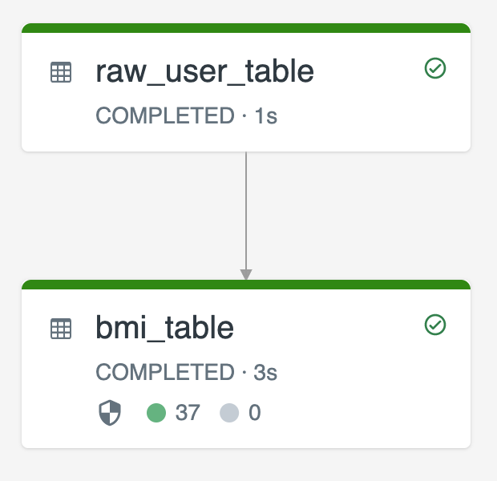

# Daten transformieren mit Pipelines — Referenz

Dieses Dokument beschreibt, wie Transformationen in Lakeflow-Declarative-Pipelines (LDP) deklariert werden — über gängige Muster wie private Zwischentabellen, das Mischen von Streaming Tables und Materialized Views, Stream-Static-Joins, effiziente Aggregat-Berechnung, den Einsatz von MLflow-Modellen und den kontrollierten Erhalt manueller Löschungen/Updates. Verifiziert per `WebFetch` gegen die Azure-Spiegelseite (`learn.microsoft.com/en-us/azure/databricks/ldp/transform`), die eine vollständige, wörtliche Wiedergabe des Roh-Markdowns lieferte. Ein Bild wurde erfolgreich heruntergeladen und liegt lokal unter `images/dlt-cookbook-disable-refresh.png`.

## Abschnittsübersicht

1. [Grundprinzip](#grundprinzip)
2. [Tabellen vom Zielschema ausschließen (`PRIVATE`)](#private-tabellen)
3. [Streaming Tables und Materialized Views in einer Pipeline kombinieren](#kombination)
4. [Stream-Static-Joins](#stream-static-joins)
5. [Aggregate effizient berechnen](#aggregate)
6. [MLflow-Modelle in Pipelines verwenden](#mlflow)
7. [Manuelle Löschungen/Updates erhalten](#manuelle-updates)
8. [Quellen](#quellen)

---

## <a id="grundprinzip">1. Grundprinzip</a>

Transformationen werden in Pipelines deklariert, um festzulegen, wie Datensätze durch Query-Logik verarbeitet werden — mit gängigen Mustern wie Stream-Static-Joins, inkrementellen Aggregationen und dem Mischen von Streaming Tables und Materialized Views.

Ein Dataset lässt sich gegen jede Query definieren, die einen DataFrame zurückgibt. Apache-Spark-Built-in-Operationen, UDFs, benutzerdefinierte Logik und MLflow-Modelle lassen sich als Transformationen in der Pipeline verwenden. Nach der Ingestion in die Pipeline lassen sich neue Datasets gegen Upstream-Quellen definieren, um neue Streaming Tables, Materialized Views und Views zu erzeugen.

## <a id="private-tabellen">2. Tabellen vom Zielschema ausschließen (`PRIVATE`)</a>

Müssen Zwischentabellen berechnet werden, die nicht für externen Konsum gedacht sind, lässt sich deren Publizierung in ein Schema über das `PRIVATE`-Keyword verhindern. Private Tabellen speichern und verarbeiten Daten weiterhin gemäß Pipeline-Semantik, sollten aber außerhalb der aktuellen Pipeline nicht zugegriffen werden. Eine private Tabelle besteht für die Lebensdauer der sie erzeugenden Pipeline.

```sql
CREATE PRIVATE STREAMING TABLE private_table
AS SELECT ... ;
```

```python
@dp.table(
  private=True)
def private_table():
  return ("...")
```

## <a id="kombination">3. Streaming Tables und Materialized Views in einer Pipeline kombinieren</a>

Streaming Tables erben die Verarbeitungsgarantien von Apache Spark Structured Streaming und sind darauf konfiguriert, Queries aus Append-only-Datenquellen zu verarbeiten, bei denen neue Zeilen stets in die Quelltabelle eingefügt statt geändert werden.

**Hinweis:** Obwohl Streaming Tables standardmäßig Append-only-Datenquellen voraussetzen, lässt sich dieses Verhalten übersteuern, wenn eine streamende Quelle selbst eine Streaming Table ist, die Updates oder Deletes erfordert — über das [`skipChangeCommits`-Flag](../04%20Ingestion%20und%20Laden%20von%20Daten/Daten%20laden.md#skip-change-commits).

Ein verbreitetes Streaming-Muster nutzt die Ingestion von Quelldaten zur Erzeugung der initialen Datasets in einer Pipeline — üblicherweise Bronze-Tabellen genannt, meist mit einfachen Transformationen. Die finalen Tabellen einer Pipeline, üblicherweise Gold-Tabellen genannt, erfordern dagegen oft komplizierte Aggregationen oder das Lesen aus Zielen einer `AUTO CDC ... INTO`-Operation. Da solche Operationen inhärent Updates statt Appends erzeugen, werden sie als Eingaben für Streaming Tables nicht unterstützt — für solche Transformationen eignen sich Materialized Views besser.

Durch das Mischen von Streaming Tables und Materialized Views in einer einzigen Pipeline lässt sich die Pipeline vereinfachen, teures erneutes Einlesen/Verarbeiten roher Daten vermeiden, und die volle Ausdruckskraft von SQL für komplexe Aggregationen über einem effizient kodierten und gefilterten Dataset nutzen:

```python
@dp.table
def streaming_bronze():
  return (
    # Since this is a streaming source, this table is incremental.
    spark.readStream.format("cloudFiles")
      .option("cloudFiles.format", "json")
      .load("abfss://path/to/raw/data")
  )

@dp.table
def streaming_silver():
  # Since we read the bronze table as a stream, this silver table is also
  # updated incrementally.
  return spark.readStream.table("streaming_bronze").where(...)

@dp.materialized_view
def live_gold():
  # This table will be recomputed completely by reading the whole silver table
  # when it is updated.
  return spark.read.table("streaming_silver").groupBy("user_id").count()
```

```sql
CREATE OR REFRESH STREAMING TABLE streaming_bronze
AS SELECT * FROM STREAM read_files(
  "abfss://path/to/raw/data",
  format => "json"
)

CREATE OR REFRESH STREAMING TABLE streaming_silver
AS SELECT * FROM STREAM(streaming_bronze) WHERE...

CREATE OR REFRESH MATERIALIZED VIEW live_gold
AS SELECT count(*) FROM streaming_silver GROUP BY user_id
```

## <a id="stream-static-joins">4. Stream-Static-Joins</a>

Stream-Static-Joins eignen sich gut, um einen kontinuierlichen Strom Append-only-Daten mit einer überwiegend statischen Dimensionstabelle zu denormalisieren.

Bei jedem Pipeline-Update werden neue Datensätze aus dem Stream mit dem aktuellsten Snapshot der statischen Tabelle gejoint. Werden Datensätze in der statischen Tabelle hinzugefügt oder geändert, nachdem entsprechende Daten aus der Streaming Table bereits verarbeitet wurden, werden die resultierenden Datensätze nicht neu berechnet, sofern kein Full Refresh durchgeführt wird.

In Pipelines mit getriggerter Ausführung liefert die statische Tabelle Ergebnisse zum Zeitpunkt des Update-Starts. In Pipelines mit kontinuierlicher Ausführung wird bei jeder Verarbeitung eines Updates die jeweils neueste Version der statischen Tabelle abgefragt.

```python
@dp.table
def customer_sales():
  return spark.readStream.table("sales").join(spark.read.table("customers"), ["customer_id"], "left")
```

```sql
CREATE OR REFRESH STREAMING TABLE customer_sales
AS SELECT * FROM STREAM(sales)
  INNER JOIN LEFT customers USING (customer_id)
```

### Weitere Join-Typen: MV-Join und Stream-Stream-Join

Aus einer privaten Kurs-Notiz übernommen, nicht gegen die offizielle Doku verifiziert. Neben dem oben beschriebenen Stream-Static-Join (auch Stream-Snapshot-Join genannt) gibt es zwei weitere Join-Muster:

- **Join zweier Streaming Tables über eine Materialized View:** Sollen zwei sich kontinuierlich ändernde Streaming Tables regelmäßig vollständig gejoint werden, dient eine Materialized View als Ziel — sie verarbeitet bei jedem Update alle Zeilen beider Quellen neu (bzw. inkrementell, wo möglich) und hält das Ergebnis konsistent zum aktuellen Stand beider Seiten. Geeignet, wenn beide Eingaben sich ändern und stets ein aktuelles, vollständiges Bild benötigt wird — z. B. Kundenaktivität mit dem jeweils neuesten Produktkatalogstand angereichert.
- **Stream-Stream-Join:** Verarbeitet bei jedem Update nur die jeweils neu eingetroffenen Daten beider Streams inkrementell — vergangene Daten fließen nicht erneut ein. Nützlich, um zeitlich eng beieinanderliegende Ereignisse zu korrelieren (z. B. Clickstream mit Echtzeit-Ad-Impressions). Erfordert Windowing- und Watermark-Logik (siehe `Zustandsbehaftete Verarbeitung.md` in diesem Ordner sowie die Doku zu `Optimize stateful processing with watermarks`).

| Join-Typ | Quellen | Ausgabetyp | Verarbeitete Daten |
|---|---|---|---|
| Stream-Static (Stream-Snapshot) | Streaming + Statisch | Streaming Table | nur neue Zeilen |
| MV-Join | Streaming + Streaming | Materialized View | alle Zeilen je Lauf |
| Stream-Stream | Streaming + Streaming | Streaming Table | nur neue Zeilen (windowed) |

## <a id="aggregate">5. Aggregate effizient berechnen</a>

Streaming Tables lassen sich verwenden, um einfache distributive Aggregate wie `count`, `min`, `max` oder `sum` sowie algebraische Aggregate wie Durchschnitt oder Standardabweichung inkrementell zu berechnen. Databricks empfiehlt inkrementelle Aggregation für Queries mit einer begrenzten Anzahl an Gruppen, etwa eine Query mit `GROUP BY country`-Klausel — bei jedem Update werden nur neue Eingabedaten gelesen.

Für Details zu inkrementellen Aggregationen in Pipeline-Queries siehe `Zustandsbehaftete Verarbeitung.md` in diesem Ordner.

## <a id="mlflow">6. MLflow-Modelle in Pipelines verwenden</a>

**Hinweis:** Für MLflow-Modelle in einer Unity-Catalog-aktivierten Pipeline muss die Pipeline auf den `preview`-Channel konfiguriert sein. Für den `current`-Channel muss die Pipeline stattdessen auf den Hive Metastore publizieren.

MLflow-trainierte Modelle lassen sich in Pipelines verwenden. MLflow-Modelle werden in Databricks als Transformationen behandelt — sie wirken auf einen Spark-DataFrame-Input und geben Ergebnisse als Spark DataFrame zurück. Da Pipelines Datasets gegen DataFrames definieren, lassen sich Apache-Spark-Workloads, die MLflow nutzen, mit wenigen Codezeilen in Pipelines überführen.

Besteht bereits ein Python-Skript, das ein MLflow-Modell aufruft, lässt sich dieser Code über den `@dp.table`- oder `@dp.materialized_view`-Dekorator in eine Pipeline überführen — dabei müssen die Funktionen so definiert sein, dass sie Transformationsergebnisse zurückgeben. Pipelines installieren MLflow nicht standardmäßig — vor Nutzung muss über `%pip install mlflow` installiert und `mlflow` sowie `dp` am Anfang der Quelldatei importiert werden.

Zur Nutzung von MLflow-Modellen in Pipelines:

1. Run-ID und Modellname des MLflow-Modells ermitteln — diese werden zur Konstruktion der Modell-URI benötigt.
2. Die URI verwenden, um eine Spark-UDF zu definieren, die das MLflow-Modell lädt.
3. Die UDF in den Tabellendefinitionen aufrufen, um das MLflow-Modell zu nutzen.

Basis-Syntax:

```python
%pip install mlflow==2.20.2

from pyspark import pipelines as dp
import mlflow

run_id= "<mlflow-run-id>"
model_name = "<the-model-name-in-run>"
model_uri = f"runs:/{run_id}/{model_name}"
loaded_model_udf = mlflow.pyfunc.spark_udf(spark, model_uri=model_uri)

@dp.materialized_view
def model_predictions():
  return spark.read.table(<input-data>)
    .withColumn("prediction", loaded_model_udf(<model-features>))
```

Vollständiges Beispiel — eine Spark-UDF `loaded_model_udf` lädt ein auf Kreditrisikodaten trainiertes MLflow-Modell. Die für die Vorhersage genutzten Datenspalten werden der UDF als Argument übergeben. Die Tabelle `loan_risk_predictions` berechnet Vorhersagen für jede Zeile in `loan_risk_input_data`:

```python
%pip install mlflow==2.20.2

from pyspark import pipelines as dp
import mlflow
from pyspark.sql.functions import struct

run_id = "mlflow_run_id"
model_name = "the_model_name_in_run"
model_uri = f"runs:/{run_id}/{model_name}"
loaded_model_udf = mlflow.pyfunc.spark_udf(spark, model_uri=model_uri)

categoricals = ["term", "home_ownership", "purpose",
  "addr_state","verification_status","application_type"]

numerics = ["loan_amnt", "emp_length", "annual_inc", "dti", "delinq_2yrs",
  "revol_util", "total_acc", "credit_length_in_years"]

features = categoricals + numerics

@dp.materialized_view(
  comment="GBT ML predictions of loan risk",
  table_properties={
    "quality": "gold"
  }
)
def loan_risk_predictions():
  return spark.read.table("loan_risk_input_data")
    .withColumn('predictions', loaded_model_udf(struct(features)))
```

## <a id="manuelle-updates">7. Manuelle Löschungen/Updates erhalten</a>

Pipelines erlauben es, Datensätze manuell aus einer Tabelle zu löschen oder zu aktualisieren und anschließend ein Refresh durchzuführen, um nachgelagerte Tabellen neu zu berechnen.

Standardmäßig berechnen Pipelines Tabellenergebnisse bei jedem Update anhand der Eingabedaten neu — es muss also sichergestellt werden, dass der gelöschte Datensatz nicht erneut aus den Quelldaten geladen wird. Das Setzen der Tabellen-Property `pipelines.reset.allowed` auf `false` verhindert Refreshes einer Tabelle, verhindert aber **nicht** inkrementelle Writes in die Tabelle oder das Einfließen neuer Daten.

Beispielszenario mit zwei Streaming Tables:

- `raw_user_table` liest rohe Nutzerdaten aus einer Quelle ein.
- `bmi_table` berechnet inkrementell BMI-Werte aus Gewicht und Größe von `raw_user_table`.

Sollen Nutzerdatensätze in `raw_user_table` manuell gelöscht/aktualisiert und `bmi_table` neu berechnet werden:



Der folgende Code setzt die Tabellen-Property `pipelines.reset.allowed` auf `false`, um Full Refresh für `raw_user_table` zu deaktivieren, sodass beabsichtigte Änderungen über die Zeit erhalten bleiben — nachgelagerte Tabellen werden dennoch bei jedem Pipeline-Update neu berechnet:

```sql
CREATE OR REFRESH STREAMING TABLE raw_user_table
TBLPROPERTIES(pipelines.reset.allowed = false)
AS SELECT * FROM STREAM read_files("/databricks-datasets/iot-stream/data-user", format => "csv");

CREATE OR REFRESH STREAMING TABLE bmi_table
AS SELECT userid, (weight/2.2) / pow(height*0.0254,2) AS bmi FROM STREAM(raw_user_table);
```

Derselbe Schutz greift auch, wenn nicht manuell, sondern automatisch Daten aus der Quelle verschwinden — etwa wenn eine Rohdatenquelle Dateien nach einer bestimmten Zeitspanne selbstständig entfernt (z. B. über eine Lifecycle-Richtlinie im Objektspeicher). Ohne `pipelines.reset.allowed = false` würden solche, im Quellverzeichnis nicht mehr vorhandenen Daten bei einem **Run pipeline with full table refresh** nicht erneut in die Zieltabelle eingelesen. Siehe [Properties.md](../12%20Unity%20Catalog%20und%20Schema-Verwaltung/08%20Properties.md), Abschnitt 4.

---

## <a id="quellen">8. Quellen</a>

- Transform data with pipelines (Azure-Spiegelseite, vollständig als Rohtext abgerufen, inkl. Bild-URL): https://learn.microsoft.com/en-us/azure/databricks/ldp/transform
- Transform data with pipelines (AWS): https://docs.databricks.com/aws/en/ldp/transform
- Bild-Original: https://learn.microsoft.com/en-us/azure/databricks/_static/images/dlt/dlt-cookbook-disable-refresh.png (lokal gespeichert unter `images/dlt-cookbook-disable-refresh.png`)

**Stand:** 2026-08-19.
