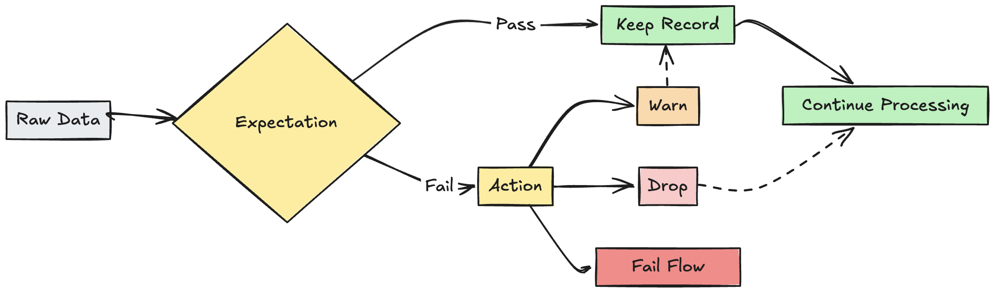
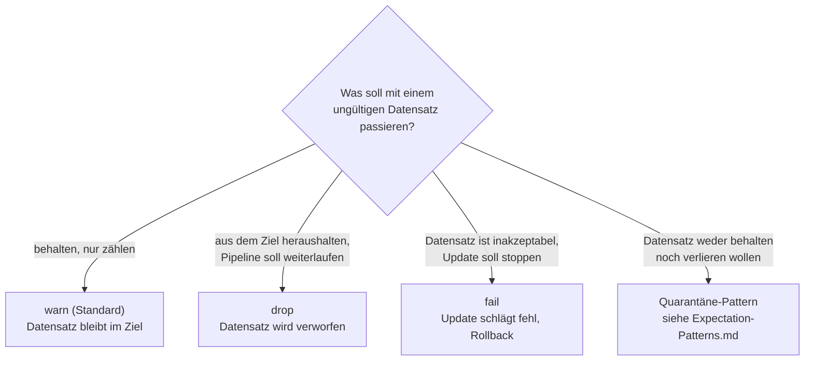
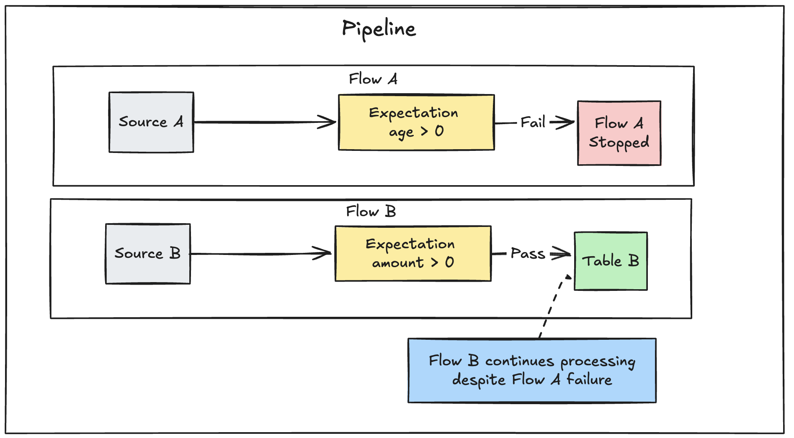
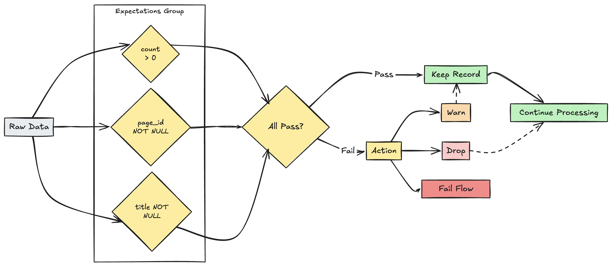

# Expectations — Grundlagen

Dieses Dokument fasst die Databricks-Referenzseite "Manage data quality with pipeline expectations" zusammen. Jede Aussage wurde per `WebFetch` gegen die offizielle Doku verifiziert; die AWS-Seite (`docs.databricks.com/aws/en/ldp/expectations`) und die Azure-Spiegelseite (`learn.microsoft.com/en-us/azure/databricks/ldp/expectations`) wurden dabei unabhängig abgerufen und stimmten inhaltlich überein. Die Azure-Fassung ließ sich vollständig wörtlich extrahieren und dient als Haupt-Zitatgrundlage.

## Abschnittsübersicht

1. [Was sind Expectations?](#was-sind-expectations)
2. [Die drei Bestandteile einer Expectation](#drei-bestandteile)
3. [Aktion bei Regelverletzung](#aktion-bei-verletzung)
4. [Tracking-Metriken](#tracking-metriken)
5. [Retain / Drop / Fail im Detail](#retain-drop-fail)
6. [Fehlerbehandlung bei fehlgeschlagenen Updates](#troubleshooting)
7. [Mehrere Expectations verwalten](#mehrere-expectations)
8. [Limitierungen](#limitierungen)
9. [Quellen](#quellen)

---

## <a id="was-sind-expectations">1. Was sind Expectations?</a>



Expectations sind optionale Klauseln in den Erstellungsanweisungen von Materialized Views, Streaming Tables oder Views innerhalb einer Pipeline, die bei jedem durch eine Query fließenden Datensatz Datenqualitätsprüfungen anwenden. Expectations verwenden Standard-SQL-Boolean-Ausdrücke, um Constraints zu spezifizieren. Mehrere Expectations lassen sich für ein einzelnes Dataset kombinieren, und Expectations können über alle Dataset-Deklarationen einer Pipeline hinweg gesetzt werden.

**Einordnung:** Expectations sind eine **Lakeflow-exklusive Erweiterung** — die Feature-Vergleichstabelle der offiziellen Doku führt "Data quality expectations" explizit als Häkchen bei Lakeflow-Pipelines und als nicht vorhanden bei reinen Apache-Spark-Declarative-Pipelines (SDP). Reines SDP kennt also keine Expectations (siehe `01 Concepts/Was ist Spark Declarative Pipelines.md`, Abschnitt 4).

Expectations lassen sich auch auf Streaming Tables und Materialized Views definieren, die von einer eigenständigen ("standalone") Pipeline verwaltet werden, die in Databricks SQL erstellt wurde — über die Klausel `CONSTRAINT expectation_name EXPECT (expectation_expr)` innerhalb von `CREATE STREAMING TABLE` bzw. `CREATE MATERIALIZED VIEW`.

## <a id="drei-bestandteile">2. Die drei Bestandteile einer Expectation</a>

### Expectation-Name

Jede Expectation benötigt einen Namen, der als Identifikator zum Tracking und Monitoring der Expectation dient. Ein Expectation-Name muss für ein gegebenes Dataset eindeutig sein; Expectations können jedoch über mehrere Datasets einer Pipeline hinweg wiederverwendet werden (siehe `Expectation-Patterns.md`, Abschnitt "Portable und wiederverwendbare Expectations").

```python
@dp.table
@dp.expect("valid_customer_age", "age BETWEEN 0 AND 120")
def customers():
  return spark.readStream.table("datasets.samples.raw_customers")
```

```sql
CREATE OR REFRESH STREAMING TABLE customers(
  CONSTRAINT valid_customer_age EXPECT (age BETWEEN 0 AND 120)
) AS SELECT * FROM STREAM(datasets.samples.raw_customers);
```

### Constraint-Klausel

Die Constraint-Klausel ist eine SQL-Bedingungsanweisung, die für jeden Datensatz zu `true` oder `false` auswerten muss. Der Constraint enthält die eigentliche Logik dessen, was validiert wird. Schlägt ein Datensatz bei dieser Bedingung fehl, wird die Expectation ausgelöst.

Constraints müssen gültige SQL-Syntax verwenden und dürfen **nicht** enthalten:

- Benutzerdefinierte Python-Funktionen
- Aufrufe externer Dienste
- Subqueries, die andere Tabellen referenzieren

**Python-Syntax:**

```python
@dp.expect(<constraint-name>, <constraint-clause>)
```

Mehrere Constraints lassen sich stapeln:

```python
@dp.expect(<constraint-name>, <constraint-clause>)
@dp.expect(<constraint2-name>, <constraint2-clause>)
```

**SQL-Syntax:**

```sql
CONSTRAINT <constraint-name> EXPECT ( <constraint-clause> )
```

Mehrere Constraints müssen durch Komma getrennt werden:

```sql
CONSTRAINT <constraint-name> EXPECT ( <constraint-clause> ),
CONSTRAINT <constraint2-name> EXPECT ( <constraint2-clause> )
```

**Vollständige Beispiele aus der Doku** (Python und äquivalentes SQL):

```python
# Einfacher Constraint
@dp.expect("non_negative_price", "price >= 0")

# SQL-Funktionen
@dp.expect("valid_date", "year(transaction_date) >= 2020")

# CASE-Anweisungen
@dp.expect("valid_order_status", """
   CASE
     WHEN type = 'ORDER' THEN status IN ('PENDING', 'COMPLETED', 'CANCELLED')
     WHEN type = 'REFUND' THEN status IN ('PENDING', 'APPROVED', 'REJECTED')
     ELSE false
   END
""")

# Mehrere Constraints
@dp.expect("non_negative_price", "price >= 0")
@dp.expect("valid_purchase_date", "date <= current_date()")

# Komplexe Geschäftslogik
@dp.expect(
  "valid_subscription_dates",
  """start_date <= end_date
    AND end_date <= current_date()
    AND start_date >= '2020-01-01'"""
)

# Komplexe Boolean-Logik
@dp.expect("valid_order_state", """
   (status = 'ACTIVE' AND balance > 0)
   OR (status = 'PENDING' AND created_date > current_date() - INTERVAL 7 DAYS)
""")
```

```sql
-- Einfacher Constraint
CONSTRAINT non_negative_price EXPECT (price >= 0)

-- SQL-Funktionen
CONSTRAINT valid_date EXPECT (year(transaction_date) >= 2020)

-- CASE-Anweisungen
CONSTRAINT valid_order_status EXPECT (
  CASE
    WHEN type = 'ORDER' THEN status IN ('PENDING', 'COMPLETED', 'CANCELLED')
    WHEN type = 'REFUND' THEN status IN ('PENDING', 'APPROVED', 'REJECTED')
    ELSE false
  END
)

-- Mehrere Constraints
CONSTRAINT non_negative_price EXPECT (price >= 0),
CONSTRAINT valid_purchase_date EXPECT (date <= current_date())

-- Komplexe Geschäftslogik
CONSTRAINT valid_subscription_dates EXPECT (
  start_date <= end_date
  AND end_date <= current_date()
  AND start_date >= '2020-01-01'
)

-- Komplexe Boolean-Logik
CONSTRAINT valid_order_state EXPECT (
  (status = 'ACTIVE' AND balance > 0)
  OR (status = 'PENDING' AND created_date > current_date() - INTERVAL 7 DAYS)
)
```

## <a id="aktion-bei-verletzung">3. Aktion bei Regelverletzung</a>

Für jede Expectation muss festgelegt werden, was bei einem fehlgeschlagenen Datensatz geschieht:

| Aktion | SQL-Syntax | Python-Syntax | Ergebnis |
|---|---|---|---|
| `warn` (Standard) | `EXPECT` | `dp.expect` | Ungültige Datensätze werden in das Ziel geschrieben. |
| `drop` | `EXPECT ... ON VIOLATION DROP ROW` | `dp.expect_or_drop` | Ungültige Datensätze werden verworfen, bevor Daten in das Ziel geschrieben werden. Die Anzahl verworfener Datensätze wird zusammen mit den übrigen Dataset-Metriken protokolliert. |
| `fail` | `EXPECT ... ON VIOLATION FAIL UPDATE` | `dp.expect_or_fail` | Ungültige Datensätze verhindern das erfolgreiche Update. Manuelles Eingreifen ist vor einer erneuten Verarbeitung erforderlich. |



Für fortgeschrittene Logik, um ungültige Datensätze zu isolieren, ohne das Update fehlschlagen zu lassen oder Daten zu verwerfen, siehe das Quarantäne-Pattern in `Expectation-Patterns.md`.

**Praxisregel (keine Doku-Vorgabe, sondern gängige Faustregel):** `fail` für kritische Geschäftsschlüssel, deren Verletzung die Pipeline stoppen soll; `drop` für Datenqualitätsprobleme, die sich gefahrlos herausfiltern lassen; `warn` für die Beobachtung ungewöhnlicher, aber potenziell noch gültiger Muster.

## <a id="tracking-metriken">4. Tracking-Metriken</a>

Tracking-Metriken für die Aktionen `warn` und `drop` sind in der Pipeline-UI sichtbar. Da `fail` das Update bei einem erkannten ungültigen Datensatz fehlschlagen lässt, werden für diesen Fall keine Metriken erfasst.

Für Streaming Tables und Materialized Views, die von einer eigenständigen, in Databricks SQL erstellten Pipeline verwaltet werden, ist der **Data Quality**-Tab in der Pipeline-UI **nicht** verfügbar — stattdessen muss der Event-Log abgefragt werden, um Expectation-Metriken einzusehen.

Um Expectation-Metriken über die UI einzusehen:

1. Im Workspace-Sidebar auf **Jobs & Pipelines** klicken.
2. Auf den **Namen** der Pipeline klicken.
3. Ein Dataset mit definierter Expectation anklicken.
4. Den Tab **Data quality** in der rechten Seitenleiste auswählen.

Alternativ lassen sich Datenqualitätsmetriken durch Abfrage des Lakeflow-Pipeline-Event-Logs einsehen.

## <a id="retain-drop-fail">5. Retain / Drop / Fail im Detail</a>

### Ungültige Datensätze behalten (Standardverhalten)

Das Behalten ungültiger Datensätze ist das Standardverhalten von Expectations. Der `expect`-Operator wird verwendet, wenn Datensätze, die eine Expectation verletzen, dennoch behalten werden sollen — aber Metriken darüber gesammelt werden sollen, wie viele Datensätze einen Constraint bestehen oder nicht bestehen. Datensätze, die die Expectation verletzen, werden zusammen mit gültigen Datensätzen dem Ziel-Dataset hinzugefügt:

```python
@dp.expect("valid timestamp", "timestamp > '2012-01-01'")
```

```sql
CONSTRAINT valid_timestamp EXPECT (timestamp > '2012-01-01')
```

### Ungültige Datensätze verwerfen

Der `expect_or_drop`-Operator verhindert die Weiterverarbeitung ungültiger Datensätze. Datensätze, die die Expectation verletzen, werden aus dem Ziel-Dataset entfernt:

```python
@dp.expect_or_drop("valid_current_page", "current_page_id IS NOT NULL AND current_page_title IS NOT NULL")
```

```sql
CONSTRAINT valid_current_page EXPECT (current_page_id IS NOT NULL and current_page_title IS NOT NULL) ON VIOLATION DROP ROW
```

### Bei ungültigen Datensätzen fehlschlagen

Wenn ungültige Datensätze inakzeptabel sind, wird der `expect_or_fail`-Operator verwendet, um die Ausführung sofort zu stoppen, sobald ein Datensatz die Validierung nicht besteht. Handelt es sich um ein Tabellen-Update, rollt das System die Transaktion atomar zurück:

```python
@dp.expect_or_fail("valid_count", "count > 0")
```

```sql
CONSTRAINT valid_count EXPECT (count > 0) ON VIOLATION FAIL UPDATE
```



**Wichtiger Unterschied zwischen Triggered- und Continuous-Pipelines** (wörtlich zitiert): In einer Triggered-Pipeline führt das Fehlschlagen eines einzelnen Flows nicht dazu, dass andere parallele Flows fehlschlagen. In einer Continuous-Pipeline stoppt ein Expectation-Fehlschlag den betroffenen Flow sowie alle davon abhängigen Flows, und die Pipeline gibt eine Meldung aus, die erklärt, warum sie gestoppt wurde.

Für mehr Kontrolle über die Workflow-Orchestrierung bei einem fehlgeschlagenen Validierungslauf empfiehlt die Doku, Validierung und nachgelagerte Arbeit in getrennte Pipelines aufzuteilen und diese über Control-Flow zwischen Pipeline-Tasks zu koordinieren (siehe `Expectation-Patterns.md`, Abschnitt "Validation-Tabellen und Pipeline-Control-Flow").

## <a id="troubleshooting">6. Fehlerbehandlung bei fehlgeschlagenen Updates</a>

Wenn eine Pipeline wegen einer Expectation-Verletzung fehlschlägt, muss der Pipeline-Code korrigiert werden, um die ungültigen Daten korrekt zu behandeln, bevor die Pipeline erneut ausgeführt wird.

Auf `fail` konfigurierte Expectations modifizieren den Spark-Query-Plan der Transformationen, um die zur Erkennung und Meldung von Verletzungen nötigen Informationen mitzuführen. Diese Information kann genutzt werden, um bei vielen Queries den Eingabedatensatz zu identifizieren, der die Verletzung verursacht hat. Lakeflow-Pipelines liefern eine dedizierte Fehlermeldung für solche Verletzungen. Beispiel aus der Doku:

```console
[EXPECTATION_VIOLATION.VERBOSITY_ALL] Flow 'sensor-pipeline' failed to meet the expectation. Violated expectations: 'temperature_in_valid_range'. Input data: '{"id":"TEMP_001","temperature":-500,"timestamp_ms":"1710498600"}'. Output record: '{"sensor_id":"TEMP_001","temperature":-500,"change_time":"2024-03-15 10:30:00"}'. Missing input data: false
```

## <a id="mehrere-expectations">7. Mehrere Expectations verwalten</a>

Sowohl SQL als auch Python unterstützen mehrere Expectations für ein einzelnes Dataset; **nur Python** erlaubt es jedoch, mehrere Expectations zu gruppieren und eine gemeinsame Aktion für die Gruppe festzulegen.



Mehrere Expectations lassen sich mit den Funktionen `expect_all`, `expect_all_or_drop` und `expect_all_or_fail` gruppieren und mit einer gemeinsamen Aktion versehen. Diese Decorators akzeptieren ein Python-Dictionary als Argument, wobei der Key der Expectation-Name und der Value der Expectation-Constraint ist. Dasselbe Set von Expectations lässt sich in mehreren Datasets der Pipeline wiederverwenden:

```python
valid_pages = {"valid_count": "count > 0", "valid_current_page": "current_page_id IS NOT NULL AND current_page_title IS NOT NULL"}

@dp.table
@dp.expect_all(valid_pages)
def raw_data():
  # Create a raw dataset

@dp.table
@dp.expect_all_or_drop(valid_pages)
def prepared_data():
  # Create a cleaned and prepared dataset

@dp.table
@dp.expect_all_or_fail(valid_pages)
def customer_facing_data():
  # Create cleaned and prepared to share the dataset
```

**Ungeklärt:** Die Doku beschreibt hier nicht explizit, ob die einzelnen Regeln innerhalb eines `expect_all`-Dictionaries mit AND oder OR verknüpft werden. Da jede Regel als eigenständiger benannter Constraint behandelt wird (vergleichbar mehreren einzelnen `@dp.expect`-Aufrufen) und ein Datensatz bereits bei Verletzung *einer* Regel als ungültig für die jeweilige Aktion (drop/fail) gilt, ist eine AND-Verknüpfung (alle Regeln müssen erfüllt sein, damit ein Datensatz als gültig zählt) naheliegend, wurde aber nicht wörtlich so in der Doku gefunden.

## <a id="limitierungen">8. Limitierungen</a>

Wörtlich aus der Doku übernommene Limitierungs-Liste:

- Da nur Streaming Tables, Materialized Views und temporäre Views Expectations unterstützen, sind Datenqualitätsmetriken auch nur für diese Objekttypen verfügbar.
- Datenqualitätsmetriken sind nicht verfügbar, wenn:
  - keine Expectations für eine Query definiert sind;
  - ein Flow einen Operator verwendet, der Expectations nicht unterstützt;
  - der Flow-Typ — etwa **Sinks** (siehe `09 Sinks/Sinks in Lakeflow Pipelines.md`) — Expectations nicht unterstützt;
  - für einen gegebenen Flow-Lauf keine Updates an der zugehörigen Streaming Table oder Materialized View stattfanden;
  - die Pipeline-Konfiguration nicht die für die Metrik-Erfassung nötigen Einstellungen enthält, etwa `pipelines.metrics.flowTimeReporter.enabled`.
- In manchen Fällen enthält ein `COMPLETED`-Flow möglicherweise keine Metriken; stattdessen werden Metriken in jedem Micro-Batch in einem `flow_progress`-Event mit Status `RUNNING` gemeldet.
- Da Views nur bei Abfrage berechnet werden, sind Datenqualitätsmetriken für eine definierte View möglicherweise nicht verfügbar. Alternativ kann eine View, die in mehreren nachgelagerten Datasets abgefragt wird, mehrere Sätze von Datenqualitätsmetriken aufweisen.
- Expectations werden mit `AUTO CDC FROM SNAPSHOT` **nicht** unterstützt.

---

## <a id="quellen">Quellen</a>

- https://docs.databricks.com/aws/en/ldp/expectations
- https://learn.microsoft.com/en-us/azure/databricks/ldp/expectations (wörtliche Vollzitat-Quelle, inhaltlich mit AWS-Seite abgeglichen)
