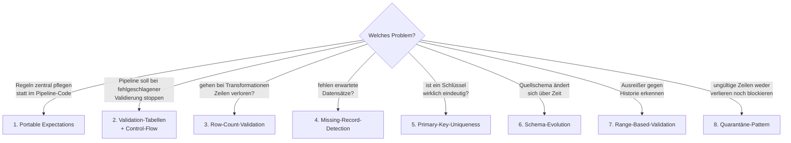
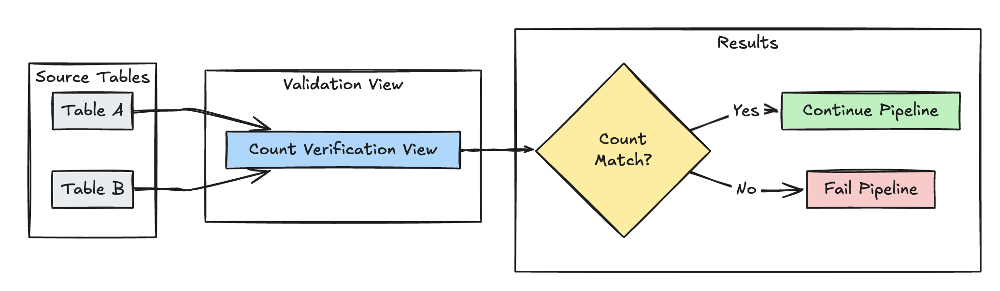
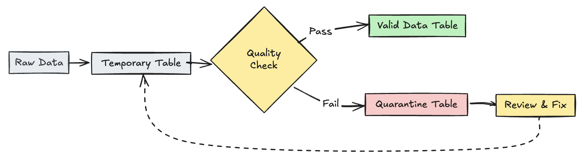
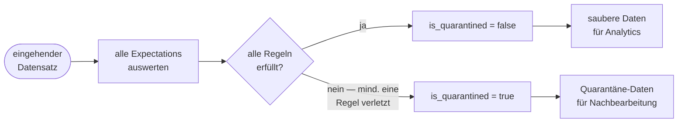

# Expectation-Patterns — Erweiterte Muster

Dieses Dokument beschreibt erweiterte Muster für Expectations: portable Regeln, Validation-Tabellen, Row-Count-Validation, Missing-Record-Detection, Primary-Key-Uniqueness, Schema-Evolution, Range-Based-Validation, das Quarantäne-Pattern und NULL-Toleranz.

Die Codebeispiele stimmen inhaltlich überein, teils mit leicht abweichenden Bezeichnern (`count()` statt `COUNT()`, `as` statt `AS`).



## Abschnittsübersicht

1. [Warum erweiterte Expectations? Grenzen der Basis-Constraints](#warum-erweitert)
2. [Portable und wiederverwendbare Expectations](#portable-expectations)
3. [Validation-Tabellen und Pipeline-Control-Flow](#validation-control-flow)
4. [Row-Count-Validation](#row-count)
5. [Missing-Record-Detection](#missing-record)
6. [Primary-Key-Uniqueness](#pk-uniqueness)
7. [Schema-Evolution-Pattern](#schema-evolution)
8. [Resilientes Pipeline-Design: STRING-Ingestion und Schema-Evolution-Tools](#resilient-design)
9. [Range-Based-Validation-Pattern](#range-validation)
10. [Quarantäne ungültiger Datensätze](#quarantine)
11. [NULL-Toleranz](#null-toleranz)

---

## <a id="warum-erweitert">1. Warum erweiterte Expectations? Grenzen der Basis-Constraints</a>

Lakeflow Declarative Pipelines liefern eingebaute Expectations mit drei Violation-Modi — `WARN`, `DROP ROW` und `FAIL UPDATE` (siehe [01 Expectations-Grundlagen.md](01%20Expectations-Grundlagen.md)) —, aber produktive Szenarien verlangen oft anspruchsvollere Ansätze: Business-Regeln validieren, Schema-Evolution robust handhaben und jeden Datensatz für Audit- und Nachbearbeitungszwecke erhalten.

### Die Grenzen einfacher Constraints

Ein `NOT NULL`-Check bestätigt, dass ein Feld *vorhanden* ist — Anwesenheit allein bedeutet aber nicht, dass ein Wert *korrekt* ist. Die folgende Tabelle zeigt typische Datenqualitätsprobleme aus der Praxis und ob ein einfacher `NOT NULL`-Check sie erkennt:

| Problemtyp | Beispiel | Erkennt `NOT NULL`? | Erweiterte Expectation? |
|---|---|---|---|
| Numerische Anomalie | Negative Menge in einer Bestellung | Nein | Ja |
| Zeitliche Inkonsistenz | Event-Datum auf Jahr 1970 (System-Default) | Nein | Ja |
| Bereichsverletzung | Rabattsatz = 120 % | Nein | Ja |
| Optionales-Feld-Regel | Feld darf NULL sein, muss bei Vorhandensein aber >= 0 sein | Nein | Ja |
| Schema-Evolution | Neue, mitten im Stream hinzugefügte Spalte bricht bestehende Regeln | Nein | Ja |
| Datenverlust | Ungültige Datensätze werden dauerhaft verworfen — kein Audit-Trail | Nein | Ja |

**Beispiel:** Ein `discount_rate`-Feld mit dem Wert `120` besteht jeden `NOT NULL`-Check anstandslos — repräsentiert aber einen unmöglichen Rabatt, der nachgelagerte Umsatzberechnungen unbemerkt verfälscht. Erst ein Bereichs-Constraint wie `discount_rate BETWEEN 0 AND 100` fängt das ab, bevor es weiterfließt.

Über zeilenbasierte Constraints hinaus unterstützen Databricks-Expectations auch **tabellenübergreifende Validierung** — Row-Count-Abgleiche, fehlende Datensätze und Primärschlüssel-Eindeutigkeit über mehrere Datasets hinweg (siehe Abschnitte 4–6).

---

## <a id="portable-expectations">2. Portable und wiederverwendbare Expectations</a>

Databricks empfiehlt folgende Best Practices, um die Portabilität von Expectations zu erhöhen und den Wartungsaufwand zu reduzieren:

| Empfehlung | Wirkung |
|---|---|
| Expectation-Definitionen getrennt von der Pipeline-Logik speichern. | Expectations lassen sich leicht auf mehrere Datasets oder Pipelines anwenden. Aktualisierung, Audit und Pflege von Expectations, ohne den Pipeline-Quellcode zu ändern. |
| Benutzerdefinierte Tags zur Gruppierung verwandter Expectations hinzufügen. | Filterung von Expectations anhand von Tags. |
| Expectations konsistent auf ähnliche Datasets anwenden. | Dieselben Expectations über mehrere Datasets und Pipelines hinweg verwenden, um identische Logik auszuwerten. |

**Wichtig:** Das dynamische Laden von Expectations aus einer Datei wird in SQL nicht unterstützt.

### Variante: Delta-Tabelle als Regel-Repository

```sql
CREATE OR REPLACE TABLE
  rules
AS SELECT
  col1 AS name,
  col2 AS constraint,
  col3 AS tag
FROM (
  VALUES
  ("website_not_null","Website IS NOT NULL","validity"),
  ("fresh_data","to_date(updateTime,'M/d/yyyy h:m:s a') > '2010-01-01'","maintained"),
  ("social_media_access","NOT(Facebook IS NULL AND Twitter IS NULL AND Youtube IS NULL)","maintained")
)
```

Die `get_rules()`-Funktion liest die Regeln aus der `rules`-Tabelle und liefert ein Python-Dictionary mit den Regeln, die zum übergebenen `tag`-Argument passen. Das Dictionary wird über `@dp.expect_all_or_drop()` angewendet — Datensätze, die die mit `validity` getaggten Regeln verletzen, werden aus `raw_farmers_market` verworfen:

```python
from pyspark import pipelines as dp
from pyspark.sql.functions import expr, col

def get_rules(tag):
  """
    loads data quality rules from a table
    :param tag: tag to match
    :return: dictionary of rules that matched the tag
  """
  df = spark.read.table("rules").filter(col("tag") == tag).collect()
  return {
      row['name']: row['constraint']
      for row in df
  }

@dp.table
@dp.expect_all_or_drop(get_rules('validity'))
def raw_farmers_market():
  return (
    spark.read.format('csv').option("header", "true")
      .load('/databricks-datasets/data.gov/farmers_markets_geographic_data/data-001/')
  )

@dp.table
@dp.expect_all_or_drop(get_rules('maintained'))
def organic_farmers_market():
  return (
    spark.read.table("raw_farmers_market")
      .filter(expr("Organic = 'Y'"))
  )
```

### Variante: Python-Modul als Regel-Repository

Das folgende Beispiel legt die Regeln in einer Datei `rules_module.py` im selben Ordner wie das Pipeline-Quellcode-Notebook ab:

```python
def get_rules_as_list_of_dict():
  return [
    {
      "name": "website_not_null",
      "constraint": "Website IS NOT NULL",
      "tag": "validity"
    },
    {
      "name": "fresh_data",
      "constraint": "to_date(updateTime,'M/d/yyyy h:m:s a') > '2010-01-01'",
      "tag": "maintained"
    },
    {
      "name": "social_media_access",
      "constraint": "NOT(Facebook IS NULL AND Twitter IS NULL AND Youtube IS NULL)",
      "tag": "maintained"
    }
  ]
```

```python
from pyspark import pipelines as dp
from rules_module import *
from pyspark.sql.functions import expr, col

def get_rules(tag):
  """
    loads data quality rules from a table
    :param tag: tag to match
    :return: dictionary of rules that matched the tag
  """
  return {
    row['name']: row['constraint']
    for row in get_rules_as_list_of_dict()
    if row['tag'] == tag
  }

@dp.table
@dp.expect_all_or_drop(get_rules('validity'))
def raw_farmers_market():
  return (
    spark.read.format('csv').option("header", "true")
      .load('/databricks-datasets/data.gov/farmers_markets_geographic_data/data-001/')
  )

@dp.table
@dp.expect_all_or_drop(get_rules('maintained'))
def organic_farmers_market():
  return (
    spark.read.table("raw_farmers_market")
      .filter(expr("Organic = 'Y'"))
  )
```

## <a id="validation-control-flow">3. Validation-Tabellen und Pipeline-Control-Flow</a>

Manche Muster in diesem Dokument — etwa Row-Count-Validation und Primary-Key-Uniqueness — definieren ein separates Dataset, eine sogenannte *Validation-Tabelle*, das eine Eigenschaft über andere Tabellen hinweg prüft und `expect_or_fail` verwendet, um Probleme sichtbar zu machen. Bevor eine Validation-Tabelle zum Gatekeeping einer Pipeline eingesetzt wird, ist Folgendes zu beachten:

- **Expectations erzwingen Datenqualität, keine Orchestrierung.** Innerhalb einer Pipeline bestimmen Expectations, welche Datensätze ein Ziel-Dataset erreichen: `warn` behält ungültige Datensätze und erfasst Metriken, `drop` entfernt sie, und `fail` stoppt den betroffenen Flow. Das Ziel ist sicherzustellen, dass nur saubere Daten durchfließen — nicht, andere Teile der Pipeline bedingt auszuführen oder zu überspringen.
- **Das Verhalten von `expect_or_fail` hängt vom Ausführungsmodus der Pipeline ab.** In einer Triggered-Pipeline scheitert und rollt eine fehlgeschlagene Expectation nur das Update des betroffenen Flows zurück; andere Flows derselben Pipeline werden unabhängig weiter aktualisiert. In einer Continuous-Pipeline stoppt eine fehlgeschlagene Expectation den Flow und alle davon abhängigen Flows.
- **Eine Validation-Tabelle blockiert ihre nachgelagerten Tabellen nicht.** Das Lesen einer Validation-Tabelle aus einem anderen Dataset lässt dieses Dataset nicht auf das Validierungsergebnis warten — eine fehlgeschlagene Validierung verhindert also nicht, dass nachgelagerte Tabellen aktualisiert werden.

Um die nachgelagerte Verarbeitung bei einer fehlgeschlagenen Validierung zu stoppen, empfiehlt es sich, Validierungslogik und nachgelagerte Arbeit in separate Pipelines aufzuteilen und diese über einen Job zu orchestrieren, sodass der Task der nachgelagerten Pipeline vom Task der Validierungs-Pipeline abhängt. Da ein Pipeline-Task fehlschlägt, wenn dessen Update fehlschlägt, läuft der nachgelagerte Task nicht, sofern die Validierungs-Pipeline nicht erfolgreich war. Allgemeiner gilt: Bei bedingter Ausführung oder komplexen Abhängigkeiten sollten mehrere Pipelines über einen Job koordiniert werden, statt die Logik in eine einzelne Pipeline zu bauen (siehe `11 Konfiguration und Compute/Workflows-Integration.md`).

## <a id="row-count">4. Row-Count-Validation</a>



Validiert die Zeilenanzahl-Gleichheit zwischen `table_a` und `table_b`, um zu prüfen, dass bei Transformationen keine Daten verloren gehen:

```python
@dp.materialized_view(
  name="count_verification",
  comment="Validates equal row counts between tables"
)
@dp.expect_or_fail("no_rows_dropped", "a_count == b_count")
def validate_row_counts():
  return spark.sql("""
    SELECT * FROM
      (SELECT COUNT(*) AS a_count FROM table_a),
      (SELECT COUNT(*) AS b_count FROM table_b)""")
```

```sql
CREATE OR REFRESH MATERIALIZED VIEW count_verification(
  CONSTRAINT no_rows_dropped EXPECT (a_count == b_count)
) AS SELECT * FROM
  (SELECT COUNT(*) AS a_count FROM table_a),
  (SELECT COUNT(*) AS b_count FROM table_b)
```

## <a id="missing-record">5. Missing-Record-Detection</a>

Validiert, dass alle erwarteten Datensätze in der Tabelle `report` vorhanden sind, mittels eines LEFT OUTER JOIN gegen eine Referenzkopie:

```python
@dp.materialized_view(
  name="report_compare_tests",
  comment="Validates no records are missing after joining"
)
@dp.expect_or_fail("no_missing_records", "r_key IS NOT NULL")
def validate_report_completeness():
  return (
    spark.read.table("validation_copy").alias("v")
      .join(
        spark.read.table("report").alias("r"),
        on="key",
        how="left_outer"
      )
      .select(
        "v.*",
        "r.key as r_key"
      )
  )
```

```sql
CREATE OR REFRESH MATERIALIZED VIEW report_compare_tests(
  CONSTRAINT no_missing_records EXPECT (r_key IS NOT NULL)
)
AS SELECT v.*, r.key as r_key FROM validation_copy v
  LEFT OUTER JOIN report r ON v.key = r.key
```

## <a id="pk-uniqueness">6. Primary-Key-Uniqueness</a>

Validiert Primärschlüssel-Constraints über Tabellen hinweg, indem nach dem Schlüssel gruppiert und geprüft wird, dass jede Gruppe genau einen Eintrag hat:

```python
@dp.materialized_view(
  name="report_pk_tests",
  comment="Validates primary key uniqueness"
)
@dp.expect_or_fail("unique_pk", "num_entries = 1")
def validate_pk_uniqueness():
  return (
    spark.read.table("report")
      .groupBy("pk")
      .count()
      .withColumnRenamed("count", "num_entries")
  )
```

```sql
CREATE OR REFRESH MATERIALIZED VIEW report_pk_tests(
  CONSTRAINT unique_pk EXPECT (num_entries = 1)
)
AS SELECT pk, count(*) as num_entries
  FROM report
  GROUP BY pk
```

## <a id="schema-evolution">7. Schema-Evolution-Pattern</a>

Zeigt, wie zusätzliche Spalten bei Schema-Evolution behandelt werden. Dieses Muster eignet sich beim Migrieren von Datenquellen oder bei mehreren Versionen vorgelagerter Daten und stellt Rückwärtskompatibilität sicher, während Datenqualität weiterhin erzwungen wird:

```python
@dp.table
@dp.expect_all_or_fail({
  "required_columns": "col1 IS NOT NULL AND col2 IS NOT NULL",
  "valid_col3": "CASE WHEN col3 IS NOT NULL THEN col3 > 0 ELSE TRUE END"
})
def evolving_table():
  # Legacy data (V1 schema)
  legacy_data = spark.read.table("legacy_source")

  # New data (V2 schema)
  new_data = spark.read.table("new_source")

  # Combine both sources
  return legacy_data.unionByName(new_data, allowMissingColumns=True)
```

```sql
CREATE OR REFRESH MATERIALIZED VIEW evolving_table(
  -- Merging multiple constraints into one as expect_all is Python-specific API
  CONSTRAINT valid_migrated_data EXPECT (
    (col1 IS NOT NULL AND col2 IS NOT NULL) AND (CASE WHEN col3 IS NOT NULL THEN col3 > 0 ELSE TRUE END)
  ) ON VIOLATION FAIL UPDATE
) AS
  SELECT * FROM new_source
  UNION
  SELECT *, NULL as col3 FROM legacy_source;
```

Der SQL-Kommentar im Beispiel weist explizit darauf hin, dass `expect_all` eine Python-spezifische API ist — in SQL müssen mehrere Regeln daher zu einem einzigen Constraint zusammengeführt werden.

## <a id="resilient-design">8. Resilientes Pipeline-Design: STRING-Ingestion und Schema-Evolution-Tools</a>

### Bronze: alles als STRING aufnehmen

Das robusteste Bronze-Layer-Design **lehnt niemals einen Datensatz wegen eines Typkonflikts ab**. Werden alle eingehenden Felder als `STRING` gespeichert, wird akzeptiert, was auch immer die Quelle liefert — Integers, Decimals, gemischte Typen —, und die Typdurchsetzung wird auf die Silver-Schicht verschoben, wo `TRY_CAST` Fehler statt eines Pipeline-Abbruchs zu `NULL` auflöst.

**Bronze — alles akzeptieren:** Alle Felder werden als `STRING` inferiert. Ein Integer in einem String-Feld ist dann einfach ein String, kein Typkonflikt bricht die Pipeline.

```sql
CREATE OR REFRESH STREAMING TABLE bronze_events
COMMENT "Bronze: alle Felder als STRING, Schema Rescue aktiviert"
AS SELECT *
FROM STREAM read_files(
  '/path/to/source',
  format => 'json',
  schemaEvolutionMode => 'rescue'
)
```

**Silver — Typen sicher erzwingen:** `TRY_CAST` liefert bei einem fehlgeschlagenen Cast `NULL` statt die Pipeline zu stoppen; das NULL-tolerante Constraint-Pattern (Abschnitt 11) übernimmt den Rest.

```sql
CREATE OR REFRESH STREAMING TABLE silver_events (
  CONSTRAINT valid_amount EXPECT (
    CASE WHEN amount IS NOT NULL
    THEN amount >= 0 ELSE TRUE END
  ) ON VIOLATION DROP ROW
)
AS SELECT *,
  TRY_CAST(amount_str AS DOUBLE) AS amount
FROM STREAM bronze_events
```

`schemaEvolutionMode => 'rescue'` ist ein Modus von Auto Loader/`read_files`, ausführlich dokumentiert in [_schema_Aspekte.md](../../02%20Lakeflow%20Connect/02%20Lakeflow%20Connect%20Standard%20Connectors/05%20Working%20with%20Files/_schema_Aspekte.md), Abschnitt 5.

### Schema-Evolution-Werkzeuge auf der Bronze-Schicht

Zwei eingebaute Mechanismen decken den gesamten Lebenszyklus von Schemaänderungen ab — `schemaHints` für bereits bekannte künftige Spalten, und `_rescued_data` als letzte Verteidigungslinie für alles Unerwartete. Beide Features sind bereits ausführlich dokumentiert in [_schema_Aspekte.md](../../02%20Lakeflow%20Connect/02%20Lakeflow%20Connect%20Standard%20Connectors/05%20Working%20with%20Files/_schema_Aspekte.md) (Abschnitt 4 zu `schemaHints`) und [_rescued_data.md](../../02%20Lakeflow%20Connect/02%20Lakeflow%20Connect%20Standard%20Connectors/05%20Working%20with%20Files/05%20Diagnose-%20und%20Herkunftsspalten/_rescued_data.md) — hier nur im Kontext des Zusammenspiels mit Expectations zusammengefasst:

- **`schemaHints`** deklariert Spalten, die erst in künftigen Dateien erwartet werden, bevor sie eintreffen. Erscheint die neue Spalte, wird sie automatisch befüllt; Datensätze von vor der Evolution tragen `NULL` — rückwärts- und vorwärtskompatibel zugleich.
- **`_rescued_data`** fängt jedes Feld außerhalb des deklarierten Schemas ab — unerwartete Spalten, Typkonflikte — als JSON, statt es stillschweigend zu verwerfen. Jederzeit für Untersuchung oder Recovery abfragbar.

**Wichtiges Zusammenspiel mit Expectations:** Wird durch Schema-Evolution eine Spalte neu hinzugefügt, tragen alle davor eingelesenen Datensätze für diese Spalte `NULL`. Jeder Constraint für diese Spalte **muss das NULL-tolerante `CASE WHEN`-Pattern verwenden** (siehe Abschnitt 11) — sonst scheitern alle historischen Datensätze an diesem Constraint und fluten die Pipeline-UI mit falschen Verletzungsmeldungen.

## <a id="range-validation">9. Range-Based-Validation-Pattern</a>

Validiert neue Datenpunkte gegen historische statistische Bandbreiten, um Ausreißer und Anomalien im Datenfluss zu erkennen:

```python
@dp.view
def stats_validation_view():
  # Calculate statistical bounds from historical data
  bounds = spark.sql("""
    SELECT
      avg(amount) - 3 * stddev(amount) as lower_bound,
      avg(amount) + 3 * stddev(amount) as upper_bound
    FROM historical_stats
    WHERE
      date >= CURRENT_DATE() - INTERVAL 30 DAYS
  """)

  # Join with new data and apply bounds
  return spark.read.table("new_data").crossJoin(bounds)

@dp.table
@dp.expect_or_drop(
  "within_statistical_range",
  "amount BETWEEN lower_bound AND upper_bound"
)
def validated_amounts():
  return spark.read.table("stats_validation_view")
```

```sql
CREATE OR REFRESH MATERIALIZED VIEW stats_validation_view AS
  WITH bounds AS (
    SELECT
    avg(amount) - 3 * stddev(amount) as lower_bound,
    avg(amount) + 3 * stddev(amount) as upper_bound
    FROM historical_stats
    WHERE date >= CURRENT_DATE() - INTERVAL 30 DAYS
  )
  SELECT
    new_data.*,
    bounds.*
  FROM new_data
  CROSS JOIN bounds;

CREATE OR REFRESH MATERIALIZED VIEW validated_amounts (
  CONSTRAINT within_statistical_range EXPECT (amount BETWEEN lower_bound AND upper_bound)
)
AS SELECT * FROM stats_validation_view;
```

## <a id="quarantine">10. Quarantäne ungültiger Datensätze</a>



Kombiniert Expectations mit temporären Tabellen und Views, um Datenqualitätsmetriken während Pipeline-Updates zu erfassen und getrennte Verarbeitungspfade für gültige und ungültige Datensätze in nachgelagerten Operationen zu ermöglichen. Kein Datensatz geht dabei verloren: Jeder eingehende Datensatz durchläuft die Validierung und wird anschließend in genau einen von zwei Pfaden geroutet. Als Merksatz (aus Kurs-Notiz): **eingehende Datensätze insgesamt = saubere Datensätze + Quarantäne-Datensätze** — diese Gleichung muss nach jedem Update aufgehen, sonst ist irgendwo doch ein Datensatz verlorengegangen.



**Wichtig:** Die Quality-Tracking-Tabelle muss durchgängig `warn` verwenden. Würde stattdessen `drop` oder `fail` eingesetzt, wären ungültige Datensätze bereits entfernt, bevor das `is_quarantined`-Flag berechnet wird — das würde die Zero-Data-Loss-Garantie des Patterns unterlaufen. `warn` dient hier ausschließlich dazu, Verletzungsmetriken pro Constraint in der Pipeline-UI sichtbar zu machen; das eigentliche Routing übernimmt die inverse Logik in der `is_quarantined`-Spalte.

**Warum nach `is_quarantined` partitionieren?** Die Partitionierung trennt gültige und ungültige Datensätze physisch auf Speicherebene. Die beiden nachgelagerten Views (`WHERE is_quarantined = false` bzw. `= true`) profitieren dadurch von Partition Pruning und lesen jeweils nur ihre eigene Partition statt der gesamten Tabelle.

```python
from pyspark import pipelines as dp
from pyspark.sql.functions import expr

rules = {
  "valid_pickup_zip": "(pickup_zip IS NOT NULL)",
  "valid_dropoff_zip": "(dropoff_zip IS NOT NULL)",
}
quarantine_rules = "NOT({0})".format(" AND ".join(rules.values()))

@dp.view
def raw_trips_data():
  return spark.readStream.table("samples.nyctaxi.trips")

@dp.table(
  temporary=True,
  partition_cols=["is_quarantined"],
)
@dp.expect_all(rules)
def trips_data_quarantine():
  return (
    spark.readStream.table("raw_trips_data").withColumn("is_quarantined", expr(quarantine_rules))
  )

@dp.view
def valid_trips_data():
  return spark.read.table("trips_data_quarantine").filter("is_quarantined=false")

@dp.view
def invalid_trips_data():
  return spark.read.table("trips_data_quarantine").filter("is_quarantined=true")
```

```sql
CREATE TEMPORARY STREAMING LIVE VIEW raw_trips_data AS
  SELECT * FROM STREAM(samples.nyctaxi.trips);

CREATE OR REFRESH TEMPORARY STREAMING TABLE trips_data_quarantine(
  -- Option 1 - merge all expectations to have a single name in the pipeline event log
  CONSTRAINT quarantined_row EXPECT (pickup_zip IS NOT NULL OR dropoff_zip IS NOT NULL),
  -- Option 2 - Keep the expectations separate, resulting in multiple entries under different names
  CONSTRAINT invalid_pickup_zip EXPECT (pickup_zip IS NOT NULL),
  CONSTRAINT invalid_dropoff_zip EXPECT (dropoff_zip IS NOT NULL)
)
PARTITIONED BY (is_quarantined)
AS
  SELECT
    *,
    NOT ((pickup_zip IS NOT NULL) and (dropoff_zip IS NOT NULL)) as is_quarantined
  FROM STREAM(raw_trips_data);

CREATE TEMPORARY LIVE VIEW valid_trips_data AS
SELECT * FROM trips_data_quarantine WHERE is_quarantined=FALSE;

CREATE TEMPORARY LIVE VIEW invalid_trips_data AS
SELECT * FROM trips_data_quarantine WHERE is_quarantined=TRUE;
```

Zu beachten: Die SQL-Variante verwendet bewusst den Legacy-Bezeichner `CREATE TEMPORARY STREAMING LIVE VIEW` bzw. `CREATE TEMPORARY LIVE VIEW` für temporäre Views.

### Alternative SQL-Variante

Statt über einen Python-Regel-Dictionary lässt sich dasselbe Pattern auch direkt mit mehreren benannten `CONSTRAINT`-Klauseln und expliziter `NOT(...)`-Inverse-Logik in einer nicht-temporären Streaming Table umsetzen — funktional äquivalent zum Beispiel oben, aber mit granular benannten Regeln statt eines zusammengeführten Python-Dictionarys:

```sql
CREATE OR REFRESH STREAMING TABLE trips_quarantine (
  CONSTRAINT valid_distance EXPECT (trip_distance > 0),
  CONSTRAINT valid_fare     EXPECT (fare_amount >= 0),
  CONSTRAINT valid_pax      EXPECT (passenger_count BETWEEN 1 AND 9)
  -- WARN (Default): macht Metriken in der UI sichtbar, verwirft keine Datensätze
)
PARTITIONED BY (is_quarantined)
AS SELECT *,
  NOT(
    trip_distance > 0
    AND fare_amount >= 0
    AND passenger_count BETWEEN 1 AND 9
  ) AS is_quarantined
FROM STREAM bronze_trips;

-- Saubere Datensätze für nachgelagerte Analytics
CREATE OR REFRESH MATERIALIZED VIEW valid_trips_data
AS SELECT * FROM trips_quarantine
WHERE is_quarantined = FALSE;

-- Fehlgeschlagene Datensätze, erhalten für Nachbearbeitung und Audit
CREATE OR REFRESH MATERIALIZED VIEW invalid_trips_data
AS SELECT * FROM trips_quarantine
WHERE is_quarantined = TRUE;
```

Wichtig bei dieser Variante wie beim Beispiel oben: Werden die Constraints der Quarantäne-Tabelle auf `DROP ROW` oder `FAIL UPDATE` statt auf den Default `WARN` gesetzt, werden ungültige Datensätze bereits entfernt, bevor `is_quarantined` berechnet wird — das bricht die Zero-Data-Loss-Garantie des gesamten Patterns.

### `drop` vs. Quarantäne-Pattern: Wann welche Wahl?

Beide Ansätze erzwingen Datenqualität, unterscheiden sich aber grundlegend darin, was mit ungültigen Datensätzen geschieht. Die Wahl hängt davon ab, ob Audit-Trail und Wiederherstellbarkeit gebraucht werden und ob Schema-Evolution zu False-Positive-Verletzungen führen kann.

| | `drop` | Quarantäne-Pattern |
|---|---|---|
| Ungültige Datensätze | dauerhaft gelöscht | in Quarantäne-Tabelle erhalten |
| Audit-Trail | keiner | vollständig, abfragbar |
| Wiederherstellung | nicht möglich | Regel korrigieren → aus Quarantäne neu einspeisen |
| Lesbarkeit-Performance | vollständiger Table-Scan der sauberen Daten | Partition Pruning auf `is_quarantined` |
| Pipeline-Komplexität | gering — eine Tabelle | moderat — temporäre Tabelle + zwei Views |
| Geeignet für | unkritische Streams mit stabilen Regeln | produktive Pipelines mit Compliance-, Audit- oder Nachbearbeitungsbedarf |

Für produktive Pipelines mit Compliance- oder Audit-Anforderungen ist das Quarantäne-Pattern in der Regel die bessere Wahl: kein Datenverlust, Verletzungsmetriken pro Constraint in der UI, Partition Pruning auf den sauberen Daten und eine wiederherstellbare Quarantäne-Tabelle für Ursachenanalyse und Nachverarbeitung.

## <a id="null-toleranz">11. NULL-Toleranz</a>

Da NULL in SQL zu `NOT TRUE` auswertet, führt ein einfacher Bereichs-Check bei jedem NULL-Wert zu einer fälschlichen Verletzung. Das zugrunde liegende SQL-Verhalten (NULL-Vergleiche werten zu `UNKNOWN`/`NOT TRUE` aus) ist mit dem `CASE WHEN col3 IS NOT NULL THEN col3 > 0 ELSE TRUE END`-Beispiel im Schema-Evolution-Pattern (Abschnitt 7) konsistent.

### Ein Constraint, eine logische Regel

Jeder `CONSTRAINT`-Block sollte genau **eine** logische Regel prüfen, statt mehrere Bedingungen in einem Ausdruck zu bündeln. Das gibt der Pipeline-UI präzise Metriken pro Constraint — bei einem kombinierten Ausdruck lässt sich aus der UI nicht mehr ablesen, welche der gebündelten Teilregeln tatsächlich verletzt wurde.

### Naiv vs. NULL-tolerant

**Naiv — NULLs werden als Verletzung behandelt:**

```sql
CONSTRAINT valid_discount
EXPECT (
  discount_rate >= 0
  AND discount_rate <= 100
)
-- Jeder NULL-Datensatz wird als Verletzung markiert
```

Nach einer Schema-Evolution tragen alle historischen Datensätze von vor Einführung der Spalte `discount_rate` den Wert `NULL` — und jeder einzelne fällt bei diesem Constraint durch, was die Pipeline-UI mit falschen Verletzungsmeldungen flutet.

**NULL-tolerant — validiert nur, wenn der Wert vorhanden ist:**

```sql
CONSTRAINT valid_discount EXPECT (
  CASE
    WHEN discount_rate IS NOT NULL
    THEN discount_rate >= 0 AND discount_rate <= 100
    ELSE TRUE
  END
)
```

NULL-Datensätze bestehen den Constraint anstandslos. Nur Datensätze, bei denen `discount_rate` vorhanden *und* außerhalb des Bereichs ist, werden markiert — das liefert präzise, rauschfreie Verletzungsmetriken.

**Faustregel:** Immer wenn eine Spalte fehlen kann — weil sie optional ist oder erst nach Pipeline-Start per Schema-Evolution hinzukam — den Constraint in ein `CASE WHEN ... IS NOT NULL THEN ... ELSE TRUE END`-Konstrukt einpacken (siehe auch Abschnitt 8 zum Zusammenspiel mit Schema-Evolution-Werkzeugen).
