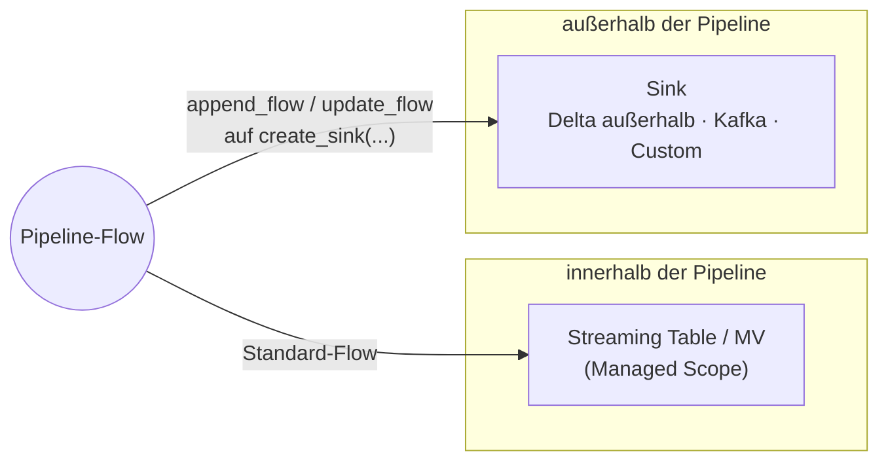

# Sinks

Referenz zum Konzept "Sink" in Lakeflow-Pipelines, basierend auf `https://docs.databricks.com/aws/en/ldp/concepts/sinks` (wörtlich per Azure/Microsoft-Learn-Spiegelseite gegengeprüft).

## Abschnittsübersicht

1. [Was ist ein Sink?](#definition)
2. [Managed Table vs. Sink](#vergleich)
3. [Wann Sinks verwenden?](#wann-verwenden)
4. [Sink-Typen](#sink-typen)
5. [Sink-APIs](#sink-apis)
6. [Einschränkungen](#einschraenkungen)
7. [Muster mit Sinks](#muster)
8. [Quellen](#quellen)

---

## <a id="definition">1. Was ist ein Sink?</a>

Standardmäßig schreiben Pipeline-Flows ihre Ergebnisse in von Unity Catalog verwaltete Delta-Tabellen, typischerweise Streaming Tables oder Materialized Views. Sinks sind ein alternatives Ausgabeziel, mit dem transformierte Daten an Ziele außerhalb des von Databricks verwalteten Speichers geschrieben werden können, etwa Event-Streaming-Dienste oder benutzerdefinierte Datenspeicher.

Sinks werden zusammen mit Append- oder Update-Flows verwendet: Zunächst wird ein Sink über eine der Sink-APIs definiert, anschließend wird er als `target` in der `append_flow`- bzw. `update_flow`-Definition referenziert.

## <a id="vergleich">2. Managed Table vs. Sink</a>

Jedes Standard-Dataset einer Pipeline — Streaming Table oder Materialized View — wird von der Pipeline selbst verwaltet. Ein Sink durchbricht das bewusst: Er lässt die Pipeline Streaming-Daten an ein Ziel schreiben, das außerhalb ihres verwalteten Bereichs liegt.

| | Managed Table (Standard) | Sink |
|---|---|---|
| Speicherort | bleibt in Unity Catalog | beliebiges externes System |
| Lineage | vollständige Pipeline-Lineage | keine Pipeline-Lineage |
| Expectations / CDC | unterstützt | nicht unterstützt |
| Schreibmodus | je nach Flow-Typ | nur Anhängen (`append_flow`) oder `update`-Mode (`update_flow`) |
| Typische Ziele | Streaming Table, Materialized View | Delta außerhalb der Pipeline, Kafka, Event Hubs, Custom |

## <a id="wann-verwenden">3. Wann Sinks verwenden?</a>

Databricks empfiehlt Sinks für folgende Fälle:

- **Operative Anwendungsfälle mit niedriger Latenz**, etwa Fraud Detection, Echtzeit-Analysen oder Kundenempfehlungen, bei denen Daten an einen Message-Bus statt an Cloud-Speicher fließen müssen. Für Workloads, die Latenzen im Millisekundenbereich erfordern, verweist die Doku auf den "Real-Time Mode" (siehe `11 Konfiguration und Compute/Echtzeit-Verarbeitung.md`).
- **Schreiben transformierter Daten in Tabellen, die von einer externen Delta-Instanz verwaltet werden**, einschließlich Unity-Catalog-Managed- und External-Tables.
- **Reverse ETL in externe Systeme**, etwa das Zurückschreiben verarbeiteter Daten in Apache-Kafka-Topics zur Nutzung außerhalb von Databricks.
- **Schreiben in ein von Databricks nicht nativ unterstütztes Format**, mittels benutzerdefinierter Python-Datenquellen.

## <a id="sink-typen">4. Sink-Typen</a>

Pipelines unterstützen folgende Sink-Typen:

| Sink-Typ | Beschreibung |
|---|---|
| **Delta-Table-Sinks** | Schreiben in Unity-Catalog-Managed- oder -External-Delta-Tabellen. Es wird entweder ein Dateipfad oder ein vollqualifizierter Tabellenname angegeben. |
| **Apache-Kafka-Sinks** | Schreiben in Apache-Kafka-Topics über den im Pipeline-Runtime enthaltenen Kafka-Connector. |
| **Azure-Event-Hubs-Sinks** | Schreiben in Azure Event Hubs über die Kafka-Schnittstelle. Verwendet dieselben Optionen wie Kafka-Sinks. |
| **Python-Custom-Sinks** | Schreiben in einen beliebigen Datenspeicher über eine mit `spark.dataSource.register` registrierte benutzerdefinierte Python-Datenquelle. |
| **ForEachBatch-Sinks** | Wenden benutzerdefinierte Python-Logik auf jeden Micro-Batch von Streaming-Daten an. Geeignet, wenn in mehrere Ziele geschrieben werden muss, Upserts durchgeführt werden müssen, oder wenn das Ziel Streaming-Writes nicht nativ unterstützt. |

## <a id="sink-apis">5. Sink-APIs</a>

Pipelines stellen zwei APIs zur Erstellung von Sinks bereit:

- **`create_sink()`:** Erstellt einen benannten Sink eines unterstützten Typs (Delta, Kafka, Azure Event Hubs oder Python-Custom-Datenquelle). Nur in Python verfügbar.
- **`foreach_batch_sink()`:** Dekoriert eine Python-Funktion, die für jeden Micro-Batch von Streaming-Daten ausgeführt wird. Bietet maximale Flexibilität für benutzerdefinierte Schreiblogik.

Ein per `create_sink()` erzeugter Sink wird als `target` eines `append_flow` oder `update_flow` referenziert; ein `foreach_batch_sink` wird ebenso als `target` eines `append_flow` angesteuert (siehe `Sinks in Lakeflow Pipelines.md`, Abschnitt 4, und `06 Flows/foreachBatch.md`).

## <a id="einschraenkungen">6. Einschränkungen</a>

- Sinks sind ausschließlich in Python verfügbar. SQL wird nicht unterstützt.
- Nur Streaming-Queries werden unterstützt. Batch-Queries werden nicht unterstützt.
- Nur `append_flow` und `update_flow` können in Sinks schreiben; `create_auto_cdc_flow` und andere Flow-Typen werden nicht unterstützt.
- Pipeline-Expectations werden für Sinks nicht unterstützt.
- Ein Full Refresh räumt zuvor in Sinks geschriebene Daten nicht auf (keine automatische Bereinigung).

## <a id="muster">7. Muster mit Sinks</a>

Zwei Architekturmuster bauen unmittelbar auf Sinks auf. Beide sind primär Flow-seitig dokumentiert, weil sie über `foreach_batch_sink` bzw. mehrere `append_flow`-Instanzen umgesetzt werden — Details und Code-Beispiele stehen daher in `06 Flows/Flow-Muster (Fan-in, Fan-out, Multiplex).md`, um Dopplung zu vermeiden:

- **Fan-out auf mehrere Sinks:** Ein `foreach_batch_sink` schreibt aus einem einzigen Flow in mehrere Ziele (z. B. eine Delta-Tabelle und einen JSON-Pfad) — siehe dort Abschnitt 2c.
- **Fan-in in einen gemeinsamen Sink:** Mehrere `append_flow`-Quellen (unterschiedliche Kafka-Topics, APIs, Verzeichnisse) laufen in einen einzigen `foreach_batch_sink` zusammen und teilen sich dadurch einen Checkpoint statt vieler — siehe dort, Tabelle in Abschnitt 2c.

Innerhalb eines `foreach_batch_sink` steht der volle Batch-Funktionsumfang von Spark zur Verfügung — dazu zählt auch `MERGE INTO` gegen eine externe Delta-Tabelle, was mit reinem Streaming-Write nicht möglich wäre. Ein vollständiges Beispiel dafür steht in `06 Flows/foreachBatch.md`, Abschnitt "Merge mit einer externen Delta-Lake-Tabelle".

## <a id="quellen">8. Quellen</a>

- https://docs.databricks.com/aws/en/ldp/concepts/sinks
- https://learn.microsoft.com/en-us/azure/databricks/ldp/concepts/sinks (Gegenprüfung, wörtlich)
- Fan-in and fan-out architecture in Lakeflow pipelines (Abschnitt 7, Querverweis): https://learn.microsoft.com/en-us/azure/databricks/data-engineering/fan-in-fan-out

**Stand:** 2026-08-19.
