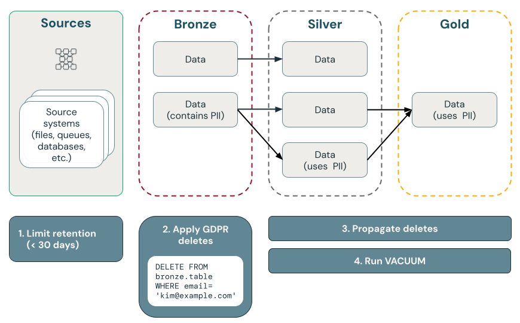
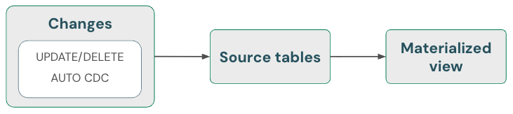
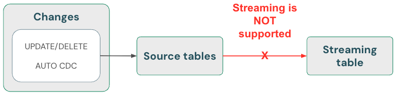

# GDPR / Right to be Forgotten in Lakeflow Pipelines

Dieses Dokument beschreibt, wie man das "Right to be Forgotten" in Lakeflow Pipelines umsetzt.

## Abschnittsübersicht

1. [Rechtlicher Hintergrund](#hintergrund)
2. [Point Deletes mit Delta Lake](#point-deletes)
3. [Löschung bei aktivierten Deletion Vectors](#deletion-vectors)
4. [Löschung in vorgelagerten Quellen](#upstream)
5. [Vollständige Löschung statt Verschleierung](#loeschung-vs-obfuskation)
6. [Reihenfolge: Bronze zuerst, dann Silver/Gold](#reihenfolge)
7. [Regelmäßige Tabellenpflege](#tabellenpflege)
8. [PII-Löschung in der Bronze-Schicht](#bronze-loeschung)
9. [Propagation von Bronze nach Silver/Gold](#propagation)
10. [Vollständiges Beispiel: E-Commerce-Pipeline](#beispiel)

---

## <a id="hintergrund">1. Rechtlicher Hintergrund</a>



Die Datenschutz-Grundverordnung (GDPR) und der California Consumer Privacy Act (CCPA) sind Datenschutz- und Datensicherheitsregularien, die Unternehmen verpflichten, auf ausdrückliche Anfrage eines Kunden alle über ihn gesammelten personenbezogenen Daten (PII) dauerhaft und vollständig zu löschen. Auch bekannt als "Right to be Forgotten" (RTBF) oder "Right to Data Erasure" — Löschanfragen müssen innerhalb einer festgelegten Frist ausgeführt werden (zum Beispiel innerhalb eines Kalendermonats).

Bei GDPR-Verstößen drohen Bußgelder. Ein Beispiel dafür ist eine fehlende Antwort auf eine Löschanfrage innerhalb von 30 Tagen. Die Bußgelder betragen bis zu 4 % des weltweiten Jahresumsatzes oder 20 Mio. €, je nachdem, welcher Betrag höher ist.

Bei CCPA muss der Eingang einer Anfrage innerhalb von 10 Werktagen bestätigt werden. Die Anfrage selbst muss innerhalb von 45 Tagen bearbeitet werden. Verstöße können mit bis zu 2.500 $ pro Verstoß bzw. 750 $ pro Kunde und Vorfall geahndet werden.

Da beide Regularien im Detail unterschiedliche Anforderungen stellen, vereinfacht eine gemeinsame, beide Regelwerke abdeckende globale Policy das Datenmanagement erheblich.

## <a id="point-deletes">2. Point Deletes mit Delta Lake</a>

Delta Lake beschleunigt Point Deletes in großen Data Lakes durch ACID-Transaktionen und erlaubt es, PII als Reaktion auf GDPR- oder CCPA-Anfragen zu lokalisieren und zu entfernen.

Delta Lake behält die Tabellenhistorie und macht sie für Point-in-Time-Queries und Rollbacks verfügbar. Die `VACUUM`-Funktion entfernt Datendateien, die von einer Delta-Tabelle nicht mehr referenziert werden und älter sind als ein festgelegter Retention-Schwellenwert — dabei werden die Daten dauerhaft gelöscht.

## <a id="deletion-vectors">3. Löschung bei aktivierten Deletion Vectors</a>

Für Tabellen mit aktivierten Deletion Vectors muss nach dem Löschen von Datensätzen zusätzlich `REORG TABLE ... APPLY (PURGE)` ausgeführt werden, um zugrunde liegende Datensätze dauerhaft zu löschen. Dies gilt für Delta-Lake-Tabellen, Materialized Views und Streaming Tables gleichermaßen.

## <a id="upstream">4. Löschung in vorgelagerten Quellen</a>

GDPR und CCPA gelten für alle Daten, einschließlich Daten in Quellen außerhalb von Delta Lake, etwa Kafka, Dateien und Datenbanken. Zusätzlich zum Löschen von Daten in Databricks müssen auch Daten in vorgelagerten Quellen gelöscht werden, etwa in Warteschlangen und Cloud-Speicher.

## <a id="loeschung-vs-obfuskation">5. Vollständige Löschung statt Verschleierung</a>

Es besteht die Wahl zwischen dem Löschen und dem Verschleiern von Daten. Verschleierung lässt sich über Pseudonymisierung, Data Masking etc. umsetzen. Die sicherste Option ist jedoch die vollständige Löschung, da die Beseitigung des Reidentifizierungsrisikos in der Praxis oft eine vollständige Löschung der PII-Daten erfordert.

## <a id="reihenfolge">6. Reihenfolge: Bronze zuerst, dann Silver/Gold</a>

Empfohlen wird, GDPR- und CCPA-Compliance zunächst mit der Löschung von Daten in der Bronze-Schicht zu beginnen, gesteuert durch einen geplanten Job, der eine Tabelle mit Löschanfragen abfragt. Nachdem Daten aus der Bronze-Schicht gelöscht wurden, können die Änderungen an Silver- und Gold-Schichten weitergegeben werden.

## <a id="tabellenpflege">7. Regelmäßige Tabellenpflege</a>

Delta Lake behält standardmäßig die Tabellenhistorie — einschließlich gelöschter Datensätze — für **30 Tage** und macht sie für Time Travel und Rollbacks verfügbar. Auch wenn frühere Versionen der Daten entfernt werden, bleiben die Daten weiterhin im Cloud-Speicher erhalten. Datasets sollten daher regelmäßig gepflegt werden, um frühere Datenversionen zu entfernen. Empfohlen wird Predictive Optimization für Unity-Catalog-verwaltete Tabellen, die sowohl Streaming Tables als auch Materialized Views intelligent pflegt:

- Für Tabellen, die durch Predictive Optimization verwaltet werden, pflegen Lakeflow-Pipelines sowohl Streaming Tables als auch Materialized Views intelligent, basierend auf Nutzungsmustern.
- Für Tabellen ohne aktivierte Predictive Optimization führen Lakeflow-Pipelines automatisch Pflegeaufgaben innerhalb von 24 Stunden nach der Aktualisierung von Streaming Tables und Materialized Views aus.

Wird weder Predictive Optimization noch Lakeflow-Pipelines verwendet, sollte ein `VACUUM`-Befehl auf Delta-Tabellen ausgeführt werden, um frühere Datenversionen dauerhaft zu entfernen. Standardmäßig reduziert dies die Time-Travel-Fähigkeiten auf **7 Tage** (konfigurierbar) und entfernt auch historische Datenversionen aus dem Cloud-Speicher.

## <a id="bronze-loeschung">8. PII-Löschung in der Bronze-Schicht</a>

Je nach Lakehouse-Design lässt sich möglicherweise die Verknüpfung zwischen PII und Nicht-PII-Nutzerdaten trennen. Wird beispielsweise ein nicht-natürlicher Schlüssel wie `user_id` statt eines natürlichen Schlüssels wie einer E-Mail-Adresse verwendet, lassen sich PII-Daten löschen, während Nicht-PII-Daten erhalten bleiben.

Einzelner Datensatz per `DELETE`:

```python
spark.sql("DELETE FROM bronze.users WHERE user_id = 5")
```

Für das gleichzeitige Löschen einer großen Anzahl von Datensätzen wird der `MERGE`-Befehl empfohlen. Das folgende Beispiel setzt voraus, dass eine Kontrolltabelle `gdpr_control_table` mit einer Spalte `user_id` existiert, in die für jeden Nutzer, der das "Right to be Forgotten" beantragt hat, ein Datensatz eingefügt wird:

```python
spark.sql("""
  MERGE INTO target
  USING (
    SELECT user_id
    FROM gdpr_control_table
  ) AS source
  ON target.user_id = source.user_id
  WHEN MATCHED THEN DELETE
""")
```

Der `MERGE`-Befehl gleicht Zeilen aus `target_table` mit Zeilen aus `gdpr_control_table` anhand von `user_id` ab; bei einer Übereinstimmung wird die Zeile in `target_table` gelöscht. Nach erfolgreichem `MERGE` sollte die Kontrolltabelle aktualisiert werden, um zu bestätigen, dass die Anfrage bearbeitet wurde.

## <a id="propagation">9. Propagation von Bronze nach Silver/Gold</a>

### Materialized Views: automatische Behandlung von Löschungen



Materialized Views behandeln Löschungen in Quellen **automatisch**. Es ist also nichts Besonderes zu tun, um sicherzustellen, dass eine Materialized View keine Daten enthält, die aus einer Quelle gelöscht wurden. Die Materialized View muss aktualisiert werden, und Pflegeaufgaben müssen laufen, um sicherzustellen, dass Löschungen vollständig verarbeitet werden.

Eine Materialized View liefert immer das korrekte Ergebnis, da sie inkrementelle Berechnung nutzt, sofern diese günstiger ist als vollständige Neuberechnung — aber niemals auf Kosten der Korrektheit. Mit anderen Worten: Das Löschen von Daten in einer Quelle kann dazu führen, dass eine Materialized View vollständig neu berechnet wird.

### Streaming Tables: Daten löschen und mit `skipChangeCommits` lesen



Streaming Tables verarbeiten beim Streamen aus Delta-Tabellen-Quellen ausschließlich Append-only-Daten. Jede andere Operation, etwa das Aktualisieren oder Löschen eines Datensatzes in einer Streaming-Quelle, wird **nicht unterstützt** und unterbricht den Stream.

Für eine robustere Streaming-Implementierung sollte stattdessen aus den Change Feeds von Delta-Tabellen gestreamt werden, um Updates und Deletes im eigenen Verarbeitungscode zu behandeln.

Da das Streamen aus Delta-Tabellen nur neue Daten behandelt, müssen Änderungen an Daten selbst behandelt werden. Die empfohlene Methode: (1) Daten in den Quell-Delta-Tabellen per DML löschen, (2) Daten aus der Streaming Table per DML löschen, und anschließend (3) das Streaming-Lesen so aktualisieren, dass `skipChangeCommits` verwendet wird. Dieses Flag zeigt an, dass die Streaming Table alles außer Inserts überspringen soll, etwa Updates oder Deletes.

Alternativ: (1) Daten aus der Quelle löschen, dann (2) die Streaming Table vollständig aktualisieren (Full Refresh). Bei einem Full Refresh einer Streaming Table wird der Streaming-State der Tabelle gelöscht und alle Daten erneut verarbeitet. Jede vorgelagerte Datenquelle, die außerhalb ihrer Aufbewahrungsfrist liegt (zum Beispiel ein Kafka-Topic, das Daten nach 7 Tagen verwirft), wird nicht erneut verarbeitet — das kann zu Datenverlust führen. Diese Option wird für Streaming Tables nur in dem Szenario empfohlen, in dem historische Daten verfügbar sind und deren erneute Verarbeitung nicht teuer ist.

## <a id="beispiel">10. Vollständiges Beispiel: E-Commerce-Pipeline</a>

Das folgende Beispiel zeigt eine durchgängige Medallion-Architektur für ein E-Commerce-Unternehmen. Auch wenn die Daten eines Nutzers gelöscht werden, sollen seine Aktivitäten unter Umständen weiterhin in nachgelagerten Aggregationen mitgezählt werden.

**Datenmodell:**

- **Quelltabellen:** `source_users` (Nutzer-Stream, mit PII-Spalte `email`), `source_clicks` (Klick-Events, mit PII-Spalte `ip_address`) — in Produktionsumgebungen typischerweise Kafka, Kinesis o. Ä.
- **Kontrolltabelle:** `gdpr_requests` — enthält Nutzer-IDs, die dem "Right to be Forgotten" unterliegen.
- **Bronze:** `users_bronze`, `clicks_bronze`
- **Silver:** `clicks_silver`, `users_silver`, `user_clicks_silver` (Join von `clicks_silver` (streaming) mit einem Snapshot von `users_silver`)
- **Gold:** `user_behavior_gold`, `marketing_insights_gold`

### Schritt 1: Beispieldaten erzeugen

```python
from pyspark.sql.types import StructType, StructField, StringType, IntegerType, MapType, DateType

catalog = "users"
schema = "name"

# Create table containing sample users
users_schema = StructType([
   StructField('user_id', IntegerType(), False),
   StructField('username', StringType(), True),
   StructField('email', StringType(), True),
   StructField('registration_date', StringType(), True),
   StructField('user_preferences', MapType(StringType(), StringType()), True)
])

users_data = [
   (1, 'alice', 'alice@example.com', '2021-01-01', {'theme': 'dark', 'language': 'en'}),
   (2, 'bob', 'bob@example.com', '2021-02-15', {'theme': 'light', 'language': 'fr'}),
   (3, 'charlie', 'charlie@example.com', '2021-03-10', {'theme': 'dark', 'language': 'es'}),
   (4, 'david', 'david@example.com', '2021-04-20', {'theme': 'light', 'language': 'de'}),
   (5, 'eve', 'eve@example.com', '2021-05-25', {'theme': 'dark', 'language': 'it'})
]

users_df = spark.createDataFrame(users_data, schema=users_schema)
users_df.write.mode("overwrite").saveAsTable(f"{catalog}.{schema}.source_users")

# Create table containing clickstream (i.e. user activities)
from pyspark.sql.types import TimestampType

clicks_schema = StructType([
   StructField('click_id', IntegerType(), False),
   StructField('user_id', IntegerType(), True),
   StructField('url_clicked', StringType(), True),
   StructField('click_timestamp', StringType(), True),
   StructField('device_type', StringType(), True),
   StructField('ip_address', StringType(), True)
])

clicks_data = [
   (1001, 1, 'https://example.com/home', '2021-06-01T12:00:00', 'mobile', '192.168.1.1'),
   (1002, 1, 'https://example.com/about', '2021-06-01T12:05:00', 'desktop', '192.168.1.1'),
   (1003, 2, 'https://example.com/contact', '2021-06-02T14:00:00', 'tablet', '192.168.1.2'),
   (1004, 3, 'https://example.com/products', '2021-06-03T16:30:00', 'mobile', '192.168.1.3'),
   (1005, 4, 'https://example.com/services', '2021-06-04T10:15:00', 'desktop', '192.168.1.4'),
   (1006, 5, 'https://example.com/blog', '2021-06-05T09:45:00', 'tablet', '192.168.1.5')
]

clicks_df = spark.createDataFrame(clicks_data, schema=clicks_schema)
clicks_df.write.format("delta").mode("overwrite").saveAsTable(f"{catalog}.{schema}.source_clicks")
```

### Schritt 2: Pipeline für die PII-Verarbeitung erstellen

```python
from pyspark import pipelines as dp
from pyspark.sql.functions import col, concat_ws, count, countDistinct, avg, when, expr

catalog = "users"
schema = "name"

# ----------------------------
# Bronze Layer - Raw Data Ingestion
# ----------------------------

@dp.table(
   name=f"{catalog}.{schema}.users_bronze",
   comment='Raw users data loaded from source'
)
def users_bronze():
   return (
     spark.readStream.table(f"{catalog}.{schema}.source_users")
   )

@dp.table(
   name=f"{catalog}.{schema}.clicks_bronze",
   comment='Raw clicks data loaded from source'
)
def clicks_bronze():
   return (
       spark.readStream.table(f"{catalog}.{schema}.source_clicks")
   )

# ----------------------------
# Silver Layer - Data Cleaning and Enrichment
# ----------------------------

@dp.create_streaming_table(
   name=f"{catalog}.{schema}.users_silver",
   comment='Cleaned and standardized users data'
)

@dp.view
@dp.expect_or_drop('valid_email', "email IS NOT NULL")
def users_bronze_view():
   return (
       spark.readStream
           .table(f"{catalog}.{schema}.users_bronze")
           .withColumn('registration_date', col('registration_date').cast('timestamp'))
           .dropDuplicates(['user_id', 'registration_date'])
           .select('user_id', 'username', 'email', 'registration_date', 'user_preferences')
   )

@dp.create_auto_cdc_flow(
   target=f"{catalog}.{schema}.users_silver",
   source="users_bronze_view",
   keys=["user_id"],
   sequence_by="registration_date",
)

@dp.table(
   name=f"{catalog}.{schema}.clicks_silver",
   comment='Cleaned and standardized clicks data'
)
@dp.expect_or_drop('valid_click_timestamp', "click_timestamp IS NOT NULL")
def clicks_silver():
   return (
       spark.readStream
           .table(f"{catalog}.{schema}.clicks_bronze")
           .withColumn('click_timestamp', col('click_timestamp').cast('timestamp'))
           .withWatermark('click_timestamp', '10 minutes')
           .dropDuplicates(['click_id'])
           .select('click_id', 'user_id', 'url_clicked', 'click_timestamp', 'device_type', 'ip_address')
   )

@dp.table(
   name=f"{catalog}.{schema}.user_clicks_silver",
   comment='Joined users and clicks data on user_id'
)
def user_clicks_silver():
   # Read users_silver as a static DataFrame - each refresh
   # will use a snapshot of the users_silver table.
   users = spark.read.table(f"{catalog}.{schema}.users_silver")

   # Read clicks_silver as a streaming DataFrame.
   clicks = spark.readStream \
       .table('clicks_silver')

   # Perform the join - join of a static dataset with a
   # streaming dataset creates a streaming table.
   joined_df = clicks.join(users, on='user_id', how='inner')

   return joined_df

# ----------------------------
# Gold Layer - Aggregated and Business-Level Data
# ----------------------------

@dp.materialized_view(
   name=f"{catalog}.{schema}.user_behavior_gold",
   comment='Aggregated user behavior metrics'
)
def user_behavior_gold():
   df = spark.read.table(f"{catalog}.{schema}.user_clicks_silver")
   return (
       df.groupBy('user_id')
         .agg(
             count('click_id').alias('total_clicks'),
             countDistinct('url_clicked').alias('unique_urls')
         )
   )

@dp.materialized_view(
   name=f"{catalog}.{schema}.marketing_insights_gold",
   comment='User segments for marketing insights'
)
def marketing_insights_gold():
   df = spark.read.table(f"{catalog}.{schema}.user_behavior_gold")
   return (
       df.withColumn(
           'engagement_segment',
           when(col('total_clicks') >= 100, 'High Engagement')
           .when((col('total_clicks') >= 50) & (col('total_clicks') < 100), 'Medium Engagement')
           .otherwise('Low Engagement')
       )
   )
```

### Schritt 3: Daten in Quelltabellen löschen

```python
catalog = "users"
schema = "name"

def apply_gdpr_delete(user_id):
 tables_with_pii = ["clicks_bronze", "users_bronze", "clicks_silver", "users_silver", "user_clicks_silver"]

 for table in tables_with_pii:
   print(f"Deleting user_id {user_id} from table {table}")
   spark.sql(f"""
     DELETE FROM {catalog}.{schema}.{table}
     WHERE user_id = {user_id}
   """)
```

### Schritt 4: `skipChangeCommits` zu den betroffenen Streaming-Table-Definitionen hinzufügen

In diesem Schritt muss der Pipeline mitgeteilt werden, Nicht-Append-Zeilen zu überspringen. Die `skipChangeCommits`-Option wird zu folgenden Methoden hinzugefügt: `users_bronze`, `users_silver`, `clicks_bronze`, `clicks_silver`, `user_clicks_silver`. Definitionen von Materialized Views müssen **nicht** angepasst werden, da diese Updates und Deletes automatisch behandeln.

Beispiel für die Aktualisierung von `users_bronze`:

```python
def users_bronze():
   return (
     spark.readStream.option('skipChangeCommits', 'true').table(f"{catalog}.{schema}.source_users")
   )
```

Bei erneutem Ausführen der Pipeline ist das Update erfolgreich.
