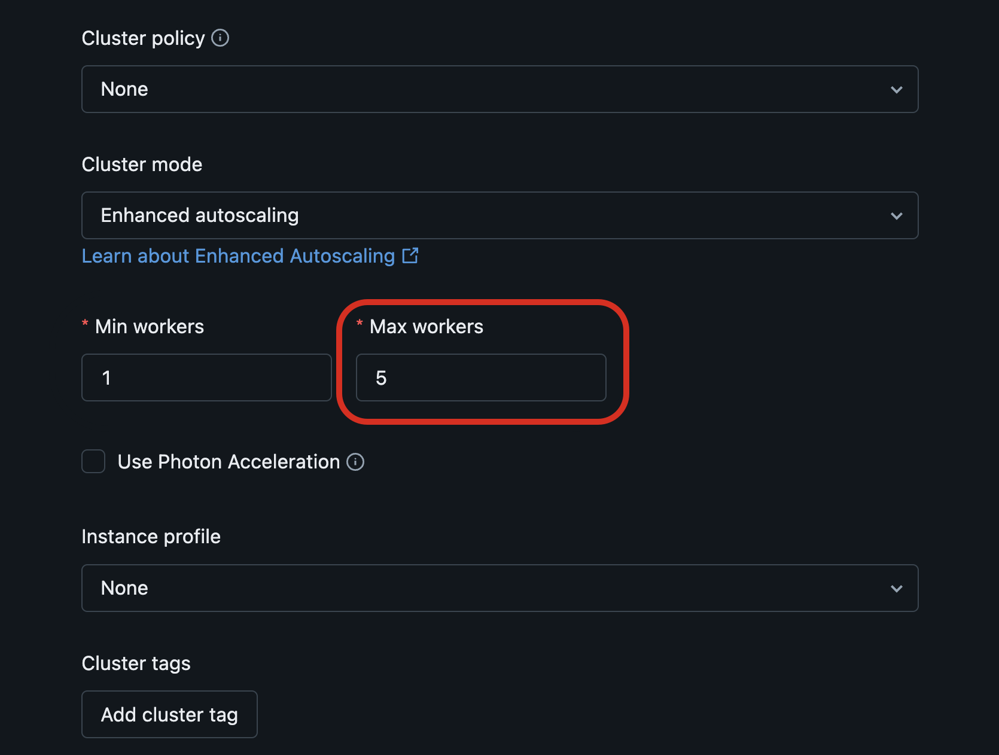

# Enhanced Autoscaling und Vertical Autoscaling

Dieses Dokument fasst die Databricks-Referenzseite "Optimize Lakeflow pipeline cluster utilization with autoscaling" zusammen. Verifiziert per `WebFetch` gegen die AWS-Seite (`docs.databricks.com/aws/en/ldp/auto-scaling`) und wörtlich vollständig extrahiert von der inhaltlich übereinstimmenden Azure-Spiegelseite (`learn.microsoft.com/en-us/azure/databricks/ldp/auto-scaling`).

## Abschnittsübersicht

1. [Was ist Enhanced Autoscaling?](#was-ist-es)
2. [Scale-Up/Scale-Down-Metriken](#metriken)
3. [Enhanced Autoscaling aktivieren](#aktivieren)
4. [Kosten begrenzen](#kosten-begrenzen)
5. [Monitoring über den Event-Log](#monitoring)
6. [Vertical Autoscaling](#vertical-autoscaling)
7. [Quellen](#quellen)

---

## <a id="was-ist-es">1. Was ist Enhanced Autoscaling?</a>

Enhanced Autoscaling optimiert die Auslastung von Lakeflow-Pipeline-Clustern, indem automatisch Compute hinzugefügt und entfernt wird, wenn sich das Workload-Volumen ändert — mit minimalem Einfluss auf die Datenverarbeitungslatenz der Pipelines.

Enhanced Autoscaling ist für alle neuen Pipelines standardmäßig aktiviert. Serverless-Pipelines nutzen zudem Vertical Autoscaling (siehe Abschnitt 6). Für Serverless-Pipelines ist Enhanced Autoscaling immer aktiv und kann nicht deaktiviert werden.

Enhanced Autoscaling verbessert die reguläre Azure-Databricks-Cluster-Autoscaling-Funktionalität durch folgende Merkmale:

- Enhanced Autoscaling implementiert eine Optimierung für Streaming-Workloads und fügt Verbesserungen hinzu, um die Performance von Batch-Workloads zu steigern. Enhanced Autoscaling optimiert Kosten, indem Maschinen hinzugefügt oder entfernt werden, sobald sich der Workload ändert.
- Enhanced Autoscaling fährt proaktiv unterausgelastete Knoten herunter, während garantiert wird, dass beim Herunterfahren keine Tasks fehlschlagen. Die bestehende Cluster-Autoscaling-Funktion skaliert Knoten nur herunter, wenn ein Knoten vollständig im Leerlauf ist.

Enhanced Autoscaling ist der Standard-Autoscaling-Modus beim Erstellen einer neuen Pipeline in der Pipelines-UI. Für bestehende Pipelines lässt sich Enhanced Autoscaling durch Bearbeiten der Pipeline-Einstellungen in der UI oder über die Pipelines-REST-API aktivieren.

## <a id="metriken">2. Scale-Up/Scale-Down-Metriken</a>

Enhanced Autoscaling verwendet zwei Metriken, um über Hoch- oder Herunterskalierung zu entscheiden:

- **Task Slot Utilization**: das durchschnittliche Verhältnis der *Anzahl belegter Task-Slots* zur *Gesamtzahl der im Cluster verfügbaren Task-Slots*.
- **Task Queue Size**: die Anzahl der Tasks, die auf Ausführung in Task-Slots warten.

## <a id="aktivieren">3. Enhanced Autoscaling aktivieren</a>

Vorgehen:

- **Cluster mode** auf **Enhanced autoscaling** setzen, beim Bearbeiten der Pipeline-Einstellungen im Lakeflow Pipelines Editor, oder
- Die `autoscale`-Einstellung zur Pipeline-Cluster-Konfiguration hinzufügen und das Feld `mode` auf `ENHANCED` setzen.

Richtlinien für Produktions-Pipelines:

- **Min workers** auf dem Standardwert belassen.
- **Max workers** auf einen Wert setzen, der sich an Budget und Pipeline-Priorität orientiert.

Beispiel: ein Enhanced-Autoscaling-Cluster mit minimal 5 und maximal 10 Workern. `max_workers` muss größer oder gleich `min_workers` sein.

```json
{
  "clusters": [
    {
      "autoscale": {
        "min_workers": 5,
        "max_workers": 10,
        "mode": "ENHANCED"
      }
    }
  ]
}
```

**Hinweise aus der Doku:**

- Enhanced Autoscaling ist ausschließlich für `updates`-Cluster verfügbar. Für `maintenance`-Cluster wird Legacy Autoscaling verwendet.
- Die `autoscale`-Konfiguration kennt zwei Modi: `LEGACY` (reguläres Cluster-Autoscaling) und `ENHANCED` (Enhanced Autoscaling).

Ist die Pipeline für Continuous-Ausführung konfiguriert, wird sie nach einer Änderung der Autoscaling-Konfiguration automatisch neu gestartet. Nach dem Neustart ist eine kurze Phase erhöhter Latenz zu erwarten; danach sollte sich die Clustergröße gemäß der `autoscale`-Konfiguration einpendeln und die Pipeline-Latenz zu ihren vorherigen Werten zurückkehren.

## <a id="kosten-begrenzen">4. Kosten begrenzen</a>

**Hinweis aus der Doku:** Für Serverless-Pipelines lassen sich keine Worker konfigurieren.

Das Setzen des Parameters **Max workers** im Compute-Bereich der Pipelines-UI legt eine Obergrenze für Autoscaling fest. Eine Reduzierung der verfügbaren Worker kann bei manchen Workloads die Latenz erhöhen, verhindert aber, dass die Compute-Ressourcenkosten bei rechenintensiven Operationen ausufern. Databricks empfiehlt, die **Max workers**-Einstellung so abzustimmen, dass der Kosten-Latenz-Trade-off den eigenen Anforderungen entspricht.

## <a id="monitoring">5. Monitoring über den Event-Log</a>

Der Event-Log in der Pipeline-UI dient zum Monitoring von Enhanced-Autoscaling-Metriken für Classic-Pipelines. Enhanced-Autoscaling-Events besitzen den Event-Typ `autoscale`. Beispiel-Events aus der Doku:

| Event | Meldung |
|---|---|
| Cluster resize request started | `Scaling [up or down] to <y> executors from current cluster size of <x>` |
| Cluster resize request succeeded | `Achieved cluster size <x> for cluster <cluster-id> with status SUCCEEDED` |
| Cluster resize request partially succeeded | `Achieved cluster size <x> for cluster <cluster-id> with status PARTIALLY_SUCCEEDED` |
| Cluster resize request failed | `Achieved cluster size <x> for cluster <cluster-id> with status FAILED` |

Enhanced-Autoscaling-Events lassen sich außerdem durch direkte Abfrage des Event-Logs einsehen — etwa für Backlog-Metriken (Monitoring der Daten-Backlog zur Optimierung der Streaming-Dauer) oder zur Überwachung von Cluster-Resize-Requests und -Antworten während Enhanced-Autoscaling-Operationen.

## <a id="vertical-autoscaling">6. Vertical Autoscaling</a>

Serverless-Pipelines ergänzen die horizontale Autoscaling-Funktion von Databricks Enhanced Autoscaling, indem automatisch die kosteneffizientesten Instanztypen zugewiesen werden, die die Pipeline ausführen können, ohne wegen Out-of-Memory-Fehlern fehlzuschlagen. Vertical Autoscaling skaliert hoch, wenn größere Instanztypen zur Ausführung eines Pipeline-Updates benötigt werden, und skaliert auch herunter, wenn festgestellt wird, dass das Update mit kleineren Instanztypen ausgeführt werden kann. Vertical Autoscaling bestimmt, ob Driver-Knoten, Worker-Knoten oder beide hoch- oder heruntergeskaliert werden sollen.

Vertical Autoscaling wird für **alle** Serverless-Pipelines verwendet, einschließlich Pipelines für eigenständige Materialized Views und Streaming Tables.

Vertical Autoscaling funktioniert, indem Pipeline-Updates erkannt werden, die wegen Out-of-Memory-Fehlern fehlgeschlagen sind. Werden solche Fehlschläge erkannt, weist Vertical Autoscaling größere Instanztypen zu, basierend auf den aus dem fehlgeschlagenen Update gesammelten Out-of-Memory-Daten. Für Updates, die automatisches Retry- und Restart-Verhalten nutzen, wird automatisch ein neues Update mit den neuen Compute-Ressourcen gestartet. Für Ad-hoc-Updates mit Fast-Start-, auf Debugging ausgerichtetem Verhalten werden die neuen Compute-Ressourcen verwendet, sobald manuell ein neues Update gestartet wird.

Erkennt Vertical Autoscaling, dass der Arbeitsspeicher der zugewiesenen Instanzen durchgängig unterausgelastet ist, skaliert es die für das nächste Pipeline-Update verwendeten Instanztypen herunter.



---

## <a id="quellen">Quellen</a>

- https://docs.databricks.com/aws/en/ldp/auto-scaling
- https://learn.microsoft.com/en-us/azure/databricks/ldp/auto-scaling (wörtliche Vollzitat-Quelle, inhaltlich mit AWS-Seite abgeglichen)
