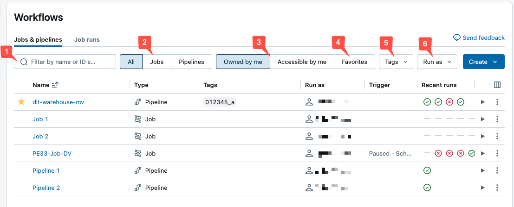

# Pipelines in der UI überwachen

Dieses Dokument beschreibt das Monitoring von Lakeflow Declarative Pipelines direkt in der Databricks-UI: Fortschritts- und Statusverfolgung, E-Mail-Benachrichtigungen, den Aufbau der Monitoring-Seite, die Unified-Runs-List-Preview, Dataset-Details, Update-Historie, das Debuggen fehlgeschlagener Updates sowie Streaming-Metriken. Jede Aussage wurde per `WebFetch` gegen `docs.databricks.com/aws/en/ldp/monitoring-ui` verifiziert.

## Abschnittsübersicht

1. [E-Mail-Benachrichtigungen für Pipeline-Ereignisse](#notifications)
2. [Pipelines in der UI anzeigen](#anzeigen)
3. [Die Jobs-&-Pipelines-Liste nutzen](#liste)
4. [Pipeline-Details auf der Monitoring-Seite](#details)
5. [Änderungen durch die Unified-Runs-List-Preview](#unified-runs-list)
6. [Dataset-Details anzeigen](#dataset-details)
7. [Update-Historie anzeigen](#update-historie)
8. [Fehlgeschlagenes Update debuggen](#debuggen)
9. [Streaming-Metriken anzeigen](#streaming-metriken)
10. [Quellen](#quellen)

---

## <a id="notifications">1. E-Mail-Benachrichtigungen für Pipeline-Ereignisse</a>

Eine oder mehrere E-Mail-Adressen lassen sich konfigurieren, um bei folgenden Ereignissen benachrichtigt zu werden:

- Ein Pipeline-Update wird erfolgreich abgeschlossen.
- Ein Pipeline-Update schlägt fehl — entweder mit einem wiederholbaren oder einem nicht wiederholbaren Fehler (diese Option benachrichtigt bei jedem Fehlschlag).
- Ein Pipeline-Update schlägt mit einem nicht wiederholbaren (fatalen) Fehler fehl (diese Option benachrichtigt ausschließlich bei nicht wiederholbaren Fehlern).
- Ein einzelner Datenfluss (Flow) schlägt fehl.

Konfiguriert werden die Benachrichtigungen über die Pipeline-Einstellungen.

**Hinweis:** Benutzerdefinierte Reaktionen auf Ereignisse — inklusive Benachrichtigungen oder eigener Verarbeitungslogik — lassen sich über Python-Event-Hooks realisieren (siehe `Event Hooks.md`).

---

## <a id="anzeigen">2. Pipelines in der UI anzeigen</a>

Über **Jobs & Pipelines** in der Seitenleiste des Workspace gelangt man zur Seite **Jobs & pipelines**, die Informationen zu jedem zugänglichen Job und jeder Pipeline anzeigt. Ein Klick auf den Namen einer Pipeline öffnet die Pipeline-Monitoring-Seite. Zum Bearbeiten dient das Kebab-Menü mit der Option **Edit**.

**Hinweis:** Jobs und die verschiedenen Pipeline-Typen haben unterschiedliche Editoren — die **Edit**-Option öffnet automatisch den passenden Editor für das ausgewählte Objekt.

---

## <a id="liste">3. Die Jobs-&-Pipelines-Liste nutzen</a>

Der Tab **Jobs & pipelines** listet Informationen zu allen zugänglichen Jobs und Pipelines auf — u. a. Ersteller, Trigger (falls vorhanden) und das Ergebnis der letzten fünf Läufe.

Ein Klick auf den Namen einer Pipeline oder eines Jobs führt zur jeweiligen Monitoring-Seite. Über das Spalten-Icon lassen sich die angezeigten Spalten anpassen, z. B. um die Spalte `Pipeline Type` einzublenden.

Filtermöglichkeiten in der Liste:

1. **Textsuche:** Stichwortsuche für die Felder **Name** und **ID**. Für Tags kann nach Key, Value oder beidem gesucht werden (z. B. Key `department`, Value `finance` — Suche nach `department`, `finance` oder `department:finance`).
2. **Type:** Filter nach **Jobs**, **Pipelines** oder **All**. Bei Auswahl von **Pipelines** lässt sich zusätzlich nach **Pipeline type** filtern (ETL- und Ingestion-Pipelines).
3. **Owner:** nur eigene Jobs anzeigen.
4. **Favorites:** als Favorit markierte Jobs anzeigen.
5. **Tags:** Filterung über das Tags-Dropdown (bis zu fünf Tags gleichzeitig) oder direkt per Stichwortsuche.
6. **Run as:** Filter nach bis zu zwei „Run as"-Werten.

Über die Play-/Stop-Icons lassen sich Job/Pipeline starten bzw. stoppen; über das Kebab-Menü sind weitere Aktionen erreichbar, z. B. Bearbeiten, Löschen oder der Zugriff auf Pipeline-Einstellungen.

---

## <a id="details">4. Pipeline-Details auf der Monitoring-Seite</a>

Ein Klick auf den Namen einer Pipeline in der Jobs-&-Pipelines-Liste öffnet die Monitoring-Seite. Von dort lässt sich ein Pipeline-Lauf starten und lassen sich Details vorheriger Läufe einsehen.

Der Pipeline-Graph (auch Directed Acyclic Graph, DAG) erscheint, sobald ein Update erfolgreich gestartet wurde. Pfeile stellen Abhängigkeiten zwischen Datasets dar. Standardmäßig zeigt die Monitoring-Seite das jüngste Update, ältere Updates lassen sich über ein Dropdown auswählen.

Der rechte Bereich zeigt oben Pipeline-Details (Pipeline-ID, Compute-Kosten, Product Edition, Channel), darunter Update-Details. Über **Edit pipeline** gelangt man zum Quellcode; über **Navigate to code** (beim Überfahren einer Tabelle im Graph) direkt zum Code der jeweiligen Tabelle.

Die **List**-Ansicht zeigt alle Datasets tabellarisch — nützlich, wenn der Pipeline-Graph zu groß zum Visualisieren ist. Filter nach Dataset-Name, Typ und Status stehen zur Verfügung.

Der **Run as**-Nutzer ist der Pipeline-Owner; Updates laufen mit dessen Berechtigungen. Zum Ändern dient **Permissions**.

**Update-Ausführungsverhalten:** Über einen Zeitplan, die Pipelines-API oder kontinuierliche Pipelines ausgelöste Updates nutzen automatisches Retry- und Restart-Verhalten. Über die Monitoring-UI oder den Pipeline-Editor ausgelöste Updates nutzen Fast-Start-, debugging-fokussiertes Verhalten. Über **Run now with different settings** lässt sich das Verhalten für einen einzelnen Lauf überschreiben (siehe `Updates.md`).

**Event Log:** Enthält ein Update Fehler, erscheinen diese im unteren Bereich mit einem **View logs**-Button zum Event Log dieses Laufs. Das Event Log ist zusätzlich über **View event log** im rechten Bereich erreichbar. Im Lakeflow Pipelines Editor führt der Weg über das **Issues**-Panel am unteren Rand, dann **View logs** bzw. **Open in logs** neben einem Fehler.

### Änderungen durch die Unified-Runs-List-Preview

Ist die **Unified Runs List**-Preview aktiviert, erscheinen Pipeline-Run-Updates auf der Seite **Jobs & Pipelines**.

**Wichtig:** Die Unified Runs List befindet sich in der Public Preview. Workspaces sind standardmäßig in die Preview eingebunden; ein Workspace-Admin kann sie deaktivieren.

Zugriff auf die Unified Runs List: über **Runs** in der Seitenleiste oder über **Jobs & Pipelines** → Tab **Runs**.

Der Tab zeigt eine Liste der letzten Läufe der vergangenen **60 Tage**. In folgenden Fällen wird zusätzlich zuerst ein Graph mit Erfolgs-/Fehlschlagsrate der letzten **48 Stunden** angezeigt:

- gefiltert auf nur **Jobs** oder nur **Pipelines**,
- als Admin bzw. bei Filterung auf `Run as: Me`.

Läufe können bis zu einer Stunde benötigen, um im Graph zu erscheinen.

Filtermöglichkeiten: **Name**, **All/Jobs/Pipelines**, **Pipeline type** (ETL, Ingestion, MV/ST, Database Table Sync), **Run as**-Nutzer, **Start time** (innerhalb der letzten 48 Stunden), **Run status**, **Error code** bei fehlgeschlagenen Läufen.

Weitere einblendbare Spalten: **End time**, **Run ID**, ob der Lauf manuell oder per Zeitplan gestartet wurde (**Launched**), **Duration**, **Run parameters**.

---

## <a id="dataset-details">5. Dataset-Details anzeigen</a>

Ein Klick auf ein Dataset im Pipeline-Graph oder in der Dataset-Liste zeigt Informationen im unteren Bereich; der rechte Bereich zeigt weiterhin Pipeline- und Update-Details.

- **Schema:** Tabelle im **Tables**-Tab auswählen, dann **Columns**.
- **Datenqualitätsmetriken:** Im unteren Bereich sichtbar, sobald eine Tabelle ausgewählt ist.
- **Quellcode:** Über **Navigate to code** beim Überfahren der Tabelle im Graph.
- **Query History:** Über **Performance** im unteren Bereich.
- **Tabellenkommentare:** Nicht direkt auf der Pipeline-Detailseite verfügbar — dafür die Tabelle im Catalog Explorer öffnen (über **View in catalog** im Kebab-Menü der Tabelle im Graph, oder über das Daten-Icon in der Tabellenliste des unteren Bereichs).

---

## <a id="update-historie">6. Update-Historie anzeigen</a>

Über das Dropdown der Update-Historie in der oberen Leiste lässt sich der Verlauf und Status vergangener Pipeline-Updates einsehen. Auswahl eines Updates zeigt Graph, Details und Ereignisse dieses Updates; über **Show the latest update** kehrt man zum jüngsten Update zurück.

**Hinweis:** Pipelines behalten **60 Tage** vergangener Updates. Ältere Updates verschwinden aus dieser Ansicht, bleiben aber im Event Log erhalten (siehe `Event Logs ueberwachen.md`).

---

## <a id="debuggen">7. Fehlgeschlagenes Update debuggen</a>

Bei einem fehlgeschlagenen Update beginnt die Fehlersuche im **Issues**-Panel des Lakeflow Pipelines Editors bzw. im unteren Bereich der Monitoring-Seite. Fehlgeschlagene Updates zeigen dort Fehler mit einem **View logs**-Button, der direkt zu den relevanten Event-Log-Einträgen springt — ein manuelles Durchsuchen roher Logs ist dadurch selten nötig.

Empfohlenes Vorgehen:

- **Fehlerursache identifizieren:** In der **Graph**-Ansicht sind fehlgeschlagene Tabellen und Flows direkt im DAG hervorgehoben. Auswahl zeigt die Fehlermeldung und ob der Fehler isoliert ist oder auf nachgelagerte Abhängigkeiten übergegriffen hat.
- **Event Log für die vollständige Fehlermeldung abfragen:** Die UI kann Meldungen kürzen; die Spalten `error` und `details` des Event Logs enthalten den vollständigen Stack Trace und strukturierten Kontext.
- **Nur das Fehlgeschlagene erneut ausführen:** **Refresh failed tables** wiederholt nur die fehlgeschlagenen Tabellen plus nachgelagerte Abhängigkeiten, statt bereits erfolgreiche Tabellen neu zu verarbeiten.
- **Vor einem vollständigen Update validieren:** Wirkt der Fehler eher wie ein Code-/Konfigurationsproblem als ein Datenproblem, empfiehlt sich zunächst **Validate** — prüft Graph und Quellcode erneut, ohne Daten zu materialisieren, und liefert so ein schnelles Signal, ob die Korrektur den Fehler behebt.
- **Retry-Verhalten berücksichtigen:** Manuell aus dem Editor ausgelöste Updates deaktivieren automatische Retries, damit Fehler sofort sichtbar werden; per Zeitplan oder API ausgelöste Updates versuchen behebbare Fehler automatisch erneut. Ein Alarm in Produktion könnte sich durch einen Retry selbst auflösen, während dasselbe während interaktiver Entwicklung nicht geschieht.

**Hinweis:** Betrifft der Fehler speziell einen ungültigen oder inkompatiblen Streaming-Checkpoint (häufig nach Änderung einer zustandsbehafteten Operation wie `dropDuplicates()` oder einer Aggregation, oder nach Änderung einer Quelle), behebt ein einfacher Retry das Problem nicht. Die Wiederherstellung erfordert eine Neuverarbeitung der Daten — entweder ein Full Refresh oder ein selektiver Checkpoint-Reset, der ab einer gewählten Position erneut liest und bestehende Tabellendaten erhält. Da ein Reset Quelldaten erneut verarbeitet, müssen nachgelagerte Schreibvorgänge idempotent sein (siehe `Streaming wiederherstellen.md`).

---

## <a id="streaming-metriken">8. Streaming-Metriken anzeigen</a>

**Wichtig:** Streaming-Observability für Pipelines befindet sich in der Public Preview.

Für jeden Streaming-Flow einer Pipeline lassen sich Metriken der von Spark Structured Streaming unterstützten Datenquellen anzeigen — Apache Kafka, Amazon Kinesis, Auto Loader und Delta-Tabellen. Die Metriken erscheinen als Diagramme im rechten Bereich der Pipeline-UI und umfassen Backlog-Sekunden, Backlog-Bytes, Backlog-Datensätze und Backlog-Dateien. Die Diagramme zeigen den je Minute aggregierten Maximalwert; ein Tooltip zeigt Maximalwerte beim Überfahren an. Die Daten sind auf die letzten **48 Stunden** ab dem aktuellen Zeitpunkt begrenzt.

Tabellen mit verfügbaren Streaming-Metriken zeigen im Graph ein Chart-Icon. Ein Klick darauf öffnet das Streaming-Metrik-Diagramm im **Flows**-Tab des rechten Bereichs. Über **List** und den Filter **Has streaming metrics** lassen sich gezielt nur Tabellen mit Streaming-Metriken anzeigen.

Jede Streaming-Quelle unterstützt nur bestimmte Metriken:

| Quelle | Backlog Bytes | Backlog Records | Backlog Seconds | Backlog Files |
|---|---|---|---|---|
| Kafka | ✓ | ✓ | | |
| Kinesis | ✓ | | ✓ | |
| Delta | ✓ | | | ✓ |
| Auto Loader | ✓ | | | ✓ |
| Google Pub/Sub | ✓ | ✓ | | |

---

## <a id="quellen">9. Quellen</a>

- https://docs.databricks.com/aws/en/ldp/monitoring-ui
- https://learn.microsoft.com/en-us/azure/databricks/ldp/monitoring-ui (Bildquelle für Screenshot)

**Stand:** 2026-08-19
