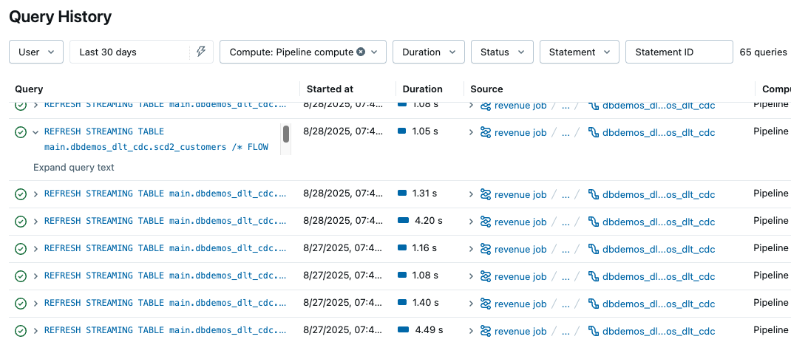

# Query History für Pipelines

Query History und Query Profiles für Pipeline-Läufe helfen beim Debuggen von Abfragen, dem Identifizieren von Performance-Engpässen und der Optimierung von Pipeline-Läufen. Diese Informationen sind über die Query-History-Seite, die Pipeline-Monitoring-Seite und den Lakeflow Pipelines Editor zugänglich. Jede Aussage wurde per `WebFetch` gegen `docs.databricks.com/aws/en/ldp/query-history` verifiziert.

## Abschnittsübersicht

1. [Query History für Pipeline-Updates einsehen](#einsehen)
2. [Zugriff über die Pipeline-Monitoring-Seite](#monitoring-seite)
3. [Zugriff über den Lakeflow Pipelines Editor](#editor)
4. [Einschränkungen](#einschraenkungen)
5. [Quellen](#quellen)

---

## <a id="einsehen">1. Query History für Pipeline-Updates einsehen</a>

Für alle ETL-Pipelines — sowohl getriggerte als auch kontinuierliche — erscheint bei jeder Aktualisierung von Materialized Views und Streaming Tables eine Query-Anweisung in der Query History. Für jede Flow-Ausführung, die eine Zieltabelle aktualisiert, gibt es eine `REFRESH`-Anweisung. Über den **Compute**-Filter auf der Query-History-Seite lassen sich ausschließlich über Pipeline-Compute verarbeitete Abfragen anzeigen.

**Vorgehen zum Zugriff auf Query-Details:**

1. In der Seitenleiste auf **Query History** klicken.
2. Im **Compute**-Dropdown-Filter die Option **Pipeline compute** auswählen, um nur Pipelines anzuzeigen. Zusätzlich lässt sich nach Nutzer, Zeit, Status und weiteren Merkmalen filtern.
3. Eine Query-Anweisung anklicken, um zusammenfassende Details wie Abfragedauer und aggregierte Metriken zu sehen.
4. Auf **See query profile** klicken, um das Query Profile zu öffnen — sowohl während die Pipeline läuft als auch nach Abschluss des Laufs möglich.
5. Optional über die Links im Abschnitt **Query Source** zur zugehörigen Pipeline-Monitoring-Seite wechseln.

---

## <a id="monitoring-seite">2. Zugriff über die Pipeline-Monitoring-Seite</a>

Auf der Pipeline-Monitoring-Seite führt der **Performance**-Tab am unteren Bildschirmrand zur Historie der eigenen Pipeline. Das Query-Details-Panel und -Profil lassen sich durch Anklicken einer Anweisung einsehen — sowohl während die Pipeline läuft als auch nach Laufende.

---

## <a id="editor">3. Zugriff über den Lakeflow Pipelines Editor</a>

Beim Bearbeiten einer Pipeline ist die Query History über den **Performance**-Tab im unteren Bereich zugänglich. Wird zuvor eine Tabelle ausgewählt, ist die Query History auf diese Tabelle eingeschränkt.

Jeder Eintrag in der Liste entspricht der Ausführung eines im Code definierten Flows. Es gibt eine Anweisung je Tabelle, außer wenn mehrere Flows in dieselbe Tabelle schreiben.

- Die Liste lässt sich nach Dataset-Namen filtern, um Anweisungen der in diese Tabelle schreibenden Flows zu finden.
- Diese Liste zeigt bis zu **1.000 Anweisungen**. Hat die Pipeline mehr Anweisungen, führt **View all in query history** zur vollständigen Liste auf der Query-History-Seite, gefiltert nach der jüngsten Pipeline-Run-ID.
- Standardmäßig sind Dauer und Metriken für Lese- und Schreibvorgänge sichtbar. Ein Klick auf eine `REFRESH`-Anweisung zeigt weitere Metriken sowie das Query Profile des Flows.
- Metriken und Query Profiles sind sowohl während des Pipeline-Laufs als auch danach verfügbar.

---

## <a id="einschraenkungen">4. Einschränkungen</a>

- Provisionierungs- und Warteschlangenzeit (Provisioning and queued time) sind nicht verfügbar.

---

## <a id="quellen">5. Quellen</a>

- https://docs.databricks.com/aws/en/ldp/query-history

**Stand:** 2026-08-19
