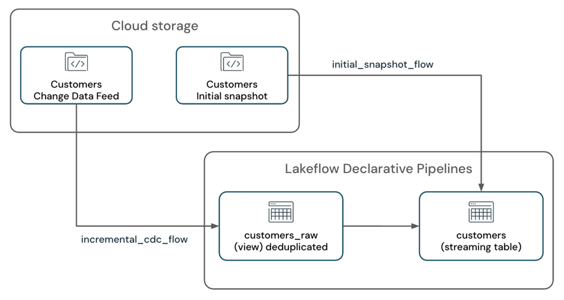

# Eine Pipeline nach Streaming-Checkpoint-Fehlschlag wiederherstellen

Dieses Dokument beschreibt, wie eine Lakeflow-Pipeline wiederhergestellt wird, wenn ein Streaming-Checkpoint ungültig oder beschädigt wird — über Full Refresh, Backup-und-Backfill, oder einen selektiven Checkpoint-Reset. Jede Aussage und jedes Code-Beispiel wurde per `WebFetch` gegen `docs.databricks.com/aws/en/ldp/recover-streaming` verifiziert.

## Abschnittsübersicht

1. [Was ist ein Streaming-Checkpoint?](#was-ist-checkpoint)
2. [Pipeline-Checkpoints](#pipeline-checkpoints)
3. [Beispiel: Pipeline-Fehlschlag durch Code-Änderung](#beispiel-fehlschlag)
4. [Wiederherstellungsoptionen](#wiederherstellungsoptionen)
5. [Empfehlungen](#empfehlungen)
6. [Checkpoint zurücksetzen und inkrementell fortsetzen](#checkpoint-reset)
7. [Best Practices](#best-practices)
8. [Quellen](#quellen)

---

## <a id="was-ist-checkpoint">1. Was ist ein Streaming-Checkpoint?</a>

In Apache Spark Structured Streaming ist ein Checkpoint ein Mechanismus zur Persistierung des Zustands einer Streaming-Abfrage. Dieser Zustand umfasst:

- **Fortschrittsinformation:** Welche Offsets der Quelle bereits verarbeitet wurden.
- **Zwischenzustand:** Daten, die über Micro-Batches hinweg für zustandsbehaftete Operationen (z. B. Aggregationen, `mapGroupsWithState`) erhalten bleiben müssen.
- **Metadaten:** Informationen zur Ausführung der Streaming-Abfrage.

Checkpoints sind essenziell für Fehlertoleranz und Datenkonsistenz in Streaming-Anwendungen:

- **Fehlertoleranz:** Schlägt eine Streaming-Anwendung fehl (z. B. wegen eines Node-Fehlers oder Absturzes), erlaubt der Checkpoint einen Neustart ab dem letzten erfolgreich geprüften Zustand statt einer vollständigen Neuverarbeitung — das verhindert Datenverlust und stellt inkrementelle Verarbeitung sicher.
- **Exactly-once-Verarbeitung:** Für viele Streaming-Quellen ermöglichen Checkpoints in Kombination mit idempotenten Senken Exactly-once-Garantien — jeder Datensatz wird genau einmal verarbeitet, selbst bei Fehlern, ohne Duplikate oder Auslassungen.
- **Zustandsverwaltung:** Bei zustandsbehafteten Transformationen persistieren Checkpoints den internen Zustand dieser Operationen, sodass die Streaming-Abfrage neue Daten korrekt basierend auf dem akkumulierten historischen Zustand weiterverarbeiten kann.

---

## <a id="pipeline-checkpoints">2. Pipeline-Checkpoints</a>

Pipelines bauen auf Structured Streaming auf und abstrahieren einen Großteil der zugrunde liegenden Checkpoint-Verwaltung über einen deklarativen Ansatz. Wird in einer Pipeline eine Streaming Table definiert, existiert für jeden in die Streaming Table schreibenden Flow ein eigener Checkpoint-Zustand. Diese Checkpoint-Speicherorte sind intern und für Nutzer nicht zugänglich.

Normalerweise müssen die zugrunde liegenden Checkpoints von Streaming Tables nicht verwaltet oder verstanden werden — außer in folgenden Fällen:

- **Rewind und Replay:** Um Daten ab einem bestimmten Zeitpunkt erneut zu verarbeiten und dabei den aktuellen Tabellenzustand zu erhalten, muss der Checkpoint der Streaming Table zurückgesetzt werden.
- **Wiederherstellung nach Checkpoint-Fehlschlag oder -Beschädigung:** Schlägt eine in die Streaming Table schreibende Abfrage wegen Checkpoint-bezogener Fehler fehl, führt das zu einem harten Fehlschlag — die Abfrage kann nicht weiter fortschreiten. Drei Ansätze zur Wiederherstellung:
    - **Vollständiger Table Refresh:** Setzt die Tabelle zurück und löscht bestehende Daten.
    - **Vollständiger Table Refresh mit Backup und Backfill:** Vor dem Full Refresh wird ein Backup der Tabelle erstellt und alte Daten anschließend zurückgespielt — sehr aufwendig, letztes Mittel.
    - **Checkpoint zurücksetzen und inkrementell fortsetzen:** Kann bestehender Datenverlust nicht in Kauf genommen werden, ist ein selektiver Checkpoint-Reset für die betroffenen Streaming Flows nötig.

---

## <a id="beispiel-fehlschlag">3. Beispiel: Pipeline-Fehlschlag durch Code-Änderung</a>

Szenario: Eine Pipeline verarbeitet einen Change-Data-Feed zusammen mit dem initialen Tabellen-Snapshot aus einem Cloud-Storage-System (z. B. Amazon S3) und schreibt in eine SCD-1-Streaming-Table.

Die Pipeline hat zwei Streaming Flows:

- `customers_incremental_flow`: liest inkrementell den CDC-Feed der Quelltabelle `customer`, filtert doppelte Datensätze heraus und upsertet sie in die Zieltabelle.
- `customers_snapshot_flow`: liest einmalig den initialen Snapshot der Quelltabelle `customers` und upsertet die Datensätze in die Zieltabelle.

*(Diagramm der Quelle: „Pipelines-CDC-Beispiel zur Wiederherstellung nach Checkpoint-Fehlschlag" — siehe `images/dlt-recover-streaming-flow.png`.)*



```python
@dp.temporary_view(name="customers_incremental_view")
  def query():
    return (
    spark.readStream.format("cloudFiles")
        .option("cloudFiles.format", "json")
        .option("cloudFiles.inferColumnTypes", "true")
        .option("cloudFiles.includeExistingFiles", "true")
        .load(customers_incremental_path)
        .dropDuplicates(["customer_id"])
    )

@dp.temporary_view(name="customers_snapshot_view")
def full_orders_snapshot():
    return (
        spark.readStream
        .format("cloudFiles")
        .option("cloudFiles.format", "json")
        .option("cloudFiles.includeExistingFiles", "true")
        .option("cloudFiles.inferColumnTypes", "true")
        .load(customers_snapshot_path)
        .select("*")
    )

dp.create_streaming_table("customers")

dp.create_auto_cdc_flow(
    flow_name = "customers_incremental_flow",
    target = "customers",
    source = "customers_incremental_view",
    keys = ["customer_id"],
    sequence_by = col("sequenceNum"),
    apply_as_deletes = expr("operation = 'DELETE'"),
    apply_as_truncates = expr("operation = 'TRUNCATE'"),
    except_column_list = ["operation", "sequenceNum"],
    stored_as_scd_type = 1
)
dp.create_auto_cdc_flow(
    flow_name = "customers_snapshot_flow",
    target = "customers",
    source = "customers_snapshot_view",
    keys = ["customer_id"],
    sequence_by = lit(0),
    stored_as_scd_type = 1,
    once = True
)
```

Nach dem Deployment läuft die Pipeline erfolgreich und verarbeitet CDC-Feed und initialen Snapshot.

Später stellt sich heraus, dass die Deduplizierungslogik in `customers_incremental_view` redundant ist und einen Performance-Engpass verursacht. `dropDuplicates()` wird entfernt, um die Performance zu verbessern:

```python
@dp.temporary_view(name="customers_raw_view")
  def query():
    return (
    spark.readStream.format("cloudFiles")
        .option("cloudFiles.format", "json")
        .option("cloudFiles.inferColumnTypes", "true")
        .option("cloudFiles.includeExistingFiles", "true")
        .load()
        # .dropDuplicates()
    )
```

Nach Entfernen der `dropDuplicates()`-API und erneutem Deployment schlägt das Update mit folgendem Fehler fehl:

```
Streaming stateful operator name does not match with the operator in state metadata.
This is likely to happen when a user adds/removes/changes stateful operators of existing streaming query.
Stateful operators in the metadata: [(OperatorId: 0 -> OperatorName: dedupe)];
Stateful operators in current batch: []. SQLSTATE: 42K03 SQLSTATE: XXKST
```

Dieser Fehler zeigt an, dass die Änderung wegen einer Diskrepanz zwischen Checkpoint-Zustand und aktueller Query-Definition nicht zulässig ist — die Pipeline kann nicht weiter fortschreiten.

Checkpoint-bezogene Fehlschläge können aus verschiedenen Gründen auftreten, nicht nur durch Entfernen von `dropDuplicates`. Häufige Szenarien:

- Hinzufügen oder Entfernen zustandsbehafteter Operatoren (z. B. Einführen oder Entfernen von `dropDuplicates()` oder Aggregationen) in einer bestehenden Streaming-Abfrage.
- Hinzufügen, Entfernen oder Kombinieren von Streaming-Quellen in einer bereits mit Checkpoint versehenen Abfrage (z. B. Vereinigen einer bestehenden Streaming-Abfrage mit einer neuen, oder Hinzufügen/Entfernen von Quellen aus einer bestehenden Union-Operation).
- Änderung des State-Schemas zustandsbehafteter Streaming-Operationen (z. B. Änderung der für Deduplizierung oder Aggregation genutzten Spalten).

Für eine vollständige Liste unterstützter und nicht unterstützter Änderungen verweist die Doku auf den Spark-Structured-Streaming-Guide sowie die Databricks-Dokumentation zu Änderungsarten in Structured-Streaming-Abfragen.

---

## <a id="wiederherstellungsoptionen">4. Wiederherstellungsoptionen</a>

Drei Wiederherstellungsstrategien, abhängig von Datendauerhaftigkeits-Anforderungen und Ressourcenbeschränkungen:

| Methode | Komplexität | Kosten | Möglicher Datenverlust | Mögliche Datenduplizierung | Erfordert initialen Snapshot | Vollständiges Table-Reset |
|---|---|---|---|---|---|---|
| Full Table Refresh | Niedrig | Mittel | Ja (falls kein initialer Snapshot verfügbar ist oder Rohdateien an der Quelle gelöscht wurden) | Nein (bei Apply-Changes-Zieltabelle) | Ja | Ja |
| Full Table Refresh mit Backup und Backfill | Mittel | Hoch | Nein | Nein (bei idempotenten Senken, z. B. Auto CDC) | Nein | Nein |
| Table-Checkpoint zurücksetzen | Mittel-Hoch (mittel bei Append-only-Quellen mit unveränderlichen Offsets) | Niedrig | Nein (erfordert sorgfältige Abwägung) | Nein (bei idempotenten Writern, z. B. Auto CDC in die Zieltabelle) | Nein | Nein |

Die Komplexität „Mittel-Hoch" hängt vom Typ der Streaming-Quelle und der Komplexität der Abfrage ab.

---

## <a id="empfehlungen">5. Empfehlungen</a>

- **Full Table Refresh** nutzen, wenn die Komplexität eines Checkpoint-Resets vermieden werden soll und die gesamte Tabelle neu berechnet werden kann. Ein Full Refresh erlaubt zudem Code-Änderungen.
- **Full Table Refresh mit Backup und Backfill** nutzen, wenn ebenfalls die Komplexität eines Checkpoint-Resets vermieden werden soll, die zusätzlichen Kosten für Backup und Backfill historischer Daten aber akzeptabel sind.
- **Table-Checkpoint zurücksetzen** nutzen, wenn bestehende Daten in der Tabelle unbedingt erhalten bleiben müssen und die Verarbeitung neuer Daten inkrementell fortgesetzt werden soll. Dieser Ansatz erfordert eine sorgfältige Handhabung des Checkpoint-Resets, damit bestehende Daten nicht verloren gehen und die Pipeline neue Daten weiterverarbeiten kann.

---

## <a id="checkpoint-reset">6. Checkpoint zurücksetzen und inkrementell fortsetzen</a>

1. **Pipeline anhalten:** Sicherstellen, dass keine aktiven Updates laufen.
2. **Startposition für den neuen Checkpoint bestimmen:** Den letzten erfolgreich verarbeiteten Offset bzw. Zeitstempel identifizieren, ab dem fortgesetzt werden soll — typischerweise der zuletzt erfolgreich verarbeitete Offset vor dem Fehlschlag.

    Werden JSON-Dateien wie im Beispiel oben über Auto Loader gelesen, lässt sich mit der Option `modifiedAfter` ein Zeitstempel setzen, ab dem Auto Loader neue Dateien verarbeitet.

    Für Kafka-Quellen dient die Option `startingOffsets`, um die Offsets festzulegen, ab denen die Streaming-Abfrage neue Daten verarbeiten soll.

    Für Delta-Lake-Quellen dient die Option `startingVersion`, um die Version festzulegen, ab der die Streaming-Abfrage neue Daten verarbeiten soll.
3. **Code-Änderungen vornehmen:** Die Streaming-Abfrage anpassen, z. B. `dropDuplicates()` entfernen oder andere Änderungen vornehmen. Zusätzlich prüfen, ob die Option `modifiedAfter` beim Auto-Loader-Lesepfad gesetzt wurde:

    ```python
    @dp.temporary_view(name="customers_incremental_view")
    def query():
        return (
        spark.readStream.format("cloudFiles")
            .option("cloudFiles.format", "json")
            .option("cloudFiles.inferColumnTypes", "true")
            .option("cloudFiles.includeExistingFiles", "true")
            .option("modifiedAfter", "2025-04-09T06:15:00")
            .load(customers_incremental_path)
            # .dropDuplicates(["customer_id"])
        )
    ```

    **Hinweis:** Ein falsch angegebener `modifiedAfter`-Zeitstempel kann zu Datenverlust oder -duplizierung führen. Der Zeitstempel muss korrekt gesetzt sein, um zu vermeiden, dass alte Daten erneut verarbeitet werden oder neue Daten übersehen werden.

    Enthält die Abfrage einen Stream-Stream-Join oder eine Stream-Stream-Union, muss diese Strategie für alle beteiligten Streaming-Quellen angewendet werden, z. B.:

    ```python
    cdc_1 = spark.readStream.format("cloudFiles")...
    cdc_2 = spark.readStream.format("cloudFiles")...
    cdc_source = cdc_1..union(cdc_2)
    ```
4. **Flow-Namen identifizieren:** Die der Streaming Table zugeordneten Flow-Namen ermitteln, für die der Checkpoint zurückgesetzt werden soll. Jeder Flow-Name muss vollständig qualifiziert im Format `catalog.schema.flow_name` übergeben werden. Im Beispiel lautet der vollständig qualifizierte Flow-Name `my_catalog.my_schema.customers_incremental_flow` (expliziter `flow_name`-Parameter `customers_incremental_flow`). Ohne expliziten Flow-Namen ist der Standard-Flow-Name der vollständig qualifizierte Zieltabellenname im Format `catalog.schema.table` (z. B. `my_catalog.my_schema.customers`). Flow-Namen finden sich im Pipeline-Code, der Pipeline-UI oder den Pipeline-Event-Logs.
5. **Checkpoint zurücksetzen:** Ein Python-Notebook erstellen und an einen Databricks-Cluster anhängen. Benötigt werden: Databricks-Workspace-URL, Pipeline-ID, Flow-Name(n), für die zurückgesetzt werden soll.

    ```python
    import requests
    import json

    # Define your Databricks instance and pipeline ID
    databricks_instance = "<DATABRICKS_URL>"
    token = dbutils.notebook.entry_point.getDbutils().notebook().getContext().apiToken().get()
    pipeline_id = "<YOUR_PIPELINE_ID>"
    flows_to_reset = ["<YOUR_FLOW_NAME>"]
    # Set up the API endpoint
    endpoint = f"{databricks_instance}/api/2.0/pipelines/{pipeline_id}/updates"

    # Set up the request headers
    headers = {
        "Authorization": f"Bearer {token}",
        "Content-Type": "application/json"
    }

    # Define the payload
    payload = {
        "reset_checkpoint_selection": flows_to_reset
    }

    # Make the POST request
    response = requests.post(endpoint, headers=headers, data=json.dumps(payload))

    # Check the response
    if response.status_code == 200:
        print("Pipeline update started successfully.")
    else:
        print(f"Error: {response.status_code}, {response.text}")
    ```
6. **Pipeline ausführen:** Die Pipeline beginnt, neue Daten ab der angegebenen Startposition mit einem frischen Checkpoint zu verarbeiten — bestehende Tabellendaten bleiben dabei erhalten, während die inkrementelle Verarbeitung fortgesetzt wird.

---

## <a id="best-practices">7. Best Practices</a>

- Private-Preview-Features nicht in Produktion einsetzen.
- Änderungen vor dem Einsatz in der Produktionsumgebung testen:
    - Eine Test-Pipeline erstellen, idealerweise in einer niedrigeren Umgebung. Ist das nicht möglich, für den Test nach Möglichkeit einen anderen Katalog und ein anderes Schema verwenden.
    - Den Fehler reproduzieren.
    - Die Änderungen anwenden.
    - Ergebnisse validieren und eine Go-/No-Go-Entscheidung treffen.
    - Änderungen auf die Produktionspipelines ausrollen.

---

## <a id="quellen">8. Quellen</a>

- https://docs.databricks.com/aws/en/ldp/recover-streaming

**Stand:** 2026-08-19
