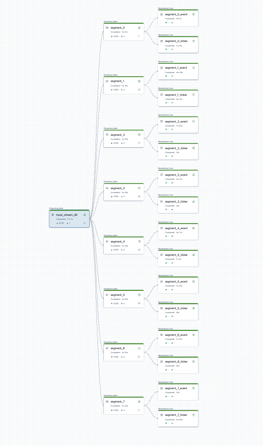
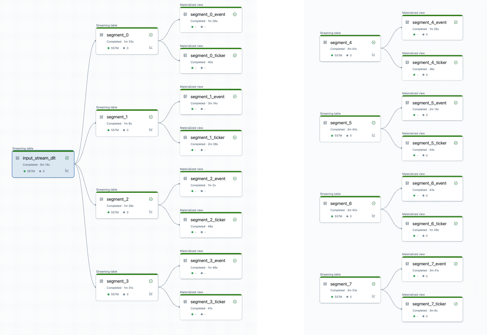

# Hohe Initialisierungszeiten in Pipelines beheben

Pipelines mit vielen Datasets und Flows verursachen einen gewissen Verwaltungs-Overhead. Dieses Dokument beschreibt, wann und wie sich eine Pipeline aufteilen lässt, um hohe Initialisierungszeiten zu beheben. Jede Aussage wurde per `WebFetch` gegen `docs.databricks.com/aws/en/ldp/fix-high-init` verifiziert.

## Abschnittsübersicht

1. [Einordnung](#einordnung)
2. [Wann eine Aufteilung sinnvoll ist](#wann-aufteilen)
3. [Details zu Performance-Problemen](#performance-probleme)
4. [Trade-offs beim Aufteilen von Pipelines](#trade-offs)
5. [Aufteilung planen](#planen)
6. [Pipeline ohne Full Refresh aufteilen](#aufteilen-ohne-full-refresh)
7. [Quellen](#quellen)

---

## <a id="einordnung">1. Einordnung</a>

Pipelines können viele Datasets mit vielen Flows enthalten, um sie aktuell zu halten. Pipelines verwalten Updates und Cluster automatisch für eine effiziente Aktualisierung. Dennoch entsteht bei der Verwaltung einer großen Anzahl von Flows ein gewisser Overhead, der zu höheren als erwarteten Initialisierungs- oder sogar Verwaltungs-Overheads während der Verarbeitung führen kann.

Treten bei getriggerten Pipelines Verzögerungen bei der Initialisierung auf — etwa Initialisierungszeiten über fünf Minuten — empfiehlt sich, die Verarbeitung auf mehrere Pipelines aufzuteilen, selbst wenn die Datasets dieselben Quelldaten nutzen.

**Hinweis:** Getriggerte Pipelines führen die Initialisierungsschritte bei jedem Trigger erneut aus. Kontinuierliche Pipelines führen die Initialisierungsschritte nur beim Stoppen und Neustarten aus. Dieser Abschnitt ist daher primär für die Optimierung der Initialisierung getriggerter Pipelines relevant.

---

## <a id="wann-aufteilen">2. Wann eine Aufteilung sinnvoll ist</a>

Mehrere Fälle, in denen eine Aufteilung aus Performance-Gründen vorteilhaft sein kann:

- Die Phasen `INITIALIZING` und `SETTING_UP_TABLES` dauern länger als gewünscht und beeinträchtigen die Gesamt-Pipeline-Zeit. Liegt dies über 5 Minuten, verbessert eine Aufteilung die Situation häufig.
- Der Driver, der den Cluster verwaltet, kann zum Engpass werden, wenn mehr als 30–40 Streaming Tables innerhalb einer einzigen Pipeline laufen. Reagiert der Driver nicht mehr, steigen die Laufzeiten der Streaming-Abfragen und damit die Gesamtdauer des Updates.
- Eine getriggerte Pipeline mit mehreren Streaming-Table-Flows kann möglicherweise nicht alle parallelisierbaren Stream-Updates parallel ausführen.

---

## <a id="performance-probleme">3. Details zu Performance-Problemen</a>

### Engpässe in den Phasen INITIALIZING und SETTING_UP_TABLES

Die anfänglichen Phasen des Laufs können je nach Komplexität der Pipeline einen Performance-Engpass darstellen.

**INITIALIZING-Phase:** Hier werden logische Pläne erstellt — u. a. Pläne zum Aufbau des Abhängigkeitsgraphen und zur Bestimmung der Reihenfolge der Tabellen-Updates.

**SETTING_UP_TABLES-Phase:** Basierend auf den in der vorherigen Phase erstellten Plänen laufen hier folgende Prozesse:

- Schema-Validierung und -Auflösung für alle in der Pipeline definierten Tabellen.
- Aufbau des Abhängigkeitsgraphen und Bestimmung der Ausführungsreihenfolge der Tabellen.
- Prüfung, ob jedes Dataset in der Pipeline aktiv ist oder seit dem vorherigen Update neu hinzugekommen ist.
- Erstellung von Streaming Tables beim ersten Update sowie — für Materialized Views — Erstellung temporärer Views oder Backup-Tabellen, die bei jedem Pipeline-Update benötigt werden.

**Warum INITIALIZING und SETTING_UP_TABLES länger dauern können:**

Große Pipelines mit vielen Flows für viele Datasets können aus mehreren Gründen länger dauern:

- Bei Pipelines mit vielen Flows und komplexen Abhängigkeiten können diese Phasen wegen des Arbeitsumfangs länger dauern.
- Komplexe Transformationen, einschließlich `Auto CDC`-Transformationen, können durch die zur Materialisierung der Tabellen nötigen Operationen einen Performance-Engpass verursachen.
- Es gibt auch Szenarien, in denen eine erhebliche Anzahl an Flows Langsamkeit verursacht, selbst wenn diese Flows nicht Teil eines Updates sind. Beispiel: Eine Pipeline mit über 700 Flows, von denen konfigurationsabhängig weniger als 50 je Trigger aktualisiert werden — jeder Lauf muss dennoch für alle 700 Tabellen bestimmte Schritte durchlaufen, die DataFrames abrufen und dann die auszuführenden auswählen.

### Engpässe beim Driver

Der Driver verwaltet die Updates innerhalb des Laufs. Er muss für jede Tabelle Logik ausführen, um zu entscheiden, welche Instanzen im Cluster welchen Flow bearbeiten. Bei mehr als 30–40 Streaming Tables innerhalb einer einzigen Pipeline kann der Driver zum CPU-Engpass werden, da er die Arbeit über den gesamten Cluster verteilen muss.

Der Driver kann zudem in Speicherprobleme laufen — dies tritt häufiger auf, wenn die Anzahl paralleler Flows 30 oder mehr beträgt. Es gibt keine feste Zahl an Flows/Datasets, die Speicherprobleme des Drivers verursacht — dies hängt von der Komplexität der parallel laufenden Tasks ab.

Streaming Flows können parallel laufen, dies erfordert vom Driver jedoch, Speicher und CPU für alle Streams gleichzeitig bereitzustellen. In einer getriggerten Pipeline verarbeitet der Driver ggf. nur eine Teilmenge der Streams gleichzeitig parallel, um Speicher- und CPU-Engpässe zu vermeiden.

In all diesen Fällen kann das Aufteilen von Pipelines in ein optimales Set an Flows je Pipeline die Initialisierungs- und Verarbeitungszeit beschleunigen.

---

## <a id="trade-offs">4. Trade-offs beim Aufteilen von Pipelines</a>

Befinden sich alle Flows innerhalb derselben Pipeline, verwaltet diese Pipeline die Abhängigkeiten automatisch. Bei mehreren Pipelines müssen Abhängigkeiten zwischen ihnen selbst verwaltet werden.

- **Abhängigkeiten:** Eine nachgelagerte Pipeline kann von mehreren vorgelagerten Pipelines abhängen (statt von einer). Beispiel: Bei drei Pipelines `pipeline_A`, `pipeline_B` und `pipeline_C`, wobei `pipeline_C` von beiden `pipeline_A` und `pipeline_B` abhängt, soll `pipeline_C` erst aktualisieren, nachdem beide ihre jeweiligen Updates abgeschlossen haben. Eine Lösung: jede Pipeline als Task in einem Job mit korrekt modellierten Abhängigkeiten orchestrieren, sodass `pipeline_C` erst aktualisiert, wenn `pipeline_A` und `pipeline_B` abgeschlossen sind.
- **Concurrency:** Verschiedene Flows innerhalb einer Pipeline können sehr unterschiedlich lange dauern — z. B. `flow_A` in 15 Sekunden, `flow_B` mehrere Minuten. Es kann hilfreich sein, vor dem Aufteilen die Abfragezeiten zu betrachten und kürzere Abfragen zu gruppieren.

---

## <a id="planen">5. Aufteilung planen</a>

Eine geplante Pipeline-Aufteilung lässt sich vorab visualisieren. Beispiel aus der Doku: eine Quell-Pipeline verarbeitet 25 Tabellen. Eine einzelne Root-Datenquelle wird in 8 Segmente aufgeteilt, jedes mit 2 Views.

Nach der Aufteilung gibt es zwei Pipelines: Eine verarbeitet die einzelne Root-Datenquelle sowie 4 Segmente mit zugehörigen Views. Die zweite verarbeitet die anderen 4 Segmente mit ihren zugehörigen Views. Die zweite Pipeline ist dabei auf die erste angewiesen, um die Root-Datenquelle zu aktualisieren.

---

## <a id="aufteilen-ohne-full-refresh">6. Pipeline ohne Full Refresh aufteilen</a>

Nach der Planung der Aufteilung werden benötigte neue Pipelines erstellt und Tabellen zwischen Pipelines verschoben, um die Last auszugleichen — ohne dabei einen Full Refresh auszulösen (siehe `Tabellen verschieben.md`).

**Einschränkungen dieses Ansatzes:**

- Die Pipelines müssen in Unity Catalog sein.
- Quell- und Ziel-Pipeline müssen sich im selben Workspace befinden — Verschiebungen über Workspace-Grenzen hinweg werden nicht unterstützt.
- Die Ziel-Pipeline muss erstellt und mindestens einmal ausgeführt worden sein (auch wenn der Lauf fehlschlägt), bevor die Verschiebung erfolgt.
- Eine Tabelle kann nicht von einer Pipeline im Default Publishing Mode zu einer Pipeline im Legacy Publishing Mode verschoben werden (siehe `Live Schema.md`).

---

## <a id="quellen">7. Quellen</a>

- https://docs.databricks.com/aws/en/ldp/fix-high-init

**Stand:** 2026-08-19
