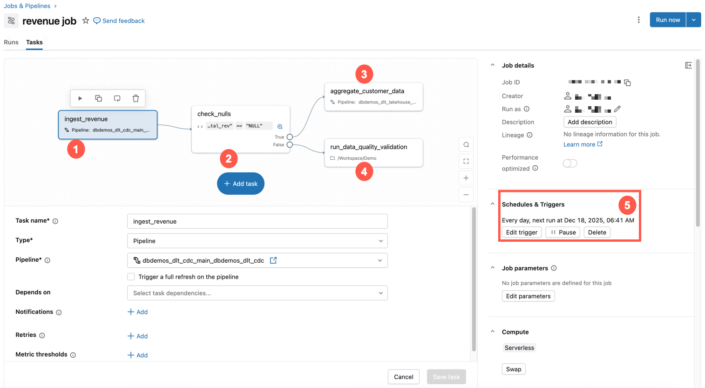

# Was sind Lakeflow Jobs?

Lakeflow Jobs ist Databricks' Werkzeug für **Workflow-Automatisierung** — es orchestriert Datenverarbeitungsaufgaben. Jobs planen und orchestrieren Tasks in Workflows, typische Anwendungsfälle sind ETL-Workflows, Notebook-Ausführungen und ML-Pipelines. Ein Job kann einen oder mehrere Tasks mit eigener Kontrollfluss-Logik (Verzweigungen, Schleifen) enthalten, die sich visuell im Editor definieren lässt.

## Drei Grundkonzepte

1. **Job** — die zentrale Koordinationsressource, mit Eigenschaften wie Triggern, Parametern, Benachrichtigungen und Git-Einstellungen. Die Tasks eines Jobs bilden einen gerichteten azyklischen Graphen (DAG).
2. **Task** — eine konkrete Arbeitseinheit, z. B. das Ausführen eines Notebooks, einer Pipeline oder eines Python-Skripts, mit Abhängigkeiten und bedingter Ausführung.
3. **Trigger** — der Mechanismus, der einen Job-Lauf auslöst: zeitgesteuert oder ereignisbasiert (z. B. neue Daten treffen ein).

## Monitoring und Observability

Job-Läufe lassen sich in der UI verfolgen (Status, Metriken), per E-Mail/Slack/Webhook benachrichtigen, und über System-Tabellen für eigene Performance-Queries auswerten.

## Grenzwerte

| Grenzwert | Wert |
|---|---|
| Gleichzeitige Task-Läufe pro Workspace | 2.000 |
| Erstellbare Jobs pro Stunde | 10.000 |
| Maximal gespeicherte Jobs pro Workspace | 12.000 |
| Maximale Tasks pro Job | 1.000 |
| Zeichenlimit für dynamische Job-Parameter | 10.000 |

## Programmatische Verwaltung

Jobs lassen sich über die Databricks CLI, Declarative Automation Bundles, die VS-Code-Extension, SDKs oder die Jobs-REST-API verwalten. Auch externe Tools wie Apache Airflow können Lakeflow Jobs orchestrieren (siehe `05 Task-Typen/Airflow-mit-Jobs.md`).

## Quelle

- https://docs.databricks.com/aws/en/jobs/
