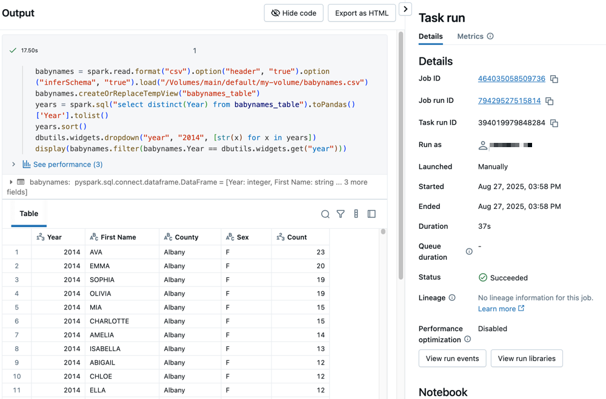

# Schnellstart: Erster Workflow

Ein erster Workflow mit zwei Notebooks: eines lädt Beispieldaten (Baby-Namen) herunter, das andere filtert und zeigt sie an.

## Voraussetzungen

- Unity-Catalog-aktivierter Workspace, idealerweise mit aktivierten Serverless Jobs (alternativ: Recht, Cluster zu erstellen).
- `READ VOLUME`/`WRITE VOLUME` auf `my-volume`, `USE SCHEMA` auf `default`, `USE CATALOG` auf `main`.

## Schritt 1: Erstes Notebook — Daten laden

```python
import requests
response = requests.get('https://health.data.ny.gov/api/views/jxy9-yhdk/rows.csv')
csvfile = response.content.decode('utf-8')
dbutils.fs.put("/Volumes/main/default/my-volume/babynames.csv", csvfile, True)
```

## Schritt 2: Zweites Notebook — Daten filtern und anzeigen

```python
babynames = spark.read.format("csv").option("header", "true").option("inferSchema", "true").load("/Volumes/main/default/my-volume/babynames.csv")
babynames.createOrReplaceTempView("babynames_table")
years = spark.sql("select distinct(Year) from babynames_table").toPandas()['Year'].tolist()
years.sort()
dbutils.widgets.dropdown("year", "2014", [str(x) for x in years])
display(babynames.filter(babynames.Year == dbutils.widgets.get("year")))
```

## Schritt 3: Job mit erstem Task erstellen

1. **Jobs & Pipelines** → **Create** → **Job**.
2. Ersten Task konfigurieren: Name `retrieve-baby-names`, Typ **Notebook**, Quelle **Workspace**, Pfad = erstes Notebook.
3. **Save task**.

## Schritt 4: Zweiten Task hinzufügen

1. **Add task** → **Notebook**.
2. Name `filter-baby-names`, Pfad = zweites Notebook.
3. Parameter hinzufügen: Key `year`, Value `2014`.
4. **Save task**.

## Schritt 5: Job ausführen

**Run Now** oben rechts klicken.

## Schritt 6: Lauf-Details ansehen

Tab **Runs** → Startzeit des gewünschten Laufs anklicken → Task-Namen anklicken, um die Ausgabe zu sehen.



## Schritt 7: Mit anderen Parametern erneut ausführen

Dropdown neben **Run Now** → **Run now with different settings** → Value auf `2015` (oder ein anderes Jahr) ändern → **Run**.

## Quelle

- https://docs.databricks.com/aws/en/jobs/jobs-quickstart
