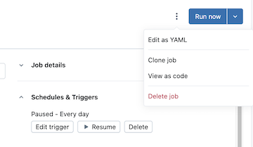

# Job-Erstellung und -Verwaltung automatisieren

Drei Entwicklerwerkzeuge zur programmatischen Job-Verwaltung: **Databricks CLI**, **Databricks SDKs**, **REST API**. Für CI/CD-Pipelines empfiehlt Databricks stattdessen **Declarative Automation Bundles** oder den **Databricks Terraform Provider**.

## Werkzeugvergleich

| Werkzeug | Beschreibung |
|---|---|
| **Databricks CLI** | Kommandozeilen-Interface, das die REST API kapselt. Ideal für Einzelaufgaben, Experimente, Shell-Skripte. |
| **Databricks SDKs** | Entwicklungsbibliotheken für Python, Java, Go, R zum Erstellen eigener Workflows. |
| **Databricks REST API** | Direkter API-Zugriff, wenn keine passende SDK-Sprache verfügbar ist. |

## Mit der CLI

Die CLI gliedert sich in Befehlsgruppen, u. a. `jobs` mit Unterbefehlen wie `create`, `delete`, `get`. CLI-Befehle entsprechen direkt REST-API-Aufrufen — `databricks jobs get` z. B. `GET /api/2.2/jobs/get`. Hilfe: `databricks jobs -h`, `databricks jobs <command> -h`.

**Job abrufen:**

```bash
databricks jobs get 478701692316314
```

Beispielhafte Antwort (Multi-Task-Job mit Abhängigkeiten, Retries, Notifications):

```json
{
  "created_time": 1730983530082,
  "creator_user_name": "someone@example.com",
  "job_id": 478701692316314,
  "run_as_user_name": "someone@example.com",
  "settings": {
    "email_notifications": {
      "no_alert_for_skipped_runs": false
    },
    "format": "MULTI_TASK",
    "max_concurrent_runs": 1,
    "name": "job_name",
    "tasks": [
      {
        "email_notifications": {},
        "notebook_task": {
          "notebook_path": "/Workspace/Users/someone@example.com/directory",
          "source": "WORKSPACE"
        },
        "run_if": "ALL_SUCCESS",
        "task_key": "success",
        "timeout_seconds": 0,
        "webhook_notifications": {}
      },
      {
        "depends_on": [
          { "task_key": "success" }
        ],
        "disable_auto_optimization": true,
        "email_notifications": {},
        "max_retries": 3,
        "min_retry_interval_millis": 300000,
        "notebook_task": {
          "notebook_path": "/Workspace/Users/someone@example.com/directory",
          "source": "WORKSPACE"
        },
        "retry_on_timeout": false,
        "run_if": "ALL_SUCCESS",
        "task_key": "fail",
        "timeout_seconds": 0,
        "webhook_notifications": {}
      }
    ],
    "timeout_seconds": 0,
    "webhook_notifications": {}
  }
}
```

Erkennbar: `depends_on` verkettet den zweiten Task an den ersten, `max_retries`/`min_retry_interval_millis`/`retry_on_timeout` steuern Wiederholungen, `run_if` legt die Ausführungsbedingung fest (`ALL_SUCCESS`), und `disable_auto_optimization` schaltet die automatische Serverless-Optimierung für diesen Task ab.

**Job erstellen** — zunächst JSON in eine Datei speichern (auch über **View JSON** in der Job-UI abrufbar):

```json
{
  "name": "My hello notebook job",
  "tasks": [
    {
      "task_key": "my_hello_notebook_task",
      "notebook_task": {
        "notebook_path": "/Workspace/Users/someone@example.com/hello",
        "source": "WORKSPACE"
      }
    }
  ]
}
```

```bash
databricks jobs create --json @<file-path>
```

**Beispiel-Kontext aus der offiziellen Doku:** Hat das Notebook eine Abhängigkeit zu einer bestimmten Version des `wheel`-PyPI-Pakets, erstellt der Job zur Laufzeit temporär einen Cluster, der die Umgebungsvariable `PYSPARK_PYTHON` exportiert — nach Abschluss des Jobs wird dieser Cluster wieder terminiert.

**Job ausführen** — drei Wege:

1. **Zeitplan** in der Job-Definition (`schedule` mit `quartz_cron_expression`), z. B.:

   ```json
   "schedule": {
     "quartz_cron_expression": "46 0 9 * * ?",
     "timezone_id": "America/Los_Angeles",
     "pause_status": "UNPAUSED"
   },
   "max_concurrent_runs": 1,
   ```

2. **`databricks jobs run-now`** — startet einen bestehenden Job.
3. **`databricks jobs submit`** — führt eine Job-Definition einmalig aus, ohne sie zu speichern; erscheint nicht in der UI und kann bei Fehlschlag nicht automatisch für Serverless optimiert werden — bei Fehlern eher `jobs create` + `jobs run-now` oder Classic Compute nutzen.

## Mit dem Python SDK

Vollständige SDK-Referenz (Installation, Authentifizierungsarten, weitere Beispiele für Cluster/Volumes/Account-API, Testing mit Mocking) siehe [Databricks SDK für Python.md](../../../../10%20Developers/07%20Databricks%20SDK%20fuer%20Python.md).

**Voraussetzung bei älterer Runtime:** Wird aus einem Databricks-Notebook auf einem Cluster mit **Databricks Runtime 12.2 LTS oder darunter** entwickelt, muss das Databricks SDK für Python zunächst manuell installiert werden (siehe Zellen unten) — bei neueren Runtimes ist es bereits vorinstalliert.

```python
%pip install --upgrade databricks-sdk==0.74.0
%restart_python
```

```python
from databricks.sdk.service.jobs import JobSettings as Job
from databricks.sdk import WorkspaceClient

job_name            = input("Provide a short name for the job, for example, my-job: ")
notebook_path       = input("Provide the workspace path of the notebook to run, for example, /Users/someone@example.com/my-notebook: ")
task_key            = input("Provide a unique key to apply to the job's tasks, for example, my-key: ")

test_sdk = Job.from_dict(
   {
       "name": job_name ,
       "tasks": [
           {
               "task_key": task_key,
               "notebook_task": {
                   "notebook_path": notebook_path,
                   "source": "WORKSPACE",
               },
           },
       ],
   })

w = WorkspaceClient()
j = w.jobs.create(**test_sdk.as_shallow_dict())
print(f"View the job at {w.config.host}/#job/{j.job_id}\n")
```

Ausführung analog zur CLI: Zeitplan, `jobs.run_now`, oder `jobs.runs.submit` (einmalig, nicht dauerhaft gespeichert).

## Mit der REST API

Empfohlen nur, wenn keine passende SDK-Sprache existiert. Das folgende Beispiel setzt voraus, dass die Umgebungsvariablen `DATABRICKS_HOST` und `DATABRICKS_TOKEN` (Personal-Access-Token-Authentifizierung) bereits gesetzt sind:

```bash
curl --request GET "https://${DATABRICKS_HOST}/api/2.2/jobs/get" \
     --header "Authorization: Bearer ${DATABRICKS_TOKEN}" \
     --data '{ "job": "11223344" }'
```

## Jobs als Code ansehen

In der Job-UI: Kebab-Menü links von **Run now** → **View as code** → Format **YAML**, **Python** oder **JSON** wählen.



- **YAML:** direkt für Declarative-Automation-Bundles-Konfigurationsdateien nutzbar.
- **Python:** wahlweise Databricks-SDK- oder Bundles-Code.
- **JSON:** für CLI, SDKs oder REST API zum Erstellen, Aktualisieren, Abrufen.

## Aufräumen

```bash
databricks jobs delete <job-id>
```

## Quelle

- https://docs.databricks.com/aws/en/jobs/automate
