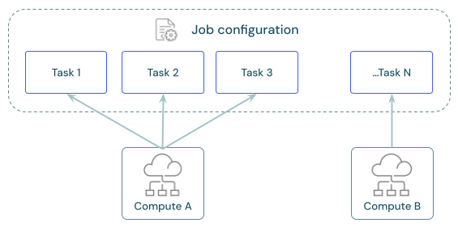

# Compute für Jobs konfigurieren

## Empfohlenes Compute je Task-Typ

| Task-Typ | Empfohlenes Compute |
|---|---|
| Notebooks, Python-Skripte, Python-Wheels | Serverless Jobs |
| SQL-Tasks | Serverless SQL-Warehouse |
| Lakeflow Pipelines | Serverless Pipeline |
| JAR und Spark Submit | nur Classic Jobs Compute |

## Einschränkung bei Serverless Compute

Kontinuierliche Zeitplanung wird nur mit begrenzten Structured-Streaming-Triggern wie `Trigger.AvailableNow` unterstützt — Standard- oder zeitintervallbasierte Trigger in Structured Streaming werden nicht unterstützt.

## Konfiguration

Classic Jobs Compute wird über dieselbe UI wie All-Purpose Compute konfiguriert; Serverless Compute wird automatisch von Databricks verwaltet.

## Geteiltes Compute über mehrere Tasks

Mehrere Tasks können sich dieselbe Compute-Ressource teilen — das reduziert Start-Latenz, lässt das Compute aber zwischen den Tasks ungenutzt im Leerlauf. Da geteilte Tasks auf derselben JVM laufen, werden Scala-Singletons und Companion-Objects über die Tasks hinweg geteilt.

## Compute-Typen im Vergleich

Für Produktions-Jobs stehen grundsätzlich drei Compute-Optionen zur Wahl, mit unterschiedlichen Kosten-/Latenz-Tradeoffs:

| Compute-Typ | Eignung | Nachteile |
|---|---|---|
| **Interactive/All-Purpose Cluster** | Ad-hoc-Analyse, Exploration, Entwicklung — **nicht für Produktion** | Teuer für Job-Läufe (läuft auch im Leerlauf weiter), begrenzte Skalierbarkeit, Verfügbarkeitsrisiko durch parallele Nutzung mehrerer Nutzer/Teams |
| **Job Cluster (Classic)** | Produktions-Jobs mit Bedarf an voller Infrastrukturkontrolle | Terminiert nach Job-Ende (günstiger als Interactive), aber Start-Latenz durch Cloud-Provider-Bereitstellung; höherer Wartungsaufwand (Instanztypen, Worker-Anzahl selbst konfigurieren) |
| **Serverless Compute** | Standardempfehlung für die meisten Produktions-Workloads | Kein manuelles Infrastruktur-Tuning möglich; nicht für alle Task-Typen verfügbar (siehe Tabelle oben) |

Serverless Compute übernimmt VM-Typ-Auswahl und Autoscaling automatisch (kein dediziertes DevOps-Know-how nötig), hat Photon standardmäßig aktiv, startet durch vorgehaltene, ML-prognostizierte Kapazität im Databricks-Account tendenziell schneller als ein neu hochfahrender Job-Cluster, und ist von Störungen einzelner Cloud-Zonen stärker abgeschirmt.

## Pricing-Modell: Classic vs. Serverless

Bei **Classic Compute** (Job-Cluster) setzt sich die Gesamtkostenrechnung aus mehreren, getrennt abgerechneten Bestandteilen zusammen:

- **DBUs** — an Databricks gezahlt.
- **Infrastrukturkosten** (VMs, Netzwerk/Firewall/NAT, Security-/Monitoring-Dienste) — direkt an den Cloud-Provider gezahlt.
- **Operationale Kosten** — organisationsintern anfallender Aufwand für Bereitstellung, Automatisierung, Wartung der Infrastruktur sowie für Kosten-/Effizienz-Monitoring.

**Serverless Compute** vereinfacht das Preismodell auf einen **einzigen DBU-Preis**, der Infrastruktur- und operationale Kosten bereits einschließt — eine einzelne Abrechnungsbeziehung statt mehrerer. Der oft höhere DBU-Satz wird laut Databricks durch den Wegfall des Infrastruktur-Managements sowie durch Auto-Scaling und Out-of-the-Box-Optimierungen ausgeglichen, sodass die **Total Cost of Ownership (TCO)** je nach Organisation niedriger ausfallen kann — insbesondere ohne dediziertes Platform-Engineering-Team.

**Hinweis zu konkreten Zahlen:** Aktuelle DBU-Sätze werden auf der [Databricks-Pricing-Seite](https://www.databricks.com/product/pricing/lakeflow-jobs) dynamisch geladen und ließen sich per WebFetch nicht als statischer Text abrufen — für exakte, aktuelle Preise dort bzw. im Pricing-Calculator nachsehen. Das grundsätzliche Abrechnungsmodell (getrennte DBU-/Infrastruktur-/Operational-Kosten bei Classic vs. gebündelter DBU-Preis bei Serverless) ist dagegen stabil und deckt sich mit der allgemeinen Serverless-Compute-Dokumentation.

## Quelle

- https://docs.databricks.com/aws/en/jobs/compute
- https://docs.databricks.com/aws/en/jobs/run-serverless-jobs
- https://docs.databricks.com/aws/en/jobs/run-classic-jobs
- https://www.databricks.com/product/pricing/lakeflow-jobs
